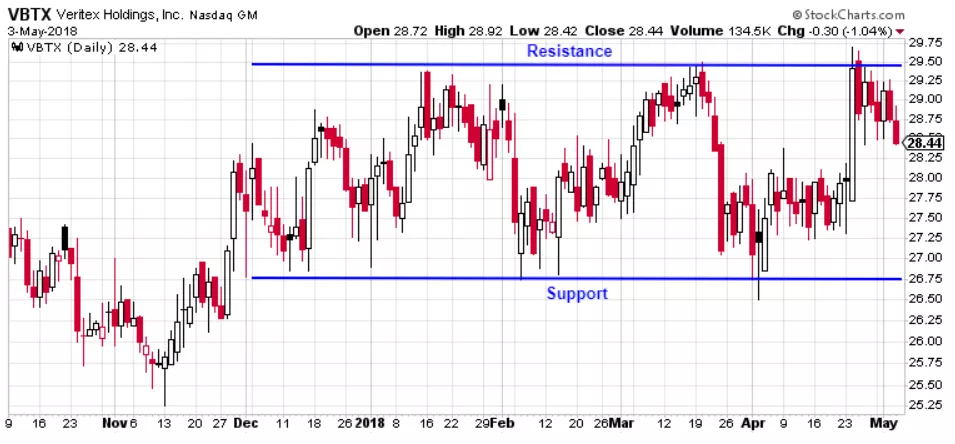

## Table of Contents

## What are consolidating stocks?

Consolidating stocks refer to a situation where a stock's price moves within a tight range for a period of time. This happens when the stock is not experiencing significant buying or selling pressure, causing it to trade sideways. During this period, the stock's price might fluctuate slightly, but it generally stays between a clear upper and lower boundary. This pattern can be seen on a stock chart as a horizontal channel or a rectangle.

When a stock is consolidating, it often means that the market is taking a break after a significant move up or down. Traders and investors watch these periods closely because a breakout from the consolidation range can signal the start of a new trend. If the stock price breaks above the upper boundary, it might indicate that the stock is ready to move higher. Conversely, if it breaks below the lower boundary, it could signal a potential drop in price. Understanding consolidation can help investors make better decisions about when to buy or sell a stock.

## Why is it important to identify consolidating stocks?

Identifying consolidating stocks is important because it helps investors and traders understand what might happen next with a stock's price. When a stock is consolidating, it means it's moving in a tight range without going up or down a lot. This can show that the stock is taking a break after a big move. By watching these stocks, investors can get ready for when the stock might start moving again. If the stock breaks out of its range and goes up, it could be a good time to buy. If it breaks down and goes lower, it might be a signal to sell or avoid buying.

Knowing about consolidating stocks also helps in planning when to buy or sell. If an investor sees a stock that has been moving sideways for a while, they might wait for it to break out of its range before making a decision. This can help them buy at a better price or sell before the stock goes down. By understanding consolidation, investors can make smarter choices and possibly make more money or lose less.

## What are the basic signs that a stock is consolidating?

When a stock is consolidating, it means its price is moving within a small range for a while. You can see this on a stock chart where the price goes up and down a little but stays between two lines. The top line is where the price stops going up, and the bottom line is where it stops going down. This pattern looks like a rectangle or a flat channel on the chart.

This happens when not many people are buying or selling the stock, so it doesn't move much. It's like the stock is taking a break after going up or down a lot. If you see a stock doing this, it might be getting ready to move again. If it breaks out of the top of the range, it could go up more. If it breaks out of the bottom, it might go down. Watching for these signs can help you decide when to buy or sell the stock.

## How can volume be used to identify consolidating stocks?

Volume can help you spot when a stock is consolidating. When a stock is moving sideways in a tight range, you'll usually see that the trading volume is lower than when the stock was moving up or down a lot. This lower volume shows that fewer people are buying and selling the stock, which is why it's not moving much. It's like the stock is taking a break, and the low volume is a sign that this break is happening.

When the stock starts to break out of its consolidation range, you might see the volume pick up. If the stock breaks above the top of its range and the volume goes up, it could mean more people are buying, and the stock might keep going up. If it breaks below the bottom of the range with higher volume, it might mean more people are selling, and the stock could go down. Watching the volume can give you clues about whether the stock is still consolidating or if it's about to start moving again.

## What technical indicators are most effective for spotting consolidation?

To spot when a stock is consolidating, you can use technical indicators like moving averages and Bollinger Bands. Moving averages smooth out price data to show the stock's trend over time. When a stock is consolidating, its price will often stay close to its moving average without moving far away. This shows that the stock is not going up or down a lot, but staying in a small range. Bollinger Bands are lines drawn above and below the moving average that show how much the stock's price is moving. During consolidation, the price will usually stay inside the Bollinger Bands, not touching the top or bottom line much.

Another useful indicator is the Average True Range (ATR), which measures how much a stock's price moves up and down over time. When a stock is consolidating, the ATR will be lower because the price isn't moving as much. This can help you see that the stock is in a tight range. By watching these indicators, you can tell when a stock is consolidating and get ready for when it might start moving again.

## How does the duration of consolidation affect stock behavior?

The length of time a stock spends consolidating can tell us a lot about what might happen next. If a stock consolidates for a short time, like a few days or weeks, it might mean the stock is just taking a quick break before it starts moving again. This short consolidation can lead to a quick move up or down once the stock breaks out of its range. On the other hand, if a stock consolidates for a longer time, like months, it might be building up more energy for a bigger move. A long consolidation period can mean that when the stock finally breaks out, it could go up or down a lot more than if it had only consolidated for a short time.

The duration of consolidation also affects how reliable the [breakout](/wiki/breakout-trading) is. A stock that consolidates for a longer time might give a clearer signal when it breaks out, making it easier for investors to decide whether to buy or sell. This is because the longer the consolidation, the more likely it is that the stock has found a stable price range, and a break from this range can be a strong sign of a new trend. So, understanding how long a stock has been consolidating can help investors make better decisions about when to act on the stock's next move.

## What are common patterns associated with stock consolidation?

When a stock is consolidating, it often makes a pattern that looks like a rectangle on a chart. This happens when the stock's price moves up and down a little but stays between two lines. The top line is where the price stops going up, and the bottom line is where it stops going down. This pattern shows that the stock is taking a break and not moving much. It's like the stock is waiting for something to happen before it starts moving again.

Another common pattern during consolidation is called a triangle. This happens when the stock's price moves in a way that makes the range between the top and bottom lines get smaller over time. It can look like a triangle on the chart. This pattern shows that the stock is getting ready to make a bigger move. When the price finally breaks out of the triangle, it can go up or down a lot. Watching these patterns can help investors know when the stock might start moving again.

## How can fundamental analysis complement technical analysis in identifying consolidating stocks?

Fundamental analysis can help you understand more about a stock that is consolidating by looking at the company's financial health and future growth. When you see a stock moving sideways in a tight range, you might want to check if the company is doing well or if there are any big changes coming up. If the company is growing and making more money, it could mean the stock is just taking a break before it goes up again. On the other hand, if the company is not doing well, the consolidation might be a sign that the stock is getting ready to go down. By using [fundamental analysis](/wiki/fundamental-analysis), you can get a better idea of what might happen next with the stock.

Technical analysis shows you the patterns on the stock chart, like rectangles or triangles, that tell you the stock is consolidating. But by adding fundamental analysis, you get a fuller picture. For example, if a stock is consolidating and the company's earnings are strong, you might feel more confident that a breakout to the upside is coming. If the company's news is bad, like lower profits or problems with the business, you might be more careful and ready for a downside breakout. Combining both types of analysis helps you make smarter decisions about when to buy or sell the stock during its consolidation phase.

## What are the risks associated with trading consolidating stocks?

Trading consolidating stocks can be tricky because there's no guarantee which way the stock will move when it breaks out of its range. If you buy a stock thinking it will go up after consolidation, but it goes down instead, you could lose money. The same goes for selling short a stock expecting it to drop, only to see it rise. These false breakouts can happen often, making it hard to predict the stock's next move. Also, trading during consolidation can lead to small profits or losses because the stock's price isn't moving much, which means you might not make as much money as you hoped.

Another risk is that consolidation periods can last longer than expected. If you're waiting for a breakout and it takes weeks or months, you might miss out on other good trading opportunities. Plus, holding onto a stock that's not moving can tie up your money, making it harder to invest in other stocks that might be doing better. It's important to keep an eye on the stock and be ready to change your plan if the consolidation lasts too long or if the stock's fundamentals change. By understanding these risks, you can make better decisions and be more prepared for what might happen when trading consolidating stocks.

## How do market conditions influence the identification of consolidating stocks?

Market conditions play a big role in how easy it is to spot consolidating stocks. When the overall market is calm and not moving a lot, it's easier to see when a single stock is consolidating. The stock's price will move in a small range, making it clear that it's taking a break. But if the market is going up and down a lot, it can be harder to tell if a stock is really consolidating or if it's just following the market's big moves. In a volatile market, the stock might seem like it's consolidating, but it could just be reacting to the market's ups and downs.

Also, the type of market can affect how long a stock stays in consolidation. In a bull market, where stocks are generally going up, a stock might not stay in consolidation for long because there's a lot of buying pressure pushing prices higher. In a bear market, where stocks are going down, a stock might consolidate for longer as investors wait to see if the market will get better. By understanding the market conditions, you can better judge if a stock is truly consolidating and what might happen next with its price.

## What advanced strategies can be used to predict the breakout direction of consolidating stocks?

One advanced strategy to predict the breakout direction of consolidating stocks is to use volume analysis. When a stock is consolidating, you can watch the trading volume to see if it's getting ready to move. If the volume starts to go up as the stock gets close to the top of its range, it might mean more people are buying, and the stock could break out to the upside. On the other hand, if the volume goes up near the bottom of the range, it might mean more people are selling, and the stock could break down. By watching the volume, you can get a better idea of which way the stock might go when it breaks out of its consolidation.

Another strategy is to use multiple technical indicators together. For example, you can combine moving averages, Bollinger Bands, and the Relative Strength Index (RSI). If the stock's price is close to the top of its Bollinger Bands and the RSI is also high, it might be a sign that the stock is ready to break out to the upside. If the price is near the bottom of the Bollinger Bands and the RSI is low, it could mean a downside breakout is coming. By looking at these indicators together, you can get a clearer picture of the stock's [momentum](/wiki/momentum) and be more confident in predicting its next move.

## How can algorithmic trading be utilized to identify and trade consolidating stocks effectively?

Algorithmic trading can help you spot and trade consolidating stocks by using computer programs to watch the market all the time. These programs can look at a lot of data very quickly and find patterns that show when a stock is moving in a tight range. They can use things like moving averages and Bollinger Bands to see if a stock is consolidating. Once the program spots a consolidating stock, it can keep an eye on the volume and other signs to guess which way the stock might go when it breaks out. This can help you buy or sell the stock at just the right time, before other people do.

Using [algorithmic trading](/wiki/algorithmic-trading) also means you can set up rules for when to buy or sell a stock. For example, you can tell the program to buy the stock if it breaks above the top of its range with high volume, or sell it if it goes below the bottom of the range. This takes the guesswork out of trading and can help you make decisions faster than if you were doing it all by yourself. By using these smart programs, you can trade consolidating stocks more effectively and maybe make more money.

## What are the key aspects of understanding investment strategies?

Investment strategies serve as essential frameworks for traders and investors, guiding decisions on resource allocation to achieve specific financial goals. These strategies can be customized to align with individual risk tolerances and target objectives, ranging from aggressive growth models to more conservative approaches focused on income generation.

Aggressive growth strategies are typically employed by investors willing to undertake higher risk to achieve substantial potential returns. These strategies often include investing in high-growth sectors, such as technology or biotechnology, where companies frequently reinvest their profits to fuel further expansion instead of paying dividends. Examples of these strategies include investing in small-cap stocks with high growth potential or focusing on emerging markets, where economic growth rates are robust.

Conversely, conservative income-focused strategies prioritize stability and regular income over capital appreciation. These strategies are preferred by risk-averse investors who seek predictable returns to support ongoing financial needs. A popular conservative strategy involves investing in dividend-paying stocks or bonds, which offer fixed interest payments. Bonds, particularly government and high-grade corporate bonds, provide a stable income stream and are considered lower risk due to their fixed interest payouts.

Different investment strategies often balance risk and return by combining various asset classes. The concept of asset allocation plays a crucial role, defined by the formula:

$$
\text{Expected Portfolio Return} = \sum (w_i \times r_i)
$$

Where $w_i$ is the weight of each asset in the portfolio, and $r_i$ is the expected return of each asset. Investors can adjust weights based on their tolerance towards risk and return objectives.

One popular method to establish the right mix of assets is through the Modern Portfolio Theory (MPT), introduced by Harry Markowitz. MPT suggests diversifying assets to optimize the expected return for a given risk level. It uses the efficient frontier, a graphical representation showing the set of portfolios with the highest expected return for each level of risk.

Another widely used strategy is value investing, which involves [picking](/wiki/asset-class-picking) stocks that appear to be trading for less than their intrinsic or book value. This approach is often associated with the legendary investor Warren Buffett, who seeks to invest in companies with strong fundamentals, undervaluation, and robust potential for growth.

Growth investing, distinct from value investing, focuses on companies expected to grow at an above-average rate compared to their industry or the overall market. Such companies are characterized by high earnings growth, revenue expansion, and increased market share.

Ultimately, the suitability of any given investment strategy depends significantly on individual financial goals and risk appetite. Tailored approaches that consider these factors can empower investors to make informed decisions about asset allocation and investment selection, enhancing the likelihood of achieving their desired financial outcomes.

## What is Technical Analysis in Trading?

Technical analysis is a method used by traders to analyze market data, such as price and [volume](/wiki/volume-trading-strategy), to forecast future price movements. It is grounded on the assumption that historical market performance has patterns that are likely to recur. Traders employ various technical indicators and chart patterns to identify potential trading opportunities.

One of the foundational tools in technical analysis is the moving average, which helps smooth out price data by creating a constantly updated average price. The most common types include the simple moving average (SMA) and the exponential moving average (EMA). The SMA is calculated by summing the closing prices over a particular time period and dividing by the number of periods, while the EMA gives more weight to recent prices. This formula for the EMA can be represented as:

$$
\text{EMA} = \left( \frac{\text{Close}_t - \text{EMA}_{t-1}}{n+1} \right) + \text{EMA}_{t-1}
$$

where $\text{Close}_t$ is the closing price for the current period, $\text{EMA}_{t-1}$ is the EMA of the previous period, and $n$ is the number of periods.

Oscillators, another vital component, measure the speed and change of price movements. Common oscillators include the Relative Strength Index (RSI) and the Moving Average Convergence Divergence (MACD). The RSI compares the magnitude of recent gains to recent losses to identify overbought or oversold conditions. Mathematically, it is computed as:

$$
\text{RSI} = 100 - \frac{100}{1 + \frac{\text{Average Gain}}{\text{Average Loss}}}
$$

The MACD, however, shows the relationship between two moving averages of a security’s price and is calculated by subtracting the 26-period EMA from the 12-period EMA.

Chart patterns like head and shoulders, triangles, and double tops/bottoms are visual signals used to identify potential trend reversals or continuations. Implementing these technical indicators into trading strategies involves recognizing these patterns and understanding the potential implications on price direction. For example, a trader might set buy or sell signals based on moving average crossovers or when oscillators reach extreme levels.

Python can be a potent tool for implementing technical analysis strategies. For instance, using libraries like pandas and TA-Lib, traders can calculate technical indicators and automate their application to large datasets. Here is a basic example of calculating a moving average using Python:

```python
import pandas as pd

# Assuming df is a DataFrame with a 'Close' column
df['SMA'] = df['Close'].rolling(window=20).mean()
df['EMA'] = df['Close'].ewm(span=20, adjust=False).mean()
```

These tools enhance a trader's ability to evaluate market trends and make informed decisions, potentially improving trading outcomes. Understanding and effectively applying technical analysis can be integral to crafting a successful trading strategy.

## References & Further Reading

[1]: Lopez de Prado, M. (2018). ["Advances in Financial Machine Learning."](https://www.amazon.com/Advances-Financial-Machine-Learning-Marcos/dp/1119482089) Wiley.

[2]: Chan, E. (2009). ["Quantitative Trading: How to Build Your Own Algorithmic Trading Business."](https://github.com/ftvision/quant_trading_echan_book) Wiley.

[3]: Aronson, D. R. (2006). ["Evidence-Based Technical Analysis: Applying the Scientific Method and Statistical Inference to Trading Signals."](https://www.amazon.com/Evidence-Based-Technical-Analysis-Scientific-Statistical/dp/0470008741) Wiley.

[4]: Markowitz, H. (1952). ["Portfolio Selection."](https://onlinelibrary.wiley.com/doi/abs/10.1111/j.1540-6261.1952.tb01525.x) The Journal of Finance, 7(1), 77-91.

[5]: Jansen, S. (2018). ["Machine Learning for Algorithmic Trading."](https://github.com/stefan-jansen/machine-learning-for-trading) Packt Publishing.