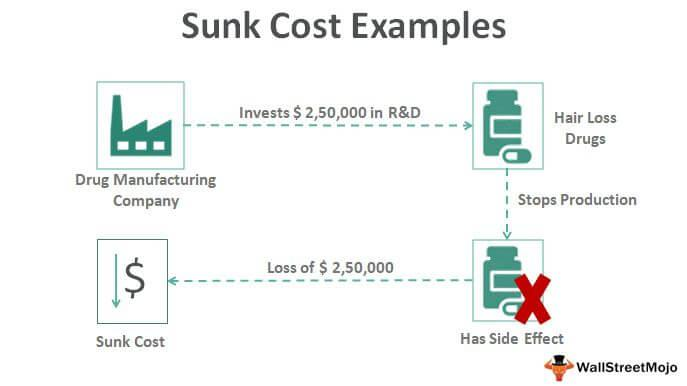

Algorithmic trading represents a sophisticated intersection of finance and technology, demanding a thorough understanding of economic principles to harness its full potential. One of the foundational concepts that significantly influence decision-making in this domain is sunk cost analysis. Sunk costs refer to past expenses that cannot be recovered and, according to economic theory, should not affect future financial decisions. However, the challenge arises as psychological biases often lead traders to irrationally favor investments due to these incurred costs, potentially compromising profitability.

This article aims to investigate the pivotal role of sunk costs in economic decision-making within algorithmic trading. By examining these principles, traders can enhance their strategic frameworks in dynamic market conditions. Understanding how sunk costs manifest and influence decisions is essential to prevent common pitfalls and improve trading performance.



In both traditional economics and cutting-edge trading technologies, acknowledging the irrelevance of sunk costs is crucial. As algorithmic strategies become increasingly prevalent, integrating economic insights with technological capabilities provides traders a competitive edge. With algorithms capable of processing vast amounts of real-time data, it becomes imperative to design models that prioritize rational economic principles over emotional reactions.

As we embark on this exploration, we will uncover strategies that leverage a thorough understanding of sunk costs. This knowledge will empower traders to make more informed and profitable decisions, ensuring their approaches align with sound economic reasoning while taking advantage of technological advancements.

## Table of Contents

## What are Sunk Costs?

Sunk costs are expenditures that have already occurred and cannot be recovered, a concept critical in both economics and behavioral finance. These costs, once made, should not influence ongoing decisions because they cannot be altered. However, in practice, sunk costs often impact decision-making, leading to an irrational commitment to losing investments or projects—a phenomenon known as the sunk cost fallacy.

Economic theory maintains that decisions should be based solely on future costs and benefits, as sunk costs have no bearing on future outcomes. Yet, psychological factors frequently sway individuals and institutions to consider these irretrievable expenses. This bias can manifest across various scenarios, particularly in financial markets.

For example, an investor may hold onto a declining stock due to the significant initial investment, which they cannot recover—choosing to hope for a turnaround rather than reallocating the remaining resources to more promising opportunities. Such behavior can lead to suboptimal portfolio performance, emphasizing the need to disentangle emotional attachment from rational analysis.

By recognizing and understanding sunk costs, traders can develop more effective decision-making frameworks and avoid common pitfalls. In [algorithmic trading](/wiki/algorithmic-trading), incorporating mechanisms to identify and disregard sunk costs can enhance strategy efficiency. This can be implemented through algorithms that focus on present and future market conditions rather than past expenses.

In doing so, traders can optimize their investment strategies, aiming for decisions driven by potential, rather than being anchored by irreversible past expenditures.

## Sunk Costs in Economic Decision-Making

Economic decision-making is frequently hindered by the "sunken ship effect," a common mismanagement phenomenon arising from non-recoverable expenditures. This cognitive bias can lead individuals and organizations to continue investing in failing ventures due to the money or resources already spent, rather than assessing future potential outcomes.

Rational decision-making prescribes that decisions should be based solely on future costs and benefits, excluding any sunk costs, as these irretrievable expenses do not affect future prospects. However, psychological biases often cloud judgment, causing individuals to irrationally [factor](/wiki/factor-investing) sunk costs into their decision-making. This skewed perception underlines the importance of maintaining a rational mindset when developing trading strategies, aiming to increase efficiency and minimize losses.

Optimizing decision-making involves acknowledging the irrelevance of sunk costs, which can lead to more effective portfolio allocation and risk management. By ignoring past expenditures, traders can avoid falling into the trap of emotional investing and instead focus on data-driven decision-making processes. This approach enables a recalibration of resources to investments with better future prospects, enhancing overall financial health.

Incorporating an awareness of sunk costs into automated trading systems is crucial for fostering data-driven and objective decision frameworks. Automation helps remove emotional biases from trading processes, allowing for algorithmic strategies that consistently adhere to rational economic principles. Automated systems can be programmed to disregard sunk costs, thus preventing these irrelevant factors from influencing trading decisions.

Optimizing portfolio allocation through such automated systems can be achieved by employing algorithms that systematically evaluate future potential benefits while ignoring past losses. The following Python pseudocode illustrates how one might implement a simplified approach to decision-making that disregards sunk costs:

```python
def decide_to_invest(current_value, future_benefit, investment_cost):
    # Example decision-making logic ignoring sunk costs
    if future_benefit > investment_cost:
        return "Invest"
    else:
        return "Do not invest"

# Example usage
current_value = 10000  # The current investment value
future_benefit = 15000  # Projected future benefit
investment_cost = 12000  # Cost of additional investment

decision = decide_to_invest(current_value, future_benefit, investment_cost)
print(decision)
```

Incorporating this type of rational economic framework within trading strategies allows for emotionless, optimal decisions that align with future-oriented goals. By emphasizing future possibilities rather than past expenditures, traders are better equipped to navigate dynamic markets effectively.

## Algorithmic Trading and Economic Principles

Algorithmic trading effectively merges traditional economic principles with cutting-edge technology to create automated, efficient trading strategies. At the heart of this integration is the application of sunk cost rationalization, a key economic principle that has profound implications for real-time decision-making processes in trading.

In algorithmic systems, sunk cost rationalization helps prevent emotional and irrational adherence to prior investment decisions that have shown negative returns. This principle is crucial for optimizing buy-sell decisions, as it prioritizes future potential gains over past investments that cannot be recovered. By incorporating sunk cost rationalization, algorithms can make more objective and profitable trading decisions, reducing the likelihood of ineffective trades based on irrecoverable expenses.

Economic decision-making modules embedded within trading algorithms critically impact their performance. These modules are designed to process data, assess risk, and evaluate market conditions, ensuring decisions are grounded in objective analysis rather than subjective biases or emotional responses. For example, an algorithm might include a module that continuously evaluates the opportunity cost of maintaining current positions versus reallocating resources to potentially more lucrative options. This ensures that trading strategies remain aligned with market dynamics and economic rationales.

The robustness of an algorithmic trading system is significantly enhanced when sunk costs are adequately addressed. Effective response mechanisms that prioritize future outcomes over past decisions cultivate powerful trading systems capable of achieving consistent performance. These systems are equipped to react dynamically to new data and market shifts, ensuring risk management protocols are adhered to and potential losses are minimized.

Different levels of algorithmic integration demonstrate the practical application of economic theories in trading environments. For instance, a basic level may involve simple algorithms that follow set rules and conditions, like executing a trade when a stock price crosses a moving average threshold. A more advanced level may include algorithms that utilize [machine learning](/wiki/machine-learning) models to continuously learn from past trading data, adjusting strategies in response to shifts in market behavior, and negating the effects of sunk costs. Such adaptive systems not only facilitate sophisticated decision-making processes but also empower traders to maintain competitiveness in rapidly evolving markets.

In conclusion, algorithmic trading benefits significantly from the integration of traditional economic principles, particularly sunk cost rationalization. By embedding these concepts within algorithmic frameworks, traders can improve decision-making accuracy, reduce emotional bias, and optimize trading performance, ultimately leading to more profitable and strategic outcomes.

## Case Studies: Sunk Costs in Algo Trading

Analyzing specific cases where sunk costs influenced algorithmic trading decisions unveils critical insights into both successful and unsuccessful strategies, highlighting the practical impact of these costs on algorithmic trading systems.

### Successful Cases

One notable example in [forex](/wiki/forex-system) trading involves an algorithm that deliberately ignores sunk costs in its trading decisions. This system, programmed to follow a trend-based strategy, showcased an ability to adjust dynamically to market changes without being tied to prior unrecouped investments. By adhering strictly to future-oriented data and technical indicators, the algorithm could cut losses early and reallocate assets efficiently, exemplifying a clear understanding of sunk cost irrelevance. This strategy increased overall portfolio turnover but ultimately led to enhanced profitability due to disciplined adherence to objective data.

### Unsuccessful Instances

Conversely, failure to detach from sunk costs can lead to detrimental outcomes, as illustrated by a high-frequency trading platform that persisted in certain trades despite clear evidence of a downtrend. The algorithm, initially designed with limited stop-loss constraints, continually fed resources into trades in a bid to recover previously incurred losses. This sunken commitment led to substantial financial losses, further compounded by algorithmic inertia when attempting to reverse [course](/wiki/best-algorithmic-trading-courses). Analysis of these trades showed that the inclusion of real-time stop-loss updates, integrating lessons from previous trades, could have significantly mitigated losses.

### Historical Data Evaluation

The review of historical trading data also sheds light on the treatment of sunk losses within algorithmic strategies. By examining a multi-year dataset of trading decisions, it becomes evident that algorithms programmed with predefined abandonment criteria for loss-making trades consistently outperformed those without such mechanisms. This quantitative approach underscores the importance of systematic loss-cutting strategies and the need for evolving parameters that resonate with ongoing market conditions. Historical data thus acts as a resource for refining algorithms to better respond to sunk cost challenges.

### Applying Lessons from Case Studies

From these examples in forex and stock markets, we learn that aligning algorithmic strategies with sound economic principles can drive superior outcomes. Successful trading systems share a trait of promptly acknowledging sunk costs and recalibrating strategies to optimize resource allocation. Implementing robust stop-loss measures, periodic strategy reviews, and machine-learning components to predict unprofitable patterns are essential practices for addressing the implications of sunk costs.

These case studies not only demonstrate the tangible effects of applying theoretical concepts to market movements but also offer actionable insights to enhance decision-making frameworks. By learning from these instances, traders can adopt best practices in developing and adjusting their algorithmic models to improve performance while minimizing the influence of irrecoverable expenses.

## Strategies to Optimize Decision-Making

Optimizing decision-making in algorithmic trading requires strategies that mitigate the distortionary impact of sunk costs on trading models. A key approach is the implementation of stop-loss protocols, which are designed to limit potential losses by selling securities once they reach a pre-determined price. This prevents the fallacy of holding onto losing positions due to past expenditures, aligning future trading decisions with current market realities.

Backtesting is another crucial technique. By evaluating trading models against historical data, traders can assess the efficacy of their strategies without risking capital. This analysis helps in identifying patterns where sunk costs may have previously influenced decisions, allowing for refinement of algorithms to avoid such biases.

Real-time market data analysis provides traders with up-to-the-minute information, enhancing the adaptability of trading algorithms. By remaining responsive to current market trends, algorithms can bypass the tendency to factor in non-recoverable costs, focusing instead on optimizing returns based on actionable insights.

Adaptability is paramount as market conditions are not static. Trading algorithms must be designed to adjust their parameters in response to evolving market dynamics. Techniques such as machine learning enable algorithms to learn from new data, thereby improving decision-making processes. Python, with libraries such as TensorFlow or Scikit-learn, provides robust tools for integrating such adaptive capabilities into trading systems.

By embedding a comprehensive understanding of economic principles within algorithmic design, traders elevate decision quality. Mastery of concepts like opportunity cost, risk-return trade-off, and behavioral finance supports the development of trading models that prioritize rational investment strategies over emotional or irrational reactions to sunk costs. Ultimately, this fosters long-term profitability and resilience against market [volatility](/wiki/volatility-trading-strategies).

## Conclusion

Navigating the complexities of sunk costs in algorithmic trading involves combining robust theoretical insights with practical applications. This article has examined how disregarding irretrievable costs can significantly enhance both economic decision-making and trading performance. Ignoring sunk costs allows for a focus on relevant future opportunities and constraints rather than past expenditures that no longer matter. 

As algorithmic trading continues to evolve, traders must maintain an awareness of fundamental economic principles to stay competitive. The speed and efficiency of algorithms, coupled with a grounded understanding of concepts such as sunk costs, enable traders to execute strategies that are both informed and resilient. Failures to consider sunk costs can lead to irrational decisions, like holding onto losing positions longer than necessary, thereby diminishing the efficiency of trading algorithms.

Future-focused traders understand that integrating knowledge of sunk costs into their strategy development and execution processes is crucial. By constructing trading models that emphasize rational decision-making and leverage past data responsibly, market participants can enhance their decision quality. Strategies that incorporate dynamic stop-loss protocols, rigorous [backtesting](/wiki/backtesting), and real-time market data analysis are crucial in mitigating the adverse effects of psychological biases tied to sunk costs.

Empowered with this understanding, traders can make more strategic and profitable decisions. By embracing both the theoretical and practical dimensions of economic principles, they ensure that their algorithmic systems remain adaptive and responsive to changing market conditions. Ultimately, this synthesis of knowledge facilitates more informed trading endeavors, positioning traders for success in increasingly complex financial markets.

## References & Further Reading

[1]: Bengio, Y., Bergstra, J., Bardenet, R., & Kégl, B. (2011). ["Algorithms for Hyper-Parameter Optimization."](https://papers.nips.cc/paper/4443-algorithms-for-hyper-parameter-optimization) Advances in Neural Information Processing Systems 24.

[2]: Jansen, S. (2020). ["Machine Learning for Algorithmic Trading."](https://github.com/stefan-jansen/machine-learning-for-trading) Packt Publishing.

[3]: Lopez de Prado, M. (2018). ["Advances in Financial Machine Learning."](https://www.amazon.com/Advances-Financial-Machine-Learning-Marcos/dp/1119482089) Wiley.

[4]: Aronson, D. R. (2006). ["Evidence-Based Technical Analysis: Applying the Scientific Method and Statistical Inference to Trading Signals."](https://www.amazon.com/Evidence-Based-Technical-Analysis-Scientific-Statistical/dp/0470008741) Wiley.

[5]: Chan, E. P. (2009). ["Quantitative Trading: How to Build Your Own Algorithmic Trading Business."](https://github.com/ftvision/quant_trading_echan_book) Wiley.