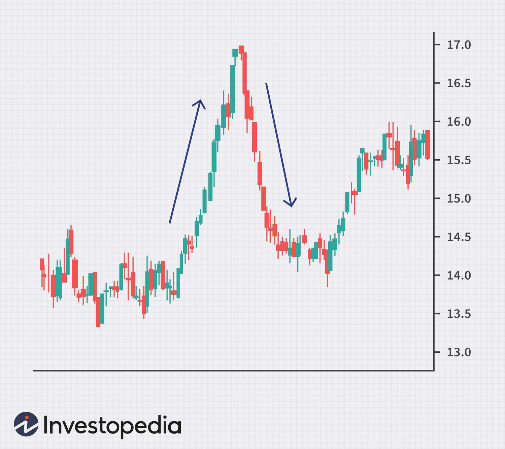

In the world of trading, understanding market patterns and indicators is crucial for making informed decisions. A key phenomenon to grasp is the 'blow-off top,' a chart pattern representing a rapid rise followed by a sharp decline in asset prices. Historically, blow-off tops are seen at the peaks of speculative rallies where asset prices become disconnected from their intrinsic values, often fueled by excessive enthusiasm and speculative buying.

This article examines both the technical aspects of blow-off tops and highlights the strategic value of algorithmic trading in improving market strategies. Recognizing such patterns involves analyzing price and volume behavior to identify unsustainable growth trends commonly influenced by market psychology and external factors. Algorithmic trading, which utilizes automated systems to analyze real-time data, plays a vital role in swiftly detecting and reacting to these volatile conditions, offering traders tools to manage risks and secure profitable opportunities.



By exploring the characteristics of blow-off tops, methods for identification, and the utility of algo trading, this article aims to equip traders with advanced insights for navigating these market scenarios. The goal is to enhance your trading arsenal with strategies that address the inherent risks of blow-off tops, transforming potential challenges into opportunities.

## Table of Contents

## Understanding Blow-Off Tops

A blow-off top is a market phenomenon characterized by an abrupt surge in a security's price and trading volume, followed by a swift decline. This pattern often marks the culmination of a bullish trend predominantly driven by speculative buying behaviors that may lack a solid foundation in the underlying asset's intrinsic value. Traders and analysts identify blow-off tops through distinct signs: rapid, vertical climbs in price and volume culminating in sudden, steep declines. 

The psychology underpinning a blow-off top is crucial to grasp, as it is frequently driven by a 'fear of missing out' (FOMO) among traders. This phenomenon is compounded by herd mentality, where market participants collectively engage in aggressive buying, propelling prices to heights that are ultimately unsustainable. The exaggerated enthusiasm and speculative fervor typically observed during a blow-off top are often detached from the security's fundamental valuations, making these events highly volatile and unpredictable.

Understanding these dynamics is essential for traders aiming to navigate and potentially profit from blow-off tops while mitigating associated risks.

## Key Indicators of Blow-Off Tops

Identifying a blow-off top requires an understanding of specific market behaviors that indicate this distinctive chart pattern. One of the primary features is a sharp, almost vertical increase in the asset's price, often driven by intense speculative activity. This surge is unsustainable and is soon followed by a rapid decline as the market corrects itself.

A critical [factor](/wiki/factor-investing) in recognizing a blow-off top is the trading [volume](/wiki/volume-trading-strategy). During the price spike, a noticeable increase in trading volume occurs as more market participants engage in buying, driven by enthusiasm or the fear of missing out. This is followed by another surge in volume during the descent as panic selling ensues. Hence, monitoring volume fluctuations alongside price movements provides valuable insights into identifying blow-off tops.

Technical indicators play a crucial role in highlighting potential blow-off tops. The Relative Strength Index (RSI), a popular tool for assessing whether an asset is overbought or oversold, becomes particularly useful. An RSI reading above 70 is commonly interpreted as overbought, signaling that the asset's price could soon revert. However, in a blow-off scenario, RSI can exceed usual overbought levels, reflecting extreme market conditions before the eventual drop.

Apart from technical metrics, sentiment analysis and macroeconomic indicators can also corroborate a blow-off top's presence. Market sentiment gauges investors' overall attitude toward risk, which, during a blow-off top, is often overly optimistic. Sentiment shifts can be tracked using social media trends, news headlines, or dedicated sentiment indices. Additionally, analyzing broader economic conditions, such as [liquidity](/wiki/liquidity-risk-premium) levels or [interest rate](/wiki/interest-rate-trading-strategies) changes, can provide context to these formations, confirming whether the price movements are justified by fundamentals or driven by speculation.

By combining these approaches, traders can more effectively identify and anticipate blow-off tops, allowing them to adjust their strategies accordingly and manage the associated risks.

## Algorithmic Trading and Blow-Off Tops

Algorithmic trading strategies are crucial in recognizing and capitalizing on blow-off tops, which are characterized by rapid increases followed by sharp declines in asset prices. Algorithms equipped to process real-time data can identify unusual pricing behaviors and significant volume spikes, alerting traders to potential blow-off top formations. This capability is particularly important given the speed at which these phenomena can develop and dissipate.

The implementation of automated trading systems provides a strategic advantage by executing trades swiftly, thereby reducing the risks associated with manual intervention during volatile market phases. For instance, when a blow-off top is detected, these systems can be programmed to automatically initiate trades, capturing profits or limiting losses based on pre-set conditions and market analysis. This approach is essential in protecting traders from the emotional impulses typically triggered by volatile situations.

One of the popular methods employed by traders is the use of sophisticated strategies like short selling or options trading to capitalize on blow-off tops. Short selling allows traders to profit from the expected decline by selling borrowed shares at high prices and repurchasing them at lower prices. In this context, algorithmic systems can determine optimal entry and [exit](/wiki/exit-strategy) points by analyzing historical price patterns and current market conditions.

Consider a simple Python example to identify a blow-off top using a moving average crossover strategy:

```python
import pandas as pd

def identify_blow_off_top(df, short_window=5, long_window=20):
    # Calculate short and long-term moving averages
    df['Short_MA'] = df['Close'].rolling(window=short_window).mean()
    df['Long_MA'] = df['Close'].rolling(window=long_window).mean()

    # Identify crossover points
    df['Signal'] = 0
    df['Signal'][short_window:] = \
        np.where(df['Short_MA'][short_window:] > df['Long_MA'][short_window:], 1, 0)

    df['Position'] = df['Signal'].diff()

    # Condition for blow-off top: short-term average crosses below long-term average
    blow_off_tops = df[df['Position'] == -1]

    return blow_off_tops

# Example DataFrame df with Date and Close columns
blow_off_tops = identify_blow_off_top(df)
print(blow_off_tops[['Date', 'Close']])
```

By utilizing [algorithmic trading](/wiki/algorithmic-trading), investors can exploit these strategies with precision and discipline, characteristic of automated systems. Moreover, the ability to backtest strategies against historical data offers insight into potential outcomes and risk adjustments, honing the automated decision-making process under varying market scenarios.

Ultimately, incorporating algorithmic trading in the context of blow-off tops equips traders with a robust toolset to navigate the complexities of rapidly shifting markets, leveraging technological advancements to engage with the market proactively and efficiently.

## Strategies for Trading Blow-Off Tops

Trading a blow-off top necessitates a robust strategy centered on risk management and precise market timing. The rapid price ascent followed by a sharp decline typical of blow-off tops presents both challenges and opportunities for traders. Employing the right techniques can help navigate these volatile conditions effectively.

One of the primary strategies is short selling during the decline phase. Short selling involves selling a security not currently owned, with the intention of repurchasing it at a lower price. To execute profitable short sales, identifying precise entry and exit points is essential. This requires a thorough analysis of price trends and volume indicators to anticipate the reversal point accurately. For instance, when a blow-off top is suspected, traders might wait for confirmation, such as a candlestick pattern signaling a reversal, before initiating a short position.

Options strategies, such as buying puts, offer another avenue for managing risk and profiting during a blow-off top. A put option gives the holder the right to sell an asset at a predetermined price within a specific timeframe. By purchasing puts, traders can protect their portfolios from potential losses if the asset's price plummets. Calculating the right strike price and expiration date is crucial for maximizing the effectiveness of this strategy. This calculation often involves understanding the asset's historical [volatility](/wiki/volatility-trading-strategies) and predicting future market movements.

Risk management is paramount when trading blow-off tops. The volatile nature of these patterns demands stringent risk controls to protect against significant losses. One effective method is setting stop-loss orders, which automatically sell a security when its price falls to a predetermined level. This mitigates the potential for loss by capping the downside risk. Additionally, adjusting position sizes based on market volatility can help manage risk exposure. For example, during periods of high volatility, reducing the size of trades can minimize potential losses.

Implementing these strategies requires a combination of technical analysis and strategic foresight. Traders should regularly monitor key indicators, such as trading volume and Relative Strength Index (RSI), to identify potential blow-off tops. Additionally, incorporating algorithmic trading tools can enhance the ability to execute trades swiftly and efficiently, further improving risk management and market timing.

Overall, while blow-off tops can be difficult to navigate, disciplined strategies focused on short selling, options trading, and rigorous risk management can create opportunities for profit and safeguard against potential downturns.

## Examples and Case Studies

Historical blow-off tops, such as the 2017 Bitcoin surge, provide valuable lessons in market behavior. The Bitcoin rally of 2017 exemplifies a classic blow-off top, with the [cryptocurrency](/wiki/cryptocurrency)'s price skyrocketing from approximately $1,000 at the beginning of the year to nearly $20,000 in December, followed by a rapid crash. This pattern is characteristic of a blow-off top, featuring a swift and unsustainable rise in asset prices driven by speculative enthusiasm and fear of missing out (FOMO).

Analyzing the 2017 Bitcoin surge sheds light on specific patterns and triggers associated with blow-off tops. The extreme volatility was a result of increased participation from retail investors amid extensive media coverage and speculative hype. The parabolic price increase was further fueled by herd behavior and speculative trading activities, often detached from Bitcoin's intrinsic value or technological fundamentals. The reversal was equally swift, triggered by regulatory concerns, technical challenges, and profit-taking, leading to a steep decline in prices.

Real-world case studies like the 2017 Bitcoin incident offer insights into successful strategies and common pitfalls during blow-off tops. A key strategy employed during such events is to recognize overbought signals using technical indicators, such as the Relative Strength Index (RSI), and to be prepared with a risk management plan. The RSI can signal overbought conditions when it moves above 70, indicating potential reversals.

Moreover, the use of algorithmic trading strategies can enhance the ability to capitalize on blow-off tops. Algorithms can monitor market conditions in real-time, alerting traders to unusual volume spikes or rapid price changes. For example, a Python script might look like this:

```python
import pandas as pd
import numpy as np

# Example function to identify RSI
def compute_RSI(data, window=14):
    delta = data['Close'].diff()
    gain = (delta.where(delta > 0, 0)).ewm(span=window).mean()
    loss = (-delta.where(delta < 0, 0)).ewm(span=window).mean()
    RS = gain / loss
    RSI = 100 - (100 / (1 + RS))
    return RSI

# Load market data
data = pd.read_csv('market_data.csv')

# Compute RSI
data['RSI'] = compute_RSI(data)

# Detect high RSI indicating potential blow-off top
potential_blow_off = data[data['RSI'] > 70]
```

This code demonstrates a simple implementation of RSI calculation to flag potential blow-off tops. Traders can integrate such algorithms into their systems to execute timely trades, employing strategies such as short selling or options trading to hedge against anticipated declines.

These historical instances and strategies underscore the importance of a disciplined approach to trading blow-off tops, meticulously analyzing market sentiment and technical indicators while employing advanced trading tools to navigate volatility effectively.

## Conclusion

Blow-off tops can be both a challenge and an opportunity for traders who possess the right strategies. The harmony of technical analysis with algorithmic trading tools is crucial in navigating these unpredictable market phases. This combination allows for refined analysis of price movements, enabling traders to predict and react swiftly to these volatile spikes. 

Understanding market indicators is central to managing risk. Through precisely analyzing price and volume data, traders can forecast potential blow-off tops, minimizing exposure to rapid downturns. Algorithmic trading further enhances this approach by executing trades with speed and precision, thus reducing the impact of human error and emotional decision-making in volatile conditions.

To benefit from market anomalies like blow-off tops, traders must remain vigilant and informed. Continuous learning and adaptation to new market trends and technologies are essential. By effectively integrating these strategies, traders can transform potentially adverse market conditions into advantageous opportunities, ensuring resilience in the ever-changing trading ecosystem.

## References & Further Reading

[1]: Bergstra, J., Bardenet, R., Bengio, Y., & Kégl, B. (2011). ["Algorithms for Hyper-Parameter Optimization."](https://dl.acm.org/doi/10.5555/2986459.2986743) Advances in Neural Information Processing Systems 24.

[2]: ["Advances in Financial Machine Learning"](https://www.amazon.com/Advances-Financial-Machine-Learning-Marcos/dp/1119482089) by Marcos Lopez de Prado

[3]: ["Evidence-Based Technical Analysis: Applying the Scientific Method and Statistical Inference to Trading Signals"](https://www.amazon.com/Evidence-Based-Technical-Analysis-Scientific-Statistical/dp/0470008741) by David Aronson

[4]: ["Machine Learning for Algorithmic Trading"](https://github.com/stefan-jansen/machine-learning-for-trading) by Stefan Jansen

[5]: ["Quantitative Trading: How to Build Your Own Algorithmic Trading Business"](https://www.amazon.com/Quantitative-Trading-Build-Algorithmic-Business/dp/1119800064) by Ernest P. Chan