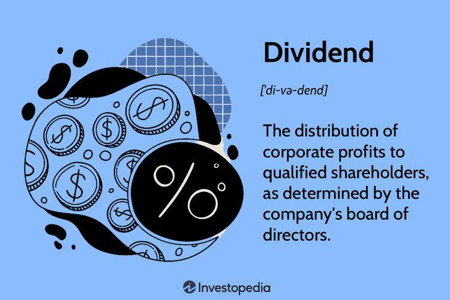

## Table of Contents

## What are dividend-paying stocks?

Dividend-paying stocks are shares in a company that give you a portion of the company's profits regularly, usually every three months. When you own these stocks, you get paid a dividend, which is like a small reward for being a shareholder. This can be a good way to earn some extra money without selling your stocks.

Companies that pay dividends are often well-established and financially stable. They want to share their success with their shareholders. By paying dividends, these companies show that they are doing well and have extra money to give back. This can make dividend stocks a popular choice for people looking for a steady income from their investments.

## Why might someone invest in dividend-paying stocks?

Someone might invest in dividend-paying stocks because they want to earn money regularly without selling their stocks. When a company does well and has extra money, it shares some of that money with its shareholders as dividends. This can be like getting a small paycheck every few months just for holding onto the stock. This steady income can be really helpful, especially for people who are retired or need extra money to live on.

Another reason to invest in dividend-paying stocks is that they can be a sign of a strong and stable company. Companies that pay dividends are usually well-established and have a good track record. They want to keep their shareholders happy by sharing their profits. So, by investing in these stocks, you're not just getting regular payments, but you're also putting your money into companies that are likely to be around for a long time. This can make your investment safer and more reliable in the long run.

## How can beginners identify companies that pay dividends?

Beginners can start by looking at a company's history of paying dividends. Many websites and financial news sources list companies that pay dividends regularly. You can search for terms like "dividend stocks" or "dividend-paying companies" to find lists and articles about them. Also, you can check a company's website or their investor relations page. There, they often share information about their dividend history and when they plan to pay dividends next.

Another way is to use stock screening tools. These are online tools that let you filter stocks based on different criteria, like whether they pay dividends. You can set the tool to show only stocks that have a history of paying dividends. This can help you quickly find a list of companies that might be good for you to invest in. Some popular websites that offer these tools are Yahoo Finance, Morningstar, and Zacks.

Lastly, you can look at financial reports and announcements. Companies usually announce when they will pay dividends and how much they will pay. These announcements are often found in their quarterly earnings reports or press releases. By keeping an eye on these, you can stay updated on which companies are paying dividends and make informed decisions about where to invest your money.

## What is a dividend yield and how is it calculated?

A dividend yield is a way to see how much money you get back from a company's dividends compared to the price you paid for the stock. It tells you the percentage of return you're getting just from the dividends. For example, if a stock costs $100 and pays $5 in dividends each year, the dividend yield would be 5%. This helps you understand how much income you can expect from your investment.

To calculate the dividend yield, you take the annual dividend per share and divide it by the stock's current price per share. Then, you multiply that number by 100 to turn it into a percentage. So, if a company pays $2 in dividends per year and the stock price is $50, you would do this: $2 divided by $50 equals 0.04. Multiply 0.04 by 100, and you get a 4% dividend yield. This simple calculation helps you compare different stocks and see which ones might give you a better return through dividends.

## How do dividend payout ratios affect stock selection?

The dividend payout ratio is a number that shows how much of a company's earnings are given out as dividends. It's important because it can help you understand if a company is good at sharing its profits with shareholders. A high payout ratio means the company is giving out most of its earnings as dividends, which might be good if you want a lot of income from your stocks. But it could also mean the company isn't keeping enough money to grow or handle tough times. On the other hand, a low payout ratio means the company is keeping more of its earnings, which could be good for future growth but might mean less money for you in dividends.

When picking stocks, looking at the dividend payout ratio can help you decide if a stock fits your goals. If you need regular income, you might like a company with a higher payout ratio because it gives you more money now. But if you're thinking about the long term and want the company to grow, you might choose one with a lower payout ratio. It's all about finding the right balance between getting dividends now and the company's ability to keep doing well in the future.

## What are the tax implications of dividend income?

When you get money from dividends, you have to pay taxes on it. The tax you pay depends on how much money you make in a year and what kind of dividends you get. There are two main types of dividends: qualified and non-qualified. Qualified dividends are taxed at a lower rate, which can be 0%, 15%, or 20%, depending on your income. Non-qualified dividends are taxed at your regular income tax rate, which can be higher. So, knowing which type of dividend you're getting can help you figure out how much tax you'll owe.

The way you report dividend income is by filling out a form called a 1099-DIV, which you get from the company that paid you the dividends. You need to include this form when you do your taxes. If you have a lot of dividend income, it might push you into a higher tax bracket, meaning you'll pay more in taxes overall. It's a good idea to keep track of your dividends and maybe talk to a tax professional to make sure you're paying the right amount and taking advantage of any tax breaks you can get.

## How can one assess the sustainability of a company's dividend?

To assess the sustainability of a company's dividend, you need to look at how well the company is doing financially. One way to do this is by checking the company's earnings. If a company is making more money than it's paying out in dividends, it's a good sign that the dividend can keep going. You can find this out by looking at the dividend payout ratio, which shows how much of the company's earnings are being paid out as dividends. A lower payout ratio usually means the company has more money left over to keep the dividend going or to grow the business.

Another thing to check is the company's cash flow. This is the money that's coming in and going out of the company. If a company has a strong and steady cash flow, it's more likely to keep paying its dividends. You can find this information in the company's financial statements, like the cash flow statement. Also, it's good to look at the company's history of paying dividends. If a company has been paying dividends for a long time without cutting them, it's a sign that the dividend might be sustainable. By looking at these things, you can get a better idea of whether a company's dividend will last.

## What role do sector and industry play in dividend stability?

The sector and industry a company is in can really affect how stable its dividends are. Some sectors, like utilities and consumer staples, tend to be more stable because people always need things like electricity and food. These companies usually have steady earnings, which makes it easier for them to keep paying dividends. On the other hand, sectors like technology or energy can be more up and down. For example, tech companies might be growing fast but might not pay dividends because they're using their money to grow even more. Energy companies can be affected a lot by changes in oil prices, which can make their dividends less predictable.

Another thing to think about is how the industry is doing overall. If an industry is doing well and growing, the companies in it might have more money to pay out as dividends. But if the industry is struggling, companies might have to cut their dividends to save money. For example, during tough economic times, industries like travel and hospitality might see their profits drop, making it harder for them to keep paying dividends. So, when you're looking at a company's dividend, it's a good idea to also look at how stable its sector and industry are.

## How do economic cycles impact dividend-paying stocks?

Economic cycles can really change how well dividend-paying stocks do. When the economy is doing great, companies usually make more money. This means they can pay bigger dividends to their shareholders. People also feel more confident about investing, so they might buy more stocks, which can make the stock prices go up. But when the economy starts to slow down or goes into a recession, things can get tough. Companies might not make as much money, so they might have to cut their dividends or stop paying them altogether. This can make investors worried, and they might sell their stocks, which can make the stock prices go down.

Different sectors feel the impact of economic cycles in different ways. Some sectors, like utilities and consumer staples, are more stable because people always need things like electricity and food, no matter how the economy is doing. These companies are more likely to keep paying their dividends even during tough times. On the other hand, sectors like technology or luxury goods can be hit harder by economic downturns. People might not buy as many expensive gadgets or luxury items when money is tight, so these companies might have to cut their dividends. Knowing how different sectors react to economic cycles can help you pick dividend-paying stocks that are more likely to keep paying out, even when the economy is not doing so well.

## What are the differences between high-yield and growth-oriented dividend stocks?

High-yield dividend stocks are stocks that pay a lot of money in dividends compared to their price. They are good for people who want to get a lot of income from their investments right away. These stocks usually have a high dividend yield, which means you get more money back for each dollar you invest. But, high-yield stocks can sometimes be risky. A company might pay a high dividend because it's not doing well and its stock price is going down. So, while you might get a lot of money now, the company might not be able to keep paying those high dividends in the future.

Growth-oriented dividend stocks are different. These are stocks from companies that are growing and using some of their money to pay dividends, but they're also keeping a lot of it to grow even more. These stocks might not pay as much in dividends right now, but the company is expected to do better in the future. This means the stock price could go up, and the dividends might get bigger over time. People who invest in growth-oriented dividend stocks are usually looking for a mix of income now and the chance for their investment to grow in value later.

## How can investors use dividend reinvestment plans (DRIPs) to their advantage?

Investors can use dividend reinvestment plans (DRIPs) to grow their investments over time without spending more money. When you sign up for a DRIP, instead of getting your dividend payments in cash, the company uses that money to buy more shares of its stock for you. This means you end up owning more of the company without having to pay extra. Over time, as you keep getting dividends and they keep getting reinvested, you can own a lot more shares than you started with. This can help your investment grow faster because you're earning dividends on a bigger and bigger number of shares.

DRIPs can also help you take advantage of compound growth. When your dividends buy more shares, those new shares will also start earning dividends. This creates a cycle where your investment keeps growing on its own. It's like planting a seed and watching it grow into a big tree. Plus, many companies offer DRIPs at a discount, so you can buy more shares for less money than if you bought them on the open market. This can make your investment grow even faster. By using DRIPs, you can build a bigger investment over time without having to do much work.

## What advanced metrics should experts consider when evaluating dividend stocks?

When experts look at dividend stocks, they pay attention to something called the payout ratio. This number shows how much of a company's earnings go to paying dividends. A payout ratio that's too high might mean the company is giving away too much money and might not have enough left to grow or handle tough times. On the other hand, a payout ratio that's too low might mean the company isn't sharing enough of its profits with shareholders. Experts also look at the company's free cash flow, which is the money left after the company pays for everything it needs to run. If a company has a lot of free cash flow, it's more likely to keep paying its dividends and maybe even increase them over time.

Another important thing experts consider is the company's debt levels. A company with a lot of debt might have to use its money to pay off loans instead of paying dividends. This can make the dividends less reliable. Experts also look at the company's history of paying dividends. A company that has been paying dividends for a long time and hasn't cut them is usually seen as more stable. Finally, experts might look at the company's return on equity (ROE), which shows how well the company is using the money shareholders have invested. A high ROE can be a good sign that the company is doing well and can keep paying its dividends.

## What is the understanding of dividend stocks?

Dividend stocks represent equity in companies that allocate a portion of their earnings to shareholders in the form of dividends, typically on a regular basis. These distributions can provide a steady income stream, which is particularly appealing for investors focused on long-term growth and income stability. Such stocks are often considered a fundamental component of a diversified investment portfolio due to their potential for consistent returns and lower volatility compared to non-dividend-paying stocks.

Evaluating dividend stocks involves analyzing key indicators such as dividend yield and payout ratio. The dividend yield is a financial ratio that indicates how much a company pays in dividends each year relative to its stock price. It is calculated as:

$$
\text{Dividend Yield} = \left( \frac{\text{Annual Dividends Per Share}}{\text{Price Per Share}} \right) \times 100\%
$$

This metric provides investors with a sense of the return on investment they can expect from dividend payments alone, exclusive of capital gains. A high dividend yield might indicate a good investment opportunity; however, it can also suggest potential underlying problems within the company that could affect its future profitability.

The payout ratio is another essential metric, representing the proportion of earnings a company distributes to its shareholders in dividends. It is given by:

$$
\text{Payout Ratio} = \left( \frac{\text{Dividends Paid}}{\text{Net Income}} \right) \times 100\%
$$

A low payout ratio may indicate that a company is reinvesting most of its earnings into business growth, while a high payout ratio could suggest that the company is returning substantial profits to shareholders. Thus, understanding a company's payout ratio helps investors gauge the sustainability of its dividend payments.

In addition to these metrics, the financial health of the issuing company is a critical consideration for investors. Companies with strong balance sheets, stable cash flows, and solid financial performance are more likely to sustain and grow their dividend payments over time. Conversely, companies with significant debt levels or inconsistent earnings may face challenges in maintaining their dividend distributions.

When assessing dividend stocks, it is vital to consider the quality of the company and its ability to generate cash flow, not just the attractiveness of the dividend yield. A comprehensive evaluation, balancing dividend metrics with the company's overall financial health, can lead to more informed investment decisions and contribute to achieving long-term financial goals.

## What are the benefits of investing in dividend stocks?

Dividend stocks are a popular choice for investors seeking to build a stable income stream. One of the primary benefits of investing in dividend stocks is the consistent passive income they provide. When a company earns profits, it can choose to reinvest those earnings or distribute a portion to shareholders in the form of dividends. This distribution creates a reliable income source that investors can count on, regardless of other market fluctuations. In this way, dividend stocks can effectively complement other income sources and reduce overall financial [volatility](/wiki/volatility-trading-strategies).

Reinvesting dividends is another key advantage, allowing for the exponential growth of an investment portfolio through the power of compounding. The process of reinvesting involves using dividend payouts to purchase additional shares, which can then generate their own dividends. Over time, this can lead to significant growth as dividends start generating their own returns. Mathematically, this growth can be expressed using the formula for compound interest:

$$
A = P \left(1 + \frac{r}{n}\right)^{nt}
$$

Where:
- $A$ is the amount of money accumulated after n years, including dividends.
- $P$ is the initial principal balance (initial investment).
- $r$ is the dividend yield.
- $n$ is the number of times dividends are reinvested per year.
- $t$ is the number of years.

Additionally, dividend-paying stocks generally provide a hedge against market volatility. During periods of economic uncertainty, such stocks tend to offer a more stable return component due to the regularity and predictability of their dividend payouts. This stability can be particularly appealing in times of market downturns, as dividends provide a cushion against falling stock prices and often indicate a company’s financial health and stability.

From a tax perspective, there are benefits associated with qualified dividend income. Qualified dividends are typically taxed at a lower rate compared to ordinary income, often aligning with long-term capital gains tax rates. This tax efficiency can enhance the overall returns from dividend stocks, making them a more attractive option compared to other forms of income. In various jurisdictions, such as the United States, this tax advantage can help improve net returns for dividend investors.

Overall, investing in dividend stocks presents numerous benefits including securing a passive income stream, the potential for portfolio growth through compounding, stability during market volatility, and possible tax advantages. These factors make dividend stocks a compelling addition to a diverse investment portfolio.

## References & Further Reading

[1]: Bergstra, J., Bardenet, R., Bengio, Y., & Kégl, B. (2011). ["Algorithms for Hyper-Parameter Optimization."](https://papers.nips.cc/paper/4443-algorithms-for-hyper-parameter-optimization) Advances in Neural Information Processing Systems 24.

[2]: ["Advances in Financial Machine Learning"](https://www.amazon.com/Advances-Financial-Machine-Learning-Marcos/dp/1119482089) by Marcos Lopez de Prado

[3]: ["Evidence-Based Technical Analysis: Applying the Scientific Method and Statistical Inference to Trading Signals"](https://books.google.com/books/about/Evidence_Based_Technical_Analysis.html?id=MeoJAQAAMAAJ) by David Aronson

[4]: ["Machine Learning for Algorithmic Trading"](https://github.com/stefan-jansen/machine-learning-for-trading) by Stefan Jansen

[5]: ["Quantitative Trading: How to Build Your Own Algorithmic Trading Business"](https://www.amazon.com/Quantitative-Trading-Build-Algorithmic-Business/dp/1119800064) by Ernest P. Chan