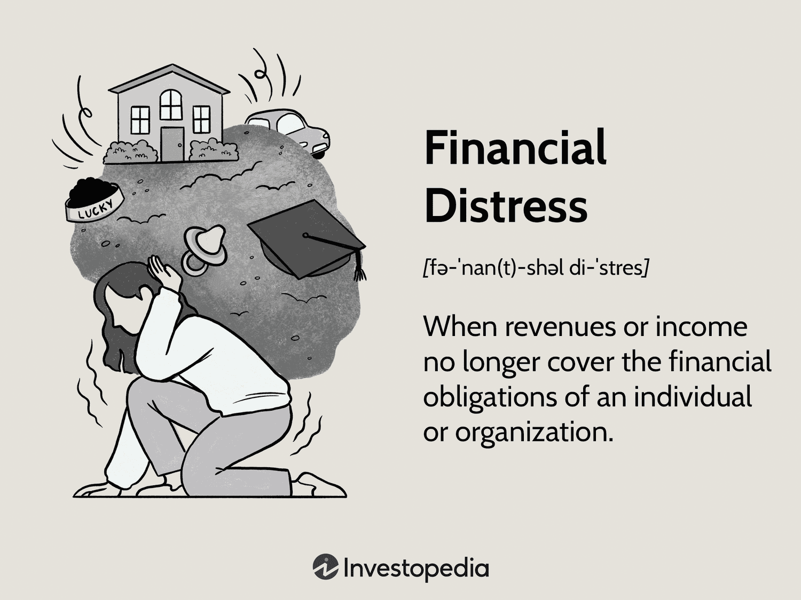

## Table of Contents

## What are financial ratios and why are they important?

Financial ratios are numbers that help people understand a company's financial health by comparing different parts of its financial statements. They are like health check-ups for businesses, showing how well a company is doing with its money. For example, they can tell if a company is making good profits, if it can pay its bills, or if it is using its resources well.

These ratios are important because they help investors, managers, and other people make smart decisions. Investors might use them to decide if they should buy or sell a company's stock. Managers can use them to see where they need to improve or to show how well they are doing. By looking at these ratios, people can get a quick and clear picture of a company's financial situation, which helps them make better choices.

## How can financial ratios help identify financial distress?

Financial ratios can help spot when a company is in financial trouble by showing warning signs early on. For example, the debt-to-equity ratio tells us how much a company is borrowing compared to what the owners have put in. If this ratio is high, it means the company is relying a lot on borrowed money, which can be risky. Another ratio, the interest coverage ratio, shows if a company can pay the interest on its debts from its earnings. If this number is low, it might mean the company is struggling to make these payments, which is a big red flag.

Another useful ratio is the current ratio, which compares a company's short-term assets to its short-term debts. A low current ratio could mean the company might have trouble paying its bills soon. Also, the return on assets ratio shows how well a company is using its assets to make money. If this ratio starts dropping, it could be a sign that the company's financial health is getting worse. By keeping an eye on these ratios, people can see early warnings of financial distress and take action to help the company get back on track.

## What is the current ratio and how does it indicate liquidity issues?

The current ratio is a financial ratio that tells us if a company can pay its short-term bills. It is calculated by dividing the company's current assets, like cash and things that can be turned into cash quickly, by its current liabilities, which are the bills it needs to pay soon. A good current ratio is usually seen as being above 1, because that means the company has more assets than liabilities to cover its short-term debts.

If the current ratio is low, it can show that the company might have liquidity issues. Liquidity means having enough cash or things that can be turned into cash to pay bills when they are due. A low current ratio, like below 1, means the company might not have enough money or assets to pay what it owes in the short term. This can be a warning sign that the company is in financial trouble and might struggle to keep running smoothly.

## What is the quick ratio and how does it differ from the current ratio in assessing financial health?

The quick ratio, also known as the acid-test ratio, is another way to check if a company can pay its short-term bills. It's similar to the current ratio, but it's a bit stricter. The quick ratio is calculated by taking the company's most liquid assets, like cash, money in the bank, and things that can be sold quickly, and dividing them by the company's current liabilities. This ratio doesn't include inventory because it might take time to sell, so it gives a clearer picture of how well a company can pay its bills right away.

The main difference between the quick ratio and the current ratio is that the quick ratio is more conservative. While the current ratio includes all current assets, the quick ratio only counts the assets that can be turned into cash very quickly. This makes the quick ratio a better tool for spotting immediate liquidity problems. If a company's quick ratio is low, it might mean they could have trouble paying their bills right away, even if their current ratio looks okay. So, the quick ratio gives a more urgent warning about a company's financial health.

## How does the debt-to-equity ratio signal potential financial distress?

The debt-to-equity ratio tells us how much a company is borrowing compared to what the owners have put in. It's calculated by dividing the company's total debt by its total equity. A high debt-to-equity ratio can be a warning sign of financial distress. It means the company is relying a lot on borrowed money, which can be risky. If the company can't pay back its debts, it might face big problems.

When the debt-to-equity ratio is high, it shows that the company might be in a risky spot. If things go wrong, like if the company's profits drop or if interest rates go up, it could struggle to pay back what it owes. This could lead to financial distress, where the company might have to sell assets, cut jobs, or even go bankrupt. So, a high debt-to-equity ratio is something to watch out for because it can signal that the company is in trouble.

## What does the interest coverage ratio tell us about a company's ability to meet its debt obligations?

The interest coverage ratio tells us if a company can pay the interest on its debts from its earnings. It's calculated by dividing a company's earnings before interest and taxes (EBIT) by its interest expenses. A high interest coverage ratio means the company is doing well and can easily pay its interest. A low ratio means the company might struggle to pay its interest, which is a warning sign.

If the interest coverage ratio is low, it means the company's earnings are not enough to cover its interest payments. This can be a big problem because if a company can't pay its interest, it might have to borrow more money, sell assets, or even go bankrupt. So, the interest coverage ratio is important for understanding if a company is in a good spot to handle its debts or if it's in danger of financial trouble.

## How can the inventory turnover ratio indicate operational inefficiencies leading to financial distress?

The inventory turnover ratio shows how often a company sells and replaces its stock of goods within a certain time. It's calculated by dividing the cost of goods sold by the average inventory. If this ratio is low, it means the company is not selling its products quickly enough. This can be a sign of operational inefficiencies because it shows that the company might be holding onto too much stock, which ties up money that could be used elsewhere.

When a company has a low inventory turnover ratio, it can lead to financial distress. Keeping too much inventory means the company has less cash on hand to pay bills or invest in new opportunities. It can also mean that the products might get outdated or go bad, especially if they are perishable. This can lead to losses and make it harder for the company to stay financially healthy. So, a low inventory turnover ratio is a warning sign that the company needs to look at its operations and fix any problems to avoid financial trouble.

## What role does the accounts receivable turnover ratio play in assessing a company's financial health?

The accounts receivable turnover ratio helps us see how well a company is at collecting money from its customers. It's found by dividing the total sales on credit by the average accounts receivable. A high ratio means the company is good at getting paid quickly, which is good because it keeps the money flowing and helps the company pay its own bills.

If the accounts receivable turnover ratio is low, it can be a warning sign. It might mean the company is having trouble getting paid by its customers. This can lead to problems because if the company doesn't get paid, it might not have enough money to keep running smoothly. So, this ratio is important for understanding if a company is in good financial shape or if it might be heading towards trouble.

## How can the return on assets (ROA) ratio be used to detect early signs of financial distress?

The return on assets (ROA) ratio tells us how well a company is using its stuff to make money. It's calculated by dividing the company's net income by its total assets. If the ROA is high, it means the company is doing a good job of turning its assets into profits. But if the ROA starts to drop, it could be an early sign that the company is not doing so well and might be heading towards financial distress.

A falling ROA can mean a few things. It might show that the company's profits are going down, or that it's spending more money on things that aren't helping it make more profit. If a company's ROA keeps getting lower, it's a warning that the company might be struggling to stay financially healthy. Watching the ROA can help catch these problems early, so the company can try to fix them before they get worse.

## What advanced financial ratios should be used to predict bankruptcy, such as Altman Z-score?

The Altman Z-score is a popular tool for predicting if a company might go bankrupt. It uses a mix of five financial ratios to come up with a score that tells us how likely it is for a company to fail. The ratios look at things like how well the company is using its assets, how much debt it has compared to what the owners have put in, how well it's selling its products, and how good it is at making money from what it sells. If the Z-score is low, it means the company is at a higher risk of going bankrupt, which can be a big warning sign for people who invest in or run the company.

Another useful ratio for predicting bankruptcy is the Beneish M-score. This score looks at eight different financial numbers to see if a company might be cooking its [books](/wiki/algo-trading-books) or if it's really in financial trouble. It checks things like how much the company's sales are growing, how it's managing its costs, and how its profits are changing. A high M-score can mean the company is at risk of going bankrupt because it might be hiding problems or not managing its money well. Both the Altman Z-score and the Beneish M-score help people spot early signs of trouble, so they can take action to keep the company from failing.

## How do cash flow ratios like operating cash flow to total debt help in deeper analysis of financial distress?

Cash flow ratios, like the operating cash flow to total debt ratio, give us a good look at how a company is doing with its money. This ratio is found by dividing the cash a company makes from its normal business activities by the total amount of debt it has. A high ratio means the company is making enough cash to pay off its debts, which is a good sign. But if the ratio is low, it can mean the company might have trouble paying back what it owes, which is a warning sign of financial distress.

Looking at this ratio can help us understand if a company is really in trouble or if it's just having a bad year. If a company's operating cash flow to total debt ratio keeps going down, it might mean it's getting harder for the company to handle its debts. This can be a big problem because if a company can't pay its debts, it might have to sell things, cut jobs, or even go bankrupt. So, this ratio is a useful tool for catching early signs of financial trouble and helping people make smart decisions about the company.

## What are the limitations of using financial ratios to identify financial distress, and how can these be mitigated?

Using financial ratios to spot financial distress has some limits. One big problem is that these ratios only look at numbers from the past. They don't tell us what might happen in the future or what's going on right now in the company. Also, different companies in different industries might have different normal ratios, so comparing them can be tricky. Sometimes, a company can make its numbers look better on paper by doing things like selling off assets, but this might not fix the real problems.

To make up for these limits, it's a good idea to use more than just financial ratios. Looking at other things, like what's happening in the company's industry or the economy, can give a fuller picture. Talking to people who work at the company or reading news about it can also help. Using a mix of financial ratios and other information can help spot financial distress better and make smarter decisions about the company's health.

## What are the key financial ratios for detecting financial distress?

Financial ratios are crucial for detecting financial distress, helping analysts and investors assess the financial health of a company. These ratios are categorically divided into liquidity, profitability, solvency, and cash flow ratios, each highlighting different aspects of the company's financial status.

**Liquidity Ratios** measure a company's ability to meet its short-term obligations. The current ratio, defined as current assets divided by current liabilities, is a fundamental liquidity measure:

$$
\text{Current Ratio} = \frac{\text{Current Assets}}{\text{Current Liabilities}}
$$

A ratio below 1 may indicate potential [liquidity](/wiki/liquidity-risk-premium) problems. Another vital liquidity measure is the quick ratio, or acid-test ratio, which excludes inventories from current assets, as they may not be quickly convertible to cash:

$$
\text{Quick Ratio} = \frac{\text{Current Assets} - \text{Inventories}}{\text{Current Liabilities}}
$$

**Profitability Ratios** assess a company's efficiency and its ability to generate profits relative to revenue. Key measures include the net profit margin and the return on assets (ROA). The net profit margin is calculated by dividing net income by total revenue, indicating how much profit is retained from sales:

$$
\text{Net Profit Margin} = \frac{\text{Net Income}}{\text{Revenue}} \times 100\%
$$

ROA, on the other hand, measures how effectively a company uses its assets to generate earnings:

$$
\text{ROA} = \frac{\text{Net Income}}{\text{Total Assets}}
$$

**Solvency Ratios** evaluate a company's long-term financial stability and its capacity to manage debt. The debt-to-equity ratio, a core solvency measure, compares a company's total debt to its shareholders' equity:

$$
\text{Debt-to-Equity Ratio} = \frac{\text{Total Debt}}{\text{Shareholders' Equity}}
$$

A high ratio suggests potential financial risk due to excessive leverage. The interest coverage ratio, calculated by dividing earnings before interest and taxes (EBIT) by interest expenses, indicates how easily a company can cover interest payments:

$$
\text{Interest Coverage Ratio} = \frac{\text{EBIT}}{\text{Interest Expenses}}
$$

**Cash Flow Ratios** provide insights into cash management and operational liquidity. The operating cash flow ratio, which divides operating cash flow by current liabilities, assesses how well current liabilities are covered by the cash generated from operations:

$$
\text{Operating Cash Flow Ratio} = \frac{\text{Operating Cash Flow}}{\text{Current Liabilities}}
$$

A detailed analysis of these ratios can reveal underlying financial challenges a company may face, such as an inability to meet debts or inefficiencies in operational cash management. Regular monitoring and interpretation of these ratios are critical for early detection of financial distress, allowing preemptive measure implementation before conditions worsen.

## What is the relationship between Algorithmic Trading and Financial Ratio Analysis?

Algorithmic trading leverages financial ratios to enhance the decision-making process, basing trades on quantitative data and automation. These ratios serve as foundational elements that allow algorithms to assess the financial health of companies effectively. By integrating financial ratios into trading algorithms, traders can detect signs of potential distress in companies, enabling timely and informed decisions.

Key financial ratios, such as liquidity, profitability, and solvency ratios, can signal a company's financial distress. Algorithmic trading systems continuously analyze these metrics to identify companies that might be at risk. For instance, a low current ratio—defined as current assets divided by current liabilities—could indicate liquidity issues:

$$
\text{Current Ratio} = \frac{\text{Current Assets}}{\text{Current Liabilities}}
$$

Such insights help traders to act on early warning signs, potentially avoiding losses associated with distressed companies.

Algorithmic trading strategies assess both market trends and the financial health of firms. By back-testing financial ratios against historical market data, algorithms identify patterns and correlations that human traders might miss. This quantitative approach ensures that trading decisions are objective, systematic, and devoid of emotional bias.

Moreover, predictive analytics are crucial in [algorithmic trading](/wiki/algorithmic-trading). By utilizing statistical models and [machine learning](/wiki/machine-learning) techniques, trading algorithms forecast future price movements and financial health trajectories. These predictions allow algorithms to front-run market trends, optimizing buy and sell orders to capitalize on anticipated changes in a company's condition.

In practical terms, algorithmic trading code might look like this in Python, using a basic moving average crossover strategy that incorporates financial ratios:

```python
import numpy as np
import pandas as pd

# Sample function to calculate the moving average
def moving_average(data, window_size):
    return data.rolling(window=window_size).mean()

# Sample data
price_data = pd.Series([100, 102, 104, 103, 105, 107, 106, 108, 110])
financial_strength_index = pd.Series([2.0, 2.2, 1.8, 1.9, 2.1, 2.0, 1.7, 1.8, 2.2])  # Hypothetical ratio indicating distress

# Compute a 3-day moving average
short_ma = moving_average(price_data, 3)
long_ma = moving_average(price_data, 5)

# Generate buy/sell signals
signals = (short_ma > long_ma) & (financial_strength_index > 2.0)

print("Buy/Sell Signals:")
print(signals)
```

This example highlights how algorithmic strategies can incorporate financial ratios into trading decisions. By focusing on quantitative assessments, these systems reduce emotional interference, allowing for precision and timeliness in trading execution.

## References & Further Reading

[1]: Altman, E. I. (1968). ["Financial Ratios, Discriminant Analysis and the Prediction of Corporate Bankruptcy."](https://www.semanticscholar.org/paper/FINANCIAL-RATIOS%2C-DISCRIMINANT-ANALYSIS-AND-THE-OF-Altman/a193120975be25b4ba2764e6d7bf9dc01588aafb) The Journal of Finance, 23(4), 589-609.

[2]: Chan, E. P. (2009). ["Quantitative Trading: How to Build Your Own Algorithmic Trading Business."](https://github.com/ftvision/quant_trading_echan_book) Wiley.

[3]: Jansen, S. (2020). ["Machine Learning for Algorithmic Trading."](https://github.com/stefan-jansen/machine-learning-for-trading) Packt Publishing.

[4]: Lopez de Prado, M. (2018). ["Advances in Financial Machine Learning."](https://www.amazon.com/Advances-Financial-Machine-Learning-Marcos/dp/1119482089) Wiley.

[5]: Reilly, F. K., & Brown, K. C. (2011). ["Investment Analysis and Portfolio Management."](https://faculty.cengage.com/titles/9781305262997) South-Western Cengage Learning.

[6]: Aronson, D. R. (2007). ["Evidence-Based Technical Analysis: Applying the Scientific Method and Statistical Inference to Trading Signals."](https://onlinelibrary.wiley.com/doi/book/10.1002/9781118268315) Wiley.

[7]: Nofsinger, J. R. (2016). ["The Psychology of Investing."](https://www.taylorfrancis.com/books/mono/10.4324/9781003159704/psychology-investing-john-nofsinger) Routledge.