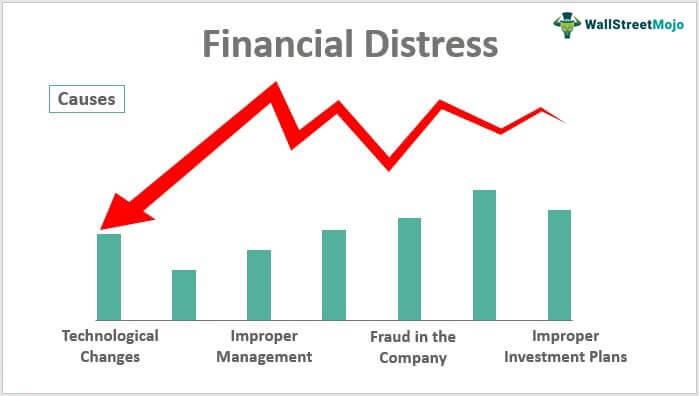

Financial ratios are fundamental tools utilized to assess the financial health of companies. By providing quantifiable metrics from financial statements, these ratios allow analysts and investors to decode a company’s financial stability, profitability, and operational efficiency. Ratios such as liquidity, profitability, solvency, and cash flow offer snapshots of various aspects of a company's economic performance, empowering stakeholders to make informed decisions and identify potential signs of financial distress early.

Understanding financial ratios is integral for anticipating financial challenges before they escalate into crises. Early identification of distress signals, such as diminishing cash flow or increasing debt levels relative to income, enables timely interventions to avert potential business failures. This foresight is crucial for investors, creditors, and managers who are vested in the financial success and sustainability of a company.



Algorithmic trading, a form of trading that uses complex algorithms to execute orders, leverages insights derived from financial ratios to inform trading decisions. By integrating these quantitative metrics, algorithmic trading strategies can automate and optimize trade executions based on financial data, ensuring that decisions are grounded in empirical financial analyses rather than emotional biases or speculation. This precision is vital in high-frequency trading environments where margins are thin, and the speed of execution is key.

This article elucidates the significance of employing financial ratios in detecting distress signs and their symbiotic relationship with algorithmic trading. Readers will be acquainted with various financial ratios, their interpretations, and their application in developing robust trading strategies. The exploration extends to the technological advancements that augment these analyses, illustrating how automated tools enhance decision-making processes in modern financial markets. By converging traditional financial analysis with cutting-edge technology, investors can refine their strategies to adapt to dynamic market conditions and safeguard their investments against the backdrop of evolving financial landscapes.

## Table of Contents

## Key Financial Ratios for Financial Distress Detection

Financial ratios are crucial for detecting financial distress, helping analysts and investors assess the financial health of a company. These ratios are categorically divided into liquidity, profitability, solvency, and cash flow ratios, each highlighting different aspects of the company's financial status.

**Liquidity Ratios** measure a company's ability to meet its short-term obligations. The current ratio, defined as current assets divided by current liabilities, is a fundamental liquidity measure:

$$
\text{Current Ratio} = \frac{\text{Current Assets}}{\text{Current Liabilities}}
$$

A ratio below 1 may indicate potential [liquidity](/wiki/liquidity-risk-premium) problems. Another vital liquidity measure is the quick ratio, or acid-test ratio, which excludes inventories from current assets, as they may not be quickly convertible to cash:

$$
\text{Quick Ratio} = \frac{\text{Current Assets} - \text{Inventories}}{\text{Current Liabilities}}
$$

**Profitability Ratios** assess a company's efficiency and its ability to generate profits relative to revenue. Key measures include the net profit margin and the return on assets (ROA). The net profit margin is calculated by dividing net income by total revenue, indicating how much profit is retained from sales:

$$
\text{Net Profit Margin} = \frac{\text{Net Income}}{\text{Revenue}} \times 100\%
$$

ROA, on the other hand, measures how effectively a company uses its assets to generate earnings:

$$
\text{ROA} = \frac{\text{Net Income}}{\text{Total Assets}}
$$

**Solvency Ratios** evaluate a company's long-term financial stability and its capacity to manage debt. The debt-to-equity ratio, a core solvency measure, compares a company's total debt to its shareholders' equity:

$$
\text{Debt-to-Equity Ratio} = \frac{\text{Total Debt}}{\text{Shareholders' Equity}}
$$

A high ratio suggests potential financial risk due to excessive leverage. The interest coverage ratio, calculated by dividing earnings before interest and taxes (EBIT) by interest expenses, indicates how easily a company can cover interest payments:

$$
\text{Interest Coverage Ratio} = \frac{\text{EBIT}}{\text{Interest Expenses}}
$$

**Cash Flow Ratios** provide insights into cash management and operational liquidity. The operating cash flow ratio, which divides operating cash flow by current liabilities, assesses how well current liabilities are covered by the cash generated from operations:

$$
\text{Operating Cash Flow Ratio} = \frac{\text{Operating Cash Flow}}{\text{Current Liabilities}}
$$

A detailed analysis of these ratios can reveal underlying financial challenges a company may face, such as an inability to meet debts or inefficiencies in operational cash management. Regular monitoring and interpretation of these ratios are critical for early detection of financial distress, allowing preemptive measure implementation before conditions worsen.

## The Role of Auditing in Identifying Financial Distress

Auditing plays a crucial role in identifying financial distress within companies by providing an independent examination of financial statements. Through comprehensive audits, discrepancies or irregularities in financial records that may signal financial instability are often uncovered. These discrepancies can stem from overstated assets, understated liabilities, or revenue recognition issues, all of which can misrepresent a company's true financial position.

Regular audit reports can be instrumental in highlighting changes in accounting practices, which might be indicative of financial distress. For example, a shift from conservative to aggressive revenue recognition methods could suggest that a company is attempting to mask declining performance. Similarly, modifications in inventory valuation or depreciation methods might be tactics to artificially enhance financial outcomes. Auditors, through their analysis, can bring such issues to the fore, enabling stakeholders to make more informed assessments of financial health.

A clean audit report, indicating that the financial statements are free from material misstatements, generally bolsters investor confidence. It suggests that the financial practices of the company are transparent and adhere to generally accepted accounting principles (GAAP). This can be seen as a marker of good corporate governance, enhancing the company's reputation in the eyes of investors and creditors.

Conversely, frequent changes in auditors can be a red flag signaling potential financial problems. High auditor turnover might imply that the company is "opinion shopping" for a more favorable audit result or that there are disagreements over accounting practices, either of which are warning indicators of financial distress. This can undermine investor confidence, as continuity and stability in auditor relationships are typically reflective of sound financial management practices.

Auditing not only underscores discrepancies but, when anomalies are detected, compels management to address these issues, often prompting corrective measures. As such, the auditing process is central to maintaining financial integrity and can be pivotal in detecting early signs of potential financial distress.

## Business and Management Indicators of Financial Distress

Sudden changes in managerial or operational strategies can serve as critical red flags when assessing a company's financial health. Such abrupt shifts may result from internal pressures or inefficiencies that require immediate remediation. For example, a company experiencing cash flow issues might drastically alter its operational strategy to cut costs. While cost reduction can be a strategic move, sudden and unplanned cuts may signify underlying financial distress that could lead to prolonged instability if not properly managed.

Persistent reductions in product quality or service deliverability are also significant warning signs of financial distress. These reductions often result from diminishing resources allocated to production or service departments, possibly due to tightened budgets or efforts to scale down operations. Customers might notice delayed service delivery or reduced product standards, which can damage the company's reputation and exacerbate financial problems as consumer trust declines.

Management departures frequently indicate internal issues affecting a company's financial health. When executives or key managers leave a company, it may suggest dissatisfaction with the strategic direction or financial management. High turnover can disrupt business continuity, leading to the loss of organizational knowledge and a decline in employee morale, further aggravating financial difficulties.

Shifts in market dynamics, increased competition, and evolving consumer behavior can also significantly impact a company's stability. For example, a firm that fails to adapt to new market trends or technology advancements might lose market share to more agile competitors. The inability to swiftly respond to these external pressures can stifle growth and lead to financial losses, making it imperative for businesses to continually assess their strategic positioning and operational agility.

In summary, business and management indicators offer invaluable insights into financial distress. By closely monitoring changes in management strategies, product quality, management turnover, and market conditions, stakeholders can better anticipate potential financial challenges and take corrective action to safeguard the company's longevity.

## Algorithmic Trading and Financial Ratio Analysis

Algorithmic trading leverages financial ratios to enhance the decision-making process, basing trades on quantitative data and automation. These ratios serve as foundational elements that allow algorithms to assess the financial health of companies effectively. By integrating financial ratios into trading algorithms, traders can detect signs of potential distress in companies, enabling timely and informed decisions.

Key financial ratios, such as liquidity, profitability, and solvency ratios, can signal a company's financial distress. Algorithmic trading systems continuously analyze these metrics to identify companies that might be at risk. For instance, a low current ratio—defined as current assets divided by current liabilities—could indicate liquidity issues:

$$
\text{Current Ratio} = \frac{\text{Current Assets}}{\text{Current Liabilities}}
$$

Such insights help traders to act on early warning signs, potentially avoiding losses associated with distressed companies.

Algorithmic trading strategies assess both market trends and the financial health of firms. By back-testing financial ratios against historical market data, algorithms identify patterns and correlations that human traders might miss. This quantitative approach ensures that trading decisions are objective, systematic, and devoid of emotional bias.

Moreover, predictive analytics are crucial in [algorithmic trading](/wiki/algorithmic-trading). By utilizing statistical models and [machine learning](/wiki/machine-learning) techniques, trading algorithms forecast future price movements and financial health trajectories. These predictions allow algorithms to front-run market trends, optimizing buy and sell orders to capitalize on anticipated changes in a company's condition.

In practical terms, algorithmic trading code might look like this in Python, using a basic moving average crossover strategy that incorporates financial ratios:

```python
import numpy as np
import pandas as pd

# Sample function to calculate the moving average
def moving_average(data, window_size):
    return data.rolling(window=window_size).mean()

# Sample data
price_data = pd.Series([100, 102, 104, 103, 105, 107, 106, 108, 110])
financial_strength_index = pd.Series([2.0, 2.2, 1.8, 1.9, 2.1, 2.0, 1.7, 1.8, 2.2])  # Hypothetical ratio indicating distress

# Compute a 3-day moving average
short_ma = moving_average(price_data, 3)
long_ma = moving_average(price_data, 5)

# Generate buy/sell signals
signals = (short_ma > long_ma) & (financial_strength_index > 2.0)

print("Buy/Sell Signals:")
print(signals)
```

This example highlights how algorithmic strategies can incorporate financial ratios into trading decisions. By focusing on quantitative assessments, these systems reduce emotional interference, allowing for precision and timeliness in trading execution.

## Utilizing Technology for Enhanced Financial Analysis

Financial modeling tools are transforming the landscape of financial analysis by automating the calculation and analysis of critical financial ratios. These tools utilize sophisticated algorithms to process vast amounts of financial data, thereby offering a streamlined and efficient process. For example, Python libraries such as Pandas and NumPy enable users to handle data efficiently, while financial packages can compute ratios such as the current ratio, debt-to-equity ratio, and return on equity with just a few lines of code.

Real-time data feeds provide an edge in financial decision-making and risk assessment by ensuring that the most current data is available for analysis. Platforms offering APIs, such as Bloomberg, integrate seamlessly with modeling tools to deliver live market data. This real-time access allows investors to respond promptly to market fluctuations, thereby optimizing trading strategies and minimizing potential risks.

The integration of financial analytical tools with trading platforms facilitates the execution of algorithmic strategies that leverage current market trends and financial ratios. Platforms like MetaTrader and TradeStation offer APIs that allow direct execution of trades based on pre-defined algorithms. These integrations help cut down on the time lag between analysis and action, enabling timely and efficient trade execution.

Moreover, technology supports investors in adapting and refining their strategies swiftly in response to shifting market dynamics. Machine learning algorithms, capable of identifying patterns and predicting market movements, are increasingly being used in concert with traditional financial analysis. For instance, by using Python's scikit-learn library, investors can develop predictive models that evolve with new market data, thus enhancing the robustness of their trading strategies.

In summary, technology plays a pivotal role in automating financial analysis, providing real-time data for informed decision-making, enabling seamless trading strategy execution, and allowing quick adaptation to market changes. The convergence of these technologies facilitates a comprehensive approach to financial analysis, empowering investors and traders to make data-driven decisions with greater confidence and agility.

## Conclusion

Understanding financial ratios is an essential component in gauging a company's financial health and assessing potential distress. These ratios provide concise insights into various aspects of a business's financial performance, including liquidity, profitability, solvency, and cash flow. By analyzing these metrics, investors and stakeholders can detect early warning signs of financial troubles, enabling strategic decision-making to mitigate risks.

Algorithmic trading significantly enhances the utility of financial ratios by incorporating them into sophisticated investment strategies. Through algorithmic trading, financial ratios become part of a quantitative framework that automates trading decisions, reducing emotional biases and improving execution efficiency. These algorithms can process and analyze vast datasets in real-time, allowing traders to capitalize quickly on market opportunities and identify distressed assets that may be undervalued.

Technological advancements play a pivotal role in supporting financial analysis. Modern tools facilitate the automation of financial modeling, providing instantaneous calculations and interpretations of financial ratios. These technologies integrate seamlessly with trading platforms, ensuring that algorithmic strategies can be executed with precision and speed. Technologies such as machine learning and data analytics offer predictive insights, enhancing traditional financial ratio analysis with forward-looking assessments.

Remaining informed and employing quantitative analysis constitute effective strategies for safeguarding investments against potential failures. By continuously monitoring financial health through these metrics and leveraging technology-driven tools, investors can adapt to market changes swiftly, thereby protecting their portfolios from unexpected financial downturns. This proactive approach not only maximizes returns but also fortifies investments against the threats of financial distress in a dynamic economic landscape.

## References & Further Reading

[1]: Altman, E. I. (1968). ["Financial Ratios, Discriminant Analysis and the Prediction of Corporate Bankruptcy."](https://www.semanticscholar.org/paper/FINANCIAL-RATIOS%2C-DISCRIMINANT-ANALYSIS-AND-THE-OF-Altman/a193120975be25b4ba2764e6d7bf9dc01588aafb) The Journal of Finance, 23(4), 589-609.

[2]: Chan, E. P. (2009). ["Quantitative Trading: How to Build Your Own Algorithmic Trading Business."](https://github.com/ftvision/quant_trading_echan_book) Wiley.

[3]: Jansen, S. (2020). ["Machine Learning for Algorithmic Trading."](https://github.com/stefan-jansen/machine-learning-for-trading) Packt Publishing.

[4]: Lopez de Prado, M. (2018). ["Advances in Financial Machine Learning."](https://www.amazon.com/Advances-Financial-Machine-Learning-Marcos/dp/1119482089) Wiley.

[5]: Reilly, F. K., & Brown, K. C. (2011). ["Investment Analysis and Portfolio Management."](https://faculty.cengage.com/titles/9781305262997) South-Western Cengage Learning.

[6]: Aronson, D. R. (2007). ["Evidence-Based Technical Analysis: Applying the Scientific Method and Statistical Inference to Trading Signals."](https://onlinelibrary.wiley.com/doi/book/10.1002/9781118268315) Wiley.

[7]: Nofsinger, J. R. (2016). ["The Psychology of Investing."](https://www.taylorfrancis.com/books/mono/10.4324/9781003159704/psychology-investing-john-nofsinger) Routledge.