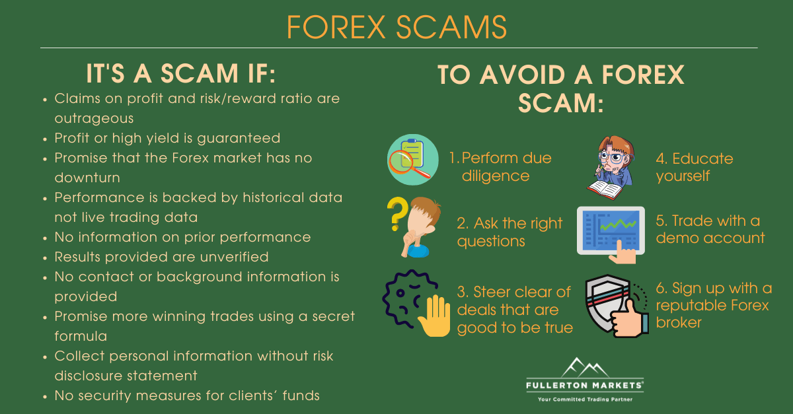

## Table of Contents

## What is a Forex scam?

A Forex scam is when people trick others into giving them money by promising big profits from trading foreign currencies. These scammers often use fake websites, apps, or social media to make their offers look real. They might tell you about a special system or secret strategy that guarantees you'll make money, but it's all a lie. They take your money and then disappear, leaving you with nothing.

These scams can be hard to spot because they sound convincing. Scammers might show you fake success stories or even let you see some small wins at first to make you trust them more. But once they have your money, they stop responding to your messages or suddenly change the rules. It's important to be careful and do a lot of research before you give your money to anyone promising big returns in Forex trading. Always check if the company is regulated by a trusted financial authority.

## How can beginners identify common signs of Forex scams?

Beginners can spot Forex scams by looking out for promises of huge profits with little or no risk. If someone says you can make a lot of money easily, it's probably a scam. Real trading involves risk, and no one can guarantee big profits all the time. Also, be wary of high-pressure sales tactics. Scammers often try to rush you into making a decision, saying the offer is only available for a short time. Take your time and think it over before you invest any money.

Another sign of a scam is if the company isn't regulated by a well-known financial authority. Always check if the company is registered with organizations like the U.S. Securities and Exchange Commission (SEC) or the Financial Conduct Authority (FCA) in the UK. If they're not, it's a red flag. Also, be suspicious if the company asks you to pay in ways that are hard to trace, like cryptocurrencies or wire transfers. Legitimate companies usually accept more standard payment methods.

Lastly, watch out for fake testimonials and success stories. Scammers often use made-up stories or even pay people to say good things about their services. If something sounds too good to be true, it probably is. Always do your own research and be cautious about where you put your money. If you're unsure, talk to a financial advisor or someone you trust before making any decisions.

## What are the most common types of Forex scams?

One common type of Forex scam is the Ponzi scheme. In a Ponzi scheme, scammers promise high returns on your investment. They use money from new investors to pay off earlier investors, making it look like they're making profits. But there's no real trading happening. Eventually, when they can't find enough new investors, the whole thing falls apart, and people lose their money.

Another type is the bucket shop scam. In this scam, the company pretends to be a real Forex broker, but they don't actually trade your money in the market. Instead, they keep your money and might show you fake trading results on their platform. They might let you win a little at first to make you trust them, but when you try to take out your money, they come up with excuses or disappear.

A third type is the signal service scam. Scammers offer to sell you trading signals, which are supposed to tell you when to buy or sell currencies. They promise these signals will make you rich, but often, the signals are fake or just random guesses. They might charge you a lot of money for these signals, and when you follow them, you end up losing money instead of making it.

## Why is it important to verify the regulatory status of a Forex broker?

Verifying the regulatory status of a Forex broker is important because it helps you know if the broker is trustworthy. Regulated brokers have to follow strict rules set by financial authorities. These rules are there to protect you and your money. If a broker is not regulated, they might be a scam, and you could lose all your money. By checking if a broker is regulated, you can feel safer about putting your money with them.

Regulated brokers also have to be open about how they work. They need to show you clear information about their fees, how they handle your money, and what risks you might face. This openness helps you make better choices about where to invest. If a broker isn't regulated, they might hide important details from you, making it hard to know if they're honest. So, always check the regulatory status before you start trading with any Forex broker.

## How can one check the legitimacy of a Forex trading platform?

To check if a Forex trading platform is legitimate, start by finding out if it's regulated by a well-known financial authority. Look for names like the U.S. Securities and Exchange Commission (SEC), the Financial Conduct Authority (FCA) in the UK, or the Australian Securities and Investments Commission (ASIC). You can usually find this information on the broker's website or by searching online. If the platform isn't regulated, it's a big warning sign that it might be a scam.

Next, read reviews and testimonials from other users, but be careful because some might be fake. Look for reviews on trusted websites and forums where people share their real experiences. Also, check if the platform has a good reputation in the trading community. Legitimate platforms often have positive feedback and are known for being reliable. If you see a lot of complaints about not being able to withdraw money or about hidden fees, it's best to stay away from that platform.

## What red flags should traders look for in Forex trading advertisements?

When you see Forex trading ads, watch out for promises of huge profits with little or no risk. If someone says you can make a lot of money easily, it's probably a scam. Real trading has risks, and no one can guarantee big profits all the time. Also, be careful if the ad uses high-pressure sales tactics, trying to rush you into making a decision. Scammers often say the offer is only available for a short time to make you act quickly without thinking.

Another red flag is if the ad doesn't mention any regulation by a well-known financial authority. Legitimate brokers are usually regulated by organizations like the U.S. Securities and Exchange Commission (SEC) or the Financial Conduct Authority (FCA) in the UK. If the ad doesn't talk about regulation, it's a warning sign. Also, be suspicious if the ad shows fake testimonials or success stories. Scammers often use made-up stories to make their offers look real. If something sounds too good to be true, it probably is.

## How do Forex scammers typically operate to deceive traders?

Forex scammers often trick people by promising huge profits with little or no risk. They might say they have a secret strategy or a special system that guarantees you'll make money. But it's all a lie. They use fake websites, apps, or social media to make their offers look real. They might show you fake success stories or let you see some small wins at first to make you trust them. Once they get your money, they stop responding to your messages or suddenly change the rules. They take your money and disappear, leaving you with nothing.

Another way scammers operate is by running Ponzi schemes. In a Ponzi scheme, they promise high returns on your investment. They use money from new investors to pay off earlier investors, making it look like they're making profits. But there's no real trading happening. When they can't find enough new investors, the whole thing falls apart, and people lose their money. Scammers also might run bucket shop scams, where they pretend to be real Forex brokers but don't actually trade your money in the market. They keep your money and show you fake trading results. When you try to take out your money, they come up with excuses or disappear.

## What are the advanced techniques used by scammers to manipulate Forex trading systems?

Scammers use advanced techniques like creating fake trading software or apps to trick people. These apps might look real and show you fake trading results to make you think you're making money. They might even let you win a little at first to make you trust them more. But once they have your money, they stop the app from working or change the rules so you can't take out your money. They might also use technology to make their websites look like real trading platforms, complete with fake charts and graphs.

Another way scammers manipulate Forex trading systems is by using algorithms to create fake trading signals. They sell these signals, saying they will help you make a lot of money. But these signals are often just random guesses or designed to make you lose money. Scammers might also use social engineering tactics, like pretending to be experts or successful traders on social media, to gain your trust. They might share fake success stories or testimonials to make their offers look more convincing. By the time you realize it's a scam, they've already taken your money and disappeared.

## How can experienced traders use technical analysis to spot potential Forex scams?

Experienced traders can use technical analysis to spot potential Forex scams by looking at the trading data and patterns provided by the platform. If a platform shows unusually consistent profits or unrealistic returns without any losses, it's a red flag. Real Forex markets have ups and downs, and no strategy can guarantee profits all the time. Scammers might use fake data to make their platform look like it's performing well, but experienced traders can tell the difference by comparing the platform's data with real market trends and [volatility](/wiki/volatility-trading-strategies).

Another way to spot scams is by checking the platform's order execution and slippage. Legitimate platforms usually have transparent and fair order execution, with slippage that matches market conditions. If a platform shows too many delays or too much slippage, especially in a way that always seems to go against the trader, it could be a sign of manipulation. Experienced traders know what normal market behavior looks like and can use this knowledge to identify when a platform is faking its data or manipulating trades to scam users.

## What role do social media and online forums play in spreading Forex scams?

Social media and online forums are big places where Forex scams can spread easily. Scammers use these sites to reach a lot of people quickly. They might make fake accounts that look like they belong to successful traders or experts. These accounts share stories about making a lot of money from Forex trading and offer to help others do the same. They might post videos, charts, or links to fake websites to make their scams look real. People who see these posts might think they are real and end up losing money to the scammers.

It's also common for scammers to use private messages or group chats on social media to trick people. They might join Forex trading groups and start talking to members, building trust over time. Once they have someone's trust, they might offer special deals or secret strategies that promise big profits. But these are just tricks to get people to give them money. It's important for people to be careful and check if the person they're talking to is really who they say they are before they trust them with their money.

## How can one protect their investments from Forex scams using risk management strategies?

One way to protect your investments from Forex scams is by using risk management strategies. Always start by only investing money you can afford to lose. This way, if you fall for a scam, you won't lose everything. Another good strategy is to set strict limits on how much you're willing to lose in a single trade. This is called setting a stop-loss order. It helps you control your losses and keep your money safe from big scams that promise huge profits.

Another important part of risk management is diversifying your investments. Instead of putting all your money into one Forex trading platform, spread it out across different investments. This way, if one platform turns out to be a scam, you won't lose all your money. Also, always do your research before you start trading with a new platform. Check if it's regulated by a trusted financial authority and read reviews from other users. By being careful and using these risk management strategies, you can better protect your investments from Forex scams.

## What legal actions can be taken if one falls victim to a Forex scam?

If you fall victim to a Forex scam, you can take legal action to try to get your money back. Start by reporting the scam to the authorities. In the U.S., you can contact the Federal Trade Commission (FTC) or the Securities and Exchange Commission (SEC). They can help you file a complaint and might be able to take action against the scammers. You can also report the scam to your local police, especially if you know where the scammers are located. It's important to act quickly because the longer you wait, the harder it might be to get your money back.

Another step you can take is to talk to a lawyer who specializes in fraud cases. They can help you understand your rights and guide you through the process of trying to recover your money. You might be able to sue the scammers in civil court to get your money back. Keep all your records, like emails, bank statements, and any communication with the scammers, because these can be important evidence in your case. While there's no guarantee you'll get all your money back, taking these legal steps can help you fight back against the scammers and maybe stop them from hurting others.

## References & Further Reading

[1]: Bergstra, J., Bardenet, R., Bengio, Y., & Kégl, B. (2011). ["Algorithms for Hyper-Parameter Optimization."](https://proceedings.neurips.cc/paper/2011/file/86e8f7ab32cfd12577bc2619bc635690-Paper.pdf) Advances in Neural Information Processing Systems 24.

[2]: ["Advances in Financial Machine Learning"](https://www.amazon.com/Advances-Financial-Machine-Learning-Marcos/dp/1119482089) by Marcos Lopez de Prado

[3]: ["Evidence-Based Technical Analysis: Applying the Scientific Method and Statistical Inference to Trading Signals"](https://www.semanticscholar.org/paper/Evidence-Based-Technical-Analysis%3A-Applying-the-and-Aronson/3b33df8737f1772e9e14d66a08c9696f140a2ee1) by David Aronson

[4]: ["Machine Learning for Algorithmic Trading"](https://github.com/PacktPublishing/Machine-Learning-for-Algorithmic-Trading-Second-Edition) by Stefan Jansen

[5]: ["Quantitative Trading: How to Build Your Own Algorithmic Trading Business"](https://books.google.com/books/about/Quantitative_Trading.html?id=j70yEAAAQBAJ) by Ernest P. Chan