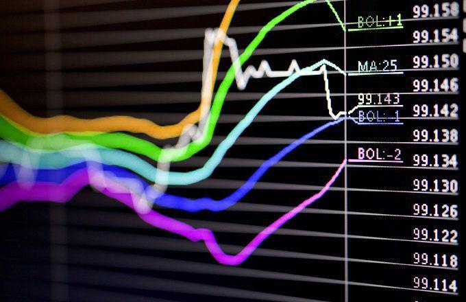

The foreign exchange (forex) market represents the largest and most liquid financial market globally, with an estimated daily trading volume exceeding $6 trillion as of 2023. This vast and dynamic landscape attracts traders worldwide due to its potential for high returns and 24-hour accessibility. However, this allure also creates a fertile environment for scams, primarily due to its partially unregulated nature in many jurisdictions. Fraudsters exploit this lack of oversight, particularly in the rapidly evolving sectors such as algorithmic trading, where the misuse of technology can result in substantial losses for unsuspecting traders.

Algorithmic trading, characterized by the use of computer programs to execute trades automatically based on pre-established criteria, has surged in popularity. This trading method promises efficiency and speed, attracting both institutional and retail traders. Yet, the same advanced technology that facilitates legitimate trading can be manipulated to perpetrate fraudulent schemes. As financial markets integrate more algorithms, understanding their role and identifying associated risks is essential for market participants.



This article aims to uncover the variety of scams prevalent in the forex market, particularly those linked to algorithmic trading. By examining how these frauds operate and the sophisticated techniques employed by perpetrators, traders can better protect themselves from falling prey to these malicious activities. Furthermore, it will provide insights into safeguarding investments, thereby enabling traders to make informed decisions while navigating this volatile market. Through increased awareness and regulatory understanding, market participants can mitigate risk and engage more securely with forex trading opportunities.

## Table of Contents

## Understanding Forex Algorithmic Trading

Forex algorithmic trading involves using complex computer programs to automate the process of trading foreign currencies based on pre-defined rules and strategies. These algorithms analyze vast amounts of data, including historical price patterns and market indicators, to make trading decisions that are executed at speeds far beyond human capability. The primary objective is to capitalize on small price movements that can occur within fractions of a second, often employing high-frequency trading strategies.

Automated trading systems, often referred to as forex robots, are software programs that can operate with minimal human intervention. These robots are designed to monitor markets and execute trades 24/7, identifying trading opportunities that match the pre-set criteria. Traders can customize these systems to follow specific strategies, implementing a variety of techniques ranging from simple moving averages to complex machine learning models.

The appeal of these systems lies in their ability to remove emotional and psychological biases from trading, which can often lead to irrational decision-making in human traders. By adhering strictly to a set of programmed rules, forex robots aim to maintain discipline and consistency in trading activities.

However, while [algorithmic trading](/wiki/algorithmic-trading) offers numerous advantages, it is a domain frequently targeted by fraudsters. Fraudsters exploit the desire for quick and easy profits by marketing unverified trading systems with exaggerated claims of guaranteed returns. These fraudulent activities often lure less experienced traders with promises of significant gains with little effort, making it essential for traders to conduct thorough research and seek systems with verified track records and independent evaluations.

One common approach used in algorithmic trading is the implementation of strategies using Python, a versatile programming language. Below is a simple example of a moving average crossover strategy in Python:

```python
import pandas as pd
import numpy as np

# Sample data loading
data = pd.read_csv('forex_data.csv')

# Calculate short-term and long-term moving averages
data['Short_MA'] = data['Close'].rolling(window=50).mean()
data['Long_MA'] = data['Close'].rolling(window=200).mean()

# Define a buy and sell signal based on moving averages crossover
data['Signal'] = 0
data['Signal'] = np.where(data['Short_MA'] > data['Long_MA'], 1, -1)

# Generate trading orders
data['Position'] = data['Signal'].shift()
```

This script utilizes historical price data to compute short-term and long-term moving averages. A simple trading signal is generated when the short-term moving average crosses above (buy signal) or below (sell signal) the long-term moving average. Although this strategy is basic, it serves as an example of how algorithmic trading systems can implement rule-based trading decisions.

It is crucial for traders to remain vigilant and discerning when considering algorithmic trading platforms, ensuring they prioritize systems with credible, transparent performance histories and robust regulatory backing. By doing so, traders can harness the power of algorithmic trading while safeguarding their investments from potential scams.

## Common Scams in Forex Trading

The [forex](/wiki/forex-system) trading arena, while offering potential profits, is fraught with risks of scams that prey on both novice and experienced traders. One prevalent scam is the Signal-Seller Scam. This involves entities, either companies or individuals, that claim to possess superior market insights, offering trade signals for a fee. These signals are supposedly based on insider knowledge, proprietary methodologies, or unique market analyses that can allegedly guide traders towards profitable decisions. However, the reality often starkly contrasts these promises. Many signal sellers use fabricated success stories and glowing testimonials to lure unsuspecting traders. Testimonials may be falsified, and the success rates of their signals greatly exaggerated. More often than not, these so-called trade signals lack substantive backing and fail to deliver on the promised returns, leaving traders at a loss financially.

Another deceptive tactic rampant in forex trading is the proliferation of Robot Scams. These scams revolve around automated trading systems, also known as forex robots or expert advisors. Scammers market these robots as sophisticated software capable of executing trades with high accuracy and minimal effort, claiming guaranteed high returns. Such claims entice traders eager for effortless income, leveraging the appeal of automation. However, fraudulent trading robots are typically not subjected to rigorous testing or third-party verification. They often rely on historical data and unrealistically favorable conditions to showcase past success, ignoring the complex and unpredictable nature of live forex markets. As a result, users of these robots frequently encounter significant financial losses instead of the advertised rewards.

In summary, the forex market is susceptible to scams that capitalize on traders' aspirations for easy profits and reliance on supposed expert guidance. Both signal-seller scams and robot scams highlight the importance of critical evaluation and cautious skepticism when faced with trading opportunities that seem too good to be true.

## The Dangers of Algorithmic Trading Scams

Algorithmic trading scams present significant dangers to forex traders, primarily through the promotion of unreliable trading bots that promise guaranteed returns. These scams exploit the allure of algorithmic trading, which is enticing due to its potential for speed and efficiency in executing trades based on well-defined strategies. However, the reality can be starkly different when scammers are involved.

Scammers frequently leverage sophisticated marketing tactics to establish a façade of credibility around their trading bots. This often involves the use of professional-looking websites, convincing testimonials, and fabricated success stories to instill confidence in potential investors. These marketing materials are designed to mislead traders into believing in the infallibility of the bots, despite the absence of substantial or genuine performance records to back such claims. Indeed, these purportedly successful bots rarely provide access to detailed historical performance data, third-party audits, or verifiable back-testing results, leaving investors in the dark about their actual efficiency.

The promise of 'guaranteed easy profits' is particularly alluring to inexperienced traders who may be less familiar with the inherent risks and complexities of forex trading. These traders are often captivated by the prospect of achieving financial success with minimal effort and little understanding of market dynamics. Scammers exploit this susceptibility by constructing narratives around the supposed ease and reliability of their offerings, assuring unsuspecting investors of consistent returns regardless of market conditions.

However, legitimate algorithmic trading involves significant risk and variability. The markets are influenced by countless unpredictable factors, making it impossible for any trading system to guarantee profits continuously. Investors are advised to critically assess any trading system that promises unrealistic returns or claims infallibility. The prudent approach involves meticulous research, including verifying the legitimacy of the trading system, scrutinizing its track record, and evaluating its claims against credible market data and expert reviews.

In conclusion, recognizing the dangers inherent in algorithmic trading scams is crucial for safeguarding investments. Traders should maintain skepticism towards overly optimistic promises and prioritize due diligence when considering algorithmic trading tools. By remaining vigilant and informed, traders can reduce exposure to such scams and make more informed decisions in the dynamic forex market.

## Red Flags to Identify Forex and Algo Trading Scams

Promises of high, guaranteed returns and low risk are often a major red flag in forex and algorithmic trading scams. Such assurances defy the fundamental principles of market economics, where risk is inherently tied to reward. The notion of consistently achieving high profits with minimal risk is not feasible due to market [volatility](/wiki/volatility-trading-strategies) and unpredictable influences.

Another significant warning sign is the lack of verified performance records or independent third-party evaluations. Legitimate trading systems typically undergo rigorous testing and provide transparent performance data, often verified by reputable third-party organizations to ensure accuracy and reliability. Without access to such evaluations, it's challenging to verify the effectiveness or success rate of the trading system or algorithm being promoted. An absence of these records should prompt skepticism.

Unreasonable pricing or fee structures for trading systems or signals further indicate potential scams. Scammers may employ high-pressure sales tactics, offering systems at exorbitant prices while justifying the cost with fabricated success stories or manipulated testimonials. Alternatively, they may charge ongoing subscription fees for supposedly exclusive signals or strategies, without demonstrating actual value or performance.

These red flags underscore the importance of conducting due diligence before engaging with any forex or algorithmic trading offer. Verifying broker credentials through regulatory bodies like the Financial Conduct Authority (FCA) or the Commodity Futures Trading Commission (CFTC) is a crucial step. Additionally, traders should scrutinize the background and credibility of the providers behind trading systems or signal services, avoiding those with vague or unverifiable claims.

## Protecting Yourself from Forex and Algo Trading Scams

To protect yourself from forex and algorithmic trading scams, it is essential to adopt several precautionary measures, beginning with verifying the legitimacy of brokers. Regulatory organizations, such as the Financial Conduct Authority (FCA) in the United Kingdom and the Commodity Futures Trading Commission (CFTC) in the United States, play a crucial role in overseeing and regulating financial markets to ensure transparency and fairness. Before engaging in any trading activity, confirm a broker's registration with these bodies. Such verification can be done through the regulators' official websites, which typically provide access to a database of licensed entities. 

Conducting thorough due diligence before investing in trading algorithms or signal services is equally important. This process involves researching the background and reputation of the service providers. Investigate their historical performance records, testimonials, and third-party evaluations to gauge their credibility and reliability. Authentic service providers often offer verifiable track records and transparent business practices. Utilizing online forums and networks of experienced traders can also offer insights into the reputation and legitimacy of these services.

Be particularly cautious of firms that make unbalanced profit claims or restrict account withdrawals. Promises of excessively high returns with little to no risk are often indicative of fraudulent schemes. Legitimate trading entities will always communicate the inherent risks involved in trading and will not guarantee profits. Furthermore, withdrawal restrictions or delays in processing withdrawals can be a warning sign of potential scams. Trustworthy trading platforms provide clear withdrawal policies that are aligned with industry standards and regulatory guidelines.

By exercising these protective measures—verifying broker legitimacy, conducting meticulous due diligence, and being vigilant against suspicious profit claims—traders can significantly reduce their risk of falling victim to scams in the forex and algorithmic trading markets.

## Conclusion

Understanding the risks and signs of scams in forex and algorithmic trading is essential for safeguarding your investments. The rapidly evolving nature of these markets, coupled with the attraction of high returns, often makes them prime targets for unscrupulous activities. To protect oneself, it is imperative to remain vigilant against common red flags such as promises of guaranteed returns and the absence of verified performance records.

With increasing regulation and awareness, traders now have more resources to help them make informed decisions. Regulatory bodies such as the Financial Conduct Authority (FCA) and the Commodity Futures Trading Commission (CFTC) provide oversight and enforce compliance, ensuring that legitimate brokers and trading systems operate within transparent and ethical frameworks. This regulatory environment helps to curtail fraudulent activities while building trader confidence in the market.

To enhance protection, traders should prioritize due diligence, scrutinizing the legitimacy and historical performance of trading systems before any financial commitment. Engaging with trading systems that are both verified and well-reviewed by reputable sources is crucial. A cautious approach entails cross-verifying information from multiple reliable sources, ensuring that the trading system or broker aligns with industry standards and practices.

In essence, while the allure of forex and algorithmic trading can be enticing, maintaining a disciplined, informed approach is vital. By exercising caution and leveraging regulatory frameworks, traders can navigate these markets safely, safeguarding their investments and fostering long-term financial success.

## References & Further Reading

[1]: Bergstra, J., Bardenet, R., Bengio, Y., & Kégl, B. (2011). ["Algorithms for Hyper-Parameter Optimization."](https://proceedings.neurips.cc/paper/2011/file/86e8f7ab32cfd12577bc2619bc635690-Paper.pdf) Advances in Neural Information Processing Systems 24.

[2]: ["Advances in Financial Machine Learning"](https://www.amazon.com/Advances-Financial-Machine-Learning-Marcos/dp/1119482089) by Marcos Lopez de Prado

[3]: ["Evidence-Based Technical Analysis: Applying the Scientific Method and Statistical Inference to Trading Signals"](https://www.semanticscholar.org/paper/Evidence-Based-Technical-Analysis%3A-Applying-the-and-Aronson/3b33df8737f1772e9e14d66a08c9696f140a2ee1) by David Aronson

[4]: ["Machine Learning for Algorithmic Trading"](https://github.com/PacktPublishing/Machine-Learning-for-Algorithmic-Trading-Second-Edition) by Stefan Jansen

[5]: ["Quantitative Trading: How to Build Your Own Algorithmic Trading Business"](https://books.google.com/books/about/Quantitative_Trading.html?id=j70yEAAAQBAJ) by Ernest P. Chan