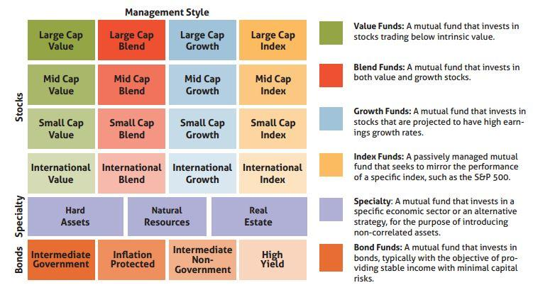

## Table of Contents

## What is an index-tracking mutual fund?

An index-tracking mutual fund is a type of investment fund that aims to match the performance of a specific stock market index, like the S&P 500. Instead of trying to beat the market, these funds simply try to replicate the returns of the index they follow. They do this by holding the same stocks in the same proportions as the index. This approach is often called passive investing because it doesn't involve active buying and selling of stocks by a fund manager.

These funds are popular because they usually have lower fees than actively managed funds. Since they don't need a team of experts to pick stocks, the costs are lower, and these savings can be passed on to investors. Index-tracking mutual funds are a good choice for people who want a simple, low-cost way to invest in the stock market and are happy with market-average returns over time.

## How do index-tracking mutual funds differ from actively managed funds?

Index-tracking mutual funds and actively managed funds are two different ways to invest in the stock market. Index-tracking funds try to match the performance of a specific stock market index, like the S&P 500. They do this by holding the same stocks in the same amounts as the index. This means they don't need a person to pick which stocks to buy or sell. Instead, they just follow the index. This makes them simpler and usually cheaper because they don't need to pay for a team of experts to manage the fund.

On the other hand, actively managed funds have a person, called a fund manager, who picks the stocks they think will do well. The goal is to beat the market, not just match it. This means the fund manager is always buying and selling stocks, trying to find the best ones. Because of this, actively managed funds usually have higher fees. They need to pay the fund manager and the team that helps them. People who invest in these funds hope that the extra cost will be worth it if the fund does better than the market.

In summary, the main differences are in how they work and their costs. Index-tracking funds are simpler and cheaper because they just follow an index. Actively managed funds are more complex and cost more because they try to beat the market by [picking](/wiki/asset-class-picking) specific stocks. Which one is better depends on what you want from your investment and how much you're willing to pay for it.

## What are the benefits of investing in index-tracking mutual funds?

One big benefit of investing in index-tracking mutual funds is that they are usually cheaper than other types of funds. Because they just follow an index and don't need a person to pick stocks, the costs are lower. This means you get to keep more of your money. Over time, these lower fees can make a big difference in how much your investment grows.

Another benefit is that index-tracking mutual funds are easy to understand and manage. You don't need to worry about which stocks to buy or sell because the fund does it for you, based on the index it follows. This makes it a good choice for people who want a simple way to invest in the stock market without having to do a lot of work. Plus, because they aim to match the market's performance, you can expect steady, long-term growth, which is great for saving for things like retirement.

## What are some common indices that mutual funds track?

Some common indices that mutual funds track include the S&P 500, the Dow Jones Industrial Average, and the Nasdaq Composite. The S&P 500 is one of the most popular because it represents the 500 largest companies in the U.S. and gives a good picture of how the whole market is doing. The Dow Jones Industrial Average, often just called the Dow, tracks 30 big companies and is another way to see how the market is doing. The Nasdaq Composite includes all the stocks on the Nasdaq stock exchange and is known for having a lot of technology companies.

Another index that mutual funds often track is the Russell 2000, which focuses on smaller companies. This can be a good choice if you want to invest in smaller businesses that might grow a lot. There are also international indices like the MSCI EAFE, which tracks stocks in Europe, Australasia, and the Far East. This can be a good way to spread your investments around the world and not just in the U.S. Each of these indices gives you a different way to invest, depending on what you're looking for.

## How can you identify if a mutual fund is tracking an index?

To find out if a mutual fund is tracking an index, you can look at the fund's name and description. Many index-tracking funds have names that include the word "index" or the name of the index they follow, like "S&P 500 Index Fund." The fund's description or prospectus will also say if it's designed to match the performance of a specific index. This information is usually easy to find on the fund company's website or in the fund's official documents.

Another way to tell is by looking at the fund's holdings. If the fund holds the same stocks in the same amounts as the index it's supposed to track, it's likely an index-tracking fund. You can check this by comparing the fund's list of investments with the list of stocks in the index. Also, index-tracking funds usually have lower fees than other funds because they don't need a person to pick stocks. So, if a fund has very low fees, it might be an index-tracking fund.

## What are the key metrics to look at when evaluating an index-tracking mutual fund?

When you want to check out an index-tracking mutual fund, one of the first things to look at is the expense ratio. This tells you how much the fund charges you each year to manage your money. Index-tracking funds usually have lower expense ratios because they don't need a person to pick stocks, so you want to make sure the fees are low. Another key metric is the tracking error, which shows how well the fund matches the performance of the index it's supposed to follow. A lower tracking error means the fund is doing a good job of sticking close to the index.

Another important thing to consider is the fund's assets under management (AUM). This is the total amount of money people have invested in the fund. A fund with a lot of AUM might be more stable and easier to buy and sell. You should also look at the fund's turnover ratio, which tells you how often the fund buys and sells stocks. A lower turnover ratio is better for index-tracking funds because it means they're sticking to their strategy of just following the index, which can help keep costs down.

## How does the expense ratio impact the performance of an index-tracking mutual fund?

The expense ratio is a big deal when it comes to how well an index-tracking mutual fund does. It's the fee you pay each year to the fund for managing your money. Since index-tracking funds just follow an index and don't need a person to pick stocks, their expense ratios are usually lower than other funds. But even a small difference in fees can make a big impact over time. If a fund has a high expense ratio, it takes more money out of your investment each year, which means you end up with less money in the long run.

For example, if you invest $10,000 in a fund with a 0.1% expense ratio, you'll pay $10 a year in fees. But if the expense ratio is 1%, you'll pay $100 a year. Over many years, that extra $90 a year can add up to a lot less money for you. So, when you're picking an index-tracking mutual fund, it's smart to go for one with a low expense ratio. This way, more of your money stays invested and can grow over time.

## What is tracking error and how is it calculated for index-tracking mutual funds?

Tracking error is a way to see how well an index-tracking mutual fund is doing its job of following an index. It measures the difference between the fund's performance and the performance of the index it's supposed to track. A smaller tracking error means the fund is doing a good job of sticking close to the index. A bigger tracking error means the fund isn't matching the index as well.

To calculate tracking error, you first find the difference between the fund's returns and the index's returns for each period, like every day or every month. Then, you take the standard deviation of these differences over time. Standard deviation is a way to measure how spread out the numbers are. A lower standard deviation means the fund's returns are usually close to the index's returns, which means a lower tracking error.

## How can you assess the historical performance of an index-tracking mutual fund against its benchmark?

To assess the historical performance of an index-tracking mutual fund against its benchmark, you can look at how well the fund has matched the index over time. You can do this by comparing the fund's returns to the index's returns for different periods, like one year, three years, or five years. Most fund companies show this information on their websites or in their reports. You want to see if the fund's returns are close to the index's returns. If they are, it means the fund is doing a good job of tracking the index.

Another way to check is by looking at the tracking error. This tells you how much the fund's performance differs from the index's performance. A lower tracking error means the fund is sticking close to the index. You can find the tracking error in the fund's reports or on financial websites. By looking at both the returns and the tracking error over time, you can get a good idea of how well the fund has been tracking its benchmark in the past.

## What are the tax implications of investing in index-tracking mutual funds?

Investing in index-tracking mutual funds can have tax implications that you should know about. When the fund sells stocks to match changes in the index, it might have to pay capital gains taxes. These taxes are then passed on to you, the investor. If the fund does a lot of buying and selling, it could mean more taxes for you. This is called the fund's turnover rate. A lower turnover rate usually means fewer taxes because the fund isn't selling stocks as often.

Another thing to consider is how you invest in the fund. If you buy shares of the fund in a regular investment account, you'll have to pay taxes on any dividends and capital gains the fund distributes to you each year. But if you invest in the fund through a tax-advantaged account like an IRA or 401(k), you might not have to pay taxes on those earnings until you take the money out. So, thinking about where you put your money can help you manage the tax impact of investing in index-tracking mutual funds.

## How do sector-specific index-tracking mutual funds work and what are their advantages?

Sector-specific index-tracking mutual funds focus on a particular part of the economy, like technology, health care, or energy. They work by tracking an index that includes only companies from that sector. For example, a tech sector fund might track the Nasdaq-100 Technology Sector Index. By investing in these funds, you're betting that the companies in that sector will do well. This can be a good way to invest if you think a certain part of the economy will grow faster than others.

The main advantage of sector-specific index-tracking mutual funds is that they let you focus your investments on areas you think will do well. If you believe technology companies will grow a lot, you can invest in a tech sector fund and possibly get higher returns than a general market fund. Another advantage is that these funds still have the benefits of index-tracking funds, like lower fees and easy management. But remember, focusing on one sector can be riskier because if that sector does poorly, your investment might lose more value than a more diversified fund.

## What advanced strategies can be used to optimize a portfolio using index-tracking mutual funds?

One advanced strategy to optimize a portfolio using index-tracking mutual funds is called asset allocation. This means you spread your money across different types of index funds, like ones that track stocks, bonds, and maybe even real estate. By doing this, you can balance risk and reward. For example, if you think the stock market might go down, you could put more money into bond funds, which are usually safer. Over time, you can change how much you have in each type of fund to match your goals and how much risk you're okay with.

Another strategy is called rebalancing. This is when you check your portfolio every so often and make sure it still matches your plan. If one type of fund has done really well and now makes up a bigger part of your portfolio than you want, you can sell some of it and buy more of the other funds to get back to your original plan. This helps you keep the right balance and can even help you buy low and sell high. Both asset allocation and rebalancing can help you make the most of your index-tracking mutual funds and reach your investment goals.

## References & Further Reading

1. **Mutual Funds and Index Funds**: 
   - Bogle, J. C. (1999). *Common Sense on Mutual Funds: New Imperatives for the Intelligent Investor*. Wiley. This book offers foundational insights into mutual funds and the philosophy of index investing.
   - Malkiel, B. G. (2003). *A Random Walk Down Wall Street: The Time-tested Strategy for Successful Investing*. W.W. Norton & Company. Refer to this work for a detailed explanation of index funds and their role in modern investing.
   - Morningstar’s website (http://www.morningstar.com) provides current analyses and ratings, useful for evaluating mutual and index funds.

2. **Algorithmic Trading**:
   - Narang, R. K. (2013). *Inside the Black Box: A Simple Guide to Quantitative and High-Frequency Trading*. Wiley. This book explains the basics of algorithmic trading, offering insight into quantitative strategies.
   - Chan, E. P. (2009). *Quantitative Trading: How to Build Your Own Algorithmic Trading Business*. Wiley. It provides a practical guide on how to start an algorithmic trading strategy, detailing statistical models and risk management techniques.
   - *Automate the Boring Stuff with Python* by Al Sweigart. While not an algorithmic trading text, this book teaches Python, which is invaluable for implementing trading algorithms.

3. **Research Papers and Articles**:
   - *An Empirical Evaluation of Asset Pricing Models on the Johannesburg Stock Exchange* by Muller and Ward. This paper evaluates various asset pricing models which can be useful for understanding mutual funds and index fund valuations.
   - Hendershott, T., Jones, C. M., & Menkveld, A. J. (2011). *Does Algorithmic Trading Improve Liquidity?* in the *Journal of Finance*. This article offers evidence on the influence of algorithmic trading on market liquidity.

4. **Online Resources and Tools**:
   - Investopedia (http://www.investopedia.com) is a comprehensive financial resource that provides details on mutual funds, index funds, and algorithmic trading.
   - QuantConnect (https://www.quantconnect.com) and Zipline (https://github.com/quantopian/zipline) are platforms for algorithmic trading that offer backtesting and execution capabilities.

5. **Regulatory Frameworks**: 
   - U.S. Securities and Exchange Commission (SEC) website (https://www.sec.gov) provides updates on regulatory guidelines affecting mutual funds, index funds, and algorithmic trading.
   - *MiFID II: A New Paradigm for European Financial Markets* by Matthias Lehmann offers insights into European regulatory measures impacting algorithmic trading.

These resources offer extensive knowledge for those looking to expand their understanding of mutual funds, index funds, and [algorithmic trading](/wiki/algorithmic-trading).

