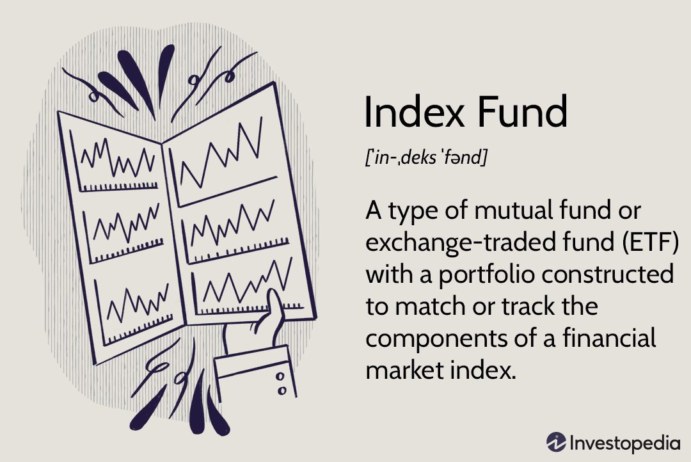

Investment strategies encompass a wide range of options, each providing unique benefits and challenges to investors. Among these strategies, mutual funds and index funds stand out as traditional investment vehicles. Mutual funds pool capital from multiple investors to purchase a diversified portfolio of securities, which is professionally managed to achieve specific objectives. This diversification is beneficial in mitigating individual security risk and enhancing the possibility of stable returns over time.

Index funds, a subset of mutual funds, aim to replicate the performance of a specific market index like the S&P 500. By doing so, index funds offer investors broad market exposure and typically incur lower costs compared to actively managed funds. This cost efficiency, together with reduced turnover, makes index funds particularly appealing to long-term investors seeking stable growth without the need for continual market analysis.



On the other hand, algorithmic trading represents a modern, technology-driven investment strategy. It involves the use of pre-programmed algorithms to automatically execute trades at high speeds and with high precision, often capitalizing on minute price differences. This method of trading leverages mathematical models and complex analytics to identify investment opportunities that would be difficult for human traders to discern, achieving efficiency and reducing the risk of human error in decision-making.

This article explores the interaction between these traditional and high-tech investment strategies. By understanding their distinctive characteristics and how they can be effectively integrated, investors can optimize their portfolios for better performance. The integration of mutual funds, index funds, and algorithmic trading can provide a balanced approach to investing, combining the stability and diversification of traditional funds with the innovation and speed of algorithmic trading.

## Table of Contents

## Understanding Mutual Funds and Index Funds

Mutual funds are investment vehicles that pool money from multiple investors to purchase a diversified portfolio of stocks, bonds, or other securities. By diversifying investments, mutual funds aim to reduce risk while attempting to achieve satisfactory returns. This diversification is achieved by spreading the investments across various assets, which helps to mitigate the impact of a poor performance by any single asset on the overall portfolio. Managed by professional fund managers, mutual funds offer investors the advantage of expert management and oversight.

Index funds are a specific category of mutual funds designed to replicate the performance of a particular market index, such as the S&P 500 or the Dow Jones Industrial Average. Rather than actively selecting stocks to outperform the market, index funds passively track the components of the index they follow. This passive investment strategy leads to several benefits:

1. **Lower Costs**: Since index funds require less active management, they generally have lower expense ratios compared to actively managed funds. This cost efficiency translates into higher net returns for investors over the long term, as less money is spent on management fees.

2. **Broad Market Exposure**: Index funds provide broad exposure to a specific market, offering investors access to an entire segment of the market through a single investment. This exposure is advantageous for those seeking to invest in the overall growth of a market rather than individual stock performance.

For long-term investors seeking stable growth, mutual and index funds are particularly suitable. The professional management and diversification provided by mutual funds offer a balanced approach to investing without requiring substantial individual stock analysis. Meanwhile, index funds cater to those who prefer a hands-off investment strategy, benefitting from market-wide gains over time.

Both mutual and index funds align well with the principles of long-term investing. They leverage the power of compounding returns and market growth to build wealth over extended periods. Their diversified nature helps in managing risks associated with market [volatility](/wiki/volatility-trading-strategies), making them an attractive option for investors who are more focused on achieving steady growth rather than taking high-risk bets.

## Investment Strategies for Mutual Funds

Mutual funds represent a popular investment vehicle that can be managed through active or passive strategies, each offering distinct advantages and trade-offs. Active management involves a team of financial experts making investment decisions to outperform the market, whereas passive management, as exemplified by index funds, primarily aims to mirror the performance of a specific market index.

When evaluating investment strategies, understanding the risk-return trade-off is crucial. Returns on any investment are typically accompanied by corresponding risks—the potential for high returns often involves greater risk, while conservative investments might offer lower returns with reduced risk. Investors must evaluate their tolerance for risk and their financial goals to determine the most suitable mutual fund strategy.

Portfolio diversification is a fundamental concept in risk management, reducing the impact of any single asset's poor performance on the overall portfolio. By holding a wide range of assets across different sectors and geographies, mutual funds can mitigate individual stock volatility, thus minimizing risk. An effectively diversified portfolio might consist of bonds, domestic and international equities, and alternative assets, ensuring that fluctuations in one area have a limited effect on the entire investment portfolio.

The investment time horizon is another critical [factor](/wiki/factor-investing) influencing mutual fund strategies. A long-term horizon generally allows investors to weather market volatility, making a more aggressive, growth-oriented portfolio feasible. Conversely, those with shorter time horizons might prefer conservative, income-oriented strategies to preserve capital and generate steady returns, emphasizing bonds and dividend-paying stocks.

By balancing active and passive management approaches, rigorously considering the risk-return equation, employing robust diversification, and aligning strategies with an investor's time horizon, mutual funds can form a core component of a well-rounded investment portfolio.

## Algorithmic Trading: A New Era of Investing

Algorithmic trading is a method of executing orders using automated pre-programmed trading instructions accounting for variables such as time, price, and [volume](/wiki/volume-trading-strategy). This approach leverages the power of computers to transact a large number of financial instruments at speeds and frequencies that are impossible for a human trader. Its growing importance in modern finance is driven by the need for speed, accuracy, and the ability to capitalize on market conditions quickly.

Algorithmic trading strategies are diverse, with some of the most common being trend-following and [arbitrage](/wiki/arbitrage). Trend-following strategies involve algorithms designed to trade based on movements in market prices. These strategies assume that market trends will continue, and the algorithms are configured to recognize early signs and direct trades accordingly. For instance, a moving average crossover strategy is popular, which buys or sells based on the position of two different averages.

Arbitrage strategies, on the other hand, exploit price differentials of similar or identical financial instruments across different markets or forms. These algorithms are programmed to identify and execute trades to capitalize on discrepancies before the market corrects the prices, a task necessitating high-speed execution and precision.

To illustrate [algorithmic trading](/wiki/algorithmic-trading), consider a simple Python implementation of a moving average crossover strategy:

```python
import numpy as np
import pandas as pd
from pandas_datareader import data as pdr

def moving_average_strategy(stock_symbol, start_date, short_window, long_window):
    df = pdr.get_data_yahoo(stock_symbol, start=start_date)
    df['Short_MA'] = df['Close'].rolling(window=short_window, min_periods=1).mean()
    df['Long_MA'] = df['Close'].rolling(window=long_window, min_periods=1).mean()

    df['Signal'] = 0.0  
    df['Signal'][short_window:] = np.where(df['Short_MA'][short_window:] > df['Long_MA'][short_window:], 1.0, 0.0) 
    df['Position'] = df['Signal'].diff()

    return df

strategy_output = moving_average_strategy('AAPL', '2020-01-01', 40, 100)
print(strategy_output.tail())
```

This code fetches stock data for a given company (e.g., Apple) and computes short and long moving averages to determine buy signals.

Algorithmic trading offers beneficial improvements over traditional trading methods, notably speed and efficiency. Algorithms can process data and execute orders far quicker than the human brain, enabling traders to take advantage of opportunities in milliseconds. This ability is instrumental in markets where fractions of a second can make a vital difference. Additionally, reliance on precise, data-driven decisions reduces human error and emotional bias, allowing for more consistent trading outcomes.

The continued evolution and adoption of algorithmic trading reflect its capacity not only to enhance operational efficiency but also to introduce a strategic advantage in the competitive landscape of modern finance. As markets become increasingly complex, the sophistication of algorithms and the ability to integrate vast amounts of data in trading decisions will be critical for success.

## Integrating Mutual Funds with Algo Trading

Algorithmic trading has progressively transformed the landscape of financial markets by elevating the speed and precision of trade executions. Its integration into mutual fund management is an area of growing interest due to its potential to enhance portfolio performance and operational efficiency.

Algorithmic trading can optimize mutual fund management by enabling rapid analysis and execution of trades, which is especially beneficial for funds dealing with large volumes of transactions. By automating the trading process, fund managers can quickly react to market conditions, reducing latency and potentially mitigating risks linked with market fluctuations. This improved responsiveness is crucial in maintaining the fund's investment strategy and capitalization on short-term opportunities without deviating from long-term objectives.

One of the primary benefits of incorporating algorithmic trading into mutual fund management is the reduction of transaction costs. Algorithms can search for [liquidity](/wiki/liquidity-risk-premium) across multiple venues, minimizing market impact and slippage costs associated with large trade orders. By executing orders in smaller increments or at strategic times, mutual funds can achieve a more favorable average price. This cost efficiency is particularly important for index funds that execute numerous transactions to closely track the underlying indices.

For example, a simple algorithmic strategy could be implemented in Python to divide a large block order into smaller parts to minimize market impact:

```python
import datetime
from trading_platform import order_execution

def execute_block_order(symbol, block_size, trade_interval):
    remaining_size = block_size
    while remaining_size > 0:
        order_size = min(remaining_size, determine_optimal_trade_size())
        order_execution(symbol, order_size)
        remaining_size -= order_size
        time.sleep(trade_interval)

def determine_optimal_trade_size():
    # Placeholder function to calculate optimal trade size based on current market conditions
    return 100  # Example trade size

execute_block_order('AAPL', 1000, datetime.timedelta(seconds=60))
```

Combining traditional fund management expertise with advanced algorithmic techniques can enhance a mutual fund's portfolio. This synergy allows fund managers to maintain oversight on strategic allocation and ensure that the fund's objectives and restrictions are upheld, while simultaneously benefiting from the tactical precision offered by algorithms. Advanced algorithms can facilitate continuous monitoring and rebalancing of the portfolio, optimizing the risk-return profile by keeping asset allocation in line with desired goals.

Furthermore, algorithmic strategies can enhance fund performance by exploiting arbitrage opportunities and implementing market-neutral strategies that seek alpha irrespective of market movements. This extends beyond index tracking, as funds can use such strategies to enhance returns while maintaining a disciplined investment approach.

In summary, the integration of algorithmic trading into mutual fund management has the potential to reduce costs, improve execution, and optimize portfolios by marrying traditional investment approaches with modern technological advancements.

## Challenges and Considerations

Algorithmic trading, while transformative in modern finance, presents several challenges that investors and institutions must address. One of the primary challenges is the risk of system failures. Given the reliance on complex software and hardware infrastructures, unexpected glitches can result in significant financial losses or missed trading opportunities. For instance, erroneous algorithms or software bugs can lead to incorrect buy or sell orders, as seen in historical incidents like the Flash Crash of 2010, where the Dow Jones Industrial Average plummeted significantly within minutes due to algorithmic malfunctions.

Regulatory compliance poses another significant challenge for algorithmic traders. Regulatory bodies worldwide, such as the U.S. Securities and Exchange Commission (SEC) and the European Securities and Markets Authority (ESMA), have implemented strict guidelines to mitigate risks associated with high-frequency trading ([HFT](/wiki/high-frequency-trading-strategies)) and other algorithmic trading forms. These rules often require robust risk management protocols, transparency measures, and periodic audits, increasing the operational burden on trading firms. Non-compliance can result in severe penalties, making it crucial for firms to consistently monitor and adapt to the evolving regulatory landscape.

The technological dependencies inherent in algorithmic trading also introduce substantial risks. High-performance computing facilities, low-latency network infrastructure, and sophisticated algorithm development environments are essential components that ensure trades are executed at optimal speeds. Any disruption or latency in these systems, whether due to network failures or server outages, can hinder a trader's ability to capitalize on market opportunities. Moreover, as trading strategies grow more intricate, the dependence on cutting-edge technology becomes even more pronounced, raising the bar for entry into the algorithmic trading market.

High-frequency trading, a subset of algorithmic trading, exacerbates these challenges due to its reliance on executing a large number of orders within fractions of a second. The competitive advantage in HFT often lies in the ability to process transactions faster than the competition. Consequently, microsecond-level delays can lead to lost opportunities or adverse price impacts. Additionally, the race for speed in HFT has led to a digital arms race, where significant investment in technology is paramount, but the potential technological obsolescence poses significant financial risks.

Lastly, the regulatory frameworks surrounding algorithmic trading strategies have implications that traders must carefully consider. Regulations like the Markets in Financial Instruments Directive II (MiFID II) in the EU aim to enhance transparency and reduce systemic risks by mandating detailed reporting and algorithm flagging. While these measures serve to protect market integrity, they also necessitate increased back-office operations and may restrict certain trading strategies, shaping how firms can effectively utilize algos to maintain a competitive edge.

In conclusion, while algorithmic trading offers unparalleled speed and efficiency, it requires diligent management of system reliability, regulatory compliance, and technological dependencies to mitigate its inherent challenges and risks.

## Conclusion

The fusion of mutual funds, index funds, and algorithmic trading presents both opportunities and challenges for investors aiming to optimize their portfolios. Mutual funds and index funds have long been celebrated for their ability to offer diversification and professional management, catering to long-term investors seeking growth stability. Algorithmic trading introduces a modern twist by enhancing precision, speed, and efficiency, presenting the potential for more sophisticated fund management.

By integrating traditional investment vehicles like mutual and index funds with cutting-edge algorithmic trading techniques, investors can potentially achieve lower transaction costs and improved execution quality. This combination leverages the traditional wisdom of diversification and market exposure with the technological advancements of automated decision-making processes. Such integration ensures that portfolios are better positioned to react dynamically to market conditions, which is crucial in the fast-paced financial environment.

However, merging these investment strategies requires an understanding of not only the merits but also the inherent complexities. The increased technological dependency, potential system failures, and regulatory compliance issues associated with algorithmic trading must be navigated carefully. Regulatory frameworks continue to evolve, impacting the way algorithmic strategies can be deployed within funds.

The landscape of investment is undeniably dynamic, necessitating continuous education and adaptation from investors and fund managers alike. Staying informed about technological advancements and regulatory changes is vital for those looking to maintain a competitive edge. Investors are encouraged to blend traditional investment knowledge with an understanding of modern financial technologies to craft well-rounded and resilient investment strategies. By doing so, they can more effectively manage risks and seize opportunities in an ever-evolving financial market.

## References & Further Reading

1. **Mutual Funds and Index Funds**: 
   - Bogle, J. C. (1999). *Common Sense on Mutual Funds: New Imperatives for the Intelligent Investor*. Wiley. This book offers foundational insights into mutual funds and the philosophy of index investing.
   - Malkiel, B. G. (2003). *A Random Walk Down Wall Street: The Time-tested Strategy for Successful Investing*. W.W. Norton & Company. Refer to this work for a detailed explanation of index funds and their role in modern investing.
   - Morningstar’s website (http://www.morningstar.com) provides current analyses and ratings, useful for evaluating mutual and index funds.

2. **Algorithmic Trading**:
   - Narang, R. K. (2013). *Inside the Black Box: A Simple Guide to Quantitative and High-Frequency Trading*. Wiley. This book explains the basics of algorithmic trading, offering insight into quantitative strategies.
   - Chan, E. P. (2009). *Quantitative Trading: How to Build Your Own Algorithmic Trading Business*. Wiley. It provides a practical guide on how to start an algorithmic trading strategy, detailing statistical models and risk management techniques.
   - *Automate the Boring Stuff with Python* by Al Sweigart. While not an algorithmic trading text, this book teaches Python, which is invaluable for implementing trading algorithms.

3. **Research Papers and Articles**:
   - *An Empirical Evaluation of Asset Pricing Models on the Johannesburg Stock Exchange* by Muller and Ward. This paper evaluates various asset pricing models which can be useful for understanding mutual funds and index fund valuations.
   - Hendershott, T., Jones, C. M., & Menkveld, A. J. (2011). *Does Algorithmic Trading Improve Liquidity?* in the *Journal of Finance*. This article offers evidence on the influence of algorithmic trading on market liquidity.

4. **Online Resources and Tools**:
   - Investopedia (http://www.investopedia.com) is a comprehensive financial resource that provides details on mutual funds, index funds, and algorithmic trading.
   - QuantConnect (https://www.quantconnect.com) and Zipline (https://github.com/quantopian/zipline) are platforms for algorithmic trading that offer backtesting and execution capabilities.

5. **Regulatory Frameworks**: 
   - U.S. Securities and Exchange Commission (SEC) website (https://www.sec.gov) provides updates on regulatory guidelines affecting mutual funds, index funds, and algorithmic trading.
   - *MiFID II: A New Paradigm for European Financial Markets* by Matthias Lehmann offers insights into European regulatory measures impacting algorithmic trading.

These resources offer extensive knowledge for those looking to expand their understanding of mutual funds, index funds, and algorithmic trading.

