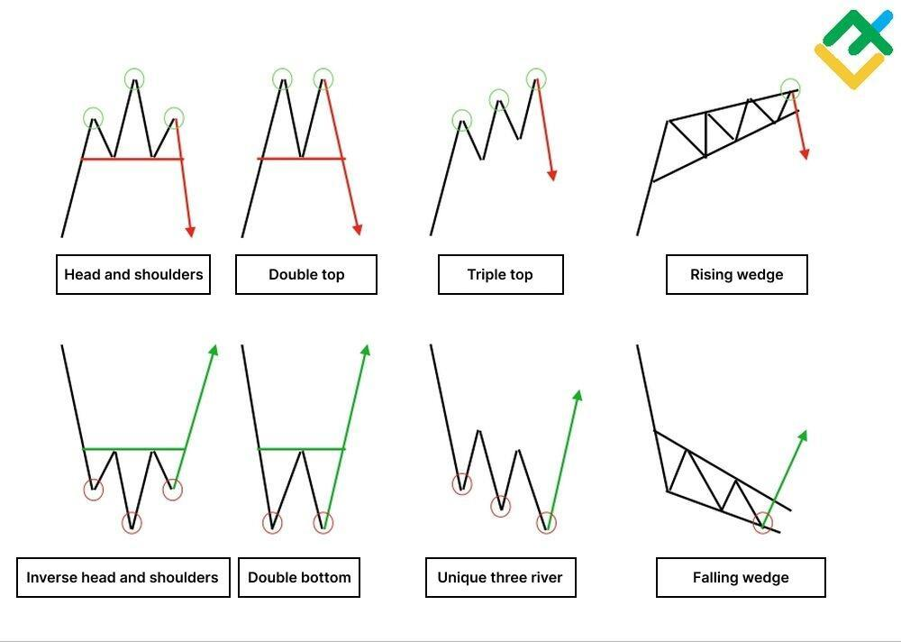

Trading strategies play a crucial role in the financial markets by providing systematic approaches to buying and selling securities. They are essential for market participants ranging from individual retail investors to institutional traders. These strategies are formulated based on various analyses and methodologies to maximize returns and minimize risk.

Technical analysis is a method traders widely use to evaluate securities. It involves statistical analysis of market activity, such as price movements and volume. Unlike fundamental analysis, which examines a company’s financial statements and economic factors, technical analysis focuses on price charts and market data to identify patterns and trends. The core principle behind technical analysis is that historical price movements can predict future price movements.



Stock chart patterns are fundamental to technical analysis, as they illustrate these historical price movements. Patterns such as Head & Shoulders, Double Tops and Bottoms, Flags, and Pennants are often used by traders to predict future price behavior. These patterns emerge from a combination of market psychology and supply-demand dynamics, helping traders make informed decisions about entry and exit points in the market. However, it is crucial to acknowledge that while chart patterns can be insightful, they are not foolproof and should be used alongside other analytical tools.

Algorithmic trading, also known as algo trading, has become a cornerstone of modern trading strategies. It involves using computer algorithms to execute trades at speeds and frequencies impossible for human traders. These algorithms are designed to identify market opportunities based on predefined criteria, often integrating principles from technical analysis. Algo trading offers advantages such as increased speed, accuracy, and the ability to process large data sets efficiently. It also reduces the impact of human emotions on trading decisions.

This article aims to explore trading strategies, focusing on the integration of technical analysis with algorithmic trading. By understanding the significance of chart patterns and the evolution of automated trading, readers can gain insights into developing and refining their trading strategies. Whether one is a novice or an experienced trader, this article will provide foundational knowledge and encourage further exploration into trading practices.

## Table of Contents

## Understanding Technical Analysis

Technical analysis is a method used by traders to evaluate securities through the analysis of statistical data generated by market activity. This includes price movement and volume. Unlike fundamental analysis, which focuses on a company's financial statements, technical analysis concentrates on patterns of price movements, trading signals, and various technical indicators.

The core of technical analysis is based on three key principles: trends, patterns, and indicators. Trends represent the general direction in which a market or the price of a stock is moving. They can be upward (bullish), downward (bearish), or horizontal (sideways). Recognizing the trend helps traders to make buy or sell decisions at optimal points. Patterns, on the other hand, are specific formations created by the price movements on a chart. These patterns help traders predict the future price movements. Common patterns include Head & Shoulders, Double Tops and Bottoms, and Flags and Pennants. Indicators are mathematical calculations based on the price, [volume](/wiki/volume-trading-strategy), or open interest of a security used to forecast market direction.

The benefits of using technical analysis in trading are numerous. It allows traders to identify the trends and potential reversal points. It serves as a tool to determine the timing of entry and [exit](/wiki/exit-strategy) points, enhancing a trader's capability to predict future price movements based on historical data. Moreover, it provides a structured method to assess market behavior and trader sentiments, giving a competitive edge in fast-paced market environments.

A comparison between technical and [fundamental analysis](/wiki/fundamental-analysis) shows that while both aim to help investors make better trading decisions, they operate on different theoretical bases. Fundamental analysis focuses on evaluating a company’s intrinsic value by examining related economic and financial factors, whereas technical analysis looks at the price and volume patterns to forecast future movements. Traders often use these methodologies in conjunction to form a more comprehensive analysis.

The history of technical analysis dates back to the late 19th century, with the pioneering work of Charles Dow. Dow's theory laid the groundwork for modern technical analysis, introducing core concepts like market trends and the importance of price in trading decisions. Since then, technical analysis has evolved with technological advancements, integrating complex algorithms and computational models. The development of computers revolutionized technical analysis by allowing for the creation of numerous charting tools and indicators, such as moving averages and relative strength indexes (RSI), enhancing traders’ ability to forecast market conditions.

In conclusion, technical analysis remains an indispensable tool in the financial markets, allowing both novice and experienced traders to make informed decisions based on historical price and volume data. By understanding and utilizing trends, patterns, and indicators, traders can better navigate the complexities of the trading world and develop strategies that align with their investment goals.

## Common Stock Chart Patterns

Stock chart patterns are visual representations of historical price data of a security and are essential tools for traders employing technical analysis. They help traders make informed predictions about future market movements based on the notion that certain patterns tend to recur and can thus indicate likely future behavior of the market.

### Detailed Description of Common Chart Patterns

**Head & Shoulders**: 
One of the most well-known reversal patterns, the Head & Shoulders pattern signals a change in trend direction. It comprises three peaks: a higher peak (head) flanked by two lower peaks (shoulders). In a normal Head & Shoulders formation, the left shoulder is formed after an upward trend, followed by the head which is the highest peak, and finally the right shoulder as the market fails to reach new highs. The neckline, drawn by connecting the lowest points of each trough, acts as a support line. A break below this line indicates a potential trend reversal from bullish to bearish.

**Double Tops and Bottoms**: 
These patterns are typically seen as signals of trend reversals. A Double Top consists of two prominent peaks at approximately the same level, suggesting that the upward trend is potentially exhausted. Conversely, a Double Bottom features two troughs at similar levels, indicating a possible reversal from a downward trend. Traders look for a break in the neckline, which connects the intervening low point of a Double Top or the high point of a Double Bottom, as a confirmation of the trend change.

**Flags and Pennants**: 
Both are short-term continuation patterns indicating a pause in the trend before the underlying move resumes. Flags look like small rectangles sloping against the prevailing trend, while Pennants have converging trendlines similar to a small symmetrical triangle. Flags and Pennants are always preceded by a strong movement known as the flagpole. When the price breaks out of the pattern in the direction of the previous trend (either bullish or bearish), it suggests a continuation of the initial [momentum](/wiki/momentum).

### Interpretation and Predictive Power

Traders interpret these patterns not only as mere illustrations of price action but as potential indicators of market sentiment and energy. The essence of technical trading lies in identifying these patterns early and acting swiftly to capitalize on potential market moves. For example, the completion of a Head & Shoulders pattern often prompts traders to take short positions anticipating a downward trend, whereas a Double Top may inspire similar bearish sentiment.

Moreover, the predictive power of these patterns is closely linked to the volume of trades. Typically, the pattern's reliability increases with the convergence of supporting volume trends, such as increasing volume on a [breakout](/wiki/breakout-trading) from the neckline.

### Examples and Visual Illustrations

Visual representation is crucial for understanding chart patterns. Here's a simple Python snippet using matplotlib to visualize a basic Head & Shoulders pattern:

```python
import matplotlib.pyplot as plt
import numpy as np

# Generating sample data for Head & Shoulders
price = np.array([100, 110, 105, 120, 115, 130, 125, 110, 115, 100, 105])
time = np.arange(len(price))

# Plotting
plt.figure(figsize=(10, 6))
plt.plot(time, price, label='Price')
plt.title('Head and Shoulders Pattern')
plt.xlabel('Time')
plt.ylabel('Price')
plt.plot([0, len(price)-1], [price[0], price[0]], linestyle='--', color='r', label='Neckline')
plt.legend()
plt.grid(True)
plt.show()
```

### Limitations of Relying Solely on Chart Patterns

While chart patterns are valuable tools in technical analysis, they are not infallible. Patterns can sometimes change or evolve, leading to false signals. Market conditions such as [volatility](/wiki/volatility-trading-strategies) and volume can further complicate pattern reliability. This inherent subjectivity means traders must exercise caution, supplementing chart patterns with other technical indicators or fundamental analysis to corroborate trading decisions.

Furthermore, over-reliance on chart patterns without a robust risk management strategy can lead to significant financial losses. It is essential for traders to adopt a disciplined approach, setting clear entry and exit points and continuously adapting to market dynamics.

 to Algorithmic Trading

Algorithmic trading, often referred to as algo trading, is a method of executing trades through the use of automated pre-programmed trading instructions accounting for variables such as time, price, and volume. This technology-driven approach leverages algorithms to make financial trading decisions and execute orders, reducing human intervention to a minimum.

### Comparison between Manual Trading and Algorithmic Trading

Manual trading involves human decision-making, where traders rely on their judgment, experience, and intuition to execute trades. This traditional approach requires constant market monitoring and can be subject to emotional influences or cognitive biases, potentially impacting trading efficiency and profitability.

On the other hand, [algorithmic trading](/wiki/algorithmic-trading) automates the trading process using computer programs that follow a defined set of rules for placing trades. These algorithms can quickly analyze vast data sets, identify trading signals, and execute orders at speeds unmatched by human traders. This capability allows algo trading to capitalize on market opportunities that may only exist for fractions of a second, a feat infeasible in manual trading.

### Advantages of Algo Trading: Speed, Accuracy, and Data Processing

The primary advantages of algorithmic trading are speed, accuracy, and the ability to process large volumes of data efficiently:

- **Speed**: Algorithms can execute trades in milliseconds, significantly faster than a human could. This speed ensures that traders can take advantage of even the most fleeting opportunities in rapidly changing markets.

- **Accuracy**: Automated trading reduces the likelihood of human errors occurring during the execution of trades. This accuracy is crucial for implementing complex trading strategies precisely as intended.

- **Data Processing**: Algo trading systems can analyze vast amounts of data from multiple sources simultaneously, enabling traders to process more information and identify profitable opportunities quicker than manual methods.

### Software and Tools Commonly Used in Algorithmic Trading

Various software platforms and tools facilitate algorithmic trading, each offering different capabilities for strategy development, [backtesting](/wiki/backtesting), and execution. Some popular software and tools include:

- **MetaTrader**: A widely-used platform offering tools for developing, testing, and executing automated trading strategies.

- **QuantConnect**: An open-source cloud-based platform that allows traders to create and test algorithms in multiple programming languages, including Python and C#.

- **NinjaTrader**: A comprehensive platform for futures and forex traders that offers advanced charting, backtesting, and simulation features.

- **Interactive Brokers API**: Provides a suite of APIs for traders to build custom trading applications that can access Interactive Brokers' suite of products and services.

### Potential Risks and Challenges Associated with Algo Trading

While algorithmic trading presents numerous benefits, it is not without its risks and challenges:

- **System Failures**: Technical glitches, software bugs, or connectivity issues can lead to unintended trades or missed market opportunities.

- **Over-optimization**: Excessive fine-tuning of an algorithm based on historical data can lead to overfitting, where the strategy performs well in backtests but fails in live markets.

- **Market Impact**: Large algorithmically-driven trades can inadvertently affect market prices, particularly in less liquid markets.

- **Security Risks**: Since algo trading systems are software-based, they are susceptible to cybersecurity threats such as hacking or unauthorized access.

In summary, algorithmic trading is a rapidly growing facet of modern financial markets, offering considerable advantages over traditional manual trading. However, it requires careful design, testing, and risk management to ensure reliability and effectiveness.

## Integrating Technical Analysis with Algo Trading

Integrating technical analysis with algorithmic trading involves encoding the principles of technical analysis into computer algorithms to automate the process of analyzing and executing trades. Technical analysis focuses on price movements and patterns to predict future market behavior. By implementing these methodologies into algorithms, traders can create systems that operate with high speed and precision.

### Coding Technical Analysis Principles

Technical analysis relies on patterns, trends, and indicators. These can be translated into algorithmic code using various programming languages like Python. For instance, moving averages, a popular technical indicator, can be encoded to generate buy/sell signals when prices cross certain threshold levels. Here’s a simple example in Python using the pandas and numpy libraries:

```python
import pandas as pd

# Load data
data = pd.read_csv('historical_stock_data.csv')

# Calculate moving averages
data['SMA50'] = data['Close'].rolling(window=50).mean()
data['SMA200'] = data['Close'].rolling(window=200).mean()

# Generate signals
data['Signal'] = 0
data['Signal'][50:] = np.where(data['SMA50'][50:] > data['SMA200'][50:], 1, 0)
data['Position'] = data['Signal'].diff()

# Display signals
print(data[['Close', 'SMA50', 'SMA200', 'Signal', 'Position']])
```

### Examples of Strategies Combining Technical Analysis with Algo Trading

1. **Trend Following**: Algorithms designed to follow upwards or downwards trends by using indicators like moving averages or the relative strength index (RSI).

2. **Mean Reversion**: This strategy involves identifying temporary trends before prices stabilize. Algorithms can utilize Bollinger Bands or Z-score calculations to execute trades when securities deviate significantly from their mean price.

3. **Breakout Strategy**: Detecting securities that go beyond identified support or resistance levels. Algorithms can automatically buy when prices exceed the resistance or sell when they fall below support levels.

### Backtesting's Role in Developing Algorithmic Strategies

Backtesting is crucial for assessing the viability of trading strategies by testing them against historical data. By simulating trades over past market conditions, traders can refine their algorithms before deploying them in live markets. Tools like Python's [backtrader](/wiki/backtrader) library enable such testing:

```python
import backtrader as bt

class TestStrategy(bt.Strategy):
    def next(self):
        if self.data[0] > self.data[-1]:  # Market is moving upwards
            self.buy()
        elif self.data[0] < self.data[-1]:  # Market is moving downwards
            self.sell()

cerebro = bt.Cerebro()
data = bt.feeds.YahooFinanceData(dataname='AAPL', fromdate=datetime(2017, 1, 1), todate=datetime(2021, 12, 31))
cerebro.adddata(data)
cerebro.addstrategy(TestStrategy)
cerebro.run()
```

### Case Studies of Successful Algo Trading Strategies

One successful example involves the use of moving averages and trade signals by hedge funds, which automate buying and selling based on crossovers. Another case includes the deployment of neural networks to optimize trading algorithms, achieving superior results.

### Tips for Beginners

1. **Education**: Understand the basics of both technical analysis and programming.
2. **Start Simple**: Begin with uncomplicated strategies like moving averages before progressing to more complex systems.
3. **Use Existing Libraries**: Leverage open-source libraries for computations to avoid reinventing the wheel.
4. **Practice Backtesting**: Always test strategies comprehensively to mitigate risks before live trading.
5. **Continuous Learning**: Keep up with advances in both technical analysis and algorithmic trading to stay relevant.

Combining technical analysis with algorithmic trading offers a powerful way to approach market trading, maximizing efficiency and potentially improving returns through precision and speed.

## Challenges and Considerations

### Challenges and Considerations

Trading using technical analysis and algorithmic strategies presents a unique set of challenges. Traders often encounter difficulties associated with the dynamic nature of financial markets and the technical intricacies of algorithmic systems.

#### Common Challenges in Technical Analysis and Algo Trading

One of the primary challenges is the subjective interpretation of chart patterns, which can lead to inconsistencies in trading decisions. Technical analysis relies heavily on visual representations of data, and different traders may identify different patterns or draw varying conclusions from the same chart. This subjectivity can result in conflicting trading signals and potentially costly mistakes.

Algorithmic trading, while minimizing human emotional biases, introduces its own challenges. Developing algorithms that can accurately interpret patterns and execute trades requires substantial expertise in both programming and finance. Moreover, these algorithms must be constantly updated to remain aligned with current market conditions, which can be a resource-intensive task.

#### Choosing Appropriate Chart Patterns and Indicators

Selecting effective chart patterns and indicators is crucial for successful trading. Traders must understand the strengths and weaknesses of various chart patterns, such as Head & Shoulders or Double Tops, and choose those that best align with their trading strategy. This involves assessing the likelihood of pattern reliability, volatility, and the specific market context. Additionally, traders should combine multiple indicators to confirm signals rather than relying on a single pattern or indicator, which can reduce the likelihood of false signals.

#### Continuous Learning and Market Adaptation

Markets are continuously evolving, driven by changes in economic conditions, geopolitical events, and technological advancements. Traders must engage in continuous learning to adapt their strategies to these changes. This involves staying updated with the latest market trends, technological tools, and regulatory developments, as well as learning from market feedback to refine trading strategies. 

#### Legal and Ethical Considerations in Algo Trading

Algorithmic trading is subject to stringent regulatory oversight to prevent market manipulation and ensure fair trading practices. Traders must familiarize themselves with the legal framework governing algorithmic trading in their jurisdiction to avoid inadvertent legal violations. Ethical considerations should also be taken into account, ensuring that trading practices do not disrupt market fairness or contribute to instability.

#### Risk Management and Trading Discipline

Effective risk management is critical for long-term trading success. Traders should employ strategies such as stop-loss orders, position sizing, and diversification to mitigate potential losses. Maintaining a disciplined trading mindset is equally important. Emotional decision-making can lead to impulsive trading and significant financial loss. Traders should adhere to a well-defined trading plan, resisting the temptation to deviate based on short-term market fluctuations. Continuous monitoring and performance reviews can aid in maintaining this discipline.

In conclusion, while technical analysis and algorithmic trading offer significant advantages, they are not without their challenges. With proper education, strategic planning, and adherence to ethical standards, traders can navigate these challenges to achieve profitable trading outcomes.

## Conclusion

In summary, this article has explored the nuanced world of trading strategies with a distinct focus on the role of technical analysis and algorithmic trading. Technical analysis provides a systematic approach for evaluating securities and predicting price movements through trends, chart patterns, and indicators. These tools are essential in helping traders make informed decisions and capture potential opportunities in the financial markets. Meanwhile, algorithmic trading represents a modern evolution in trading methodologies, leveraging computational power to enhance speed, precision, and the ability to process vast amounts of market data efficiently.

Integrating technical analysis with algo trading offers traders an edge by combining time-tested analytical principles with advanced technology. This synergy allows for the development of sophisticated strategies that can adapt to market fluctuations and execute trades with remarkable accuracy. As markets continue evolving, the interplay of technical analysis and algorithmic trading becomes increasingly crucial for staying competitive.

Traders are encouraged to actively explore and develop personalized strategies that suit their trading preferences and risk tolerance. Experimentation and innovation can lead to discovering unique approaches that stand out in a competitive landscape. To optimize these efforts, engaging in continuous learning and practice is paramount. The financial markets are dynamic, and staying informed about new developments, tools, and methodologies is essential for sustained success.

For those seeking further knowledge on trading strategies, technical analysis, and algorithmic trading, a myriad of resources are available. Books such as "Technical Analysis of the Financial Markets" by John J. Murphy offer a comprehensive foundation in technical analysis. Online platforms and courses provide structured environments for learning about algo trading and coding trading strategies.

In conclusion, the integration of technical analysis and algorithmic trading holds profound significance for both novice and experienced traders. By embracing these methodologies, individuals can craft well-rounded strategies that leverage historical data and cutting-edge technology, paving the way for informed decision-making and improved trading outcomes. As you journey through the world of financial markets, remain curious, adaptive, and committed to honing your craft.

## References & Further Reading

[1]: Murphy, J. J. (1999). ["Technical Analysis of the Financial Markets."](https://archive.org/details/technicalanalysi0000murp) New York Institute of Finance.

[2]: Aronson, D. R. (2006). ["Evidence-Based Technical Analysis: Applying the Scientific Method and Statistical Inference to Trading Signals."](https://www.amazon.com/Evidence-Based-Technical-Analysis-Scientific-Statistical/dp/0470008741) Wiley.

[3]: Lopez de Prado, M. (2018). ["Advances in Financial Machine Learning."](https://www.amazon.com/Advances-Financial-Machine-Learning-Marcos/dp/1119482089) Wiley.

[4]: Chan, E. P. (2008). ["Quantitative Trading: How to Build Your Own Algorithmic Trading Business."](https://github.com/ftvision/quant_trading_echan_book) Wiley.

[5]: Jansen, S. (2020). ["Machine Learning for Algorithmic Trading, Second Edition."](https://www.amazon.com/Machine-Learning-Algorithmic-Trading-alternative/dp/1839217715) Packt Publishing.

[6]: Nison, S. (2001). ["Japanese Candlestick Charting Techniques."](https://drive.google.com/file/d/0B_CADMk621uLNDEyZTEzZjYtMmZjOS00ZmUyLTlhYmYtN2E1YTViOWRiOTdi/view) Prentice Hall Press.