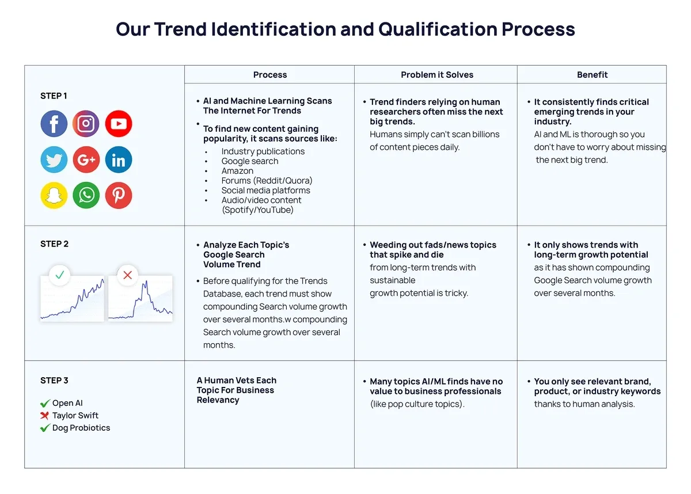

## Table of Contents

## What are market trends and why are they important?

Market trends are patterns or changes in the way people buy and sell things over time. These trends can be about what products are popular, how much people are willing to pay, or even how they shop. For example, more people might start buying electric cars instead of gas cars, or they might start shopping online more often. Understanding these trends helps businesses know what to sell and how to sell it.

Knowing market trends is important for businesses because it helps them make smart decisions. If a business knows that people are starting to like a certain type of product, they can start selling that product to make more money. It also helps them plan for the future. For example, if they see that online shopping is becoming more popular, they can focus on making their online store better. This way, they can stay ahead of their competition and keep their customers happy.

## How can beginners start identifying basic market trends?

Beginners can start identifying basic market trends by paying attention to what people around them are buying and talking about. For example, if you notice that many of your friends are suddenly interested in a new type of smartphone or a new fashion trend, that could be a sign of a market trend. You can also look at what's popular on social media or in the news. Websites and apps often have sections that show what's trending, which can give you a good idea of what's catching people's attention.

Another way to identify market trends is by looking at sales data. Many stores and online shops show what items are selling the most. If you see that a certain product is always out of stock or has a lot of good reviews, it might be part of a bigger trend. You can also use simple tools like Google Trends, which shows how often people search for certain things over time. If searches for a product or topic are going up, it could mean that it's becoming more popular.

Remember, identifying trends takes practice. Start by observing what's happening around you and using the tools available online. Over time, you'll get better at spotting patterns and understanding what they mean for the market.

## What are the most common tools used for trend analysis?

The most common tools for trend analysis include Google Trends, social media platforms, and sales data from stores. Google Trends is a free tool that shows how often people search for certain things over time. If you see that searches for a product or topic are going up, it might mean that it's becoming more popular. Social media platforms like Twitter, Instagram, and TikTok also show what's trending. By looking at hashtags and popular posts, you can see what people are talking about and what's catching their attention. Stores and online shops often share sales data, which can tell you what items are selling the most and might be part of a bigger trend.

Another useful tool is market research reports. Companies like Nielsen and Statista create reports that show detailed information about what people are buying and how their habits are changing. These reports can help you understand bigger trends in the market. Lastly, there are software tools like Trend Hunter and SEMrush that can help you analyze trends more deeply. These tools can show you patterns in data and help you predict what might happen next in the market. By using these tools together, you can get a good picture of what's happening and what might happen in the future.

## How do economic indicators influence market trends?

Economic indicators are like signs that tell us how the economy is doing. Things like unemployment rates, inflation, and how much people are spending can all affect what people buy and how they buy it. For example, if the unemployment rate goes up, people might have less money to spend, so they might buy less stuff. This can make businesses change what they sell or how they sell it to match what people can afford.

These indicators can also make people feel more or less confident about the future. If inflation is high, people might worry that prices will keep going up, so they might buy things now instead of waiting. This can create trends where certain products become more popular because people want to buy them before they get more expensive. On the other hand, if people feel good about the economy, they might be more willing to spend money on big things like cars or houses, which can start new trends in those markets.

## What role do consumer behaviors play in shaping market trends?

Consumer behaviors are really important in shaping market trends. When people start buying different things or buying things in different ways, it can start a trend. For example, if more people start buying clothes online instead of going to stores, that can make online shopping a big trend. Businesses watch what people are doing and then change what they sell or how they sell it to match what people want. If they see that people like buying eco-friendly products, they might start selling more of those to keep up with the trend.

These behaviors can also change because of what's happening in the world. If there's a new health trend, like eating more vegetables, then more people might start buying veggie snacks. This can make veggie snacks a trend. Or if people start caring more about the environment, they might buy more electric cars, which can start a trend in the car market. So, what people do and what they care about can really shape what's popular in the market.

## How can historical data be used to predict future market trends?

Historical data is like a record of what happened in the past. By looking at this data, we can see patterns and trends that happened before. For example, if we see that every summer, people buy more ice cream, we can guess that next summer, they might do the same thing. This helps businesses plan what to sell and when to sell it. They can look at old sales numbers, see what was popular, and then make more of those things for the future.

But it's not just about looking at what sold well. Historical data can also show us bigger changes over time. For example, if we see that over the last ten years, more and more people started buying things online, we can predict that this trend might keep going. Businesses can use this information to focus on making their online stores better. By understanding these long-term patterns, companies can make smarter decisions about where to put their money and how to grow.

## What are the differences between short-term and long-term market trends?

Short-term market trends are changes that happen quickly and don't last very long. They can be caused by things like a new popular product, a big sale, or even the weather. For example, if a new toy comes out and everyone wants it for a few weeks, that's a short-term trend. Businesses need to be quick to catch these trends because they can make a lot of money in a short time, but they also need to be ready for the trend to end soon.

Long-term market trends are changes that happen slowly over a long time and can last for years or even decades. These trends are often caused by bigger changes in society, like technology getting better or people caring more about the environment. For example, the trend of more people buying electric cars instead of gas cars is a long-term trend. Businesses need to plan carefully for these trends because they can change the whole market. They need to think about how to keep up with these changes and stay successful over many years.

## How do global events impact market trends?

Global events can have a big impact on market trends. When something big happens around the world, like a natural disaster or a big political change, it can change what people buy and how they buy it. For example, if there's a big earthquake, people might start buying more emergency supplies like water and batteries. This can start a trend where stores sell more of these items. Or if there's a new law about the environment, people might start buying more eco-friendly products, which can start a trend in that market.

These events can also make people feel different about the future. If there's a war or a big economic problem, people might feel worried and spend less money. This can make businesses change what they sell to match what people can afford. On the other hand, if there's good news, like a new technology that makes life easier, people might feel more confident and spend more money on new gadgets. So, global events can start new trends or change old ones by affecting what people want and how they feel about spending money.

## What advanced statistical methods can be applied to market trend analysis?

Advanced statistical methods can help us understand market trends better. One method is time series analysis, which looks at data over time to find patterns. For example, it can show if sales of a product go up every summer. Another method is regression analysis, which helps us see how different things affect sales. For instance, it can tell us if a change in price makes people buy more or less of a product. These methods use math to make predictions about what might happen next in the market.

Another useful method is cluster analysis, which groups similar data together. This can help businesses see different types of customers and what they like to buy. For example, it can show that one group of people buys a lot of sports equipment while another group buys more [books](/wiki/algo-trading-books). Machine learning is also becoming popular for market trend analysis. It can look at a lot of data quickly and find trends that might be hard for people to see. By using these advanced methods, businesses can make better decisions and stay ahead of the competition.

## How can machine learning and AI enhance market trend prediction?

Machine learning and AI can make predicting market trends easier and more accurate. They can look at a lot of data very quickly, like what people are buying, what they're searching for online, and even what they're saying on social media. By finding patterns in this data, [machine learning](/wiki/machine-learning) can spot trends that might be hard for people to see. For example, it can notice that more people are starting to buy a certain type of food or that searches for a new technology are going up. This helps businesses know what to sell and when to sell it.

AI can also learn from past data to make better predictions about the future. It can see how things like the weather, holidays, or big events affect what people buy. By understanding these patterns, AI can guess what might happen next in the market. This is really helpful for businesses because it lets them plan ahead and make smart decisions. For example, if AI predicts that more people will start buying electric cars, a car company can start making more of them to meet the demand.

## What are the challenges and limitations in accurately identifying market trends?

Identifying market trends can be hard because there are a lot of things that can change quickly. One big challenge is that trends can be affected by things we can't predict, like a sudden change in the weather or a big news event. These things can make people start buying different things very fast, and it's hard to see that coming. Another problem is that there's so much data out there. It can be tough to figure out which data is important and which isn't. Sometimes, businesses might see a trend that isn't really there because they're looking at the wrong information.

Another limitation is that people's tastes and habits can change in ways that are hard to understand. What people want can change because of new technology, changes in the economy, or even just because something becomes popular on social media. It's hard to keep up with all these changes and predict what will happen next. Plus, even if a business spots a trend, it might not last long. Short-term trends can come and go quickly, so it's risky to put a lot of money into something that might not be popular in a few months.

## How can experts integrate multiple data sources for a comprehensive market trend analysis?

Experts can integrate multiple data sources for a comprehensive market trend analysis by combining information from different places like sales data, social media, and economic reports. They start by gathering data from stores to see what people are buying. Then, they look at what's popular on social media to understand what people are talking about and what's catching their attention. They also use economic reports to see how things like unemployment rates or inflation might be affecting what people buy. By putting all this information together, experts can get a full picture of what's happening in the market.

Once they have all the data, experts use special tools and methods to analyze it. They might use software that can look at a lot of data quickly and find patterns that are hard to see. For example, they can use time series analysis to see how sales change over time or regression analysis to understand how different factors affect what people buy. By combining these different types of data and using advanced methods, experts can make better predictions about future market trends. This helps businesses make smart decisions about what to sell and how to sell it.

## References & Further Reading

[1]: Bergstra, J., Bardenet, R., Bengio, Y., & Kégl, B. (2011). ["Algorithms for Hyper-Parameter Optimization."](https://dl.acm.org/doi/10.5555/2986459.2986743) Advances in Neural Information Processing Systems 24.

[2]: ["Advances in Financial Machine Learning"](https://www.amazon.com/Advances-Financial-Machine-Learning-Marcos/dp/1119482089) by Marcos Lopez de Prado

[3]: ["Evidence-Based Technical Analysis: Applying the Scientific Method and Statistical Inference to Trading Signals"](https://www.amazon.com/Evidence-Based-Technical-Analysis-Scientific-Statistical/dp/0470008741) by David Aronson

[4]: ["Machine Learning for Algorithmic Trading"](https://github.com/stefan-jansen/machine-learning-for-trading) by Stefan Jansen

[5]: ["Quantitative Trading: How to Build Your Own Algorithmic Trading Business"](https://github.com/LucindaYa/quant-resources/blob/master/Quantitative%20Trading%20How%20to%20Build%20Your%20Own%20Algorithmic%20Trading%20Business.pdf) by Ernest P. Chan