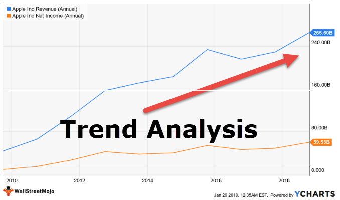

Market trends are a fundamental aspect of financial markets, representing the general direction in which market prices are moving over a certain period. These trends are driven by a complex interplay of various factors, including investor sentiment, global economic shifts, and macroeconomic data. Recognizing these trends is crucial for both investors and traders as they influence investment strategies, risk management, and portfolio diversification.

Economic indicators are vital tools in analyzing market trends, serving as quantitative metrics that reflect the economic health of a country. Common indicators include Gross Domestic Product (GDP), unemployment rates, inflation, and consumer confidence indices. Each indicator provides insights into different aspects of an economy, thereby guiding investment decisions and market forecasts. For instance, a rising GDP is often associated with economic growth, which can lead to bullish market trends, while rising unemployment may signal economic distress and bearish trends.



Trend analysis involves examining these patterns that emerge from an array of data points over time. This analytical method is employed to predict future movements based on historical data. Techniques such as moving averages, trendlines, and other statistical tools are widely used to identify and project the trajectories of these trends. These techniques enable market participants to anticipate potential market conditions, thereby aiding in making informed trading and investment decisions.

Algorithmic trading has emerged as a pivotal innovation in utilizing data-driven insights to harness market trends. By utilizing computer algorithms, traders can execute orders at speeds and frequencies impossible for human traders. This form of trading leverages vast datasets and sophisticated algorithms to identify patterns and trends that may not be visible through traditional analysis methods. Algorithms can process vast amounts of information in real-time, enabling traders to capitalize on market trends with enhanced precision and efficiency.

Understanding how market trends, economic indicators, trend analysis, and algorithmic trading intersect is essential in today's fast-paced financial environment. These elements collectively influence the strategies and tactics employed by market participants, offering opportunities to mitigate risks and enhance returns. As technology continues to evolve, the integration of these components is expected to deepen, offering more granular insights and robust trading strategies in the financial markets.

## Table of Contents

## Understanding Market Trends

Market trends represent the general direction in which a market moves over a certain period of time. Understanding these trends is crucial for investors and traders as they provide insights into market behavior, helping to forecast future movements and make informed decisions. Market trends can generally be categorized into three types: uptrends, downtrends, and sideways trends.

An uptrend is characterized by a series of higher highs and higher lows. This occurs when the overall movement of the market is directed upwards, signaling a bullish market where demand exceeds supply. Conversely, a downtrend is a series of lower highs and lower lows, indicating a bearish market where supply outweighs demand. Sideways trends, or horizontal trends, occur when the market shows little to no movement upward or downward, reflecting a period of equilibrium between buyers and sellers.

Several factors drive market trends, with macroeconomic factors playing a significant role. These include economic growth, monetary policy, fiscal policy, and international trade dynamics. For instance, strong economic growth can boost corporate earnings, leading to higher stock prices, thus fostering an uptrend. On the other hand, tight monetary policy, characterized by higher interest rates, can dampen economic activity and contribute to a downtrend.

Investor sentiment also heavily influences market trends. This sentiment can be shaped by news events, market speculation, and overall economic outlook. Positive sentiment typically results in increased buying activity, pushing markets into an uptrend. Negative sentiment, driven by fears of economic downturns or geopolitical tensions, often leads to selling pressure, initiating a downtrend.

Identifying market trends is of paramount importance for investors and traders. Recognizing an uptrend or downtrend early can lead to strategic positioning and enhanced portfolio performance. Trends help in determining entry and [exit](/wiki/exit-strategy) points, assessing risk levels, and understanding the broader market environment. Ignoring these trends can lead to missed opportunities or increased exposure to adverse market conditions.

By carefully analyzing market trends and understanding the underlying factors, investors and traders can better anticipate market movements. This foresight enables them to capitalize on profitable opportunities while mitigating risks associated with adverse trends. Consequently, knowledge of market trends and their drivers is an essential component of successful financial market participation.

## Key Economic Indicators

Economic indicators are essential tools in market analysis, providing valuable insights into the health and direction of an economy. These indicators help investors, policymakers, and analysts gauge economic performance and forecast future trends, influencing investment decisions and market movements. Some of the most significant economic indicators include Gross Domestic Product (GDP), unemployment rates, and inflation.

**Gross Domestic Product (GDP)** is a comprehensive measure of a nation's overall economic activity. It represents the total value of all goods and services produced over a specific time period within a country. GDP growth is a key indicator of economic health; rising GDP suggests a growing economy, while a declining GDP may indicate economic troubles. Investors often interpret GDP growth as a positive signal, leading to increased market confidence and potentially higher stock prices. Conversely, a shrinking GDP can cause investor pessimism, resulting in stock market downturns.

**Unemployment rates** reflect the percentage of the labor force that is jobless and actively seeking employment. High unemployment rates typically signal economic distress, as they indicate lower consumer spending power and reduced economic demand. This can negatively impact market trends, as businesses may experience decreased sales and profits, leading to a drop in stock prices. Conversely, low unemployment rates suggest a robust economy with high consumer confidence, often leading to bullish market trends.

**Inflation** refers to the rate at which the general level of prices for goods and services rises, eroding purchasing power. Moderate inflation is usually seen as a sign of a growing economy, prompting central banks to adjust interest rates to keep inflation in check. However, hyperinflation or deflation can destabilize markets. High inflation may force central banks to increase interest rates, making borrowing more expensive and potentially slowing economic growth, which can negatively affect stock prices. Conversely, low inflation might lead to interest rate cuts, encouraging investment and spending, which can boost market performance.

These indicators influence market trends significantly. For instance, an unexpected rise in GDP can lead to bullish market conditions as investors anticipate increased corporate earnings. Similarly, a drop in unemployment rates might boost market sentiment, given the potential for higher consumer spending and corporate profitability. Conversely, rising inflation could trigger bearish trends as investors worry about [interest rate](/wiki/interest-rate-trading-strategies) hikes and reduced purchasing power.

An illustrative example of the impact of these indicators can be seen in the market's reaction to GDP announcements. If actual GDP figures surpass market expectations, stock indices frequently rise as investor confidence swells. For instance, when the U.S. GDP growth exceeded forecasts in a given quarter, it led to rallies in major stock indices like the S&P 500. In contrast, if inflation rates exceed expectations, markets might react negatively due to fears of impending interest rate increases, which could stifle economic growth.

Overall, understanding and monitoring these key economic indicators enable investors to make informed decisions, assess market conditions, and anticipate potential shifts in financial markets.

## Trend Analysis Techniques

Technical analysis is a key component in trend analysis, leveraging various tools to identify and predict market trends. Fundamental techniques in this area include moving averages, trendlines, and the Relative Strength Index (RSI).

**Moving Averages**

Moving averages smooth out price data to identify the direction of a trend. The simple moving average (SMA) is the most basic, calculated by adding prices over a period and dividing by the number of data points. In Python, a simple moving average can be computed using:

```python
import pandas as pd

def simple_moving_average(prices, window):
    return prices.rolling(window=window).mean()
```

A short-term moving average crossing above a long-term moving average is often a signal of an upward trend, and vice versa.

**Trendlines**

Trendlines are straight lines that connect multiple price points, acting as a visual guide to market direction. By drawing a line connecting the lows in an uptrend or the highs in a downtrend, traders can discern the trend's strength and potential reversal points.

**Relative Strength Index (RSI)**

The RSI is a [momentum](/wiki/momentum) oscillator that measures the speed and change of price movements on a scale of 0 to 100. A typical interpretation considers an RSI above 70 as overbought and below 30 as oversold, suggesting potential trend reversals.

**Fundamental Analysis**

Unlike technical analysis, which focuses on price and [volume](/wiki/volume-trading-strategy) data, [fundamental analysis](/wiki/fundamental-analysis) evaluates securities by examining financial statements, economic conditions, and industry health to identify long-term trends. It assesses intrinsic value, considering factors like revenue, earnings, future growth, and macroeconomic indicators, thereby influencing decisions on value-oriented investments.

**Sentiment Analysis**

Sentiment analysis evaluates investor attitudes and feelings toward market conditions, securities, or trends. By analyzing news, social media, and other public forums, sentiment analysis quantifies sentiment into measurable data. Machine learning models can analyze vast amounts of data to gauge whether sentiment is bullish or bearish. This auxiliary tool helps to capture psychological and emotional market influences, offering a nuanced understanding of market dynamics.

Collectively, these analytical techniques enable traders and investors to make informed decisions by complementing qualitative insights with quantitative data.

## Algorithmic Trading and Trend Analysis

Algorithmic trading refers to the use of computer algorithms to execute trades in financial markets based on predefined criteria and strategies. These algorithms are designed to analyze vast datasets, identify patterns, and execute trades with minimal human intervention. The prevalence of [algorithmic trading](/wiki/algorithmic-trading) in contemporary financial markets is significant, with some estimates suggesting that up to 70-80% of trades in major markets are algorithmically executed. This dominance is primarily due to the speed and efficiency with which computers can process information compared to human traders.

Algorithms are capable of identifying and capitalizing on market trends by employing various techniques such as moving averages, momentum indicators, and [machine learning](/wiki/machine-learning) models. For example, a simple moving average (SMA) algorithm might trigger a buy signal if a short-term SMA crosses above a long-term SMA, indicating a potential upward trend. Similarly, advanced algorithms can employ regression models or neural networks to identify complex patterns that may not be immediately apparent to human traders.

The advantages of algorithmic trading for trend analysis are manifold. First, algorithms can process and analyze data with unprecedented speed, enabling traders to respond to market changes almost instantaneously. This speed is crucial in high-frequency trading ([HFT](/wiki/high-frequency-trading-strategies)), where the execution time of trades is measured in microseconds. Additionally, algorithms offer enhanced accuracy by eliminating human biases and errors, thus executing trades based solely on data-driven insights. Algorithms can also handle high volumes of trades simultaneously, which would be challenging for human traders.

To illustrate, consider a Python-based algorithm that uses moving averages to identify buy and sell signals:

```python
import numpy as np
import pandas as pd

# Sample stock price data
data = pd.DataFrame({
    'Price': [100, 101, 102, 99, 98, 100, 105, 107, 104, 102]
})

# Calculate moving averages
data['Short_MA'] = data['Price'].rolling(window=3).mean()
data['Long_MA'] = data['Price'].rolling(window=5).mean()

# Generate signals
data['Signal'] = np.where(data['Short_MA'] > data['Long_MA'], 1, 0)

print(data)
```

In this example, the algorithm calculates short-term and long-term moving averages and generates buy signals (1) when the short-term average exceeds the long-term average, suggesting a potential trend upward.

Furthermore, the statistical models employed by algorithms facilitate rigorous [backtesting](/wiki/backtesting), allowing traders to validate their strategies using historical data before applying them in live markets. This feature reduces the risks associated with implementing new strategies by providing insights into potential outcomes.

Overall, algorithmic trading constitutes a powerful tool for identifying and exploiting market trends, offering a strategic advantage through speed, accuracy, and volume capabilities in financial markets.

## Case Studies and Real-World Applications

Algorithmic trading has transformed the landscape of financial markets, enabling traders and firms to leverage quantitative models and vast data sets to predict market trends. Several case studies highlight the successful application of algorithmic trading strategies in anticipating future market movements by integrating economic indicators.

### Case Study 1: Predicting Commodity Price Movements

One notable case involves the prediction of [crude oil](/wiki/crude-oil) prices by a major trading firm, which integrated economic indicators such as the U.S. GDP growth rates, global supply chain data, and geopolitical events into its algorithmic models. This approach allowed them to anticipate price spikes and dips with impressive accuracy during periods of economic uncertainty when traditional analysis might have faltered. The firm utilized machine learning techniques to constantly update their models with new data, ensuring real-time responsiveness to evolving market conditions. 

The challenge faced here included the complexity of integrating various data sources and ensuring real-time data accuracy. Moreover, unforeseen geopolitical events presented additional [volatility](/wiki/volatility-trading-strategies) that could not be fully captured by the models, highlighting the inherent limitations of relying solely on historical data.

### Case Study 2: Forex Market and Economic Releases

Another example can be drawn from the foreign exchange (Forex) market, where an investment bank used algorithmic trading systems to capitalize on economic indicators such as inflation reports, central bank interest rate decisions, and employment data. By employing natural language processing techniques to parse news reports and economic releases, the systems could react almost instantaneously to market-moving news.

For instance, a sudden increase in a country’s unemployment rate often leads to a depreciation of its currency. By anticipating such moves, the algorithms allowed traders to gain substantial profits before most human traders could interpret and react to the news. However, the algorithms' reliance on pre-set parameters could sometimes lead to misinterpretation of the data, especially if the economic release was unexpectedly revised after initial publication.

### Case Study 3: Equity Markets and Sentiment Analysis

In equity markets, firms have incorporated sentiment analysis into their algorithmic trading strategies to predict stock price movements. By analyzing social media sentiments, news articles, and financial reports, these algorithms assess market sentiment and adjust trading strategies accordingly. An example includes the use of Twitter data to predict stock price movements, as investor sentiment expressed on social media platforms often precedes actual market movements.

Nevertheless, challenges such as sentiment misinterpretation and the influence of widespread misinformation can lead to inaccurate predictions. The dynamic nature of social media, coupled with the speed at which information spreads, requires constant algorithm updates and monitoring.

### Limitations and Challenges

Despite numerous successes, algorithmic trading is not without its challenges. High-frequency trading can lead to market fluctuations and contribute to events such as the 2010 United States Flash Crash. Additionally, the reliance on historical data means that algorithms might struggle to adapt to unprecedented economic events or regime changes. Furthermore, there is an ongoing risk of overfitting, where models are too tightly tailored to past data, reducing their ability to adapt to new market conditions.

In conclusion, while algorithmic trading offers substantial opportunities for leveraging economic indicators to predict market trends, it requires continuous refinement and risk management to mitigate potential pitfalls. The balance between automated efficiency and human oversight remains critical in navigating the complexities of modern financial markets.

## Challenges and Considerations

In financial markets, the reliance on algorithms and trend analysis presents several challenges and risks. While algorithmic trading offers speed and precision, excessive dependence on these methods can introduce vulnerabilities. One of the primary challenges is the risk of overfitting, where a model is tailored to historical data but fails in real-world scenarios due to its inability to generalize. This risk is exacerbated when algorithms are designed without considering underlying market fundamentals.

Data quality and selection play a critical role in the accuracy of market predictions. Algorithms need vast amounts of data to function effectively, but the quality of this data is paramount. Inconsistent or inaccurate data can lead to erroneous predictions and financial losses. Moreover, the selection of data sets must accurately represent the market segment or trend being analyzed. For instance, a model predicting stock price movements based on outdated or irrelevant economic indicators might not perform well against current market conditions.

Market volatility and unforeseen economic events pose additional challenges to the reliability of trend predictions. Financial markets are inherently volatile, with prices often reacting rapidly to unexpected news or economic shifts. Such volatility can disrupt established trends and render algorithmic predictions obsolete. For example, during a sudden market crash, algorithms based on historical trends may fail to adapt quickly enough, potentially exacerbating losses. Unpredictable events, such as geopolitical tensions or natural disasters, can further skew data inputs, reducing the efficacy of algorithmic trading systems reliant on stable trend analysis.

It is crucial for traders and firms utilizing these technologies to consider these challenges carefully. Diversifying strategies and incorporating human oversight can mitigate some risks. Additionally, continuously updating models to account for new data and changing market conditions can enhance their reliability. A balance between automated systems and human expertise is essential to navigate the unpredictable nature of financial markets effectively.

## Future of Algo Trading and Market Trend Analysis

The future of algorithmic trading and market trend analysis is poised for significant transformation, driven by advancements in technology. One of the most promising developments is the integration of [artificial intelligence](/wiki/ai-artificial-intelligence) (AI) and machine learning (ML), which have the potential to enhance the accuracy and efficiency of trend analysis. Machine learning algorithms, particularly those leveraging [deep learning](/wiki/deep-learning) techniques, can analyze vast amounts of historical and real-time data to identify patterns and make predictive forecasts. These advancements allow for more nuanced strategies that adjust to market changes with greater precision.

For instance, AI models can be trained to recognize complex nonlinear patterns and relationships in data that are beyond human capabilities or simple statistical models. The use of [reinforcement learning](/wiki/reinforcement-learning), an area of machine learning where [agents](/wiki/agents) learn optimal behaviors through trial and error in an environment, is also gaining traction. This approach can optimize trading strategies by learning from the outcomes of trades and adjusting tactics to maximize returns.

However, the rise of AI-driven trading systems necessitates a reevaluation of regulatory frameworks. Current regulations may need to be adapted to accommodate the rapid decision-making and execution capabilities of AI algorithms. This includes ensuring market stability and fairness, as high-frequency trading could potentially lead to market manipulation or flash crashes.

Ethical considerations also emerge with the increased reliance on algorithmic trading. Transparency in how AI systems make decisions is crucial to maintaining trust in financial markets. Bias in data inputs or algorithm design can lead to unfair trading advantages, so measures must be taken to ensure that these systems are both fair and impartial.

The pace of technological advancement suggests that future algorithmic trading systems will become increasingly autonomous. This development holds the potential to minimize human emotional biases and errors in trading decisions. Nevertheless, the role of human oversight remains vital to ensure ethical and impartial practices, alongside safeguarding against systemic risks.

In conclusion, as AI and machine learning continue to evolve, they will likely play an instrumental role in shaping the future of algorithmic trading and market trend analysis. This progress comes with both opportunities for improved market efficiency and challenges that demand careful regulatory and ethical consideration.

## Conclusion

Market trends, economic indicators, trend analysis, and algorithmic trading form a complex, interconnected framework within financial markets. Understanding this interplay is crucial for anyone looking to engage in trading or investing. Market trends, whether upward, downward, or sideways, are shaped by various factors, including macroeconomic influences and investor sentiment. Recognizing these trends can provide valuable insights for making informed investment decisions.

Economic indicators such as GDP, unemployment rates, and inflation offer quantitative measures that reflect the current state of the economy and influence market trends. These indicators can signal potential opportunities or risks, guiding investors and traders in their strategic choices.

Trend analysis employs a variety of tools and methodologies to identify and forecast trends. Techniques like moving averages, trendlines, and sentiment analysis allow traders to anticipate market movements while balancing the more speculative elements of trading with insights derived from fundamental analysis.

Algorithmic trading has brought significant advancements to how traders approach market trends. By utilizing algorithms, traders can process vast amounts of data with speed and precision beyond human capabilities. This technological approach enhances the ability to identify and capitalize on market trends, although it also brings challenges such as dependence on data quality and the impact of market volatility.

Looking ahead, technological advancements such as artificial intelligence and machine learning hold great promise for enhancing both trend analysis and algorithmic trading. As these technologies evolve, they will likely provide even deeper insights and more sophisticated trading strategies. However, there are regulatory and ethical considerations to keep in mind as technology continues to reshape the financial markets.

Staying informed and adaptive is essential in this rapidly evolving landscape. By leveraging the interconnected nature of market trends, economic indicators, trend analysis, and algorithmic trading, traders and investors can better navigate the complexities of the financial world. As technology continues to advance, those who embrace and understand these changes will be well-positioned to thrive in the markets of the future.

## References & Further Reading

[1]: Bergstra, J., Bardenet, R., Bengio, Y., & Kégl, B. (2011). ["Algorithms for Hyper-Parameter Optimization."](https://dl.acm.org/doi/10.5555/2986459.2986743) Advances in Neural Information Processing Systems 24.

[2]: ["Advances in Financial Machine Learning"](https://www.amazon.com/Advances-Financial-Machine-Learning-Marcos/dp/1119482089) by Marcos Lopez de Prado

[3]: ["Evidence-Based Technical Analysis: Applying the Scientific Method and Statistical Inference to Trading Signals"](https://www.amazon.com/Evidence-Based-Technical-Analysis-Scientific-Statistical/dp/0470008741) by David Aronson

[4]: ["Machine Learning for Algorithmic Trading"](https://github.com/stefan-jansen/machine-learning-for-trading) by Stefan Jansen

[5]: ["Quantitative Trading: How to Build Your Own Algorithmic Trading Business"](https://github.com/LucindaYa/quant-resources/blob/master/Quantitative%20Trading%20How%20to%20Build%20Your%20Own%20Algorithmic%20Trading%20Business.pdf) by Ernest P. Chan