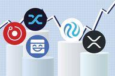

The cryptocurrency market has undergone significant transformation in recent years, reshaping the financial landscape and offering vast opportunities for investors globally. Since the inception of Bitcoin in 2009, the market has expanded dramatically, with thousands of cryptocurrencies now in circulation, each possessing unique features and technologies designed to address various financial challenges and opportunities. This surge in diversification provides investors with numerous options to enhance and expand their portfolios strategically.

One of the key drivers of this rapid evolution is the continuous technological advancement within the cryptocurrency sector. Innovations such as decentralized finance (DeFi), non-fungible tokens (NFTs), and smart contract platforms are redefining how financial transactions and asset management are conducted. These technologies not only offer new ways to invest but also promise efficiency, transparency, and new profit avenues, making them attractive propositions for both new and seasoned traders.

The dynamic nature of the cryptocurrency market presents investors with both challenges and prospects. With the proliferation of new digital currencies, understanding and analyzing these assets become crucial to navigating the complexities of the market successfully. The volatility inherent in cryptocurrencies also necessitates a robust investment strategy that can weather sudden market shifts. 

This article aims to illuminate the most recent trends in cryptocurrency, bringing forth emerging investment opportunities. Through an exploration of algorithmic trading strategies and new technological advancements, we intend to equip investors with the knowledge and tools needed to maximize returns in this burgeoning market. By grasping these essential elements, investors stand to benefit from both current market offerings and future advancements in cryptocurrency trading. Whether you are experienced or just embarking on your crypto journey, this knowledge is critical in crafting a resilient and profitable investment approach.

## Table of Contents

## Understanding New Cryptocurrencies

The cryptocurrency landscape continues to evolve with the introduction of numerous new coins and tokens that challenge the dominance of established entities like Bitcoin and Ethereum. These emerging cryptocurrencies often distinguish themselves through innovative features and technological advancements, presenting both intriguing opportunities and complexities for investors.

One noteworthy trend is the development of cryptocurrencies that focus on privacy and anonymity. Monero (XMR), for example, employs advanced cryptographic techniques to obscure transaction details, making it a preferred choice for users prioritizing privacy. In contrast, Zilliqa (ZIL) is gaining traction due to its focus on scalability through sharding, which allows the network to handle a larger number of transactions simultaneously, enhancing overall performance.

Stablecoins represent another rapidly expanding category within new cryptocurrencies. These digital assets are pegged to stable reserve currencies like the US Dollar, providing more predictable price stability compared to traditional cryptocurrencies. Tether (USDT) and USD Coin (USDC) are prominent examples, designed to facilitate seamless transactions with reduced [volatility](/wiki/volatility-trading-strategies).

The domain of smart contract platforms is also witnessing substantial growth. Cardano (ADA), for instance, differentiates itself with a rigorous peer-review process and emphasis on security and scalability. Its layered architecture separates the ledger from the computations, enhancing transaction processing efficiency. Similarly, Polkadot (DOT) introduces interoperability by enabling various blockchains to transfer messages and value in a trust-free fashion.

Decentralized Finance (DeFi) is another area benefiting from the creativity of developers fostering new cryptocurrencies. These coins often integrate seamlessly into decentralized financial systems, enabling lending, borrowing, and trading without intermediaries. For example, Uniswap's native token, UNI, powers its decentralized exchange protocol, facilitating automated [liquidity](/wiki/liquidity-risk-premium) provision on Ethereum.

Investors seeking to incorporate these new cryptocurrencies into a diversified portfolio must understand their foundational technology and intended utility. A diversified [cryptocurrency](/wiki/cryptocurrency) portfolio might combine privacy-centric tokens, scalable platforms, and stablecoins to mitigate risks while capitalizing on different growth potential avenues.

In the rapidly expanding cryptocurrency market, due diligence is essential for assessing the potential impact and viability of new coins. Familiarity with their underlying technology, market position, and developmental roadmap will aid in making informed investment decisions, thus contributing effectively to a well-rounded and resilient investment strategy.

## Emerging Crypto Investment Opportunities

As the cryptocurrency market continues to mature, investors are increasingly exploring alternatives to the traditional buy-and-hold strategy. New investment opportunities, such as staking, yield farming, and decentralized finance (DeFi) platforms, present appealing returns to those willing to navigate this evolving landscape.

Staking involves participating in the proof-of-stake (PoS) consensus mechanism of a blockchain network. By locking up a certain amount of a cryptocurrency, investors can earn rewards over time. This process not only secures the network but often provides attractive interest rates compared to traditional financial instruments. For instance, prominent PoS coins like Cardano (ADA) and Polkadot (DOT) offer annual percentage yields that can significantly enhance portfolio returns.

Yield farming, another innovative strategy within the DeFi ecosystem, allows investors to earn returns by providing liquidity to pools on decentralized exchanges (DEXs). By lending or staking tokens within these platforms, users can earn interest, fees, and sometimes additional token incentives. This method can be lucrative but comes with risks like impermanent loss and platform security vulnerabilities. Therefore, potential investors must thoroughly evaluate the protocols' credibility and smart contract audits.

DeFi platforms have revolutionized traditional financial services by offering decentralized lending, borrowing, and trading. They eliminate intermediaries and often operate with greater transparency. However, while these platforms provide higher returns, they also come with their own set of challenges, including regulatory uncertainties and transaction delays due to network congestion.

One emerging trend is the investment in lesser-known, "under-the-radar" cryptocurrencies. These digital assets, though riskier, offer significant growth potential if they gain market traction. Investors should conduct thorough research and verify the utility and adoption potential of these projects. Utilizing fundamental and technical analysis can aid in identifying promising opportunities.

The key to successfully navigating these emerging opportunities lies in diversification and due diligence. Building a diversified portfolio that includes a mix of established cryptocurrencies and promising new entrants can mitigate risks. Investors should constantly monitor market trends, updates from project teams, and changes in regulatory environments to make informed decisions.

In conclusion, while the evolving cryptocurrency market offers substantial investment opportunities, careful assessment of risk versus reward is crucial. Strategic investments, supported by comprehensive research and a diversified approach, can lead to substantial growth in this dynamic financial landscape.

## Algorithmic Trading in Cryptocurrencies

Algorithmic trading is increasingly becoming a cornerstone of cryptocurrency investment. This sophisticated approach utilizes computer algorithms to execute trades with speed and precision, offering a strategic edge over traditional manual trading. At its core, [algorithmic trading](/wiki/algorithmic-trading) involves the use of pre-programmed instructions which consider variables such as timing, price, and [volume](/wiki/volume-trading-strategy) to determine optimal trading strategies.

One of the primary advantages of algorithmic trading over traditional methods is its ability to process vast amounts of data at lightning speed. This attribute is particularly beneficial in the highly volatile and 24/7 nature of cryptocurrency markets. Algorithms can swiftly identify and exploit market inefficiencies that a human trader might overlook. Additionally, the automation of trades reduces the likelihood of emotional decision-making, leading to more consistent results.

Several algorithmic trading strategies have proven effective within cryptocurrency markets. **Arbitrage** is a popular strategy that involves taking advantage of price differences across different exchanges. For example, if Bitcoin is trading at $10,000 on one exchange and $10,200 on another, the algorithm will buy on the former and sell on the latter to profit from the price discrepancy.

**Market making** is another strategy where the algorithm provides liquidity to the market by placing simultaneous buy and sell orders to capture the spread between them. This strategy can be profitable in both rising and falling markets, though it requires careful risk management to avoid significant losses during sudden price movements.

**Trend following** strategies focus on analyzing market trends and patterns. These algorithms typically employ technical indicators such as moving averages or momentum indicators to determine the direction of the market and execute trades accordingly. While trend following can be effective, it also requires adaptation to changing market conditions to avoid lagging in performance when trends shift.

The integration of [artificial intelligence](/wiki/ai-artificial-intelligence) (AI) and [machine learning](/wiki/machine-learning) into algorithmic trading is fundamentally transforming investment strategies. Machine learning algorithms can continuously learn from historical data and adapt to new market conditions, enhancing the algorithm's decision-making capabilities. For instance, a machine learning model might analyze millions of data points from market history to predict future price movements with a higher degree of accuracy.

Understanding these strategies and the role of AI in algorithmic trading can significantly enhance an investor's ability to optimize trading decisions. By leveraging data and advanced analytics, investors can increase the probability of generating substantial returns, all while operating with increased efficiency and reduced risk exposure.

## Risks and Considerations in Cryptocurrency Investment

The volatility of cryptocurrencies presents both opportunities and challenges for investors. As digital assets are inherently speculative and characterized by significant price swings, understanding the associated risks is paramount to safeguarding one's investments. This segment explores primary risks involved in cryptocurrency investment and underscores the importance of a robust risk management strategy.

### Market Volatility

Cryptocurrency prices are subject to marked volatility, often experiencing large fluctuations within short periods. For instance, Bitcoin, the leading cryptocurrency, has experienced dramatic price changes, such as its surge to nearly $20,000 in December 2017 and subsequent decline to around $3,500 by December 2018. This volatility is primarily driven by factors including speculative trading, market sentiment, and macroeconomic variables. Investors should be prepared for inherent unpredictability and potentially significant financial losses. Employing tools such as stop-loss orders and maintaining diversified portfolios can help mitigate exposure to adverse market movements.

### Security Concerns

Security remains a critical issue in the cryptocurrency space. The decentralized and digital nature of cryptocurrencies makes them susceptible to hacks, frauds, and theft. For instance, major exchanges like Mt. Gox have suffered significant breaches, resulting in massive losses for investors. Using secure wallets, enabling two-[factor](/wiki/factor-investing) authentication, and diligently monitoring transactions can help enhance security. Additionally, choosing reputable exchanges and avoiding sharing sensitive information can reduce the risk of cyber threats.

### Regulatory Changes

The regulatory landscape for cryptocurrencies is continually evolving and can have significant implications for investors. Governments across the globe are developing frameworks to regulate digital assets, affecting everything from taxation to legal compliance. Sudden regulatory changes can impact cryptocurrency values and investor access, underscored by China's 2021 crackdown on crypto mining and trading activities. To navigate these challenges, investors should stay informed about legal developments and consider diversification across different jurisdictions to reduce geopolitical risks.

### Developing a Risk Management Strategy

A comprehensive risk management strategy is essential for mitigating potential losses in cryptocurrency investments. This involves understanding personal risk tolerance, setting clear investment goals, and regularly reviewing and adjusting investment portfolios. Techniques such as dollar-cost averaging, leveraging stablecoins, and maintaining an emergency fund can enhance financial resilience against market downturns.

### Continuous Learning and Adaptability

In the rapidly changing financial landscape of cryptocurrencies, continuous learning and adaptability are essential. Investors should stay informed about technological advancements, market trends, and emerging risks. Engaging with reputable sources, participating in online forums, and attending industry events can provide valuable insights and enhance decision-making processes.

By acknowledging these risks and implementing effective strategies, investors can make more informed decisions and potentially safeguard their cryptocurrency investments. Maintaining vigilance and flexibility is crucial in navigating the dynamic world of digital assets.

## Conclusion

The cryptocurrency market continues to present a myriad of opportunities for investors who are adept at navigating its complexities. Embracing innovation while effectively managing risk can substantially enhance investment outcomes. Staying informed about newly launched cryptocurrencies and emerging investment strategies is essential for those aiming to maintain a competitive advantage. These strategies can include staking, yield farming, and the use of decentralized finance (DeFi) platforms, each offering distinct advantages and potential returns.

Algorithmic trading has emerged as a significant tool in the toolbox of crypto investors, promising substantial enhancements in decision-making and execution. This approach, leveraging the power of AI and machine learning, allows for sophisticated data analysis, pattern recognition, and the automation of trades based on pre-defined criteria. For those investors proficient in algorithmic trading, this can mean staying ahead of market trends and optimizing their portfolios for better performance.

Nevertheless, successful cryptocurrency investment hinges on rigorous research and a profound understanding of market dynamics. This involves evaluating the underlying technology of cryptocurrencies, understanding the market forces at play, and keeping abreast of regulatory changes that could impact investments. A robust risk management strategy is crucial, considering the volatile nature of cryptocurrency markets.

Investors equipped with these insights are positioned strategically to capitalize on the evolving landscape of cryptocurrency investment. They not only enhance their potential returns but also ensure their portfolio is resilient against the fluctuations and innovations that characterize this dynamic market. By continuously adapting and learning, they can transform the risks inherent in cryptocurrency investing into opportunities for growth and long-term success.

## References & Further Reading

[1]: Catalini, C., & Gans, J. S. (2019). ["Some Simple Economics of the Blockchain"](https://papers.ssrn.com/sol3/papers.cfm?abstract_id=2874598). Communications of the ACM.

[2]: Nakamoto, S. (2008). ["Bitcoin: A Peer-to-Peer Electronic Cash System"](https://nakamotoinstitute.org/library/bitcoin/).

[3]: Schar, F., Gudgeon, L., & Basin, D. A. C. (2020). ["DeFi and the Future of Finance."](https://scholar.google.com/) SSRN Electronic Journal.

[4]: Antonopoulos, A. M. (2017). ["Mastering Bitcoin: Unlocking Digital Cryptocurrencies"](https://books.google.com/books/about/Mastering_Bitcoin.html?id=IXmrBQAAQBAJ). O'Reilly Media.

[5]: Mougayar, W. (2016). ["The Business Blockchain: Promise, Practice, and Application of the Next Internet Technology"](https://books.google.com/books/about/The_Business_Blockchain.html?id=CEsPDAAAQBAJ) Wiley.

[6]: Gandal, N., & Halaburda, H. (2014). ["Competition in the Cryptocurrency Market"](https://papers.ssrn.com/sol3/papers.cfm?abstract_id=2501640). National Bureau of Economic Research.