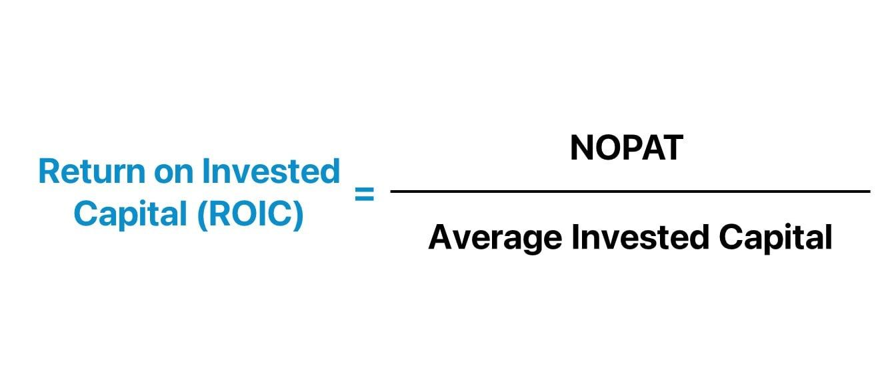

## Table of Contents

## What is Return on Invested Capital (ROIC)?

Return on Invested Capital (ROIC) is a measure that shows how well a company is using its money to make more money. It tells you how much profit a company makes for every dollar it has invested in its business. To find ROIC, you take the company's earnings before interest and taxes (EBIT) and divide it by the total amount of money invested in the company, which includes things like buildings, machines, and money borrowed.

ROIC is important because it helps investors see if a company is good at turning the money it uses into profits. A high ROIC means the company is doing a great job using its money wisely. On the other hand, a low ROIC might mean the company is not using its money as effectively as it could. By comparing the ROIC of different companies, investors can decide which ones are better at making profits from their investments.

## How is ROIC calculated?

ROIC is calculated by dividing a company's earnings before interest and taxes (EBIT) by its invested capital. EBIT shows how much money the company made from its main business activities before paying interest on loans and taxes. Invested capital is the total amount of money the company has put into its business, including things like buildings, equipment, and money borrowed.

To find the invested capital, you add up the company's total debt and its total equity. Total debt includes all the money the company owes, like loans and bonds. Total equity is the value of the company that belongs to the shareholders. Once you have these numbers, you divide the EBIT by the invested capital to get the ROIC. This tells you how efficiently the company is using its money to generate profit.

## Why is ROIC important for identifying quality investments?

ROIC is important for identifying quality investments because it shows how well a company is using its money to make more money. When a company has a high ROIC, it means they are good at turning the money they invest into profits. Investors like this because it means the company is using its resources wisely and efficiently. A high ROIC can be a sign that the company is a good investment because it's likely to keep making money and growing.

On the other hand, a low ROIC might mean the company is not using its money as well as it could. This can be a warning sign for investors, showing that the company might not be a good place to put their money. By comparing the ROIC of different companies, investors can see which ones are better at making profits from their investments. This helps them choose the best companies to invest in for long-term growth and returns.

## What is considered a good ROIC percentage?

A good ROIC percentage is usually considered to be above 10%. This means the company is making more than 10 cents of profit for every dollar it has invested in its business. Companies with an ROIC higher than 10% are seen as efficient at using their money to make profits. For example, if a company has an ROIC of 15%, it's doing a great job because it's [earning](/wiki/earning-announcement) 15 cents for every dollar invested.

However, what counts as a good ROIC can change depending on the industry. Some industries naturally have higher ROICs because they need less money to run their business or because they have strong brands or unique products. For instance, technology companies often have higher ROICs than heavy manufacturing companies. So, when looking at ROIC, it's helpful to compare companies within the same industry to get a better idea of what's considered good.

## How does ROIC differ from other financial metrics like ROI or ROE?

ROIC, or Return on Invested Capital, is different from other financial metrics like ROI (Return on Investment) and ROE (Return on Equity) because it looks at how well a company uses all the money it has invested, including debt and equity. ROI is a broader term that can be used for any investment and measures the gain or loss from an investment relative to its cost. ROE, on the other hand, only looks at how well a company uses the money from its shareholders to make profits, without considering the money it has borrowed.

While ROIC gives a complete picture of a company's efficiency by considering both debt and equity, ROE focuses only on the equity part. This makes ROIC a more comprehensive measure of how well a company is using all its resources. For example, a company might have a high ROE because it uses a lot of debt, but if its ROIC is low, it means the company isn't using that borrowed money efficiently. So, ROIC helps investors see the full story of how well a company is managing its total capital, making it a valuable tool for comparing companies across different industries.

## Can you explain the relationship between ROIC and a company's growth potential?

ROIC is important for understanding a company's growth potential because it shows how well the company is using its money to make more money. If a company has a high ROIC, it means they are good at turning the money they invest into profits. This is a good sign for growth because it means the company can keep making money and using that money to grow even more. For example, if a company has a high ROIC, they can use the profits to buy new equipment, open new stores, or develop new products, which can help them grow bigger and stronger.

On the other hand, if a company has a low ROIC, it might mean they are not using their money as well as they could. This can be a problem for growth because it means the company might not have enough money to invest in new projects or expand their business. A low ROIC can make it harder for a company to grow because they might need to borrow more money or find other ways to get the money they need. So, a high ROIC is often a good sign that a company has strong growth potential, while a low ROIC might mean they need to work on using their money more efficiently to grow.

## How can ROIC be used to compare companies within the same industry?

ROIC can be a great tool for comparing companies within the same industry because it shows how well each company is using its money to make profits. When you look at the ROIC of different companies in the same industry, you can see which ones are doing a better job at turning their investments into money. For example, if one company has an ROIC of 20% and another has an ROIC of 10%, the first company is doing a better job at using its money to make profits. This can help investors decide which company might be a better investment because it's more efficient at making money.

However, it's important to remember that even within the same industry, what counts as a good ROIC can vary. Some companies might have higher ROICs because they have strong brands or unique products that help them make more money. For example, in the tech industry, companies like Apple or Microsoft might have higher ROICs than smaller tech companies because of their well-known brands and successful products. So, when using ROIC to compare companies, it's helpful to look at the whole picture and consider other factors like the company's size, brand strength, and the specific part of the industry they are in.

## What are the limitations of using ROIC as a sole metric for investment decisions?

Using ROIC as the only way to decide on investments has some problems. ROIC looks at how well a company uses its money to make profits, but it doesn't tell the whole story. For example, ROIC doesn't show if a company is growing or if it has a lot of debt. A company might have a high ROIC because it's not spending money on growing its business, which might be good in the short term but not in the long term. Also, ROIC doesn't consider things like how risky the company's business is or how the industry is doing.

Another issue is that ROIC can be different depending on the industry. What's a good ROIC in one industry might not be good in another. For example, tech companies often have higher ROICs than companies in heavy industries like manufacturing. So, just looking at ROIC might make you think a tech company is doing better than a manufacturing company, even if that's not really the case. This means you need to compare companies within the same industry and look at other things like how fast they're growing or how much debt they have before making investment choices.

## How does the sustainability of high ROIC affect long-term investment quality?

The sustainability of a high ROIC is really important for deciding if a company is a good long-term investment. If a company can keep a high ROIC over time, it means they are good at making money from their investments again and again. This is a good sign for investors because it shows the company is using its money wisely and can keep making profits in the future. Companies that can keep their ROIC high often have strong business models, unique products, or strong brands that help them stay ahead of the competition. So, if a company can keep its ROIC high, it's more likely to be a good choice for long-term investment.

However, if a high ROIC is not sustainable, it can be a warning sign for investors. Sometimes a company might have a high ROIC for a short time because of a one-time event or because they are not spending money on growing their business. If the ROIC goes down over time, it might mean the company is not as good at using its money as it used to be. This can make it harder for the company to grow and make profits in the future. So, when looking at ROIC, it's important to think about whether it can stay high in the long run. This helps investors pick companies that are not just doing well now but will keep doing well in the future.

## What role does industry-specific factors play in interpreting ROIC?

Industry-specific factors are really important when you're trying to understand a company's ROIC. Different industries have different ways of making money and using their resources. For example, tech companies might have higher ROICs because they don't need a lot of money to run their business, and they can make a lot of money from their software or services. On the other hand, companies in heavy industries like manufacturing might have lower ROICs because they need to spend a lot of money on big machines and factories. So, when you're looking at ROIC, it's helpful to compare companies within the same industry because what's a good ROIC in one industry might not be good in another.

Also, things like how fast the industry is growing, how much competition there is, and how much money companies need to spend to stay in the game can all affect ROIC. For example, in a fast-growing industry like renewable energy, companies might have lower ROICs because they're spending a lot of money to grow quickly. But this might be okay because the industry is growing, and they might make more money in the future. On the other hand, in a slow-growing industry, a low ROIC might be a bigger problem because there's less chance for the company to make more money later. So, understanding the specific factors of an industry helps you see if a company's ROIC is good or if it needs to be better.

## How can investors adjust ROIC calculations for more accurate analysis?

Investors can make ROIC calculations more accurate by thinking about things like taxes and how much money the company has to spend to keep running. For example, when calculating ROIC, you usually start with EBIT (earnings before interest and taxes). But if you want a more accurate picture, you can adjust this number by subtracting the taxes the company would have to pay. This gives you a better idea of the real money the company is making. Also, you might want to subtract the money the company spends on keeping its machines and buildings working, because this money is needed just to keep the business going, not to grow it.

Another way to make ROIC calculations more accurate is to look at how the company is using its money over time. Instead of just looking at one year, you can look at the average ROIC over a few years. This helps you see if the company is getting better or worse at using its money. Also, you can think about how much debt the company has. If a company has a lot of debt, it might make its ROIC look higher because it's using borrowed money to make profits. But this can be risky because the company has to pay back that debt. So, by adjusting for these things, investors can get a clearer picture of how well a company is really doing.

## What advanced techniques can be used to forecast future ROIC for investment planning?

To forecast future ROIC for investment planning, investors can use something called discounted cash flow (DCF) analysis. This method looks at the money a company expects to make in the future and then figures out what that money is worth today. By doing this, investors can guess what the company's ROIC might be in the future. They can also look at how the company has done in the past and use that information to predict how it might do in the future. For example, if a company has been getting better at using its money over the last few years, investors might think it will keep getting better.

Another way to forecast future ROIC is by looking at industry trends and how the company fits into those trends. If the industry is growing fast, and the company is doing well in that industry, it might be able to keep a high ROIC. Investors can also use something called scenario analysis, where they think about different things that could happen in the future and how those things might affect the company's ROIC. For example, they might think about what would happen if the economy got worse or if new competitors came into the market. By considering all these things, investors can get a better idea of what the company's ROIC might be in the future and make smarter investment choices.

## What is Return on Invested Capital (ROIC) and how can it be understood?

Return on Invested Capital (ROIC) is a vital metric in financial analysis, assessing a company's proficiency in converting invested capital into profitable returns. It acts as a barometer of operational effectiveness and offers insights into the company’s financial health. ROIC is often used to determine how well a company is using its funds to generate returns and to compare efficiency between similar entities.

The formula for calculating ROIC is straightforward:

$$
\text{ROIC} = \frac{\text{NOPAT}}{\text{Invested Capital}}
$$

**Net Operating Profit After Tax (NOPAT)** is a key component of this formula. It represents the profit generated from a company's core operations after accounting for taxes, but it excludes financing costs and non-operating gains or losses. This provides a clearer picture of the company’s profitability from its primary business activities by isolating the operational performance from external financial influences. Essentially, NOPAT ensures that the focus remains on the earnings generated purely from operational efficiency, excluding extraneous financial maneuvers.

**Invested Capital** constitutes the total funds deployed by equity investors and debt holders necessary for the company’s growth and operational needs. It is important to include both equity and debt sources in this measure, as they collectively represent the capital at the company's disposal for generating NOPAT. By accounting for all sourced funds, Invested Capital allows stakeholders to assess how effectively a company employs all its resources to drive profitability.

A crucial aspect of interpreting ROIC is comparing it with the company’s Weighted Average Cost of Capital (WACC). If a company’s ROIC exceeds its WACC, it typically suggests that the company is generating value over and above the cost of its capital. This differential indicates effective capital utilization, as the earnings generated surpass the expense of used capital resources, ultimately signaling potential value creation for shareholders.

In practice, ROIC is a valuable metric for investors and analysts seeking to evaluate the efficiency of a company’s capital allocation strategies. It provides a lens to judge whether the management is deploying resources in a manner that will yield sustainable financial performance. Furthermore, it serves as a benchmark for comparing companies within the same industry, illuminating which firms are likely to sustain profitability through superior management of their invested capital.

## How do you calculate ROIC and what are its key components?

To accurately calculate Return on Invested Capital (ROIC), it is crucial to understand its two fundamental components: Net Operating Profit After Tax (NOPAT) and Invested Capital. These components together provide a comprehensive view of a company's operational performance and capital efficiency.

**Net Operating Profit After Tax (NOPAT)** is a measure of a company's operating efficiency, representing the after-tax profits generated from its core business operations. It excludes the effects of capital structure and non-operating gains or losses, allowing for a clearer view of the company's profitability from operations alone. NOPAT can be calculated using the following formula:

$$
\text{NOPAT} = \text{Operating Income} \times (1 - \text{Tax Rate})
$$

This formula adjusts the operating income by the tax rate, giving a realistic measure of the operating profits available after mandatory tax obligations are settled.

**Invested Capital** refers to the total amount of capital that has been put into a company for its operational activities. It includes both equity and debt components, capturing the total resources available for generating profits. Invested Capital can be calculated through two primary approaches: asset-based and financing-based.

1. **Asset-Based Approach**: This method considers the total assets required to run the company, excluding non-operational assets. The formula for the asset-based calculation is:

$$
\text{Invested Capital} = \text{Total Assets} - \text{Non-Operating Assets} - \text{Current Liabilities}
$$

2. **Financing-Based Approach**: This focuses on the sources of funds utilized for business operations, incorporating shareholder equity and interest-bearing debt. The formula is:

$$
\text{Invested Capital} = \text{Total Debt} + \text{Shareholder's Equity}
$$

Both methods aim to encapsulate the full extent of financial resources dedicated to operational undertakings, thereby determining the investable capital base necessary for value creation.

**Accurate computation** of ROIC involves integrating these elements into the ROIC formula, which is expressed as:

$$
\text{ROIC} = \frac{\text{NOPAT}}{\text{Invested Capital}}
$$

This ratio indicates how effectively a company is using its invested capital to generate profits. A higher ROIC suggests a business model that efficiently employs both physical and financial assets, enhancing its capability to create value.

By calculating ROIC accurately, investors can more effectively differentiate between companies with efficient operational models and those with less successful strategies, thereby making more informed investment decisions.

## References & Further Reading

"The Little Book That Still Beats the Market" by Joel Greenblatt offers insights into investment strategies that consistently outperform the market, focusing on the importance of financial metrics like ROIC. Greenblatt presents a straightforward approach aiming for above-average investment returns through value investing principles, making it a valuable resource for understanding the practical application of ROIC.

Wall Street Mojo's article on "Return on Invested Capital (ROIC): Meaning, Formula, and Calculation" provides a thorough explanation of ROIC. It includes the formula $\text{ROIC} = \frac{\text{NOPAT}}{\text{Invested Capital}}$, assisting readers in grasping the essential components and implications of this metric for assessing business performance.

"The Intelligent Investor: The Definitive Book on Value Investing" by Benjamin Graham emphasizes the importance of analyzing financial ratios, including ROIC, as part of a comprehensive strategy for value investing. Graham's work remains influential, stressing disciplined and rational approaches to investing.

"Investment Valuation: Tools and Techniques for Determining the Value of Any Asset" by Aswath Damodaran, part of the Wiley Finance series, investigates into various methods for asset valuation. Damodaran's book serves as a critical reference for understanding how ROIC fits within broader valuation techniques, offering methodologies and tools essential for thorough financial analysis.

"Quality Minus Junk," a study by Asness, C. S., Frazzini, A., & Pedersen, L. H., explores the performance of high-quality companies over lower-quality ones. The research highlights ROIC as a measure of quality, examining its role in identifying companies capable of generating superior returns, thereby informing investment strategy development.

Morningstar's "Measuring Economic Moats: Identifying Companies with a Competitive Advantage" outlines methodologies for assessing a company's competitive edge. The integration of ROIC as a metric for identifying economic moats aids investors in determining businesses with sustainable profitability and long-term growth potential.

"Principles for Navigating Big Debt Crises" by Ray Dalio examines the impacts of debt on economies and businesses. Dalio's principles provide context for understanding how companies can effectively manage and allocate capital in times of financial distress, with ROIC serving as a benchmark for assessing resilience.

"The Little Book of Valuation: How to Value a Company, Pick a Stock and Profit" by Aswath Damodaran acts as a guide for evaluating companies and making informed stock picks. It includes discussions on ROIC, offering insights into how investors can integrate this metric into their valuation assessments and investment decisions.

