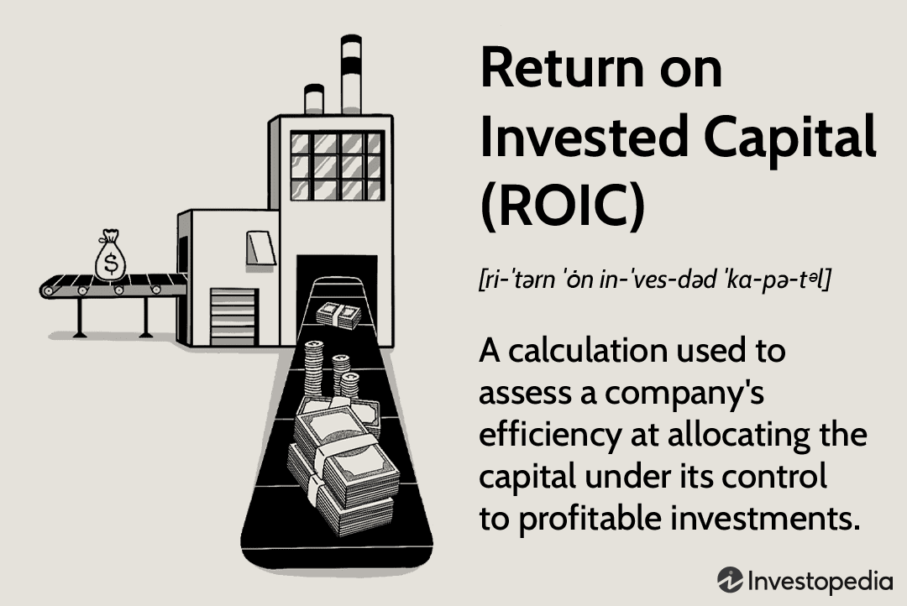

Return on Invested Capital (ROIC) is a fundamental financial metric that assesses a company's ability to efficiently allocate its capital towards generating profitable returns. This metric is crucial for investors and traders, particularly those engaged in algorithmic trading strategies that depend on precise financial indicators. By examining ROIC, individuals can gain valuable insights into a company's operational effectiveness and profitability, making it an essential tool for informed decision-making.

The significance of ROIC has amplified in modern investment strategies, where it is increasingly integrated into algorithmic trading. Such trading systems, driven by complex algorithms, leverage metrics like ROIC to enhance decision-making processes. ROIC provides a streamlined approach to evaluating a company's capital efficiency, thus allowing traders to develop strategies that can potentially yield higher profits.



This article aims to illuminate the methodology behind ROIC and its practical application in algorithmic trading as a measure of capital effectiveness. By understanding ROIC, traders can better assess how well a company utilizes its capital to generate returns, forming the basis for strategy development and optimization. As algorithmic trading continues to evolve, the use of ROIC offers a robust framework for targeting companies that demonstrate superior capital allocation, potentially refining trading strategies and outcomes.

## Table of Contents

## Understanding Return on Invested Capital (ROIC)

Return on Invested Capital (ROIC) is a vital metric in financial analysis, assessing a company's proficiency in converting invested capital into profitable returns. It acts as a barometer of operational effectiveness and offers insights into the company’s financial health. ROIC is often used to determine how well a company is using its funds to generate returns and to compare efficiency between similar entities.

The formula for calculating ROIC is straightforward:

$$
\text{ROIC} = \frac{\text{NOPAT}}{\text{Invested Capital}}
$$

**Net Operating Profit After Tax (NOPAT)** is a key component of this formula. It represents the profit generated from a company's core operations after accounting for taxes, but it excludes financing costs and non-operating gains or losses. This provides a clearer picture of the company’s profitability from its primary business activities by isolating the operational performance from external financial influences. Essentially, NOPAT ensures that the focus remains on the earnings generated purely from operational efficiency, excluding extraneous financial maneuvers.

**Invested Capital** constitutes the total funds deployed by equity investors and debt holders necessary for the company’s growth and operational needs. It is important to include both equity and debt sources in this measure, as they collectively represent the capital at the company's disposal for generating NOPAT. By accounting for all sourced funds, Invested Capital allows stakeholders to assess how effectively a company employs all its resources to drive profitability.

A crucial aspect of interpreting ROIC is comparing it with the company’s Weighted Average Cost of Capital (WACC). If a company’s ROIC exceeds its WACC, it typically suggests that the company is generating value over and above the cost of its capital. This differential indicates effective capital utilization, as the earnings generated surpass the expense of used capital resources, ultimately signaling potential value creation for shareholders.

In practice, ROIC is a valuable metric for investors and analysts seeking to evaluate the efficiency of a company’s capital allocation strategies. It provides a lens to judge whether the management is deploying resources in a manner that will yield sustainable financial performance. Furthermore, it serves as a benchmark for comparing companies within the same industry, illuminating which firms are likely to sustain profitability through superior management of their invested capital.

## Calculating ROIC and Its Key Components

To accurately calculate Return on Invested Capital (ROIC), it is crucial to understand its two fundamental components: Net Operating Profit After Tax (NOPAT) and Invested Capital. These components together provide a comprehensive view of a company's operational performance and capital efficiency.

**Net Operating Profit After Tax (NOPAT)** is a measure of a company's operating efficiency, representing the after-tax profits generated from its core business operations. It excludes the effects of capital structure and non-operating gains or losses, allowing for a clearer view of the company's profitability from operations alone. NOPAT can be calculated using the following formula:

$$
\text{NOPAT} = \text{Operating Income} \times (1 - \text{Tax Rate})
$$

This formula adjusts the operating income by the tax rate, giving a realistic measure of the operating profits available after mandatory tax obligations are settled.

**Invested Capital** refers to the total amount of capital that has been put into a company for its operational activities. It includes both equity and debt components, capturing the total resources available for generating profits. Invested Capital can be calculated through two primary approaches: asset-based and financing-based.

1. **Asset-Based Approach**: This method considers the total assets required to run the company, excluding non-operational assets. The formula for the asset-based calculation is:

$$
\text{Invested Capital} = \text{Total Assets} - \text{Non-Operating Assets} - \text{Current Liabilities}
$$

2. **Financing-Based Approach**: This focuses on the sources of funds utilized for business operations, incorporating shareholder equity and interest-bearing debt. The formula is:

$$
\text{Invested Capital} = \text{Total Debt} + \text{Shareholder's Equity}
$$

Both methods aim to encapsulate the full extent of financial resources dedicated to operational undertakings, thereby determining the investable capital base necessary for value creation.

**Accurate computation** of ROIC involves integrating these elements into the ROIC formula, which is expressed as:

$$
\text{ROIC} = \frac{\text{NOPAT}}{\text{Invested Capital}}
$$

This ratio indicates how effectively a company is using its invested capital to generate profits. A higher ROIC suggests a business model that efficiently employs both physical and financial assets, enhancing its capability to create value.

By calculating ROIC accurately, investors can more effectively differentiate between companies with efficient operational models and those with less successful strategies, thereby making more informed investment decisions.

## ROIC as a Benchmark in Investment Decisions

Return on Invested Capital (ROIC) is an indispensable metric for evaluating and comparing a company's efficiency in utilizing its invested capital to generate profits. It serves as a vital benchmark for investors, offering insights into the operational proficiency and strategic management of a firm relative to its peers and broader market performance. As an indicator, ROIC reflects the effectiveness of a company's management in employing its capital resources, highlighting the potential for quality management practices and maximizing returns. 

Incorporating ROIC into [algorithmic trading](/wiki/algorithmic-trading) systems can significantly enhance decision-making processes. These systems can analyze and identify companies exhibiting high capital efficiency, allowing traders to select investments that align with their strategic goals. For instance, an algorithmic strategy might involve filtering companies based on a predetermined ROIC threshold, thus optimizing investment decisions by ensuring capital is allocated to businesses that demonstrate superior return potential. 

The use of ROIC as a metric in trading strategies allows traders to base their decisions on empirical data, offering a robust framework for aligning investment approaches with current market dynamics and trends. This data-driven approach aids in the identification of well-managed companies and sectors that consistently outperform, providing traders with a strategic edge in market operations. Through these strategies, traders can potentially enhance their return prospects by focusing on entities that effectively utilize capital resources to foster profitability and growth.

## Algorithmic Trading and the Role of ROIC

Algorithmic trading relies on executing trades using automated systems that leverage financial metrics such as Return on Invested Capital (ROIC) to gain a competitive edge in the markets. ROIC provides significant advantages by allowing traders to assess how efficiently a company utilizes its invested capital to generate profits. This efficiency can influence several key aspects of algorithmic trading, including market entry timing, asset allocation decisions, and the identification of lucrative trading opportunities.

Firstly, ROIC can fine-tune the timing of market entry and [exit](/wiki/exit-strategy) in trading algorithms. By analyzing a company's capital efficiency, trading systems can predict potential market movements and adjust position timing accordingly. For example, an algorithm that detects a high ROIC may suggest an earlier market entry, anticipating superior performance due to the effective use of capital resources. Conversely, a declining ROIC might indicate a potentially unfavorable environment, prompting the algorithm to delay entry or exit existing positions.

Furthermore, ROIC is valuable in asset allocation decisions within trading algorithms. By evaluating companies based on their ROIC, algorithms can allocate more resources to those demonstrating superior capital management. This strategic allocation enhances portfolio performance by prioritizing investments with greater potential for returns, guided by empirical data pointing to capital efficiency.

Python and other programming languages enable traders to automate the calculation and integration of ROIC into their trading strategies. Below is a simple example of how ROIC can be calculated and used to filter companies in a Python-based trading algorithm:

```python
def calculate_roic(nopat, invested_capital):
    return nopat / invested_capital

# Sample data (in millions)
company_data = {
    'CompanyA': {'NOPAT': 50, 'Invested_Capital': 200},
    'CompanyB': {'NOPAT': 60, 'Invested_Capital': 300},
    'CompanyC': {'NOPAT': 30, 'Invested_Capital': 120}
}

roic_threshold = 0.2  # Example threshold
selected_companies = []

for company, data in company_data.items():
    roic = calculate_roic(data['NOPAT'], data['Invested_Capital'])
    if roic > roic_threshold:
        selected_companies.append(company)

print("Selected Companies:", selected_companies)
```

Incorporating ROIC into algorithmic trading frameworks allows for comprehensive comparative analysis and exploitation of market inefficiencies. By systematically evaluating a company's ability to generate returns on invested capital, algorithms can discern which firms are positioned for continued growth and profitability. This systematic approach aids in constructing investment strategies that align with market dynamics, thereby optimizing returns.

Ultimately, ROIC serves as a critical metric within algorithmic trading, providing traders with insights into capital efficiency that can significantly influence strategy execution and performance. Its integration into trading systems enhances decision-making, helping traders to capitalize on market opportunities with a robust, data-driven foundation.

## Case Study: ROIC in Sector-Specific Algorithmic Trading

The Medical Distribution industry provides an excellent example of how Return on Invested Capital (ROIC) can be leveraged in sector-specific algorithmic trading. This industry is characterized by its relatively high average ROIC, which reflects its potential for efficient capital management and profitable investment opportunities. Traders and investors often focus on companies exhibiting robust ROIC figures to predict profitability and growth potential, as these metrics highlight firms with effective capital allocation.

In algorithmic trading, strategies can be developed to filter companies based on their ROIC, ensuring that only those with capital efficiency above a predefined threshold are selected. This process involves implementing mechanisms within trading algorithms to conduct real-time analyses of financial statements and ascertain whether a company's ROIC meets the desired criteria.

Python, a common programming language used in algorithmic trading, can aid in this task. By using the `pandas` library for data manipulation and `numpy` for numerical operations, traders can automate ROIC computation as follows:

```python
import pandas as pd
import numpy as np

# Sample data to illustrate ROIC calculation
data = {
    'Company': ['A', 'B', 'C'],
    'NOPAT': [500000, 700000, 650000],
    'Invested_Capital': [2000000, 2500000, 3000000]
}

# Create DataFrame
df = pd.DataFrame(data)

# Function to calculate ROIC
def calculate_roic(nopat, invested_capital):
    return (nopat / invested_capital) * 100

# Apply function and add ROIC column
df['ROIC'] = np.vectorize(calculate_roic)(df['NOPAT'], df['Invested_Capital'])

# Filtering companies with ROIC above a threshold, e.g., 20%
roic_threshold = 20
filtered_companies = df[df['ROIC'] > roic_threshold]

# Display filtered companies
print(filtered_companies)
```

This code, a simplified illustration, performs a basic ROIC calculation and filters companies based on an ROIC threshold. Such sector-specific insights, when combined with ROIC analysis, enhance algorithmic trading by offering more targeted investment opportunities. By optimizing resource allocation towards high ROIC firms within the Medical Distribution sector, traders can potentially maximize returns in the financial markets.

Furthermore, these approaches ensure that trading strategies align with sector characteristics, which is crucial in markets where high ROIC is a prevalent attribute. Financial markets that display high ROIC are often seen as more stable and prosperous, making them attractive targets for algorithmic strategies. By focusing on these parameters, traders can enhance their prediction models, improve decision-making, and potentially achieve superior returns.

## Challenges and Limitations of Using ROIC

Return on Invested Capital (ROIC) serves as a critical indicator of capital efficiency, yet it possesses several limitations that must be considered when utilizing it for investment evaluation. The primary challenge of using ROIC lies in its varying applicability across different sectors. Industries with substantial capital requirements, such as manufacturing or utilities, often present lower ROIC values due to the high levels of invested capital required. Conversely, sectors characterized by minimal capital outlay, such as technology or service industries, can exhibit higher ROIC figures, not necessarily indicating superior operational efficiency but rather a lighter capital framework.

Furthermore, the sensitivity of ROIC to accounting practices introduces complexities in its interpretation. Different companies may apply diverse accounting standards and principles, affecting the calculation of components such as Net Operating Profit After Tax (NOPAT) and Invested Capital. This variation can lead to discrepancies, making direct comparisons between companies problematic without considering individual accounting methodologies.

To address these challenges and achieve a more comprehensive financial analysis, it is beneficial to integrate ROIC with other financial metrics. By considering Return on Equity (ROE), EBITDA margin, and Free Cash Flow in conjunction with ROIC, investors can gain a fuller picture of a company's financial health and performance. Such an integrated approach helps in overcoming the sector-specific and accounting variability associated with ROIC, allowing for a more nuanced comparison of capital efficiency across different businesses.

Despite these limitations, ROIC remains a valuable tool for assessing capital utilization when placed within the appropriate context. Understanding the sector-specific implications and the impact of accounting practices enables investors to extract meaningful insights from ROIC, informing strategic investment decisions and optimizing financial outcomes.

## Conclusion

Return on Invested Capital (ROIC) stands as a pivotal metric within both traditional financial analysis and the fast-evolving domain of algorithmic trading. ROIC offers a distinct perspective, enabling investors to evaluate the efficiency with which a company utilizes its capital to generate value. This metric assesses a company's operational effectiveness by comparing its net operating profit after taxes (NOPAT) to the invested capital, thereby providing insights into the firm's capability to produce profitable returns from its capital base.

Incorporating ROIC into algorithmic trading models significantly enhances trading performance. Algorithmic traders, equipped with the precision of automated systems, can strategically target companies exhibiting robust capital allocation practices. By integrating ROIC thresholds into trading algorithms, traders can filter and select investments based on quantitative assessments of capital efficiency, thereby potentially increasing profitability and reducing risk.

As the dynamics of financial markets continue to advance, ROIC's role within algorithmic systems is poised for growth. Its integration leads to more nuanced interpretations of market data, thereby refining strategies and improving trading outcomes. The adaptability and reliability of ROIC in assessing varying business environments and capital structures further cement its utility in a diverse array of investment scenarios.

In conclusion, ROIC presents investors with a decisive tool to make informed investment decisions. It serves as a benchmark for analyzing a company's ability to generate returns from its invested capital, thus optimizing return potential. In the rapidly changing landscape of financial markets, the importance of ROIC is set to escalate, offering clarity and depth to investment strategies that balance risk with opportunity.

## References & Further Reading

"The Little Book That Still Beats the Market" by Joel Greenblatt offers insights into investment strategies that consistently outperform the market, focusing on the importance of financial metrics like ROIC. Greenblatt presents a straightforward approach aiming for above-average investment returns through value investing principles, making it a valuable resource for understanding the practical application of ROIC.

Wall Street Mojo's article on "Return on Invested Capital (ROIC): Meaning, Formula, and Calculation" provides a thorough explanation of ROIC. It includes the formula $\text{ROIC} = \frac{\text{NOPAT}}{\text{Invested Capital}}$, assisting readers in grasping the essential components and implications of this metric for assessing business performance.

"The Intelligent Investor: The Definitive Book on Value Investing" by Benjamin Graham emphasizes the importance of analyzing financial ratios, including ROIC, as part of a comprehensive strategy for value investing. Graham's work remains influential, stressing disciplined and rational approaches to investing.

"Investment Valuation: Tools and Techniques for Determining the Value of Any Asset" by Aswath Damodaran, part of the Wiley Finance series, investigates into various methods for asset valuation. Damodaran's book serves as a critical reference for understanding how ROIC fits within broader valuation techniques, offering methodologies and tools essential for thorough financial analysis.

"Quality Minus Junk," a study by Asness, C. S., Frazzini, A., & Pedersen, L. H., explores the performance of high-quality companies over lower-quality ones. The research highlights ROIC as a measure of quality, examining its role in identifying companies capable of generating superior returns, thereby informing investment strategy development.

Morningstar's "Measuring Economic Moats: Identifying Companies with a Competitive Advantage" outlines methodologies for assessing a company's competitive edge. The integration of ROIC as a metric for identifying economic moats aids investors in determining businesses with sustainable profitability and long-term growth potential.

"Principles for Navigating Big Debt Crises" by Ray Dalio examines the impacts of debt on economies and businesses. Dalio's principles provide context for understanding how companies can effectively manage and allocate capital in times of financial distress, with ROIC serving as a benchmark for assessing resilience.

"The Little Book of Valuation: How to Value a Company, Pick a Stock and Profit" by Aswath Damodaran acts as a guide for evaluating companies and making informed stock picks. It includes discussions on ROIC, offering insights into how investors can integrate this metric into their valuation assessments and investment decisions.

