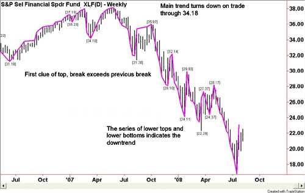

Algorithmic trading has become a cornerstone of the modern investment landscape, leveraging advanced technologies and methodologies to enhance trading performance and efficiency. At its core, algorithmic trading involves the use of computer programs to execute trades based on predefined criteria, utilizing strategies such as trend-following, mean reversion, and sentiment analysis. This approach allows for the execution of large volumes of trades at speeds and frequencies that are impossible for human traders alone, thereby optimizing market opportunities and minimizing costs.

Critical components of algorithmic trading are data analysis, execution, and risk management. Data analysis is crucial as it enables the identification of trading opportunities and the development of effective strategies. By analyzing historical price data along with macroeconomic indicators, traders can uncover patterns and make informed predictions. Execution involves the mechanics of entering and exiting trades to achieve optimal results, typically employing strategies that ensure the best possible prices are obtained. Risk management, on the other hand, focuses on identifying, assessing, and mitigating potential risks that could adversely affect trading performance. Techniques such as stop-loss orders and position sizing are often employed to manage risk effectively.



Strategies play a pivotal role in algorithmic trading. Trend-following strategies, for instance, attempt to capitalize on market movements by buying an asset when its price is trending upwards and selling when it trends downwards. Mean reversion strategies operate on the premise that asset prices will revert to a mean over time, allowing traders to profit from price corrections. Sentiment analysis incorporates the evaluation of market sentiment derived from news, social media, and other public forums, guiding trading decisions based on the collective mood and opinions of market participants.

The importance of data in shaping algorithmic strategies cannot be overstated. High-quality, granular data enables more precise modeling and prediction of market movements. Advances in big data technology and the increasing availability of diverse datasets have empowered traders to create sophisticated models that incorporate a wide array of variables, leading to more nuanced and successful trading strategies.

Technology serves as the backbone of algorithmic trading, enhancing efficiency and performance. Through the use of high-frequency trading systems, machine learning models, and artificial intelligence, traders can process vast amounts of data in real time and execute transactions within milliseconds. Such advancements allow for continuous learning and adaptation of trading models, ensuring that they remain effective in the ever-evolving market conditions.

In summary, algorithmic trading integrates complex data analysis, strategic execution, and comprehensive risk management to optimize investment strategies and improve trading performance in the contemporary financial markets. By harnessing the power of technology and data, traders can achieve a competitive edge, positioning themselves for success in the dynamic world of finance.

## Table of Contents

## Investment Strategies and Technical Analysis

Investment strategies that focus on technical analysis rely heavily on the study of historical market data and price patterns to forecast future price movements. This analysis is a cornerstone of [algorithmic trading](/wiki/algorithmic-trading), where automated systems execute trades based on predefined rules derived from such analyses.

### Technical Indicators in Algorithmic Trading

Technical indicators are mathematical calculations that are based on historical pricing and [volume](/wiki/volume-trading-strategy) information. They are essential tools for traders looking to enter or [exit](/wiki/exit-strategy) positions. Common technical indicators include:

1. **Moving Averages (MA):** These smooth out price data to identify trends over a specific period. The Simple Moving Average (SMA) and Exponential Moving Average (EMA) are widely used variants.
$$
   \text{SMA} = \frac{P_1 + P_2 + \ldots + P_n}{n}

$$

   where $P$ represents the price at each of the n periods.

2. **Relative Strength Index (RSI):** This momentum oscillator measures the speed and change of price movements, typically used to identify overbought or oversold conditions.
$$
   \text{RSI} = 100 - \frac{100}{1 + \frac{\text{average gain}}{\text{average loss}}}

$$

3. **Bollinger Bands:** These consist of a middle band (usually a 20-day SMA), an upper band, and a lower band that are standard deviations away from the middle band. They provide insights into volatility and potential price reversals.

### Backtesting, Optimization, and Implementation

Algorithmic traders extensively utilize [backtesting](/wiki/backtesting) to validate strategies against historical data before deploying them in live market conditions. This process involves applying the strategy to past data and assessing its performance. Python, with libraries like `pandas` and `[backtrader](/wiki/backtrader)`, is frequently used for such purposes:

```python
import backtrader as bt

class MyStrategy(bt.Strategy):
    def next(self):
        if self.data.close[0] > self.data.close[-1]:
            self.buy()  # example logic

cerebro = bt.Cerebro()
cerebro.addstrategy(MyStrategy)
cerebro.run()
```

Optimization involves fine-tuning parameters in trading strategies, such as the look-back period for a moving average, to enhance performance metrics like return on investment or Sharpe ratio.

### Benefits and Limitations of Technical Analysis

Technical analysis provides several advantages, such as the ability to detect trends and reversals, which can be particularly useful in a volatile market environment. However, its limitations are evident when market conditions change unexpectedly due to non-quantitative factors like geopolitical events, making purely technical approaches challenging.

### Complementing Technical Analysis with Quantitative and Machine Learning Techniques

Technical analysis is often integrated with quantitative models to enhance predictive accuracy. For instance, [machine learning](/wiki/machine-learning) techniques like neural networks can process vast amounts of data and identify complex patterns in market behavior beyond human capacity. These systems learn from historical and real-time inputs, continuously refining their predictions.

In summary, technical analysis forms a crucial backbone for many algorithmic trading strategies through the use of sophisticated indicators, rigorous backtesting, and embracing technological enhancements like machine learning. This fusion enables the development of robust strategies that are more adept at navigating the ever-evolving financial markets.

## Short Selling

Short selling is a trading strategy where an investor sells a security that they do not own, with the intention of buying it back later at a lower price. This strategy is primarily used for speculative motives, anticipating a decline in the security's price, as well as for hedging, to protect against potential losses in a long position.

The unique risks and considerations associated with short selling are manifold. One of the primary risks is the potential for unlimited losses. Unlike buying a stock, where the maximum loss is the invested amount, short selling exposes traders to losses exceeding the initial selling price if the stock price increases significantly. Additionally, short sellers must account for the costs of borrowing the securities they wish to short and may face margin calls if the market moves adversely.

Identifying short candidates involves both technical and [fundamental analysis](/wiki/fundamental-analysis). Technical analysis seeks to identify overbought conditions, resistance levels, or downward trends that indicate a temporary price inflation. Common indicators include the Relative Strength Index (RSI) and Bollinger Bands. Meanwhile, fundamental analysis evaluates a company's financial health and market position, aiming to identify overvalued stocks, potential financial distress, or deteriorating competitive advantages.

Market sentiment and news events heavily influence short selling strategies. Positive news can drive prices upward sharply, squeezing short sellers and increasing losses—an occurrence known as a "short squeeze." Conversely, negative news or unfavorable economic data can reinforce a short position's profitability.

Effective risk management and timely strategic exits are crucial in short selling. Employing stop-loss orders can automatically close short positions at predetermined unfavorable price levels, curbing potential losses. Position sizing is also essential, ensuring that any single short position does not jeopardize overall portfolio stability.

Understanding and managing these factors enhances the chance of success in short selling while reducing potential pitfalls associated with this high-risk strategy.

## Algorithmic Trading

Algorithmic trading refers to the method of executing trades in the financial markets using automated systems based on predefined rules and sophisticated algorithms. These systems analyze vast amounts of data at high speeds to make trading decisions, enabling investors and financial institutions to optimize their trading operations and reduce manual intervention.

Key advantages of algorithmic trading compared to traditional methods include its ability to process information and execute trades with high speed and accuracy. Traditional trading relies heavily on human efforts, which are often slower and more prone to errors. In contrast, algorithmic systems can analyze market conditions, determine optimal buy or sell signals, and execute trades in a fraction of a second. Additionally, by minimizing human emotions and biases, algorithmic trading can improve decision-making processes and reduce the impact of emotional trading decisions.

The industry is witnessing several trends revolving around automation, data analysis, and decision-making. Automation allows for the continuous monitoring of markets, enabling the execution of strategies without the need for constant human supervision. Enhanced data analysis capabilities, driven by big data technologies, enable traders to extract meaningful insights from vast data sets, while state-of-the-art decision-making models leverage these insights to optimize trading strategies.

Popular algorithmic trading strategies include [arbitrage](/wiki/arbitrage) and trend-following. Arbitrage strategies involve the simultaneous purchase and sale of an asset across different markets to exploit price discrepancies for a risk-free profit. For example, if a stock is trading at different prices on two exchanges, an algorithm can quickly act to buy the stock at a lower price and sell it at a higher price on another exchange. Meanwhile, trend-following strategies aim to capitalize on existing market trends by generating buy or sell signals based on historical price data and technical indicators.

The integration of machine learning and [artificial intelligence](/wiki/ai-artificial-intelligence) has further enhanced the capabilities of algorithmic trading. Machine learning models can identify patterns in large datasets and make predictions that outperform traditional statistical methods. For instance, by using supervised learning algorithms, traders can train models on historical price data to forecast future price movements. Additionally, [reinforcement learning](/wiki/reinforcement-learning) provides algorithms the ability to learn optimal trading strategies through trial and error, adapting to changing market conditions autonomously.

Python is a popular language for developing algorithmic trading models due to its extensive libraries and frameworks for data analysis, machine learning, and quantitative finance. The following Python code snippet provides a simple example of a moving average crossover strategy, a basic form of trend-following strategy:

```python
import pandas as pd
import numpy as np

# Example stock price data
data = {'Date': ['2023-01-01', '2023-01-02', '2023-01-03', '2023-01-04', '2023-01-05'],
        'Price': [100, 102, 104, 108, 110]}
df = pd.DataFrame(data)
df['Date'] = pd.to_datetime(df['Date'])
df.set_index('Date', inplace=True)

# Calculate moving averages
df['SMA_10'] = df['Price'].rolling(window=10, min_periods=1).mean()
df['SMA_20'] = df['Price'].rolling(window=20, min_periods=1).mean()

# Signal generation
df['Signal'] = np.where(df['SMA_10'] > df['SMA_20'], 1, 0)

print(df)
```

This example calculates two simple moving averages (SMA_10 and SMA_20) for a given dataset and generates a buy signal (`Signal = 1`) when the shorter-term moving average (SMA_10) crosses above the longer-term moving average (SMA_20).

In conclusion, algorithmic trading revolutionizes the way financial markets operate by leveraging computational power and advanced algorithms. As technology continues to advance, it is expected that algorithmic trading will further transform investment strategies, offering improved accuracy, efficiency, and profitability.

## Risk Management and Ethical Considerations

Algorithmic trading plays a pivotal role in modern financial markets, necessitating robust risk management and a strong ethical foundation. Effective risk management techniques, such as stop-loss orders and position sizing, are essential in mitigating potential financial losses. 

Stop-loss orders serve as a critical tool to automatically execute a trade at a predetermined price, thus limiting potential losses. This strategy protects investments by exiting a position before losses exceed a pre-defined threshold. Position sizing, on the other hand, determines the amount of capital to allocate to each trade. It is based on the trader's risk tolerance and market conditions, ensuring a diversified and balanced portfolio. The formula for position sizing might involve the Kelly criterion, which balances the probability of winning and losing to maximize capital growth:

$$
f^* = \frac{bp - q}{b}
$$

where $f^*$ is the fraction of capital to bet, $b$ is the odds received on the wager, $p$ is the probability of a win, and $q = 1 - p$ is the probability of a loss.

Ethical considerations have gained prominence in algorithmic trading due to its potential influence on market integrity and investor trust. Regulations such as the Markets in Financial Instruments Directive (MiFID II) in the European Union aim to enhance transparency, improve investor protection, and prevent market abuse. Compliance with these regulations is crucial for fostering fair and transparent trading environments.

Technological advancements have facilitated the development of platforms and tools that enhance transparency and ethical practices in trading. For instance, blockchain technology offers a decentralized and immutable ledger system that can improve transparency and traceability. Similarly, algorithmic audits and real-time surveillance systems can monitor trading activities to detect and prevent unethical practices.

Compliance challenges remain a common concern for algorithmic traders. Navigating the complex regulatory landscape requires comprehensive understanding and implementation of compliance measures. This includes maintaining rigorous documentation, conducting regular audits, and ensuring that trading algorithms operate within legal boundaries.

Ethical responsibility rests on traders to uphold fairness, integrity, and transparency. This involves avoiding market manipulation, ensuring that algorithms do not exploit market inefficiencies at the expense of other participants, and being mindful of the broader social impact of trading decisions.

In conclusion, effective risk management, coupled with ethical trading practices, is essential for sustainable success in algorithmic trading. Utilizing advanced technologies, adhering to regulations, and prioritizing ethical considerations can mitigate risks and foster a responsible trading environment.

## Conclusion

In summary, the landscape of investment strategies, technical analysis, and algorithmic trading is rich with opportunities for optimizing decision-making processes and improving financial outcomes. A key takeaway is the synergy between technology and trading, which has revolutionized how market data is analyzed and trades are executed. Technologies such as machine learning and artificial intelligence play a pivotal role, enabling traders to identify patterns and predict market movements with increased accuracy.

Continuous learning and adaptation are crucial in the ever-evolving financial markets. Staying informed about the latest tools and methodologies allows traders to refine their strategies and respond effectively to market dynamics. Additionally, the importance of well-researched decision-making cannot be overstated. Analyzing various data points, incorporating both technical and fundamental analyses, and conducting thorough backtesting are essential steps to ensure robust strategies that can withstand market [volatility](/wiki/volatility-trading-strategies).

Technology has undeniably transformed investment strategies, offering unparalleled access to data and sophisticated analytics. The automation of trading through algorithms ensures swift execution and the ability to capitalize on fleeting market opportunities. By leveraging these technologies, traders can enhance their performance, reduce manual errors, and make more informed decisions.

Looking forward, the trend towards greater integration of artificial intelligence and machine learning in trading strategies is expected to continue. These advancements promise to offer deeper insights, improved risk management, and more adaptive trading systems that can learn and evolve. Moreover, as regulatory landscapes change, ethical considerations and compliance will remain critical, guiding responsible trading practices.

In conclusion, the exploration of investment strategies, technical analysis, and algorithmic trading underscores a vibrant field marked by technological advancements and continuous innovation. For traders and investors, embracing these changes, committing to informed decision-making, and staying adaptable will be key to success in an increasingly complex financial environment.

## References & Further Reading

[1]: Bergstra, J., Bardenet, R., Bengio, Y., & Kégl, B. (2011). ["Algorithms for Hyper-Parameter Optimization."](https://papers.nips.cc/paper/4443-algorithms-for-hyper-parameter-optimization) Advances in Neural Information Processing Systems 24.

[2]: ["Advances in Financial Machine Learning"](https://www.amazon.com/Advances-Financial-Machine-Learning-Marcos/dp/1119482089) by Marcos Lopez de Prado

[3]: ["Evidence-Based Technical Analysis: Applying the Scientific Method and Statistical Inference to Trading Signals"](https://www.amazon.com/Evidence-Based-Technical-Analysis-Scientific-Statistical/dp/0470008741) by David Aronson

[4]: ["Machine Learning for Algorithmic Trading"](https://github.com/stefan-jansen/machine-learning-for-trading) by Stefan Jansen

[5]: ["Quantitative Trading: How to Build Your Own Algorithmic Trading Business"](https://www.amazon.com/Quantitative-Trading-Build-Algorithmic-Business/dp/1119800064) by Ernest P. Chan