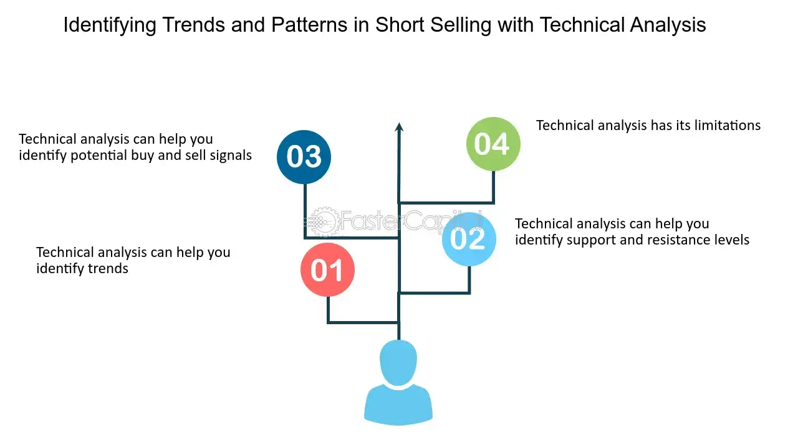

## Table of Contents

## What is short-selling and how does it work?

Short-selling is when someone borrows shares of a stock from a broker and then sells those shares on the market, hoping to buy them back later at a lower price. The goal is to make money from a stock's price going down. For example, if you think a company's stock price will drop, you can short-sell it. You borrow the stock, sell it at the current price, and then, if the price does drop, you buy it back cheaper and return the borrowed shares to the broker. The difference between the selling price and the buying price is your profit.

However, short-selling can be risky. If the stock price goes up instead of down, you will lose money. You have to buy back the shares at a higher price to return them to the broker, and that can lead to big losses. Also, there's no limit to how much the stock price can rise, so your potential losses can be unlimited. Because of these risks, short-selling is usually done by experienced investors who understand the market well and are willing to take on the extra risk.

## What are the basic principles of technical analysis?

Technical analysis is a way to study the stock market by looking at charts and past price movements. The main idea is that history tends to repeat itself, so by studying past patterns, you can guess what might happen next. People who use technical analysis believe that all the important information about a stock is already shown in its price and trading volume. They don't worry too much about the company's news or financial reports. Instead, they focus on finding patterns and trends in the stock's price chart.

One key principle of technical analysis is the concept of support and resistance. Support is a price level where a stock often stops falling and starts to go up again. Resistance is the opposite; it's a price level where a stock often stops rising and starts to go down. These levels help traders decide when to buy or sell. Another important principle is the use of indicators, like moving averages, which smooth out price data to show trends over time. Traders use these indicators to make decisions about when to enter or exit a trade.

Overall, technical analysis is all about using past price data to predict future price movements. It's a tool that many traders use to try to make better decisions in the stock market. While it's not perfect and doesn't work all the time, it can be helpful for understanding market trends and making more informed trading choices.

## How can technical analysis be used to identify potential short-selling opportunities?

Technical analysis can help find good times to short-sell by looking at charts and patterns. When you see a stock's price going down and breaking through a support level, it might be a sign that the price will keep falling. This is called a "breakdown." If you notice this happening, you might want to short-sell the stock, hoping to buy it back at a lower price later. Another thing to watch for is when a stock's price makes lower highs and lower lows over time. This shows that the stock is in a downtrend, which could be a good time to short-sell.

You can also use indicators like the Relative Strength Index (RSI) to find short-selling opportunities. If the RSI goes above 70, it means the stock might be overbought, and its price could soon drop. This could be another signal to short-sell. Moving averages can help too. If a shorter-term moving average, like the 50-day, crosses below a longer-term moving average, like the 200-day, it's called a "death cross." This can be a strong sign that the stock's price will keep going down, making it a good time to short-sell. By using these tools and watching for these patterns, you can spot potential short-selling opportunities in the market.

## What are common technical indicators used for short-selling?

Technical indicators can help you find good times to short-sell a stock. One popular indicator is the Relative Strength Index (RSI). When the RSI goes above 70, it means the stock might be overbought, and its price could soon drop. This can be a signal to short-sell. Another useful indicator is the Moving Average Convergence Divergence (MACD). If the MACD line crosses below the signal line, it suggests that the stock's price might keep falling, which could be another sign to short-sell.

Moving averages are also important for finding short-selling opportunities. When a shorter-term moving average, like the 50-day, crosses below a longer-term moving average, like the 200-day, it's called a "death cross." This can be a strong sign that the stock's price will keep going down, making it a good time to short-sell. By watching these indicators, you can spot patterns that suggest a stock's price might fall, helping you decide when to short-sell.

## How do you interpret chart patterns that suggest a stock might be a good short-selling candidate?

Chart patterns can tell you a lot about whether a stock might be a good one to short-sell. One common pattern to look for is a "head and shoulders" pattern. It looks like a person's head with two shoulders on either side. When you see this pattern, it often means that the stock's price is about to go down. Another pattern is a "double top," which looks like two peaks at about the same level. If the stock's price falls below the lowest point between these two peaks, it's a sign that the price might keep falling, making it a good time to short-sell.

Another important thing to watch is when a stock breaks through its support level. Support is a price where the stock usually stops falling and starts going up again. If the stock's price goes below this level, it's called a "breakdown." This can be a strong sign that the stock's price will keep dropping, which could be a good time to short-sell. Also, if you see the stock making lower highs and lower lows over time, it means the stock is in a downtrend. This is another sign that it might be a good stock to short-sell because the price is likely to keep going down.

## What role do volume and volatility play in short-selling decisions?

Volume and [volatility](/wiki/volatility-trading-strategies) are important when you're thinking about short-selling a stock. Volume is how many shares of the stock are being traded. If you see the volume going up when the stock's price is going down, it can be a good sign that more people are selling the stock. This can mean that the price might keep falling, which could be a good time to short-sell. On the other hand, if the volume is low, it might be harder to borrow the shares you need to short-sell, and the price might not move as much as you expect.

Volatility is how much the stock's price moves up and down. If a stock is very volatile, its price can change a lot in a short time. This can be good for short-sellers because big price drops can happen quickly, giving you a chance to make more money. But it's also riskier because the price can go up just as fast, leading to big losses. So, when you're thinking about short-selling, you need to look at both the volume and the volatility of the stock to make a smart decision.

## How can moving averages help in identifying short-selling opportunities?

Moving averages can help you spot good times to short-sell a stock by showing you the overall trend of the stock's price. A moving average is a line on a chart that smooths out the price data over time. If you see a short-term moving average, like the 50-day moving average, crossing below a long-term moving average, like the 200-day moving average, it's called a "death cross." This can be a strong sign that the stock's price is going to keep going down. When you see this happen, it might be a good time to short-sell because the stock is likely to keep falling.

Another way moving averages can help is by showing you when a stock breaks through its support level. Support is a price where the stock usually stops falling and starts going up again. If the stock's price goes below this level and stays below the moving average, it's a sign that the price might keep dropping. This can be another good time to short-sell because the stock is showing signs of a continued downward trend. By watching these moving averages, you can make better decisions about when to short-sell a stock.

## What are the risks associated with short-selling based on technical analysis?

Short-selling based on technical analysis can be risky because it's not always right. Even if you see a pattern that looks like the stock's price will go down, it might not happen. The stock's price can go up instead, and if it does, you will lose money. You have to buy back the shares at a higher price to return them to the broker, and that can lead to big losses. Also, there's no limit to how much the stock price can rise, so your potential losses can be unlimited. This makes short-selling very risky, even when you use technical analysis to guide your decisions.

Another risk is that technical analysis depends a lot on past data, and the stock market can change quickly because of new news or events. If something unexpected happens, like a company announcing good news, the stock's price can go up even if the technical indicators suggested it would go down. This can catch short-sellers off guard and lead to losses. Also, if a lot of people are short-selling the same stock, and the price starts to go up, it can cause a "short squeeze." This is when short-sellers rush to buy back the stock to cut their losses, pushing the price up even more. So, while technical analysis can be helpful, it's important to remember these risks when you're thinking about short-selling.

## How can advanced technical tools like Fibonacci retracement levels assist in short-selling?

Fibonacci retracement levels can help you find good times to short-sell a stock by showing you where the stock's price might go down to after it goes up. These levels are based on a special math pattern called the Fibonacci sequence. You draw lines on the stock's chart at certain percentages like 23.6%, 38.2%, 50%, 61.8%, and 100%. If the stock's price goes up and then starts to fall, it often stops or slows down at one of these levels. If you see the price hitting a Fibonacci level and then starting to go down again, it might be a good time to short-sell because the price could keep falling from there.

Using Fibonacci retracement levels can be tricky, though. They work best when you use them with other tools like moving averages or chart patterns. For example, if the stock's price hits a Fibonacci level and also breaks through a support level or shows a "death cross" with moving averages, it's a stronger sign that the price might keep going down. This can give you more confidence in your decision to short-sell. But remember, even with these tools, there's no guarantee the stock's price will do what you expect, so always be careful and ready for surprises.

## Can you explain how to use momentum indicators like RSI and MACD for short-selling?

Momentum indicators like the Relative Strength Index (RSI) and the Moving Average Convergence Divergence (MACD) can help you find good times to short-sell a stock. The RSI measures how fast a stock's price is moving and if it's being bought or sold a lot. If the RSI goes above 70, it means the stock might be overbought, which means a lot of people have bought it and the price could soon drop. When you see this, it might be a good time to short-sell because you think the price will go down. On the other hand, if the RSI goes below 30, it means the stock might be oversold, and the price could go up soon, so you wouldn't want to short-sell then.

The MACD is another tool that can help you decide when to short-sell. It shows you the difference between two moving averages of a stock's price. If the MACD line crosses below the signal line, it's a sign that the stock's price might start to go down. This can be a good time to short-sell because you think the price will keep falling. But remember, these indicators are not perfect. They can give you false signals, so it's a good idea to use them with other tools like chart patterns or moving averages to make better decisions about when to short-sell.

## How do you combine multiple technical indicators to increase the accuracy of short-selling predictions?

Combining multiple technical indicators can help you make better decisions about when to short-sell a stock. One way to do this is by using the Relative Strength Index (RSI) along with moving averages. If the RSI shows that a stock is overbought (above 70), and at the same time, you see a short-term moving average like the 50-day crossing below a long-term moving average like the 200-day (a "death cross"), it's a stronger sign that the stock's price might go down. This combination gives you more confidence that the stock is likely to fall, making it a good time to short-sell.

Another way to use multiple indicators is by looking at the Moving Average Convergence Divergence (MACD) and chart patterns together. If the MACD line crosses below the signal line, it suggests that the stock's price might start to fall. If you also see a bearish chart pattern like a "head and shoulders" or a "double top" at the same time, it adds more evidence that the stock's price will go down. By using these indicators together, you can get a clearer picture of what might happen to the stock's price, helping you decide when to short-sell with more accuracy.

## What are some real-world examples of successful short-selling using technical analysis?

One famous example of successful short-selling using technical analysis is the case of George Soros and the British pound in 1992. Soros noticed that the pound was overvalued and used technical indicators to time his move. He saw that the pound was breaking through key support levels and showing signs of weakness. Soros shorted the pound, betting that it would fall. His timing was perfect, and when the UK government could no longer defend the pound's value, it crashed. Soros made over a billion dollars from this trade, showing how technical analysis can help spot big opportunities.

Another example is the short-selling of Enron stock before its collapse in 2001. Some traders used technical analysis to spot that Enron's stock was showing bearish patterns like a "head and shoulders" and was breaking through support levels. They also noticed that the stock's price was making lower highs and lower lows, indicating a downtrend. These traders shorted Enron's stock, and when the company's accounting scandals came to light, the stock plummeted. Those who used technical analysis to time their short-selling made significant profits from Enron's downfall.

## What are Investment Strategies and Technical Analysis?

Investment strategies that focus on technical analysis rely heavily on the study of historical market data and price patterns to forecast future price movements. This analysis is a cornerstone of [algorithmic trading](/wiki/algorithmic-trading), where automated systems execute trades based on predefined rules derived from such analyses.

### Technical Indicators in Algorithmic Trading

Technical indicators are mathematical calculations that are based on historical pricing and [volume](/wiki/volume-trading-strategy) information. They are essential tools for traders looking to enter or [exit](/wiki/exit-strategy) positions. Common technical indicators include:

1. **Moving Averages (MA):** These smooth out price data to identify trends over a specific period. The Simple Moving Average (SMA) and Exponential Moving Average (EMA) are widely used variants.
$$
   \text{SMA} = \frac{P_1 + P_2 + \ldots + P_n}{n}

$$

   where $P$ represents the price at each of the n periods.

2. **Relative Strength Index (RSI):** This momentum oscillator measures the speed and change of price movements, typically used to identify overbought or oversold conditions.
$$
   \text{RSI} = 100 - \frac{100}{1 + \frac{\text{average gain}}{\text{average loss}}}

$$

3. **Bollinger Bands:** These consist of a middle band (usually a 20-day SMA), an upper band, and a lower band that are standard deviations away from the middle band. They provide insights into volatility and potential price reversals.

### Backtesting, Optimization, and Implementation

Algorithmic traders extensively utilize [backtesting](/wiki/backtesting) to validate strategies against historical data before deploying them in live market conditions. This process involves applying the strategy to past data and assessing its performance. Python, with libraries like `pandas` and `[backtrader](/wiki/backtrader)`, is frequently used for such purposes:

```python
import backtrader as bt

class MyStrategy(bt.Strategy):
    def next(self):
        if self.data.close[0] > self.data.close[-1]:
            self.buy()  # example logic

cerebro = bt.Cerebro()
cerebro.addstrategy(MyStrategy)
cerebro.run()
```

Optimization involves fine-tuning parameters in trading strategies, such as the look-back period for a moving average, to enhance performance metrics like return on investment or Sharpe ratio.

### Benefits and Limitations of Technical Analysis

Technical analysis provides several advantages, such as the ability to detect trends and reversals, which can be particularly useful in a volatile market environment. However, its limitations are evident when market conditions change unexpectedly due to non-quantitative factors like geopolitical events, making purely technical approaches challenging.

### Complementing Technical Analysis with Quantitative and Machine Learning Techniques

Technical analysis is often integrated with quantitative models to enhance predictive accuracy. For instance, [machine learning](/wiki/machine-learning) techniques like neural networks can process vast amounts of data and identify complex patterns in market behavior beyond human capacity. These systems learn from historical and real-time inputs, continuously refining their predictions.

In summary, technical analysis forms a crucial backbone for many algorithmic trading strategies through the use of sophisticated indicators, rigorous backtesting, and embracing technological enhancements like machine learning. This fusion enables the development of robust strategies that are more adept at navigating the ever-evolving financial markets.

## What are the considerations for risk management and ethics?

Algorithmic trading plays a pivotal role in modern financial markets, necessitating robust risk management and a strong ethical foundation. Effective risk management techniques, such as stop-loss orders and position sizing, are essential in mitigating potential financial losses. 

Stop-loss orders serve as a critical tool to automatically execute a trade at a predetermined price, thus limiting potential losses. This strategy protects investments by exiting a position before losses exceed a pre-defined threshold. Position sizing, on the other hand, determines the amount of capital to allocate to each trade. It is based on the trader's risk tolerance and market conditions, ensuring a diversified and balanced portfolio. The formula for position sizing might involve the Kelly criterion, which balances the probability of winning and losing to maximize capital growth:

$$
f^* = \frac{bp - q}{b}
$$

where $f^*$ is the fraction of capital to bet, $b$ is the odds received on the wager, $p$ is the probability of a win, and $q = 1 - p$ is the probability of a loss.

Ethical considerations have gained prominence in algorithmic trading due to its potential influence on market integrity and investor trust. Regulations such as the Markets in Financial Instruments Directive (MiFID II) in the European Union aim to enhance transparency, improve investor protection, and prevent market abuse. Compliance with these regulations is crucial for fostering fair and transparent trading environments.

Technological advancements have facilitated the development of platforms and tools that enhance transparency and ethical practices in trading. For instance, blockchain technology offers a decentralized and immutable ledger system that can improve transparency and traceability. Similarly, algorithmic audits and real-time surveillance systems can monitor trading activities to detect and prevent unethical practices.

Compliance challenges remain a common concern for algorithmic traders. Navigating the complex regulatory landscape requires comprehensive understanding and implementation of compliance measures. This includes maintaining rigorous documentation, conducting regular audits, and ensuring that trading algorithms operate within legal boundaries.

Ethical responsibility rests on traders to uphold fairness, integrity, and transparency. This involves avoiding market manipulation, ensuring that algorithms do not exploit market inefficiencies at the expense of other participants, and being mindful of the broader social impact of trading decisions.

In conclusion, effective risk management, coupled with ethical trading practices, is essential for sustainable success in algorithmic trading. Utilizing advanced technologies, adhering to regulations, and prioritizing ethical considerations can mitigate risks and foster a responsible trading environment.

## References & Further Reading

[1]: Bergstra, J., Bardenet, R., Bengio, Y., & Kégl, B. (2011). ["Algorithms for Hyper-Parameter Optimization."](https://papers.nips.cc/paper/4443-algorithms-for-hyper-parameter-optimization) Advances in Neural Information Processing Systems 24.

[2]: ["Advances in Financial Machine Learning"](https://www.amazon.com/Advances-Financial-Machine-Learning-Marcos/dp/1119482089) by Marcos Lopez de Prado

[3]: ["Evidence-Based Technical Analysis: Applying the Scientific Method and Statistical Inference to Trading Signals"](https://www.amazon.com/Evidence-Based-Technical-Analysis-Scientific-Statistical/dp/0470008741) by David Aronson

[4]: ["Machine Learning for Algorithmic Trading"](https://github.com/stefan-jansen/machine-learning-for-trading) by Stefan Jansen

[5]: ["Quantitative Trading: How to Build Your Own Algorithmic Trading Business"](https://www.amazon.com/Quantitative-Trading-Build-Algorithmic-Business/dp/1119800064) by Ernest P. Chan