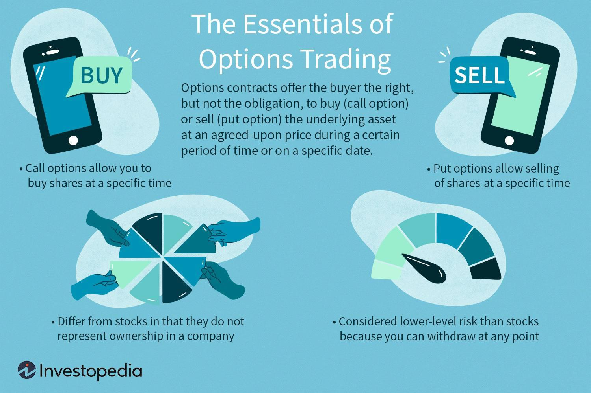

In today's rapidly evolving financial markets, options trading has become an essential tool for both novice and seasoned investors. It provides a versatile platform for hedging risks and speculating on price movements, allowing traders to capitalize on fluctuations in the value of underlying assets. With the rise of algorithmic trading, the precision and efficiency of executing trades have reached unprecedented heights, transforming the landscape of modern finance.

Algorithmic trading employs computerized systems to automate the execution of trading strategies with remarkable speed and accuracy, minimizing human error and emotional biases. The integration of algorithmic trading in options markets enables traders to employ complex strategies, such as volatility arbitrage and dynamic hedging, with enhanced precision. By leveraging technology, traders can back-test strategies using historical data, optimize parameters, and execute trades in real-time.



This article explores the intersection of options trading and algorithmic trading within the broader context of the financial markets. It examines the strategies, advantages, and challenges associated with each and how they complement each other. Whether you are new to trading or seeking to enhance your strategies, this guide provides valuable insights to help navigate the complexities of options and algorithmic trading. By understanding the fundamentals, risks, and techniques involved, traders can improve their performance and adapt to the dynamic nature of financial markets.

As we continue, algorithms will be a central theme in sophisticated trading strategies, enabling traders to optimize performance and manage risk more effectively. This synergy between options trading and algorithmic trading offers both opportunities and challenges, highlighting the need for ongoing education and adaptation to thrive in the competitive landscape of modern finance.

## Table of Contents

## Understanding Options Trading

Options trading involves financial contracts that provide the buyer the right, but not the obligation, to buy (call option) or sell (put option) an underlying asset at a predetermined strike price before or at expiration. This flexibility is advantageous for investors aiming to hedge against adverse price movements or seek profit from market fluctuations. A call option becomes profitable when the underlying asset's price exceeds the strike price, while a put option gains value when the asset's price falls below the strike price.

Investors can use various strategies with options to either mitigate risk or magnify profit potential. For example, options can serve as a hedging mechanism to protect investment portfolios from significant losses, akin to insurance. Alternatively, speculators might use them to bet on future price movements, leveraging small amounts of capital for potentially substantial returns.

However, only stocks meeting certain criteria can have options available for trading. These criteria typically include factors such as [liquidity](/wiki/liquidity-risk-premium), supply and demand for the option, and regulatory approvals. Options are typically listed on exchanges once these criteria are met, providing a structured environment for trading.

Understanding the dynamics and risks associated with options is crucial for investors. A key risk is that if an option expires out-of-the-money, meaning that market conditions have not moved as anticipated by the expiration date, the option can expire worthless. This potential for total loss of the premium paid for the option underlines the importance of strategic planning and risk management.

Options trading incorporates various risks and requires careful consideration of market conditions, [volatility](/wiki/volatility-trading-strategies), and timing. It is essential for investors to comprehend these elements thoroughly before engaging in options trading to maximize potential benefits while mitigating potential losses.

## The Rise of Algorithmic Trading

Algorithmic trading, also known as algo-trading, refers to the use of computer programs to execute trading strategies with remarkable speed and precision. This technological advancement has revolutionized financial markets by facilitating the execution of complex strategies that are often challenging for humans to manage manually. By leveraging predefined algorithms, traders can minimize human errors and emotional biases, leading to more consistent and reliable outcomes.

One of the core advantages of [algorithmic trading](/wiki/algorithmic-trading) is its ability to process vast amounts of data at speeds that are unattainable for human traders. This acceleration not only translates into faster decision-making but also allows for the implementation of advanced strategies across various asset classes, including equities, currencies, futures, and options. In the options market, algorithmic trading enables systematic and efficient trading by executing strategies such as market-making, statistical [arbitrage](/wiki/arbitrage), and volatility trading with increased precision.

The speed and [volume](/wiki/volume-trading-strategy) characteristic of algorithmic trading provide a distinct edge in competitive markets. High-frequency trading ([HFT](/wiki/high-frequency-trading-strategies)), a subset of algorithmic trading, exemplifies this edge by conducting a large number of trades in fractions of a second. The ability to swiftly exploit market inefficiencies, capitalize on arbitrage opportunities, and react to market movements gives traders a substantial advantage. However, this level of speed and sophistication necessitates a robust technological infrastructure and a deep analytical framework to manage and optimize the vast array of data.

Developing these trading systems requires a firm foundation in both technology and finance. Traders and firms need access to high-speed data feeds, low-latency execution platforms, and sophisticated analytical tools to design and implement effective algorithms. Furthermore, the constant evolution of markets demands continuous refinement and adaptation of trading strategies to sustain competitive advantage. This combination of technological and analytical prowess underpins the successful deployment of algorithmic trading systems in modern financial markets.

## Integrating Options and Algorithmic Trading

Algorithmic trading significantly enhances options trading by allowing practitioners to implement sophisticated strategies with greater precision and efficiency. One of the major advantages is the ability to execute volatility arbitrage, a strategy that capitalizes on discrepancies between an option's implied volatility and the market's actual or expected volatility. Algorithms can rapidly analyze vast amounts of market data to identify such opportunities, enabling traders to balance portfolios quickly and with minimized risk.

Dynamic hedging is another sophisticated technique augmented by algorithmic methods. This approach involves frequently adjusting the positions of options to maintain a desired level of market exposure as underlying asset prices change. Algorithmic trading automates these adjustments, ensuring timely responses to market fluctuations and reducing human error and delay.

Complex options strategies, such as iron condors and straddles, also benefit from automation. These strategies require precise timing and management to execute effectively. For example, an iron condor, which simultaneously utilizes put and call options at multiple strike prices, entails managing multiple positions and expiry timelines. Automation via algorithmic trading systems facilitates better execution by efficiently handling these intricacies, thus enhancing profits while minimizing potential losses.

Algorithmic trading systems optimize strategy parameters, helping traders identify the most profitable setups while reducing risks. For instance, through back-testing, traders can simulate strategies using historical data, assessing the potential success of a strategy before its implementation. This process involves running algorithms on past market data to evaluate performance, providing insights on optimal parameter configurations.

To illustrate, consider a Python script for optimizing a straddle strategy using historical data. This script could involve setting up a back-test environment using libraries like `pandas` and `numpy` for data manipulation, and `python-quantlib` for options pricing. Example code might include:

```python
import pandas as pd
import numpy as np

# Load historical data
data = pd.read_csv('market_data.csv')

# Define algorithmic parameters
strike_price = 100
exp_dates = ['2023-01-20', '2023-03-17']

# Function to simulate strategy
def simulate_straddle(data, strike, exp_dates):
    results = []
    for exp in exp_dates:
        # Calculate potential profit/loss
        profit_loss = (data['close'] - strike)**2 - (data['open'] - strike)**2
        results.append(profit_loss.mean())
    return results

# Run simulation
strategy_results = simulate_straddle(data, strike_price, exp_dates)
print("Average Expected Returns:", strategy_results)
```

Finally, real-time monitoring and back-testing are critical in validating strategies before they are used in live markets. Real-time monitoring ensures that the trading strategies are performing as expected and allows for immediate adjustments to manage market risks effectively. Together, these elements form a backbone of reliable and efficient operations in integrating options and algorithmic trading.

## Developing Effective Algo-Trading Strategies

Successful algorithmic options trading requires a comprehensive approach that combines market knowledge, coding expertise, and robust risk management techniques. An effective strategy begins with clear and well-defined rules for implementation. These rules encompass decision-making criteria, entry and [exit](/wiki/exit-strategy) points, and conditions under which trades should be executed or terminated. This structured framework helps eliminate emotional bias and enforces discipline, ensuring consistency in trade execution.

A pivotal component of developing robust algo-trading strategies is back-testing. By running algorithms against historical market data, traders can assess the potential effectiveness of their strategies under various market conditions. This process involves simulating trade scenarios to determine how the strategy would have performed in the past. For instance, one might use Python to back-test an options trading strategy:

```python
import pandas as pd
import numpy as np

# Sample historical data
data = pd.read_csv('historical_prices.csv')

# Example of a simple moving average strategy
data['SMA_50'] = data['Close'].rolling(window=50).mean()
data['SMA_200'] = data['Close'].rolling(window=200).mean()

# Generating signals based on moving averages
data['Signal'] = np.where(data['SMA_50'] > data['SMA_200'], 1, -1)

# Calculate returns
data['Returns'] = data['Close'].pct_change()
data['Strategy_Returns'] = data['Returns'] * data['Signal'].shift(1)

# Evaluate the performance
cumulative_returns = (data['Strategy_Returns'] + 1).cumprod()
print(f"Final Cumulative Return: {cumulative_returns.iloc[-1]}")
```

Regular monitoring and adaptation of algorithmic strategies are equally crucial to accommodate evolving market dynamics. Markets are inherently dynamic, influenced by countless factors such as economic indicators, political events, and shifts in investor sentiment. Traders should continuously monitor strategy performance and remain vigilant to any changes or anomalies in market behavior. This continuous evaluation can lead to strategic adjustments, ensuring the trading algorithm remains aligned with current market conditions.

Finally, a thorough understanding of risk management principles is essential. Risk management is not only about minimizing losses but also about optimizing the risk-reward ratio. Strategies should incorporate diversification, position sizing, and setting stop-loss limits to safeguard against significant losses. Stress testing strategies under simulated adverse market conditions can highlight potential vulnerabilities, allowing for preemptive adjustments.

In summary, developing effective algorithmic options trading strategies demands a disciplined approach that synthesizes market insights, technical skills, and prudent risk management to thrive in dynamic financial markets.

## Challenges and Risks in Algo and Options Trading

Algorithmic and options trading present numerous challenges and risks that traders must navigate to achieve successful outcomes. First, technical glitches are a prominent concern, given that algorithmic trading relies heavily on computer systems and software. A malfunction or delay in execution can lead to unintended trades, financial loss, and even market disruption. For example, the Flash Crash of 2010, largely attributed to algorithmic trading errors, highlighted the potential instability that these glitches can cause in financial markets (U.S. Securities and Exchange Commission, 2010).

Market volatility further complicates algorithmic and options trading. The rapid price swings that characterize volatile markets can render pre-programmed strategies ineffective if they are not designed to adapt quickly. In such environments, options, known for their leveraged nature, exacerbate potential losses. To illustrate, the value of options can diminish rapidly, becoming worthless at expiration if they are out-of-the-money, thus requiring traders to implement robust risk management practices.

Data reliability is another critical area. Algorithmic models depend on the accuracy and timeliness of financial data. Erroneous, outdated, or incomplete data can lead to flawed analysis and suboptimal trading decisions. Traders must ensure their systems have access to high-quality data feeds and incorporate mechanisms to detect and correct discrepancies.

Regulatory compliance is essential to prevent legal issues. Traders must adhere to financial regulations and standards, such as the SEC’s requirements in the United States, which govern trading practices to ensure fair and transparent markets. Failure to comply can result in penalties or suspension of trading activities. Regulations on algorithmic trading are continuously evolving, meaning traders must stay informed and adapt their practices accordingly.

One of the paramount risks associated with options trading is the potential for substantial losses. Options involve the risk of losing the entire premium paid for purchasing the options if market movements are unfavorable. Strategies involving writing (selling) options [carry](/wiki/carry-trading) unlimited risk because sellers might have to supply the underlying asset at the agreed-upon price regardless of the market price. Thus, improper management of options strategies can lead to significant financial distress.

Risk management, diversification, and stress testing are critical strategies for mitigating these risks. Risk management involves setting predefined limits on losses and utilizing stop-loss orders. Diversification across different asset classes and strategies can reduce exposure to any single market event or failure. Stress testing allows traders to simulate adverse market conditions and assess how their trading systems will fare, facilitating the refinement of algorithms and strategies to withstand market fluctuations.

In conclusion, navigating the challenges and risks in algorithmic and options trading requires a multifaceted approach. Traders need to leverage technology, adhere to regulatory requirements, and implement comprehensive risk management practices to safeguard against potential pitfalls in these dynamic financial landscapes.

## Conclusion

In the evolving landscape of financial markets, the integration of options trading and algorithmic trading offers significant opportunities alongside inherent challenges. Traders harnessing technology and sophisticated strategies can achieve enhanced performance. This integration allows for the execution of complex trading strategies with precision and offers increased flexibility in managing risks and exploiting market inefficiencies.

Understanding the fundamentals of both options and algorithmic trading is crucial for traders aiming to capitalize on these opportunities. Familiarity with the mechanics of options—such as calls, puts, and the implications of being in- or out-of-the-money—is essential. Furthermore, comprehending the structure and application of algorithmic trading, including back-testing and real-time strategy adjustments, underpins successful market participation.

Education and continuous learning are vital as financial markets and technologies evolve. Traders must stay informed about regulatory changes, technological advancements, and market conditions that could impact their strategies. Regular analysis and adaptation of trading algorithms ensure they remain robust against market fluctuations and volatility.

Moreover, risk management remains a cornerstone of successful trading, particularly in options where potential losses can be significant. Implementing diversification and stress testing strategies can help mitigate these risks, ensuring that trading remains sustainable and profitable.

In conclusion, the convergence of options and algorithmic trading represents a potent combination for traders, empowering them to make informed decisions and remain competitive in dynamic financial markets. As traders continue to learn and adapt, they position themselves to maximize returns and overcome the complexities inherent in these financial instruments.

## References & Further Reading

[1]: Bergstra, J., Bardenet, R., Bengio, Y., & Kégl, B. (2011). ["Algorithms for Hyper-Parameter Optimization."](https://papers.nips.cc/paper/4443-algorithms-for-hyper-parameter-optimization) Advances in Neural Information Processing Systems 24.

[2]: ["Advances in Financial Machine Learning"](https://www.amazon.com/Advances-Financial-Machine-Learning-Marcos/dp/1119482089) by Marcos Lopez de Prado

[3]: ["Evidence-Based Technical Analysis: Applying the Scientific Method and Statistical Inference to Trading Signals"](https://www.amazon.com/Evidence-Based-Technical-Analysis-Scientific-Statistical/dp/0470008741) by David Aronson

[4]: ["Machine Learning for Algorithmic Trading"](https://github.com/stefan-jansen/machine-learning-for-trading) by Stefan Jansen

[5]: ["Quantitative Trading: How to Build Your Own Algorithmic Trading Business"](https://www.amazon.com/Quantitative-Trading-Build-Algorithmic-Business/dp/1119800064) by Ernest P. Chan