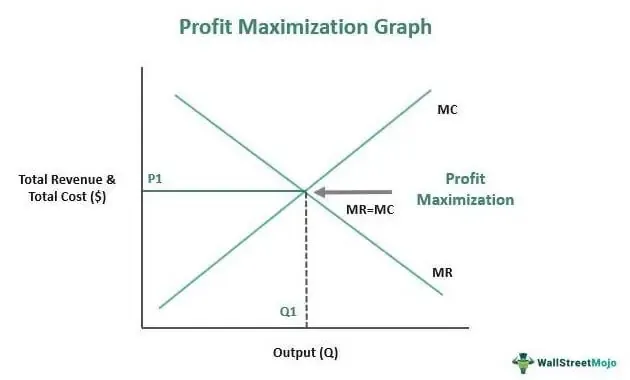

In the ever-evolving world of finance, understanding market trends and employing effective profit strategies are crucial for success. Market trends indicate the general direction that market prices are moving, often driven by external factors such as economic indicators and geopolitical events. Recognizing these trends early can be advantageous, allowing traders to position themselves to potentially benefit from these movements.

This article emphasizes the importance of trend analysis as a fundamental methodology in financial trading. It underscores the need for accurate trend identification and understanding the underlying factors driving market shifts. These insights help traders anticipate changes and make informed decisions, aligning their strategies with prevailing market conditions.



Additionally, algorithmic trading is introduced as a pivotal tool in modern trading, offering efficiencies that manual trading cannot match. By leveraging computer algorithms, traders can automatically execute trades based on predefined criteria, thus enhancing speed and minimizing human error. This shift to automated trading tools not only streamlines the trading process but also aids in managing the emotional aspects that often affect decision-making.

We will explore various strategies designed to maximize profits and manage risks effectively within dynamic markets. By integrating trend analysis and algorithmic trading, traders can enhance their ability to respond swiftly to market changes and mitigate potential downsides. Understanding these concepts equips both amateur and professional traders with a competitive edge, fostering more strategic participation in the financial markets.

## Table of Contents

## Understanding Market Trends

Market trends describe the general direction in which a particular market is moving over a specific period and are pivotal in guiding trading decisions. Understanding these trends provides traders and investors with the potential to make informed predictions and align their strategies to maximize returns and minimize risks.

Several factors can influence market trends, including economic indicators, market sentiment, and geopolitical events. Economic indicators such as interest rates, employment figures, and GDP growth provide insights into the economic health, influencing investor confidence and market behavior. For instance, an increase in GDP growth might signal a strengthening economy, likely resulting in upward market trends as investor confidence rises.

Market sentiment, which reflects the collective emotional tone of investors, can also drive trends. Factors such as major company announcements, fiscal policies, and even media reports can shift sentiment, driving markets into bullish or bearish directions. Understanding sentiment often involves gauging investor attitudes towards uncertainties and projections for economic performance.

Geopolitical events are another significant modifier of market trends. Political stability, international conflicts, and trade agreements can create [volatility](/wiki/volatility-trading-strategies), affecting the supply chain, commodity prices, and investor uncertainty. For example, positive diplomatic developments might lead to optimism in international markets, encouraging an upward trend due to anticipated economic cooperation.

Identifying trends early can be advantageous for traders and investors aiming to capitalize on market movements. Early trend detection involves analyzing patterns of price movements to identify significant shifts in market behavior. This can be achieved through various analytical tools and methodologies, such as moving averages, which smooth out price data to identify direction trends over a period. The moving average formula is given by:

$$
\text{MA}_n = \frac{1}{n} \sum_{i=0}^{n-1} P_{i}
$$

where $\text{MA}_n$ is the moving average over $n$ periods, and $P_i$ represents the price at day $i$.

Technical indicators such as the Relative Strength Index (RSI) or Bollinger Bands can also aid in the early detection of trends by providing signs of overbought or oversold conditions, indicating possible trend reversals.

Overall, effectively understanding and predicting market trends necessitates a multifaceted approach that incorporates various economic, psychological, and geopolitical elements. Accurately discerning these variables allows traders to make strategic decisions, optimize their trading outcomes and maintain competitive advantages in dynamic markets.

## Trend Analysis Techniques

### Trend Analysis Techniques

Market trend analysis primarily employs two approaches: technical analysis and [fundamental analysis](/wiki/fundamental-analysis). These methodologies, while distinct in their focus and tools, are often used in conjunction to provide a comprehensive view of market dynamics and potential future price movements.

**Technical Analysis**

Technical analysis is the study of historical market data, primarily price and [volume](/wiki/volume-trading-strategy), to forecast future price movements. This approach is based on the premise that all known information about the security is already reflected in its price, and prices move in trends that can be identified and exploited. The primary tools of technical analysts include charts, technical indicators, and patterns.

1. **Charts**: Price charts such as line charts, bar charts, and candlestick charts are foundational in technical analysis, helping traders visualize past price movements and identify emerging trends.

2. **Technical Indicators**: These are mathematical calculations based on historical price or volume data. Common indicators include:
   - **Moving Averages**: These smooth out price data to identify trends over a specified timeframe.
   - **Relative Strength Index (RSI)**: A momentum oscillator that measures the speed and change of price movements. It ranges from 0 to 100 and is used to identify overbought or oversold conditions.
   - **Bollinger Bands**: These consist of a moving average, and two standard deviations plotted away from it, providing a visual frame for price movements.

3. **Patterns**: Chart patterns, such as head and shoulders and double tops/bottoms, help traders predict future price movements based on historical patterns.

Technical analysis assumes past price movements and patterns can indicate future behavior, making it a favored tool for short-term trading strategies.

**Fundamental Analysis**

Fundamental analysis evaluates a security's intrinsic value by examining related economic, financial, and other qualitative and quantitative factors. This approach concerns itself with analyzing the core elements influencing a company's true value, rather than its trading patterns.

1. **Economic Indicators**: Factors such as interest rates, inflation, and GDP growth rates can impact the broader market and individual securities, providing a macroeconomic context for price movements.

2. **Financial Health**: Analysts assess a company's financial statements, including income statement, balance sheet, and cash flow statement. Key metrics include:
   - **Earnings Per Share (EPS)**: A measure of a company's profitability per share.
   - **Price-to-Earnings (P/E) Ratio**: This evaluates a company’s current share price relative to its per-share earnings, providing insight into valuation.

3. **Qualitative Factors**: Elements such as management quality, brand value, market position, and competitive advantage are considered to gauge future performance prospects.

Fundamental analysis is typically employed for long-term investment decisions, as it seeks to determine a security’s value and the factors likely to impact its future performance.

While technical analysis focuses on price and patterns, fundamental analysis seeks to understand the underlying business and economics. Traders and investors often use them together, known as fusion analysis, to make more informed decisions. Both techniques, deployed with discipline and skill, can provide significant insights into market trends and price movements.

## Profit Strategies in Trend Trading

Identifying and following trends can be instrumental for traders who aim to align their positions with the broader market movements. In trend trading, understanding and implementing the right strategies is crucial to capitalize on market dynamics effectively. Two primary approaches stand out: trend-following and counter-trend trading strategies.

Trend-following strategies are based on the principle of buying on upward trends and selling on downward trends. This strategy relies on the assumption that assets which have been rising will continue to rise, and those that are falling will continue to fall. Traders typically use technical indicators such as moving averages, the Moving Average Convergence Divergence (MACD), and the Average Directional Index (ADX) to identify and confirm trends. 

The core concept behind trend-following can be expressed with the following system:
```python
# Example Python pseudo-code for trend-following strategy
def trend_following(data, short_window=40, long_window=100):
    data['short_mavg'] = data['close'].rolling(window=short_window, min_periods=1).mean()
    data['long_mavg'] = data['close'].rolling(window=long_window, min_periods=1).mean()

    data['signal'] = 0.0
    data['signal'][short_window:] = np.where(data['short_mavg'][short_window:] 
                                             > data['long_mavg'][short_window:], 1.0, 0.0)
    data['positions'] = data['signal'].diff()
    return data
```
In this example, a buy signal is generated when the short-term moving average exceeds the long-term moving average, indicating an upward trend.

On the other hand, counter-trend strategies focus on identifying potential reversals. These strategies look for turning points in the market, assuming that the current trend will reverse. Counter-trend traders often use tools such as Bollinger Bands, Relative Strength Index (RSI), and Fibonacci retracement levels to detect overbought or oversold conditions. They aim to capitalize on the price corrections that follow extreme market movements.

Both strategies have their merits and risks. Trend-following can yield substantial returns during strong, prolonged market trends but may result in losses during choppy, sideways markets. Conversely, counter-trend strategies can be effective in range-bound markets but may underperform during trending markets.

The choice between these strategies usually depends on the trader’s risk tolerance, market conditions, and experience. By understanding these strategies and employing them judiciously, traders can better align their actions with anticipated market movements, potentially leading to more consistent profitability.

 to Algorithmic Trading

Algorithmic trading, commonly referred to as algo trading, involves the use of computer programs to perform trading tasks, capitalizing on speed and computational precision. This trading methodology is underpinned by algorithms, which are sets of rules or instructions designed to automate trading decisions. These algorithms can analyze significant volumes of market data and execute trades within fractions of a second, a capability that is beyond human capacity.

The main advantage of [algorithmic trading](/wiki/algorithmic-trading) is its ability to minimize emotional bias and human error, not to mention its capacity to operate efficiently in various market conditions. By pre-defining criteria such as timing, price, or quantity, algo trading systems can systematically execute trades at optimal times, reducing the risk of human judgment errors.

For instance, let us consider a simple moving average crossover strategy, a common algorithmic trading method. A basic Python implementation could involve defining short-term and long-term moving averages to generate buy and sell signals:

```python
import pandas as pd

# Sample data: historical stock prices
data = pd.read_csv('historical_data.csv')

# Calculate moving averages
short_window = 40
long_window = 100

data['Short_MA'] = data['Close'].rolling(window=short_window, min_periods=1).mean()
data['Long_MA'] = data['Close'].rolling(window=long_window, min_periods=1).mean()

# Generate signals
data['Signal'] = 0
data['Signal'][short_window:] = np.where(data['Short_MA'][short_window:] > data['Long_MA'][short_window:], 1, 0)

# Generate trading orders
data['Position'] = data['Signal'].diff()
```

In this code snippet, the algorithm calculates two moving averages based on the stock's closing prices over defined periods and generates signals when the short-term moving average crosses above or below the long-term moving average. Such algos enable traders to take advantage of systematic patterns efficiently.

Algorithmic trading's widespread adoption across markets is attributable to its effectiveness in implementing complex strategies that rely on speed, accuracy, and the processing of extensive datasets. Execution algorithms handle trade execution by dynamically adjusting orders based on market conditions, often utilizing multiple strategies such as [arbitrage](/wiki/arbitrage) and market-making. As markets evolve, the adaptability and continual refinement of these algorithms remain central to maintaining a competitive edge.

## Popular Algorithmic Trading Strategies

Algorithmic trading strategies have gained significant prominence in modern financial markets due to their ability to exploit market inefficiencies with speed and precision. Among the most prevalent strategies employed are arbitrage, trend-following, and market-making.

### Arbitrage

Arbitrage exploits price discrepancies of similar or identical financial instruments across different markets or forms. The principle is to buy low in one market and simultaneously sell high in another. In efficient markets, these opportunities are fleeting, necessitating rapid execution that is well-suited for algorithmic trading systems.

For example, consider the formula for calculating the profit from triangular arbitrage in foreign exchange markets:

$$
\text{Profit} = \left( \frac{1}{S_{AB} \times S_{BC} \times S_{CA}} - 1 \right) \times \text{Amount}
$$

Where $S_{AB}$, $S_{BC}$, and $S_{CA}$ are the exchange rates between currency pairs. Algorithms can continuously scan markets to detect and exploit such discrepancies.

### Trend-Following

Trend-following strategies aim to capitalize on the persistence of asset price movements in a particular direction. These strategies often employ indicators such as moving averages to identify and ride trends. The core idea is to take long positions in rising markets and short positions in falling markets.

A basic moving average crossover strategy might involve going long when a short-term moving average (e.g., 50-day) crosses above a long-term moving average (e.g., 200-day):

```python
import pandas as pd

def moving_average_crossover(data, short_window, long_window):
    data['Short_MA'] = data['Close'].rolling(window=short_window, min_periods=1).mean()
    data['Long_MA'] = data['Close'].rolling(window=long_window, min_periods=1).mean()

    data['Signal'] = 0
    data['Signal'][short_window:] = np.where(data['Short_MA'][short_window:] > data['Long_MA'][short_window:], 1, -1)
    data['Position'] = data['Signal'].diff()

    return data
```

### Market-Making

Market-making involves providing [liquidity](/wiki/liquidity-risk-premium) to the market by simultaneously quoting bid and ask prices. The goal is to earn the bid-ask spread through rapid buying and selling. This strategy necessitates precision, as market makers benefit from small margins over high volumes.

Algorithmic trading systems are critical for market-making, as they must continuously adjust quotes based on market conditions, inventory levels, and volatility.

### Backtesting and Optimization

Successful algorithmic trading strategies rely heavily on [backtesting](/wiki/backtesting) and optimization. Backtesting involves simulating the strategy against historical data to verify its effectiveness. Optimization fine-tunes the strategy's parameters to improve performance.

Here's a simple backtesting structure:

```python
def backtest_strategy(data, strategy, *args):
    test_data = strategy(data, *args)
    returns = test_data['Close'].pct_change()
    strategy_returns = returns * test_data['Position'].shift(1)
    cumulative_returns = (1 + strategy_returns).cumprod() - 1

    return cumulative_returns[-1]
```

Incorporating these strategies within an efficient trading framework can enhance the ability to capitalize on market opportunities while reducing exposure to risk. As market conditions change, continuous refinement and adaptation of strategies are necessary to maintain profitability.

## Risk Management in Algo Trading

Risk management techniques are fundamental to the success of algorithmic trading. The strategic use of stop-loss orders, position sizing, and diversification form the backbone of effective risk management plans.

Stop-loss orders are critical tools in mitigating losses and preserving capital. By automatically selling a security at a pre-set price, stop-loss orders help limit the amount an investor can lose. For instance, an algorithm might be programmed to execute a sell order if a stock's price falls to 5% below the purchase price, thereby protecting against further declines.

Position sizing is another key component. It determines how much capital to allocate to each trade based on the trader's risk tolerance and market volatility. Proper position sizing can prevent excessive losses from any single trade. A common approach is the fixed percentage risk model, where traders risk only a small percentage of their total capital on any given trade. For example:

$$
\text{Position Size} = \frac{\text{Capital at Risk}}{\text{Stop-loss Distance}}
$$

where "Capital at Risk" is the dollar amount the trader is willing to lose, and "Stop-loss Distance" is the difference between the entry price and the stop-loss price.

Diversification across different strategies or asset classes also plays a significant role in risk management. By spreading investments over various markets and instruments, traders can reduce their exposure to any single point of failure. This diversification helps minimize the impact of adverse movements in any one sector.

Continuous monitoring and adjustments are essential to adapt strategies to evolving market conditions. Financial markets are dynamic, and an algorithm must be able to adjust its parameters in response to new data. Regular performance evaluations and recalibrations ensure that the strategies remain effective and in line with the trader's goals and risk appetite.

In summary, effective risk management in algorithmic trading is achieved through combining stop-loss orders, prudent position sizing, diversification, and continuous strategy adjustments. Together, these techniques help mitigate risks and enhance the robustness of trading algorithms in volatile markets.

## The Role of Data in Trading Strategies

Quality data is foundational for the development of effective trading algorithms, which are increasingly employed in the finance industry to automate market transactions. Accurate and diverse data sets are crucial, as they directly influence the decision-making process within these systems. Three primary types of data are essential for formulating trading strategies: market data, fundamental data, and [alternative data](/wiki/best-alternative-data).

Market data includes quantitative information such as price quotes, trade volumes, and historical time series. This data forms the backbone of technical analysis, enabling the identification of patterns and statistical trends necessary for making informed predictions about future market movements. For instance, traders commonly use moving averages as a technical indicator to discern long-term trends from noisy data. Moving averages smooth out price data by creating a constantly updated average price, which helps to identify support and resistance levels. 

Fundamental data involves qualitative metrics related to a security's intrinsic value, such as earnings reports, financial statements, and economic indicators like employment rates and inflation. This form of data analysis is key for assessing the financial health and growth prospects of companies, influencing long-term investment decisions beyond mere price movements. Quantitative models can be employed to evaluate price-to-earnings ratios, dividend yields, and other financial ratios to estimate the fair value of a company.

In recent years, alternative data sources, such as social media sentiment, satellite imagery, and web traffic analysis, have gained prominence. These data sets provide insights that are not captured by traditional financial metrics, enabling traders to uncover non-traditional indicators of market sentiment and consumer behavior. For example, a sudden spike in social media mentions of a company might precede an uptick in its stock price, allowing traders to anticipate movements before they are reflected in conventional data.

The impact of data accuracy and diversity on trading performance cannot be overstated. Data integrity issues, such as incorrect or duplicated data points, can lead to erroneous trades and significant financial loss. Therefore, robust data validation and cleansing processes are essential components of algorithm development. Moreover, incorporating diverse data sources ensures a comprehensive view of market conditions and mitigates the risks associated with over-reliance on a single type of data.

In the context of algorithmic trading, data inputs must be properly vetted to ensure algorithms generate reliable buy or sell signals. Backtesting, whereby historical data is used to test the viability of a trading strategy, aids in refining and optimizing algorithms. Furthermore, continual data monitoring and model recalibration are necessary to adapt to evolving market dynamics, ensuring that trading strategies remain aligned with real-world conditions.

## Conclusion

Combining market trend analysis with algorithmic trading can significantly enhance profitability. Traders equipped with a robust understanding of market trends and the technological prowess of algorithmic trading are better positioned to navigate the complexities of financial markets. This dual approach enables traders to quickly identify and react to market movements, leading to more informed decision-making.

Staying ahead of market trends requires an ongoing commitment to learning and adaptability. Markets are influenced by myriad factors, including economic data releases, geopolitical developments, and investor sentiment. By continuously updating their knowledge and refining their strategies, traders can maintain a competitive edge. This often involves leveraging advanced analytic tools and techniques to forecast market direction accurately.

Effective risk management and data utilization are integral to successful trading strategies. Employing techniques such as stop-loss orders, careful position sizing, and strategic diversification helps mitigate risks inherent in trading activities. Additionally, the utilization of high-quality data—spanning market data, fundamental metrics, and alternative data sources—can profoundly impact algorithmic performance. Accurate and diverse datasets enhance the precision and reliability of trading algorithms, facilitating better execution and outcomes.

Incorporating these practices can lead to improved risk-adjusted returns. Traders benefit from the systematic approach of algorithmic strategies while remaining grounded in the fundamental truths revealed by trend analysis. As financial markets evolve, the synergy between market trend analysis and algorithmic trading will continue to play an essential role in enabling traders to achieve sustained success.

## References & Further Reading

[1]: Bergstra, J., Bardenet, R., Bengio, Y., & Kégl, B. (2011). ["Algorithms for Hyper-Parameter Optimization."](https://dl.acm.org/doi/10.5555/2986459.2986743) Advances in Neural Information Processing Systems 24.

[2]: ["Advances in Financial Machine Learning"](https://www.amazon.com/Advances-Financial-Machine-Learning-Marcos/dp/1119482089) by Marcos Lopez de Prado

[3]: ["Evidence-Based Technical Analysis: Applying the Scientific Method and Statistical Inference to Trading Signals"](https://www.amazon.com/Evidence-Based-Technical-Analysis-Scientific-Statistical/dp/0470008741) by David Aronson

[4]: ["Machine Learning for Algorithmic Trading"](https://github.com/stefan-jansen/machine-learning-for-trading) by Stefan Jansen

[5]: ["Quantitative Trading: How to Build Your Own Algorithmic Trading Business"](https://github.com/LucindaYa/quant-resources/blob/master/Quantitative%20Trading%20How%20to%20Build%20Your%20Own%20Algorithmic%20Trading%20Business.pdf) by Ernest P. Chan