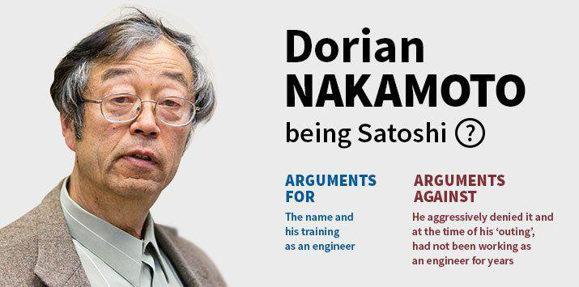

## Table of Contents

## Who is Satoshi Nakamoto?

Satoshi Nakamoto is the name used by the person or group of people who created Bitcoin, the first and most well-known cryptocurrency. Bitcoin was introduced in 2009, and Satoshi Nakamoto is known for writing the Bitcoin whitepaper, which explained how Bitcoin works. The identity of Satoshi Nakamoto is still a mystery because no one knows for sure if it's one person or a group of people.

Satoshi Nakamoto worked on Bitcoin until 2010 and then disappeared. After that, other people took over the development of Bitcoin. Even though Satoshi Nakamoto is no longer involved, the impact of Bitcoin and the idea of cryptocurrencies continues to grow. Many people are still curious about who Satoshi Nakamoto really is, but so far, no one has been able to prove their identity.

## What is the significance of Satoshi Nakamoto in the world of cryptocurrency?

Satoshi Nakamoto is very important in the world of cryptocurrency because they created Bitcoin, the first ever cryptocurrency. Before Bitcoin, there was no such thing as digital money that people could use without a bank or government controlling it. Satoshi Nakamoto wrote a special paper called the Bitcoin whitepaper, which explained how Bitcoin could work. This paper and the creation of Bitcoin started a whole new way of thinking about money and led to the creation of many other cryptocurrencies.

Even though Satoshi Nakamoto stopped working on Bitcoin in 2010 and disappeared, their impact is still huge. Bitcoin showed the world that it's possible to have money that is not controlled by any one person or group. This idea has inspired many other people to create their own cryptocurrencies. Today, there are thousands of different cryptocurrencies, and they are all based on the ideas that Satoshi Nakamoto started. So, even though we don't know who Satoshi Nakamoto is, their work has changed the world of money forever.

## When was Satoshi Nakamoto first mentioned?

Satoshi Nakamoto was first mentioned in 2008. That year, Satoshi Nakamoto sent an email to a group of people who were interested in cryptography. In the email, Satoshi shared a link to the Bitcoin whitepaper, which explained how Bitcoin would work. This was the first time anyone heard of Satoshi Nakamoto.

After the email, Satoshi Nakamoto started working on the Bitcoin software. By January 2009, the first version of Bitcoin was released. From then on, people started using Bitcoin and talking about Satoshi Nakamoto. Even though Satoshi disappeared in 2010, the name Satoshi Nakamoto became very famous in the world of [cryptocurrency](/wiki/cryptocurrency).

## What are the most popular theories about Satoshi Nakamoto's identity?

One popular theory is that Satoshi Nakamoto is actually a group of people, not just one person. Some people think that maybe a team of computer experts and mathematicians worked together to create Bitcoin. They believe that it would be hard for one person to have all the skills needed to make something as complex as Bitcoin. Some names that come up a lot in this theory are people like Hal Finney, who was one of the first to use Bitcoin, and Nick Szabo, who worked on early ideas for digital money.

Another theory is that Satoshi Nakamoto is a single person, and many people have tried to guess who it might be. One name that often comes up is Craig Wright, an Australian computer scientist who has claimed to be Satoshi Nakamoto, but many people don't believe him. Another person some think could be Satoshi is Dorian Nakamoto, a man who shares the same last name and was once mistakenly identified as Satoshi by a news reporter. However, Dorian Nakamoto denied being involved with Bitcoin.

There are also theories that Satoshi Nakamoto could be someone completely unknown to the public. Some people think that Satoshi might be a person who wanted to stay anonymous and never wanted to be famous. They believe that Satoshi created Bitcoin to change the world and then stepped away to let others take over. No one knows for sure who Satoshi Nakamoto is, and the mystery continues to fascinate people around the world.

## Has anyone ever claimed to be Satoshi Nakamoto?

Yes, some people have claimed to be Satoshi Nakamoto. One of them is Craig Wright, an Australian computer scientist. In 2016, he said he was the person behind Bitcoin. He showed some evidence, but many people didn't believe him. They thought the proof was not strong enough. Even today, some people still think he might be Satoshi, but most do not.

Another person who was thought to be Satoshi Nakamoto is Dorian Nakamoto. In 2014, a news reporter from Newsweek wrote a story saying Dorian was Satoshi. But Dorian said he had nothing to do with Bitcoin. He was just a man with the same last name. After that, people realized the reporter made a mistake, and Dorian was not involved with Bitcoin at all.

## What evidence exists regarding Satoshi Nakamoto's identity?

There is some evidence about who Satoshi Nakamoto might be, but it is not very clear. Craig Wright, an Australian computer scientist, said he was Satoshi Nakamoto in 2016. He showed some computer code and messages that looked like they could be from Satoshi. But many people did not believe him because the evidence was not strong enough. They thought he might have copied the code and messages from somewhere else. So, even though Craig Wright claimed to be Satoshi, most people still do not think he is.

Another piece of evidence came from a news story in 2014. A reporter from Newsweek wrote that Dorian Nakamoto, a man with the same last name, was Satoshi Nakamoto. The reporter thought Dorian's background matched what they knew about Satoshi. But when the reporter talked to Dorian, he said he had nothing to do with Bitcoin. He was just a man with the same last name. After that, people realized the reporter made a mistake, and Dorian was not involved with Bitcoin at all. So, the evidence about Satoshi Nakamoto's identity is still not clear, and the mystery continues.

## How has the mystery of Satoshi Nakamoto's identity affected Bitcoin?

The mystery of who Satoshi Nakamoto is has made Bitcoin even more interesting to people. Because no one knows who created it, Bitcoin seems more mysterious and special. This mystery has helped make Bitcoin very popular. People talk about it a lot and want to learn more about it. The mystery also makes people trust Bitcoin more because it shows that no one person can control it. If Satoshi Nakamoto's identity was known, people might worry that this person could change Bitcoin or stop it. But because Satoshi is unknown, people feel that Bitcoin is safer and more independent.

The mystery has also led to a lot of guessing and stories about who Satoshi might be. Some people think it's a group of experts, while others believe it's one person hiding their identity. These stories keep people interested in Bitcoin and make them want to follow its progress. Even though we don't know who Satoshi is, Bitcoin keeps growing and changing the world of money. The mystery of Satoshi Nakamoto has become a big part of Bitcoin's story and helps make it unique.

## What are the linguistic and coding clues that have been analyzed to identify Satoshi Nakamoto?

People have looked at the words Satoshi Nakamoto used in emails and on the internet to try to figure out who they might be. They noticed that Satoshi's writing had some British English words, like "colour" instead of "color." This made some people think Satoshi might be from the UK or a place that uses British English. Also, the way Satoshi wrote seemed very careful and smart, like someone who knows a lot about computers and money.

When it comes to coding, experts have studied the Bitcoin software to find clues about Satoshi. They found that the code had a style that looked like it was written by someone who is very good at programming. Some parts of the code were similar to other projects that people like Hal Finney and Nick Szabo worked on. But even with all these clues, no one can say for sure who Satoshi Nakamoto is. The mystery of Satoshi's identity keeps people guessing and interested in Bitcoin.

## What role did Satoshi Nakamoto play in the development of Bitcoin?

Satoshi Nakamoto was very important in making Bitcoin. They wrote the Bitcoin whitepaper in 2008, which explained how Bitcoin could work. This paper was the start of everything. Satoshi also made the first version of the Bitcoin software in 2009. They worked on it for about a year and a half, fixing problems and making it better. During this time, Satoshi talked with other people online, answering questions and helping them understand Bitcoin.

After working on Bitcoin until 2010, Satoshi Nakamoto stopped and disappeared. But before leaving, they made sure that other people could keep working on Bitcoin. Satoshi gave control of the project to other developers so that Bitcoin could keep growing. Even though Satoshi is no longer involved, their ideas and the software they made are still the base of Bitcoin. Today, many people are still using and improving Bitcoin because of what Satoshi started.

## How has the search for Satoshi Nakamoto's identity evolved over time?

At first, when Bitcoin was new, not many people cared about who Satoshi Nakamoto was. They were more interested in how Bitcoin worked and if it could change money. But as Bitcoin got more popular, people started to wonder who made it. In 2014, a reporter from Newsweek wrote a story saying a man named Dorian Nakamoto was Satoshi. This made a lot of people talk about it, but Dorian said he had nothing to do with Bitcoin. After that, the search for Satoshi's identity became a big mystery that many people wanted to solve.

Over time, more people started looking for clues about Satoshi. Some looked at the words Satoshi used in emails and online posts. They noticed some British English words and thought Satoshi might be from the UK or somewhere that uses British English. Others studied the Bitcoin software to see if the coding style could tell them anything. In 2016, an Australian named Craig Wright said he was Satoshi and showed some evidence, but most people didn't believe him. Even now, the search for Satoshi's identity keeps going, with people still trying to figure out who started Bitcoin.

## What are the implications of revealing Satoshi Nakamoto's identity?

If someone found out who Satoshi Nakamoto really is, it could change a lot of things about Bitcoin. People might start trusting Bitcoin more if they know who made it. On the other hand, if Satoshi is a famous person, some might think they could control Bitcoin, and that could make people worry. Also, if Satoshi has a lot of Bitcoin, knowing who they are might affect the price of Bitcoin. People might buy or sell more Bitcoin because of this news.

But there could be problems too. If Satoshi's identity is revealed, they might get a lot of attention from the media and the government. This could be hard for them and might make them want to leave Bitcoin alone even more. Also, if Satoshi is not who people expected, it could make some people lose trust in Bitcoin. So, finding out who Satoshi is could have big effects, both good and bad, on Bitcoin and the whole world of cryptocurrency.

## What are the current leading hypotheses about Satoshi Nakamoto's identity among experts?

Many experts think that Satoshi Nakamoto might be a group of people instead of just one person. They believe that creating something as complex as Bitcoin would need different skills, like computer programming and understanding money. Some names that come up a lot are Hal Finney, who was one of the first to use Bitcoin, and Nick Szabo, who worked on early ideas for digital money. These experts think that a team of experts could have worked together to make Bitcoin and then decided to stay anonymous.

Another popular idea is that Satoshi Nakamoto is one person who wanted to stay hidden. Some people think it could be Craig Wright, an Australian computer scientist who said he was Satoshi in 2016. But many experts don't believe him because his proof was not strong enough. Others have guessed that it might be someone completely unknown to the public, someone who made Bitcoin to change the world and then stepped away to let others take over. No one knows for sure, and the mystery keeps people interested in Bitcoin.

## References & Further Reading

[1]: Nakamoto, S. (2008). ["Bitcoin: A Peer-to-Peer Electronic Cash System."](https://nakamotoinstitute.org/library/bitcoin/)

[2]: Narayanan, A., Bonneau, J., Felten, E., Miller, A., & Goldfeder, S. (2016). ["Bitcoin and Cryptocurrency Technologies."](https://press.princeton.edu/books/hardcover/9780691171692/bitcoin-and-cryptocurrency-technologies) Princeton University Press.

[3]: Lopez de Prado, M. (2018). ["Advances in Financial Machine Learning."](https://www.amazon.com/Advances-Financial-Machine-Learning-Marcos/dp/1119482089) Wiley.

[4]: Chan, E. P. (2009). ["Quantitative Trading: How to Build Your Own Algorithmic Trading Business."](https://github.com/ftvision/quant_trading_echan_book) Wiley.

[5]: Jansen, S. (2018). ["Machine Learning for Algorithmic Trading."](https://www.amazon.com/Hands-Machine-Learning-Algorithmic-Trading-ebook/dp/B07JLFH7C5) Packt Publishing.

[6]: Vigna, P., & Casey, M. J. (2015). ["The Age of Cryptocurrency: How Bitcoin and Digital Money Are Challenging the Global Economic Order."](https://dl.acm.org/doi/10.5555/2717097) St. Martin's Press.

[7]: Popper, N. (2016). ["Digital Gold: Bitcoin and the Inside Story of the Misfits and Millionaires Trying to Reinvent Money."](https://www.amazon.com/Digital-Gold-Bitcoin-Millionaires-Reinvent/dp/006236250X) Harper.