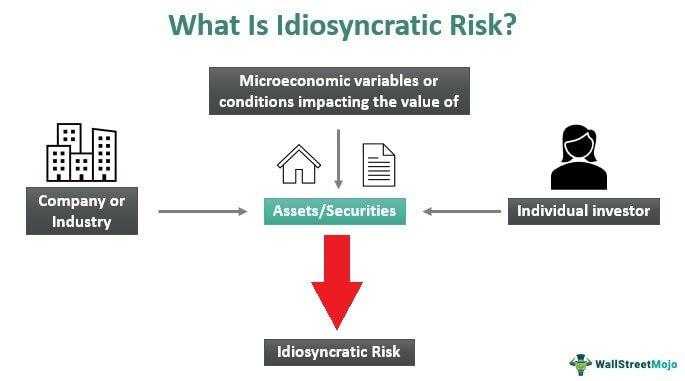

Idiosyncratic risk, commonly referred to as unsystematic risk, represents the risk inherent to a specific asset or company. Unlike systematic risk, which influences the entire market, idiosyncratic risk is confined to individual securities and is independent of broader market movements. This distinction is pivotal for investors, as the performance of individual securities can be significantly impacted by factors such as management decisions, product recalls, or industry-specific challenges. 

In the context of financial risk management, idiosyncratic risk plays a critical role. By identifying and assessing this type of risk, investors can make informed decisions, tailored to the unique characteristics of the securities in question. Moreover, strategies for mitigating idiosyncratic risk, such as diversification, are essential to optimizing portfolio performance.



The proliferation of algorithmic trading has heightened the importance of understanding and managing idiosyncratic risk. Algorithmic trading relies on sophisticated computer algorithms to execute trades at speeds and volumes impossible for human traders. These algorithms incorporate data analysis and risk assessments to fine-tune trading strategies. As such, effectively managing idiosyncratic risk within these algorithms can lead to improved risk-adjusted returns.

This article provides an in-depth exploration of idiosyncratic risk, outlining its nuances and comparing it to systematic risk. It will discuss various strategies for risk management and examine the implications of idiosyncratic risk within the framework of algorithmic trading. By gaining insights into these areas, investors and traders can enhance their ability to navigate and manage the risks associated with individual assets, ultimately fostering more robust investment outcomes.

## Table of Contents

## Understanding Idiosyncratic Risk

Idiosyncratic risk, often referred to as unsystematic risk, is associated with factors that are unique to a specific asset or company. Unlike systematic risk, which is linked to broader economic factors influencing entire markets, idiosyncratic risk stems from individual elements such as management decisions, industry conditions, or operational issues. These factors lead to uncertainties and potential financial loss that are not correlated with general market movements.

Management decisions play a crucial role in contributing to idiosyncratic risk. For instance, strategic choices regarding mergers, acquisitions, or new product launches can significantly impact a company's performance. A successful acquisition may boost a company's value, while a failed one could lead to financial instability. Similarly, unexpected changes in management, such as the departure of a key executive, can create uncertainty and affect investor confidence, leading to fluctuations in the company's stock price.

Industry conditions are another source of idiosyncratic risk. Companies operating in cyclical industries may face substantial risks due to fluctuations in demand for their products or services. For example, an automobile manufacturer might experience declining sales during an economic downturn, affecting earnings and stock performance. Conversely, companies in recession-resistant industries, such as utilities or consumer staples, may encounter different sets of risks related to regulatory changes or supply chain disruptions.

Operational issues also contribute to idiosyncratic risk. These can include challenges such as product recalls, technological failures, or legal disputes. A high-profile product recall, for instance, can damage a company's reputation, lead to significant financial losses, and impact share prices adversely. Similarly, unexpected legal challenges involving intellectual property or compliance with regulations can result in unforeseen expenses and market [volatility](/wiki/volatility-trading-strategies).

The idiosyncratic nature of this risk means that its impact is isolated to the individual asset or company. Since it does not correlate with overall market movements, it is possible to mitigate this type of risk through diversification. By holding a variety of investments across different sectors and industries, an investor can reduce exposure to the idiosyncratic risks associated with any single company or asset. 

In conclusion, the unique characteristics of idiosyncratic risk emphasize the importance of investigating the specific factors affecting individual investments. Understanding these factors enables investors to more effectively manage their portfolios and make informed decisions aimed at minimizing potential losses linked to unsystematic risk.

## Idiosyncratic Risk vs. Systematic Risk

Systematic risk, also known as market risk, refers to the inherent uncertainty affecting entire financial markets or asset classes. This type of risk arises from broad economic factors, such as changes in interest rates, inflation, political instability, or global events, that impact all securities in the market uniformly. Because systematic risk influences a wide array of investments, it cannot be eliminated through diversification. Investors must accept a certain level of systematic risk when entering financial markets, and it is often measured by metrics such as beta in the Capital Asset Pricing Model (CAPM). 

Idiosyncratic risk, often called unsystematic risk, is particular to an individual company or industry. This type of risk stems from factors like management decisions, production flaws, competitive pressures, or specific sector disruptions. Unlike systematic risk, idiosyncratic risk is not correlated with broader market movements, which means it can be significantly reduced or eliminated by diversifying a portfolio. By owning a variety of stocks across different industries and sectors, investors can mitigate the impact of company-specific events on their overall portfolio performance.

Understanding the distinctions between systematic and idiosyncratic risk is crucial for effective portfolio management. While systematic risk is inevitable and affects the pricing of all assets in the market, idiosyncratic risk can be controlled by adopting appropriate diversification strategies. For example, an investor holding shares only in technology companies would be highly exposed to company or industry-specific risks. However, diversifying across sectors such as healthcare, finance, and consumer goods would reduce vulnerability to any single sector's volatility.

In practical terms, the relationship between these risks can be expressed as:

$$
\text{Total Risk} = \text{Systematic Risk} + \text{Idiosyncratic Risk}
$$

Effective risk management thus involves identifying and mitigating idiosyncratic risk through diversification, while accepting systematic risk as a fundamental aspect of market participation. Financial models and tools like the CAPM assist investors in calculating expected returns on assets, considering the market risk premium and individual asset's sensitivity to systematic risk. By doing so, investors can achieve a balanced investment approach that seeks to optimize returns while managing the inherent risks present in financial markets.

## Strategies for Minimizing Idiosyncratic Risk

Diversification is a fundamental strategy for mitigating idiosyncratic risk, which arises from specific factors unique to individual assets or companies. By investing across a variety of asset classes such as equities, fixed income, commodities, and real estate, investors can reduce their exposure to isolated risk events that might impact a single security or sector. This can be achieved through constructing a diversified portfolio that encompasses multiple industries and geographic regions. For instance, widening the geographic exposure of a portfolio can shield investors from localized economic downturns or political instability that might affect a particular country or region.

In addition to diversification, hedging mechanisms are employed to manage idiosyncratic risk. Hedging involves taking offsetting positions in related securities to reduce potential losses. For example, investors might use futures contracts or forward agreements to lock in prices and protect against unfavorable fluctuations in an asset's value. This approach requires a detailed understanding of the risks associated with each asset and the construction of a hedging strategy that effectively mitigates those risks.

Financial instruments like options are also effective tools for reducing idiosyncratic risk. Options provide the right, but not the obligation, to buy or sell an asset at a specified price before a certain date. They can serve as insurance against adverse price movements. For example, by purchasing put options, an investor can set a floor on potential losses if the price of the underlying asset falls below the strike price, thus offering a degree of price protection.

Mathematically, the impact of diversification can be represented using the formula for the variance of a portfolio, given by:

$$
\sigma_p^2 = \sum (w_i^2 \sigma_i^2) + \sum \sum (w_i w_j \sigma_{i,j})
$$

Where $\sigma_p^2$ is the portfolio variance, $w_i$ is the weight of asset $i$ in the portfolio, $\sigma_i^2$ is the variance of asset $i$, and $\sigma_{i,j}$ is the covariance between assets $i$ and $j$. Diversification works by minimizing the first sum of weighted variances through exposure to uncorrelated assets, thereby reducing the overall portfolio risk.

In practical application, combining these strategies allows investors to effectively manage idiosyncratic risk and enhance risk-adjusted returns. By carefully selecting a well-diversified portfolio, employing hedging techniques, and leveraging financial instruments like options, investors can protect their investments from the adverse effects of idiosyncratic events while optimizing for potential gains.

## The Role of Risk Management in Algorithmic Trading

Algorithmic trading utilizes computer algorithms to analyze large datasets and execute trading strategies with speed and precision. One of its key functions is risk management, which involves assessing and responding to various risk factors, including idiosyncratic risk. By employing sophisticated risk management techniques, [algorithmic trading](/wiki/algorithmic-trading) systems can proactively adjust portfolios to mitigate these specific risks and optimize trading outcomes.

A critical component of managing idiosyncratic risk in algorithmic trading is the use of [factor](/wiki/factor-investing) models. These models help identify and quantify the unique risks associated with individual securities by analyzing factors such as earnings announcements, corporate actions, and other company-specific events. Using these insights, algorithms can dynamically reallocate assets and rebalance portfolios to minimize exposure to undesirable risks while capturing potential gains.

Event-driven strategies play a significant role in addressing idiosyncratic risks as well. These strategies focus on capitalizing on price movements resulting from specific events, such as mergers and acquisitions or regulatory changes. By programming algorithms to detect and respond to these events swiftly, traders can better manage the risks and opportunities associated with specific assets.

Integrating these risk management strategies within algorithmic trading systems often involves complex mathematical models and computational techniques. For instance, Python, a popular programming language in finance, can be used to implement risk assessment algorithms and automate trading decisions. Here is a simple example of how Python can be applied to manage risk:

```python
import numpy as np

# Simulate expected returns and covariance of assets
expected_returns = np.array([0.05, 0.07, 0.12])
cov_matrix = np.array([[0.1, 0.02, 0.04],
                       [0.02, 0.08, 0.03],
                       [0.04, 0.03, 0.15]])

# Define a function to calculate portfolio risk
def portfolio_risk(weights, cov_matrix):
    return np.sqrt(np.dot(weights.T, np.dot(cov_matrix, weights)))

# Example weights of assets in the portfolio
portfolio_weights = np.array([0.3, 0.4, 0.3])
risk = portfolio_risk(portfolio_weights, cov_matrix)

print(f"Portfolio Risk: {risk:.2f}")
```

Such computational techniques allow for real-time risk assessment and enable algorithmic trading systems to systematically manage idiosyncratic risks. By continuously evaluating the impact of unique risk factors on portfolios, these systems can adapt trading strategies to achieve better risk-adjusted returns. Integrating effective risk management tools not only enhances the robustness of algorithmic trading frameworks but also aligns them with the overarching goal of maximizing financial performance while controlling risk exposure.

## Case Studies and Practical Applications

Examining practical applications in equity, options, and commodity trading provides insight into how algorithms manage idiosyncratic risk, allowing traders to optimize returns while minimizing unexpected losses. One significant area where algorithms play a crucial role is during earnings announcements. Earnings periods are characterized by volatility, and idiosyncratic risk arises as individual company performance metrics are revealed, which could sharply impact the company's stock price.

**Equity Trading: Earnings Announcements**

In equity trading, algorithms are often programmed to manage risks associated with unexpected earnings reports. For example, an algorithm might decrease exposure to a specific stock prior to an anticipated earnings call, or a straddle strategy may be executed using options to capitalize on expected volatility. Algorithms often utilize historical data to predict possible price swings based on past earnings surprises, thereby adjusting the portfolio accordingly to minimize exposure to adverse movements.

**Options Trading: Volatility Adjustments**

In options trading, dealing with idiosyncratic risk involves adjusting strategies according to potential changes in implied volatility due to company-specific events. For instance, an options trader may deploy a gamma [scalping](/wiki/gamma-scalping) strategy to react dynamically to changes in stock price movement during periods of high volatility, such as following a major product announcement or executive change. Gamma scalping allows traders to maintain a delta-neutral position by buying low and selling high as the stock price fluctuates, offsetting short-term risk without substantial directional bets.

**Commodity Trading: Fundamental Changes**

Commodity trading also employs algorithms to manage risks associated with idiosyncratic factors such as geopolitical events or unexpected changes in supply conditions. For example, an algorithm might incorporate real-time data feeds and news sentiment analysis to anticipate and react to disruptions in a commodity supply chain. This could mean adjusting futures positions if a key exporter faces sanctions or if inclement weather impacts crop yields unexpectedly.

Algorithms further enhance these strategies using factor models, which break down various components affecting asset prices, including idiosyncratic elements. By incorporating a range of factors—from macroeconomic indicators to company-specific financial ratios—traders can better anticipate and respond to shifts in asset valuations.

In Python, managing idiosyncratic risk might include using libraries such as NumPy and pandas for data manipulation, scikit-learn for predictive modeling, and APIs for real-time data access:

```python
import numpy as np
import pandas as pd
from sklearn.linear_model import LinearRegression
from some_api_client import MarketDataAPI

# Assume market_data is a DataFrame with historical prices and fundamental data
market_data = MarketDataAPI.get_historical_data('AAPL', '2022-01-01', '2023-01-01')
X = market_data[['earnings_surprise', 'volatility_index']]
y = market_data['price_change']

# Fit a linear model to predict price changes based on earning surprises and volatility
model = LinearRegression().fit(X, y)
predicted_changes = model.predict(X)

# Perform a strategy adjustment based on predicted changes
# Placeholder for an actual trading strategy
strategy_adjustment = 'Hedge' if np.mean(predicted_changes) < 0 else 'Hold'
```

Through practical applications in various trading sectors, algorithms provide adaptive and responsive mechanisms to manage idiosyncratic risk, enabling traders to mitigate potential losses while capitalizing on opportunities presented by unique company or asset-specific events.

## Conclusion

Idiosyncratic risk is a crucial consideration for investors and traders due to its direct impact on the performance of individual assets. Unlike systematic risk, which affects entire markets, idiosyncratic risk arises from factors unique to a particular company or asset, such as management decisions, product recalls, or industry-specific issues. This specificity necessitates a strategic approach to risk management.

Diversification stands out as a fundamental strategy for managing idiosyncratic risk. By investing in a broad array of assets across different sectors, asset classes, and geographical locations, investors can minimize their exposure to the risk associated with any single investment. The basic principle behind this is that the adverse performance of one asset can be offset by the positive performance of others, achieving more stable overall returns.

Algorithmic strategies offer advanced solutions by incorporating risk analysis techniques that enable dynamic adjustment of portfolios in response to changes in idiosyncratic risk. Algorithms can process vast datasets to identify risks and opportunities quickly, modifying investment strategies as necessary to maintain optimal risk-adjusted returns. For instance, algorithms can implement factors models and event-driven strategies, which are designed to predict and adapt to company-specific changes.

A comprehensive grasp of idiosyncratic risk empowers investors to make informed decisions, enhancing their ability to achieve favorable outcomes. By understanding the unique attributes of different investments and employing robust risk management strategies, such as diversification and algorithmic trading, investors can effectively navigate the complexities of financial markets. This approach not only protects against individual asset underperformance but also maximizes potential returns, leading to a more resilient and successful investment portfolio.

## References & Further Reading

[1]: ["Advances in Financial Machine Learning"](https://www.amazon.com/Advances-Financial-Machine-Learning-Marcos/dp/1119482089) by Marcos Lopez de Prado

[2]: ["Machine Learning for Algorithmic Trading"](https://github.com/PacktPublishing/Machine-Learning-for-Algorithmic-Trading-Second-Edition) by Stefan Jansen

[3]: ["Quantitative Trading: How to Build Your Own Algorithmic Trading Business"](https://books.google.com/books/about/Quantitative_Trading.html?id=j70yEAAAQBAJ) by Ernest P. Chan

[4]: Markowitz, H. M. (1952). ["Portfolio Selection."](https://www.jstor.org/stable/2975974) The Journal of Finance, 7(1), 77-91.

[5]: Fabozzi, F. J., & Focardi, S. M. (2004). ["The Mathematics of Financial Modeling and Investment Management"](https://www.semanticscholar.org/paper/The-Mathematics-of-Financial-Modeling-and-Focardi-Fabozzi/9ef7cbeee77cf22e2ee62cfef22f466a27aec6c8). Wiley. 

[6]: Ross, S. A. (1976). ["The Arbitrage Theory of Capital Asset Pricing."](https://www.sciencedirect.com/science/article/pii/0022053176900466) Journal of Economic Theory, 13(3), 341-360.