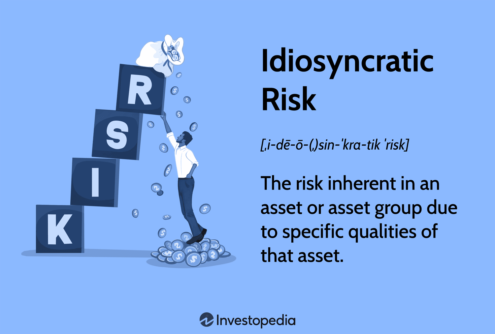

## Table of Contents

## What is idiosyncratic risk?

Idiosyncratic risk is the danger that comes from specific things about a single investment, like a company's stock. It's different from the risks that affect the whole market, which we call systematic risk. For example, if a company has a bad CEO or a factory burns down, that's idiosyncratic risk. It's about problems that only affect that one company, not the whole market.

You can lower idiosyncratic risk by spreading your investments across many different companies or types of investments. This is called diversification. When you diversify, you're less likely to lose a lot of money if one company does badly. But you can't get rid of systematic risk this way because it affects everything. So, while you can manage idiosyncratic risk, you can't completely avoid it.

## How does idiosyncratic risk differ from systematic risk?

Idiosyncratic risk is the risk that comes from things that affect just one company or investment. For example, if a company's factory burns down or its CEO gets into trouble, that's idiosyncratic risk. It's about problems that are unique to that one company and don't affect the whole market. You can reduce this type of risk by spreading your investments across many different companies. This way, if one company does badly, it won't hurt your whole investment portfolio too much.

Systematic risk, on the other hand, is the risk that comes from things that affect the whole market or economy. Things like a recession, high inflation, or a big change in interest rates are examples of systematic risk. This type of risk affects all investments, no matter how diverse your portfolio is. You can't get rid of systematic risk by diversifying because it's about big events that impact everything. So, while you can manage idiosyncratic risk, systematic risk is something you just have to live with when you invest.

## What are the main types of idiosyncratic risk?

Idiosyncratic risk comes from problems that are unique to a single company or investment. One type of idiosyncratic risk is business risk. This is when a company faces challenges like losing customers, having a bad product, or dealing with a lawsuit. These problems can make the company's stock price go down, but they don't affect other companies in the same way.

Another type of idiosyncratic risk is financial risk. This happens when a company has too much debt or can't pay its bills. If a company borrows a lot of money and can't pay it back, its stock price can fall. This risk is about the company's money troubles, not about what's happening in the whole economy.

There's also operational risk, which is when a company has problems with how it runs its business. For example, if a factory breaks down or there's a big mistake in how the company does things, that's operational risk. These kinds of problems can hurt the company's performance and lower its stock price, but they don't affect other companies in the same way.

## Can you provide examples of idiosyncratic risk in different industries?

In the technology industry, idiosyncratic risk can come from things like a big data breach. For example, if a tech company like a social media platform loses a lot of user data, it could face huge fines and lose trust from its users. This would hurt the company's stock price, but it wouldn't affect other tech companies in the same way. Another example is if a tech company's new product, like a smartphone, doesn't work well or people don't like it. That could make the company's stock price go down, but it's a problem just for that company.

In the automotive industry, idiosyncratic risk might happen if a car company has to recall a lot of cars because they're not safe. For example, if a car company finds out that some of its cars have a problem that can cause accidents, it has to call back those cars and fix them. This costs a lot of money and can make people not want to buy that company's cars. This is a problem just for that car company and doesn't affect other car companies the same way. Another example is if a car company's factory burns down. That would stop the company from making cars for a while, hurting its stock price, but it's a problem just for that company.

In the pharmaceutical industry, idiosyncratic risk can come from failing to get a new drug approved. If a drug company spends a lot of money developing a new medicine and then the government says it's not safe or doesn't work, the company loses a lot of money. This hurts the company's stock price, but it's a problem just for that drug company. Another example is if a drug company gets sued because its medicine causes bad side effects. The lawsuit can cost a lot of money and make people not want to use the company's drugs, hurting its stock price, but it's a problem just for that company.

## How does idiosyncratic risk affect individual investment portfolios?

Idiosyncratic risk can really shake up an individual's investment portfolio. This kind of risk is all about problems that hit just one company or investment. For example, if you own stock in a company and it gets hit with a huge lawsuit or its factory burns down, the value of your investment in that company can drop a lot. If that company is a big part of your portfolio, it can make your whole portfolio lose value. But if you spread your money across many different investments, the impact of one company's problems won't hurt your whole portfolio as much.

You can manage idiosyncratic risk by diversifying your investments. This means you put your money into a lot of different companies or types of investments, so if one of them does badly, it won't ruin everything. For example, if you have money in ten different companies and one of them has a big problem, the other nine can help balance things out. This way, the overall value of your portfolio stays more stable. But remember, while you can lower idiosyncratic risk this way, you can't get rid of it completely because it's always possible for something bad to happen to one of your investments.

## What are common methods to measure idiosyncratic risk?

One common way to measure idiosyncratic risk is by looking at the standard deviation of a company's stock returns. Standard deviation shows how much the stock's price goes up and down over time. If a stock's price jumps around a lot, it has a high standard deviation, which means it has a lot of idiosyncratic risk. You can compare this to the standard deviation of the whole market to see if the stock's movements are bigger than what's normal for the market. If they are, that extra movement is probably due to idiosyncratic risk.

Another way to measure idiosyncratic risk is by using a model called the Capital Asset Pricing Model (CAPM). This model helps figure out how much of a stock's risk comes from the whole market (systematic risk) and how much is just about the company itself (idiosyncratic risk). With CAPM, you look at the stock's beta, which shows how much the stock moves with the market. Any movement in the stock's price that can't be explained by the market's movement is considered idiosyncratic risk. By taking away the part of the stock's risk that comes from the market, you can see how much risk is left, which is the idiosyncratic risk.

## How can investors identify idiosyncratic risk in their investments?

Investors can spot idiosyncratic risk by keeping an eye on the specific things that could go wrong with a company they've invested in. For example, if a company is in the news a lot because of a lawsuit, a factory fire, or a big product recall, those are signs of idiosyncratic risk. These problems can make the company's stock price go up and down a lot more than the rest of the market. By watching for these kinds of news and events, investors can get a sense of how much idiosyncratic risk is in their investments.

Another way to identify idiosyncratic risk is by looking at how much a stock's price moves around compared to the whole market. If a stock's price jumps around a lot more than the market does, that extra movement is probably due to idiosyncratic risk. Investors can use tools like standard deviation to measure this. If the standard deviation of a stock's returns is high, it means the stock has a lot of idiosyncratic risk. By comparing the stock's movements to the market's, investors can figure out how much of the risk in their portfolio comes from problems that are unique to the companies they've invested in.

## What strategies can be used to minimize idiosyncratic risk?

The best way to lower idiosyncratic risk is by spreading your investments across many different companies and types of investments. This is called diversification. When you diversify, you're not putting all your eggs in one basket. If one company does badly because of a problem that's just about that company, like a lawsuit or a factory fire, it won't hurt your whole investment portfolio too much. Instead, the other companies in your portfolio can help balance things out. By having a mix of stocks, bonds, and maybe even real estate or commodities, you can reduce the chance that one bad thing will ruin everything.

Another strategy is to keep an eye on the companies you've invested in. By staying informed about the news and events that could affect those companies, you can spot signs of idiosyncratic risk early. For example, if a company is in the news because of a big lawsuit or a product recall, that's a sign of idiosyncratic risk. If you see these signs, you might decide to sell some of your investment in that company or at least not put more money into it. This way, you can manage the risk better and protect your portfolio from big losses caused by problems that are unique to one company.

## How does diversification help in managing idiosyncratic risk?

Diversification helps in managing idiosyncratic risk by spreading your investments across many different companies and types of investments. When you do this, you're not putting all your money into just one company. If one company has a problem, like a lawsuit or a factory fire, it won't hurt your whole investment portfolio too much. Instead, the other companies in your portfolio can help balance things out. By having a mix of stocks, bonds, and maybe even real estate or commodities, you reduce the chance that one bad thing will ruin everything.

For example, imagine you have all your money in one company's stock, and that company gets hit with a big lawsuit. The value of your investment could drop a lot. But if you have your money spread out across ten different companies, and one of them has a problem, the other nine can help keep your portfolio stable. This way, the impact of idiosyncratic risk is smaller because it's spread out over many investments. Diversification doesn't get rid of idiosyncratic risk completely, but it makes it much easier to handle.

## What role do financial instruments like options and futures play in hedging idiosyncratic risk?

Financial instruments like options and futures can help investors protect their investments from idiosyncratic risk. Options give you the right, but not the obligation, to buy or sell a stock at a certain price before a certain time. If you own a stock and you're worried about its price dropping because of a problem that's just about that company, you can buy a put option. This lets you sell the stock at a set price, even if its market price falls a lot. Futures, on the other hand, are agreements to buy or sell something at a set price on a set date in the future. If you think a company's stock might go down because of idiosyncratic risk, you can sell futures contracts on that stock. If the stock price does drop, you can make money from the futures contract, which helps offset the loss in your stock.

Using options and futures to hedge idiosyncratic risk means you're trying to balance out the potential losses from problems that affect just one company. By using these instruments, you're not eliminating the risk, but you're giving yourself a way to manage it better. For example, if a company you've invested in has a big product recall, the stock price might fall. But if you have a put option or a futures contract, you can use that to make some money back. This way, the overall impact on your investment portfolio is smaller, making it easier to handle the ups and downs that come with idiosyncratic risk.

## How do regulatory changes impact idiosyncratic risk for companies?

Regulatory changes can make idiosyncratic risk bigger for companies. When the government changes rules or laws, it can affect just one company or a small group of companies. For example, if a new law makes it harder for a company to sell its products, that company might lose money and its stock price could go down. This is a problem just for that company, not the whole market. So, if you own stock in that company, you face more idiosyncratic risk because of the new regulation.

On the other hand, regulatory changes can also help lower idiosyncratic risk. If a new rule makes a company's business safer or more stable, it can make the company's stock price go up. For example, if the government gives a company a new way to make money or helps it avoid a big problem, that can make the company stronger. This means the company is less likely to have big ups and downs in its stock price because of problems that are just about that company. So, regulatory changes can both increase and decrease idiosyncratic risk, depending on what the changes are and how they affect the company.

## What advanced quantitative models are used to predict and manage idiosyncratic risk?

Advanced quantitative models like the Fama-French three-[factor](/wiki/factor-investing) model and the Carhart four-factor model are used to predict and manage idiosyncratic risk. These models look at different things that can affect a stock's price, like how big the company is, how much it grows, and how much people want to buy its stock. By using these models, investors can figure out how much of a stock's risk comes from the whole market and how much is just about the company itself. This helps them see how much idiosyncratic risk they have in their investments and make better choices about what to do with their money.

Another model that's used is the Arbitrage Pricing Theory (APT). This model says that a stock's returns are affected by many different things, not just the market. It looks at things like inflation, interest rates, and how well the company is doing compared to others in its industry. By understanding these different factors, investors can predict how much a stock's price might go up or down because of problems that are just about that company. This helps them manage idiosyncratic risk better by making smarter investment decisions and maybe even using financial tools like options and futures to protect their investments.

## What is the difference between Idiosyncratic Risk and Systematic Risk?

Systematic risk, also known as market risk, refers to the inherent uncertainty affecting entire financial markets or asset classes. This type of risk arises from broad economic factors, such as changes in interest rates, inflation, political instability, or global events, that impact all securities in the market uniformly. Because systematic risk influences a wide array of investments, it cannot be eliminated through diversification. Investors must accept a certain level of systematic risk when entering financial markets, and it is often measured by metrics such as beta in the Capital Asset Pricing Model (CAPM). 

Idiosyncratic risk, often called unsystematic risk, is particular to an individual company or industry. This type of risk stems from factors like management decisions, production flaws, competitive pressures, or specific sector disruptions. Unlike systematic risk, idiosyncratic risk is not correlated with broader market movements, which means it can be significantly reduced or eliminated by diversifying a portfolio. By owning a variety of stocks across different industries and sectors, investors can mitigate the impact of company-specific events on their overall portfolio performance.

Understanding the distinctions between systematic and idiosyncratic risk is crucial for effective portfolio management. While systematic risk is inevitable and affects the pricing of all assets in the market, idiosyncratic risk can be controlled by adopting appropriate diversification strategies. For example, an investor holding shares only in technology companies would be highly exposed to company or industry-specific risks. However, diversifying across sectors such as healthcare, finance, and consumer goods would reduce vulnerability to any single sector's [volatility](/wiki/volatility-trading-strategies).

In practical terms, the relationship between these risks can be expressed as:

$$
\text{Total Risk} = \text{Systematic Risk} + \text{Idiosyncratic Risk}
$$

Effective risk management thus involves identifying and mitigating idiosyncratic risk through diversification, while accepting systematic risk as a fundamental aspect of market participation. Financial models and tools like the CAPM assist investors in calculating expected returns on assets, considering the market risk premium and individual asset's sensitivity to systematic risk. By doing so, investors can achieve a balanced investment approach that seeks to optimize returns while managing the inherent risks present in financial markets.

## What are strategies for minimizing idiosyncratic risk?

Diversification is a fundamental strategy for mitigating idiosyncratic risk, which arises from specific factors unique to individual assets or companies. By investing across a variety of asset classes such as equities, fixed income, commodities, and real estate, investors can reduce their exposure to isolated risk events that might impact a single security or sector. This can be achieved through constructing a diversified portfolio that encompasses multiple industries and geographic regions. For instance, widening the geographic exposure of a portfolio can shield investors from localized economic downturns or political instability that might affect a particular country or region.

In addition to diversification, hedging mechanisms are employed to manage idiosyncratic risk. Hedging involves taking offsetting positions in related securities to reduce potential losses. For example, investors might use futures contracts or forward agreements to lock in prices and protect against unfavorable fluctuations in an asset's value. This approach requires a detailed understanding of the risks associated with each asset and the construction of a hedging strategy that effectively mitigates those risks.

Financial instruments like options are also effective tools for reducing idiosyncratic risk. Options provide the right, but not the obligation, to buy or sell an asset at a specified price before a certain date. They can serve as insurance against adverse price movements. For example, by purchasing put options, an investor can set a floor on potential losses if the price of the underlying asset falls below the strike price, thus offering a degree of price protection.

Mathematically, the impact of diversification can be represented using the formula for the variance of a portfolio, given by:

$$
\sigma_p^2 = \sum (w_i^2 \sigma_i^2) + \sum \sum (w_i w_j \sigma_{i,j})
$$

Where $\sigma_p^2$ is the portfolio variance, $w_i$ is the weight of asset $i$ in the portfolio, $\sigma_i^2$ is the variance of asset $i$, and $\sigma_{i,j}$ is the covariance between assets $i$ and $j$. Diversification works by minimizing the first sum of weighted variances through exposure to uncorrelated assets, thereby reducing the overall portfolio risk.

In practical application, combining these strategies allows investors to effectively manage idiosyncratic risk and enhance risk-adjusted returns. By carefully selecting a well-diversified portfolio, employing hedging techniques, and leveraging financial instruments like options, investors can protect their investments from the adverse effects of idiosyncratic events while optimizing for potential gains.

## References & Further Reading

[1]: ["Advances in Financial Machine Learning"](https://www.amazon.com/Advances-Financial-Machine-Learning-Marcos/dp/1119482089) by Marcos Lopez de Prado

[2]: ["Machine Learning for Algorithmic Trading"](https://github.com/PacktPublishing/Machine-Learning-for-Algorithmic-Trading-Second-Edition) by Stefan Jansen

[3]: ["Quantitative Trading: How to Build Your Own Algorithmic Trading Business"](https://books.google.com/books/about/Quantitative_Trading.html?id=j70yEAAAQBAJ) by Ernest P. Chan

[4]: Markowitz, H. M. (1952). ["Portfolio Selection."](https://www.jstor.org/stable/2975974) The Journal of Finance, 7(1), 77-91.

[5]: Fabozzi, F. J., & Focardi, S. M. (2004). ["The Mathematics of Financial Modeling and Investment Management"](https://www.semanticscholar.org/paper/The-Mathematics-of-Financial-Modeling-and-Focardi-Fabozzi/9ef7cbeee77cf22e2ee62cfef22f466a27aec6c8). Wiley. 

[6]: Ross, S. A. (1976). ["The Arbitrage Theory of Capital Asset Pricing."](https://www.sciencedirect.com/science/article/pii/0022053176900466) Journal of Economic Theory, 13(3), 341-360.