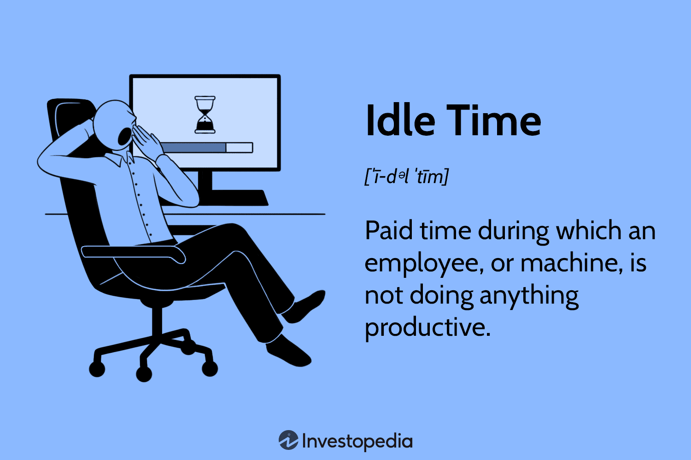

In today's competitive business environment, enhancing efficiency is essential for maintaining success. Efficiency involves optimizing resources to maximize output while minimizing waste. This process is crucial for businesses to remain competitive and profitable, as efficient operations can lead to increased productivity and reduced costs. 

Operational downtime and idle time are significant challenges to achieving business efficiency. Downtime refers to periods when operations are halted due to maintenance, failures, or transitions between tasks, leading to a loss of productive capacity. Idle time, on the other hand, occurs when resources are available but not actively engaged, resulting in unutilized potential. These inefficiencies can significantly impact a company's bottom line by increasing operational costs and reducing output.

This article explores the interconnection between idle time, operational downtime, and algorithmic trading. Algorithmic trading, which involves the use of computer algorithms to execute trades automatically, offers a prime example of how technology can address efficiency-related challenges. By understanding these elements, businesses can better leverage technology to improve performance and competitiveness. Algorithmic trading not only maximizes trading efficiency by executing decisions at speeds and frequencies beyond human capability but also highlights the broader potential of automation. Through the integration of sophisticated technologies, businesses can enhance their operational workflows, reducing waste and maximizing resource use. Ultimately, understanding and addressing these aspects of efficiency can empower businesses to sustain their competitive edge in rapidly evolving markets.

## Table of Contents

## Understanding Business Efficiency

Business efficiency refers to the capacity of an organization to maximize output with the least amount of input. It is a critical [factor](/wiki/factor-investing) in a company's ability to compete in today's economic landscape. Efficient businesses effectively allocate resources, reducing waste and unnecessary expenditure, thereby enhancing overall profitability.

One of the primary metrics used to assess business efficiency is labor productivity, which is calculated as the ratio of output produced to the input utilized, typically measured in labor hours. An example formula for labor productivity is:

$$
\text{Labor Productivity} = \frac{\text{Total Output}}{\text{Total Labor Hours}}
$$

Another vital metric is asset utilization, which evaluates how well a company uses its assets to generate income. This can be quantified using the asset turnover ratio:

$$
\text{Asset Utilization} = \frac{\text{Sales Revenue}}{\text{Total Assets}}
$$

Technological advancements, particularly in automation and data analytics, have significantly boosted business efficiency. Automation streamlines operations by reducing the need for manual intervention, thereby speeding up processes and minimizing human errors. Data analytics provides insights into customer behavior, market trends, and internal processes, enabling businesses to make informed decisions that enhance efficiency.

Process optimization is another key strategy for enhancing business efficiency. It involves refining workflows to eliminate inefficiencies and redundancies. By analyzing and redefining processes, companies can minimize waste and maximize output, ensuring that each operation contributes effectively to the organization's goals. Techniques such as lean management and Six Sigma are often employed to facilitate process optimization, focusing on increasing quality and efficiency while reducing waste. 

Overall, understanding and implementing strategies for business efficiency can lead to substantial improvements in a company's operational performance and competitiveness in the market.

## The Role of Capacity Utilization in Operational Performance

Capacity utilization is a critical indicator of how effectively an organization uses its resources to produce goods and services. It is calculated as the ratio of actual output to potential output, often expressed as a percentage. High capacity utilization signifies efficient use of production capabilities, which typically leads to reduced per-unit production costs and enhanced service levels. This efficiency arises because fixed costs are spread over a larger number of units, diminishing the cost burden per individual unit produced.

Balancing capacity with demand plays a pivotal role in operational efficiency. When an organization consistently operates at a level close to full capacity, it capitalizes on potential efficiencies and avoids the costs associated with underutilization, such as idle machinery and workforce downtime. However, operating consistently at maximum capacity can result in diminished quality, increased wear and tear on equipment, and a reduced ability to respond to unexpected demand surges or equipment failures.

Demand forecasting emerges as a crucial strategy for optimizing capacity utilization. By predicting future demand patterns based on historical data, businesses can adjust production schedules and maintain optimal stock levels. This approach minimizes the risk of overproduction, which can tie up capital in unsold inventory, or underproduction, which can lead to stockouts and lost sales opportunities.

Flexible production systems enhance the ability to adapt capacity in alignment with market demands. These systems incorporate advanced manufacturing techniques and technologies that allow for swift transitions between different production levels or product types. The advent of smart factories and Industry 4.0 technologies, such as IoT and AI-driven analytics, further enables businesses to anticipate and respond to fluctuating markets efficiently.

Regular evaluation of capacity is essential to ensure that production capabilities are in sync with ever-changing market demands. This involves continuous assessment of machinery, workforce, and technological capabilities to identify bottlenecks or underutilized resources. Steps are then taken to reallocate or expand resources, ensuring that production processes remain efficient and responsive.

In conclusion, optimizing capacity utilization is fundamental for operational performance. By strategically managing capacity, employing demand forecasting, and adapting flexible production systems, businesses can achieve substantial gains in efficiency, reduce costs, and improve service delivery, thereby enhancing their competitiveness in the market.

## Algorithmic Trading: Revolutionizing Financial Markets

Algorithmic trading automates the execution of trades by leveraging sophisticated algorithms that follow pre-defined rules. This automation significantly enhances the speed and precision of trading operations, thereby minimizing the likelihood of human errors. By employing advanced data analytics, [algorithmic trading](/wiki/algorithmic-trading) systems can identify and exploit real-time market trends. This ability to process and interpret large volumes of data swiftly provides traders with a competitive advantage in the fast-paced financial markets.

The inclusion of [machine learning](/wiki/machine-learning) models in algorithmic trading further refines the decision-making process. These models can analyze historical data and predict future price movements, offering traders insights that aid in making more informed decisions. For instance, a common practice involves using regression models to forecast asset prices:

$$
\text{Price}_\text{t+1} = \alpha + \beta \times \text{Price}_\text{t} + \epsilon
$$

Where $\alpha$ and $\beta$ are constants determined during the model training phase, and $\epsilon$ represents the model's error term.

By contributing to increased market [liquidity](/wiki/liquidity-risk-premium) and reduced transaction costs, algorithmic trading transforms the financial landscape. Enhanced liquidity means there is a higher number of buyers and sellers in the market, which reduces the bid-ask spread—the difference between the price a buyer is willing to pay and the price a seller is willing to accept. This reduction in spread directly correlates with lower transaction costs for all market participants.

One of the notable benefits of algorithmic trading is its impact on market efficiency. By facilitating quicker and more accurate trades, algorithmic systems improve the price discovery process, ensuring that asset prices more accurately reflect all available information. This leads to more robust and transparent markets, where resources are allocated more efficiently.

In conclusion, algorithmic trading represents a paradigm shift in financial markets by optimizing trade execution through automation, data analytics, and machine learning. Its ability to enhance market liquidity and reduce transaction costs underscores its transformative potential. As technology continues to evolve, the integration of even more sophisticated algorithms is likely to further revolutionize the trading environment, offering enhanced performance and efficiency.

## Synergies Between Algorithmic Trading and Business Efficiency

Algorithmic trading, or algo trading, exemplifies the transformative impact of automation and real-time analytics in enhancing business efficiency beyond the confines of financial markets. By leveraging complex algorithms to execute trades rapidly and accurately, businesses achieve operational superiority characterized by increased speed, reduced costs, and minimized human errors. These principles of automation and data-driven decision-making possess wide applicability across various business domains.

Real-time analytics, a cornerstone of algorithmic trading, involves the continuous analysis of data as it is generated. This capability is crucial for businesses striving to maintain a competitive edge, as it allows for immediate interpretation of data to make timely and informed decisions. In trading, this translates to the ability to capture fleeting market opportunities; for other sectors, it can mean optimizing real-time customer interactions or adjusting production workflows based on immediate feedback. For instance, in supply chain management, algorithms can predict demand patterns and optimize inventory levels, ensuring products are available where and when they are needed while minimizing excess stock and associated carrying costs.

Automated systems powered by algorithms also significantly enhance customer service responsiveness. These systems utilize analytics to interpret customer data, anticipate needs, and thereby provide rapid, personalized responses to queries. This leads to improved customer experience and satisfaction—a critical element in maintaining a competitive advantage. Such responsiveness is increasingly expected in today's fast-paced marketplace and automation facilitates meeting such expectations efficiently.

Furthermore, integrating algorithmic solutions into business processes offers a pathway to achieving competitive advantages and improved performance. In the context of supply chain, logistics, customer service, or any data-intensive sector, algorithmic solutions pave the way for streamlined processes, cost reductions, and enhanced accuracy. Consider a logistics company employing route optimization algorithms: by finding the most efficient paths, the company can cut fuel costs, reduce delivery times, and improve service reliability—all contributing to overall operational efficiency.

Ultimately, the principles underpinning algorithmic trading, such as real-time data analytics and automated decision-making, are not confined to financial markets. When appropriately adapted, these strategies can lead to significant improvements in efficiency across various sectors, helping businesses achieve greater competitiveness and agility in an ever-evolving market landscape.

## Strategies for Maximizing Capacity Utilization in Trading Firms

Trading firms operate in highly dynamic environments where market conditions can change rapidly. To maximize capacity utilization, firms must adopt strategies that allow them to handle varying demands efficiently. This involves leveraging technology and robust systems to enhance operational performance and maintain competitiveness in the market.

Scalable computing resources play a crucial role by allowing firms to adjust their infrastructure dynamically to meet fluctuating demands. This elastic computing capability ensures that firms can scale their operations up or down without unnecessary expenditure on idle resources, optimizing both performance and cost.

Adaptive algorithms are essential in minimizing downtime and effectively responding to market changes. These algorithms continuously process real-time data to adjust trading strategies, enabling firms to maintain peak performance even amid volatile conditions. By predicting and reacting to market trends swiftly, adaptive algorithms help in reducing latency in trade execution.

Regular system updates are necessary to integrate new tools and techniques into existing frameworks. Keeping systems up-to-date with the latest advancements in technology ensures that trading firms remain at the forefront of innovation. These updates enhance the ability of firms to process information efficiently, reducing the risks associated with outdated technology and methods.

Collaborations with technology providers are significant in enhancing infrastructure resilience. Partnering with specialized providers allows firms to access cutting-edge technology and support, crucial for maintaining robust and secure trading platforms. These collaborations often lead to shared insights and improvements in system reliability and efficiency.

Efficient capacity utilization directly influences trading performance and market competitiveness. By optimizing resource allocation and minimizing waste, trading firms can reduce operating costs and improve the speed and accuracy of their transactions. These efficiencies translate into better service delivery and gives firms a competitive edge in the financial markets. 

Overall, through strategic deployment of scalable resources, adaptive algorithms, and continuous technological collaboration, trading firms can significantly enhance their capacity utilization, ensuring sustained operational excellence and market leadership.

## Conclusion

The interaction between business efficiency, capacity utilization, and algorithmic trading is pivotal in shaping modern operational performance. Optimizing capacity relies heavily on advanced demand forecasting and the implementation of flexible systems. These approaches ensure resources are effectively aligned with market demands, minimizing waste and enhancing output. Algorithmic trading serves as a prime illustration of how automation can lead to significant cost reductions and improve accuracy by eliminating human error. The principles of automation and data analytics embodied in algorithmic trading can be extended to various business operations beyond finance. By adopting these principles, companies can streamline processes, improve resource management, and gain a competitive edge.

Businesses must remain adaptable, continuously integrating new technological advancements and data insights. This adaptability is critical not only for maintaining efficiency but also for ensuring ongoing competitiveness as markets evolve. Continuous learning and adaptation enable organizations to anticipate and respond to changes swiftly, which is essential for sustained success in today's fast-paced environment. By leveraging these strategies, businesses can enhance their operational performance and secure a robust position in their respective markets.

## References & Further Reading

Harvard Business School provides a comprehensive study on the prevalence and impact of idle time within organizations, highlighting how this can detract from overall business efficiency. Understanding and addressing idle time can lead to significant improvements in resource utilization and productivity, aligning closely with the principles discussed in operational performance and capacity utilization sections.

"Advances in Financial Machine Learning" by Marcos Lopez de Prado offers in-depth insights into the application of machine learning in financial markets, notably through algorithmic trading. This resource is critical for understanding how algorithms can enhance decision-making processes, predicting price movements with greater accuracy, and ultimately increasing trading efficiency. The book provides both theoretical foundations and practical implementations of machine learning in trading.

The dynamics of market liquidity and the influence of algorithmic trading are pivotal in modern financial markets. Algorithmic trading strategies have transformed traditional trading by significantly improving market liquidity, enabling faster and more efficient transactions, and reducing transaction costs. These dynamics are crucial for financial professionals seeking to comprehend current market structures and the role of technology in reshaping them.

Numerous [books](/wiki/algo-trading-books) and papers focus on algorithmic trading and business efficiency, offering a wealth of information for those interested in automating business processes. These resources generally explore data-driven methodologies, how companies can harness algorithms to improve supply chain management, inventory control, and customer responsiveness.

Technological advancements in trading, particularly those that enhance operational performance, are ongoing. The integration of scalable computing resources and adaptive algorithms in trading firms showcases significant developments. Continuous system updates and collaborations with technology providers contribute to infrastructure resilience and, consequently, to improved market competitiveness. These advancements provide a framework for businesses aiming to incorporate technology into their operations effectively, ensuring adaptability in an ever-evolving market landscape.

