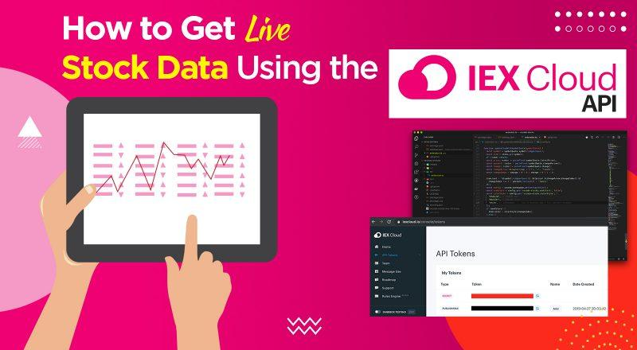

## Table of Contents

## What is the IEX API and what is it used for?

The IEX API is a tool provided by the Investors Exchange (IEX), which is a stock exchange in the United States. The API, or Application Programming Interface, allows developers to access financial data and services easily. This means that anyone who wants to build an app or a website that deals with stock market information can use the IEX API to get the data they need without having to gather it themselves.

People use the IEX API for many different reasons. For example, financial analysts might use it to get real-time stock prices and historical data to make better investment decisions. Also, companies that offer financial services can use the API to show their customers up-to-date market information. This makes it easier for everyone to stay informed about the stock market and make smart choices with their money.

## How do I sign up for an IEX API key?

To sign up for an IEX API key, you first need to visit the IEX Cloud website. Look for a button or link that says something like "Sign Up" or "Get Started." Click on it and you'll be asked to create an account. You'll need to enter your email address, choose a password, and maybe fill out some other basic information. Once you've done that, you'll get an email to confirm your account. Click on the link in the email to finish setting up your account.

After your account is set up, you can log in to the IEX Cloud website. Once you're logged in, look for a section that says "API Keys" or something similar. There, you'll find an option to create a new API key. Click on it, and you might be asked to name your key or choose what kind of access you want it to have. After you've made your choices, the website will give you a unique API key. Make sure to copy and save this key somewhere safe, because you'll need it to use the IEX API in your projects.

## What are the different types of data I can access through the IEX API?

The IEX API lets you get all sorts of stock market information. You can see the current prices of stocks, which is really helpful if you want to know how much a stock is worth right now. It also gives you historical data, so you can look at how a stock's price has changed over time. This can be useful for figuring out trends or making predictions about the future.

Besides stock prices, the IEX API also gives you information about companies. You can find out things like what a company does, who runs it, and how many people work there. This kind of information can help you understand a company better before you decide to invest in it. The API also has data on stock market news and events, so you can stay up-to-date with what's happening in the world of finance.

## How do I make a basic API request to the IEX API?

To make a basic API request to the IEX API, you need to use a tool like a web browser or a programming language that can send HTTP requests. First, you need to know the specific endpoint you want to use. For example, if you want to get the current price of a stock, you might use an endpoint like `https://cloud.iexapis.com/stable/stock/aapl/quote`. You'll need to replace `aapl` with the stock symbol you're interested in, like `msft` for Microsoft. Then, you add your API key to the end of the URL as a parameter, like this: `?token=YOUR_API_KEY`. So, the full URL might look like `https://cloud.iexapis.com/stable/stock/aapl/quote?token=YOUR_API_KEY`.

Once you have the full URL, you can send a GET request to that address. If you're using a web browser, you can just paste the URL into the address bar and hit enter. The browser will show you the data in a format like JSON, which is a way of organizing information that computers can read easily. If you're using a programming language like Python, you can use a library like `requests` to send the GET request and then process the JSON data that comes back. This way, you can use the data in your own programs or apps.

## What are the rate limits for the IEX API and how can I manage them?

The IEX API has rules about how often you can ask for information. These rules are called rate limits. For people using the free version of the IEX API, you can ask for data up to 100,000 times every month. If you need to ask more often, you can pay for a plan that lets you ask up to 50 times every second. It's important to keep track of how many times you're asking for data so you don't go over your limit.

To manage these limits, you can keep a count of how many times you've asked for data. Some programming languages have tools that can help you do this automatically. If you're close to your limit, you can slow down how often you're asking for data or wait until the next month when your limit resets. It's a good idea to plan your requests carefully so you don't run out of chances to get the information you need.

## How can I use the IEX API to retrieve real-time stock data?

To get real-time stock data using the IEX API, you need to send a request to the right part of the API. This part is called an endpoint, and for real-time stock prices, you can use the `quote` endpoint. For example, if you want to know the current price of Apple's stock, you would use the URL `https://cloud.iexapis.com/stable/stock/aapl/quote?token=YOUR_API_KEY`. Make sure to replace `YOUR_API_KEY` with the actual key you got from IEX. When you send this request, the API will give you back information like the current price, the highest price of the day, and the lowest price of the day.

Once you have the data, you can use it in many ways. If you're building a website or an app, you can show the current stock price to your users. Or, if you're an investor, you can use this real-time data to make quick decisions about buying or selling stocks. Just remember that the IEX API has limits on how often you can ask for data, so plan your requests carefully to stay within those limits.

## What are the best practices for handling errors and exceptions with the IEX API?

When using the IEX API, it's important to handle errors and exceptions well so your program doesn't break if something goes wrong. One way to do this is by checking the response from the API. If the response doesn't come back with the right kind of data or if there's an error message, you can catch this and deal with it without stopping your whole program. For example, you can use "try" and "catch" statements in your code to look for errors and handle them gracefully. This way, if the API is down or if you go over your rate limit, your app can show a friendly message to the user instead of crashing.

Another good practice is to log any errors you find. This means writing down what went wrong, when it happened, and maybe even what you were trying to do at the time. Keeping a record like this can help you fix problems later and make your app better. Also, it's a good idea to plan for common errors, like getting a "404 Not Found" if you ask for data that doesn't exist, or a "429 Too Many Requests" if you go over your rate limit. By planning for these errors, you can make your app more reliable and easier to use for everyone.

## How can I integrate the IEX API into a web application?

To integrate the IEX API into a web application, you first need to set up your web app to send requests to the API. You can do this by using a programming language like JavaScript, Python, or any other language that can make HTTP requests. For example, in JavaScript, you can use the `fetch` function to send a request to the IEX API endpoint, like `https://cloud.iexapis.com/stable/stock/aapl/quote?token=YOUR_API_KEY`. Once you get the data back, you can use it to update your web page. This could mean showing the current stock price, displaying a chart of historical data, or even letting users search for different stocks.

After you've set up the request, it's important to handle the data you get back from the API. You'll need to parse the JSON data that the API sends you, which means turning it into something your web app can use. For instance, if you're using JavaScript, you can use the `JSON.parse()` function to turn the data into a JavaScript object. Then, you can use this data to update your web page in real-time. Make sure to also handle any errors that might come up, like if the API is down or if you go over your rate limit. By planning for these errors, you can make your web app more reliable and user-friendly.

## What advanced features does the IEX API offer for financial analysis?

The IEX API offers several advanced features that can help with financial analysis. One of these features is the ability to get detailed financial data for a company, like their income statements, balance sheets, and cash flow statements. This information can be really useful if you want to understand how a company is doing financially and make smart investment choices. Another cool feature is the ability to get real-time and historical data on stock prices, which can help you spot trends and patterns in the market. This can be helpful for making predictions about where stock prices might go in the future.

Another advanced feature of the IEX API is the ability to access data on stock market news and events. This means you can stay up-to-date with what's happening in the financial world, which can affect stock prices and market trends. The API also lets you use technical indicators, which are tools that help analyze stock price movements and make trading decisions. By using these advanced features, you can do a deeper analysis of the stock market and make more informed decisions about your investments.

## How can I use the IEX API to perform historical data analysis?

To perform historical data analysis with the IEX API, you can use the `chart` endpoint to get past stock prices. For example, if you want to see how Apple's stock did over the last year, you would use a URL like `https://cloud.iexapis.com/stable/stock/aapl/chart/1y?token=YOUR_API_KEY`. This will give you a list of prices for each day in the last year. You can then use this data to look for patterns or trends, like if the stock goes up or down at certain times of the year.

Once you have the historical data, you can use it to do things like calculate the average price of the stock over time or see how much the price changes from day to day. This can help you understand how the stock has performed in the past and maybe even guess how it might do in the future. By using the IEX API to get this data, you can make better decisions about buying or selling stocks based on what's happened before.

## What are some common pitfalls to avoid when using the IEX API?

One common pitfall when using the IEX API is not keeping track of your rate limits. The API has rules about how often you can ask for data, and if you go over these limits, your requests might get blocked. This can stop your app from working right, so it's important to count your requests and plan them carefully. If you're close to your limit, you might need to slow down or wait until the next month when your limit resets.

Another pitfall is not handling errors well. Sometimes, the API might be down or you might ask for data that doesn't exist. If you don't plan for these problems, your app could crash and leave your users confused. It's a good idea to use "try" and "catch" statements in your code to deal with these errors gracefully. This way, you can show a friendly message to your users instead of letting the app break.

Lastly, it's easy to forget to update your API key or use it correctly. Your API key is like a special password that lets you use the IEX API, and if you don't include it in your requests or if it's expired, you won't get any data. Always make sure your key is up-to-date and that you're using it the right way in your requests.

## How can I optimize my use of the IEX API for large-scale data processing?

When you need to process a lot of data with the IEX API, it's important to be smart about how you ask for that data. One way to do this is by using the API's batch requests feature. This lets you ask for information about many different stocks all at once instead of asking for each stock one by one. This can save you time and help you stay within your rate limits. Another good idea is to use the API's endpoints that let you get data for a whole year or more at once. This means you don't have to send as many requests, which can make your data processing faster and more efficient.

Another thing to think about is how you handle the data once you get it. It's a good idea to store the data you get from the API in a database or a file on your computer. This way, you don't have to ask the API for the same information over and over again. You can also use tools like caching, which means keeping some of the data in memory so you can get to it quickly without asking the API again. By doing these things, you can make your large-scale data processing smoother and more efficient.

## References & Further Reading

[1]: Bergstra, J., Bardenet, R., Bengio, Y., & Kégl, B. (2011). ["Algorithms for Hyper-Parameter Optimization."](https://papers.nips.cc/paper/4443-algorithms-for-hyper-parameter-optimization) Advances in Neural Information Processing Systems 24.

[2]: ["Advances in Financial Machine Learning"](https://www.amazon.com/Advances-Financial-Machine-Learning-Marcos/dp/1119482089) by Marcos Lopez de Prado

[3]: ["Evidence-Based Technical Analysis: Applying the Scientific Method and Statistical Inference to Trading Signals"](https://www.amazon.com/Evidence-Based-Technical-Analysis-Scientific-Statistical/dp/0470008741) by David Aronson

[4]: ["Machine Learning for Algorithmic Trading"](https://github.com/stefan-jansen/machine-learning-for-trading) by Stefan Jansen

[5]: ["Quantitative Trading: How to Build Your Own Algorithmic Trading Business"](https://books.google.com/books/about/Quantitative_Trading.html?id=j70yEAAAQBAJ) by Ernest P. Chan