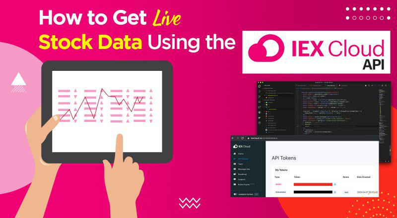

The financial markets have undergone a profound transformation with the integration of advanced technologies, particularly influencing stock exchanges and trading practices. The advent of algorithmic trading stands as one of the pivotal advancements, reshaping the methodologies through which trades are executed. In this evolving landscape, the IEX Group has positioned itself as a significant influencer, playing a crucial role in redefining trading norms and practices.

Algorithmic trading, a process of using computer programs and algorithms to automatically execute trades at speeds and frequencies beyond human capability, has revolutionized modern trading. These systems rely on complex mathematical models to decide the optimal timing, pricing, and execution of trades, often capitalizing on opportunities faster than traditional manual trading methods. The IEX Group has emerged as a noteworthy entity in this transformation, advocating for a trading environment that emphasizes fairness and integrity.

This article aims to explore the innovations that the IEX Group has introduced within the stock exchange domain, emphasizing its influence on algorithmic trading. As an architect of change, IEX Group has introduced several mechanisms and strategies to create a more equitable trading landscape, challenging traditional paradigms and prompting reforms that address long-standing inequities within the market structure. This exploration will shed light on how IEX’s strategic initiatives have fostered a more balanced trading field, ultimately benefiting a wide spectrum of market participants by ensuring that access and opportunities are more uniformly distributed.

The focus of this article will be on unpacking the seminal contributions and technological advancements made by IEX Group, along with assessing their impact on algorithmic trading. Furthermore, there will be a discussion on how IEX’s commitment to transparency and fairness serves as a guideline for future improvements in stock exchanges, paving the way for a more just and efficient financial market system.

## Table of Contents

## IEX Group: A Pioneer in the Stock Exchange World

Founded in 2012, the Investors Exchange (IEX) Group quickly distinguished itself as a significant player among alternative trading systems in the United States. This organization emerged during a period when traditional stock exchanges were facing scrutiny over fairness and transparency, primarily due to the rise of high-frequency trading (HFT) practices. Recognizing an opportunity to innovate, IEX set a foundation focused on equalizing trading opportunities across the market.

The pivotal transformation of IEX occurred in 2016 when it transitioned from being an Alternative Trading System (ATS) to a full-fledged national stock exchange. This transition was not merely a change in status but a significant milestone for IEX, as it provided them with the regulatory recognition and operational capacities akin to established exchanges such as the NYSE and NASDAQ. This milestone allowed IEX to operate with a greater impact while adhering to the stringent regulations and guidelines applicable to national exchanges.

IEX’s market design is a standout feature, primarily aimed at leveling the playing field for investors. Central to this design is the introduction of its "speed bump" — a 350-microsecond delay applied to all incoming and outgoing orders. This mechanism serves to mitigate the speed advantage sought by certain [HFT](/wiki/high-frequency-trading-strategies) firms and thereby reduces the risk of manipulative trading behaviors such as latency [arbitrage](/wiki/arbitrage). By implementing this delay, IEX ensures that no single trader can exploit technological speed to gain unfair advantages over others, fostering an environment of transparency and fairness.

Moreover, IEX eschews the widespread practice of offering rebates to traders. These rebates are financial incentives provided to market participants to attract order flow. However, such practices have been criticized for creating conflicts of interest that can deter fairness. By avoiding rebates, IEX distinguishes itself from competitors and aligns its interests more closely with that of market fairness and investor protection.

In essence, IEX Group’s journey from an ATS to a national stock exchange reflects its pioneering approach to creating a market infrastructure that prioritizes equality and transparency. Through its unique mechanisms and a firm commitment to ethical trading practices, IEX continues to challenge traditional norms and offers a compelling alternative for trading within the U.S. financial markets.

## Technological Innovations by IEX

IEX Group is recognized for its technological innovations, most notably the implementation of the 350-microsecond "speed bump." This intentional delay is designed to eliminate the speed advantage held by high-frequency traders, who often use superior technology to execute trades at nanosecond speeds. By introducing this deliberate latency, IEX aims to ensure that all market participants have a fair opportunity to react to market conditions, thereby fostering a more equitable trading environment.

Unlike many other exchanges, IEX refrains from offering rebates to market makers. Rebates are financial incentives provided to traders who add [liquidity](/wiki/liquidity-risk-premium) to the market, often leading to conflicts of interest where brokers might route orders based on rebate structures rather than best execution for the client. By avoiding these rebate practices, IEX distinguishes itself as a platform with an emphasis on transparency and fairness.

Further technological features introduced by IEX include the Crumbling Quote Indicator (CQI) and Discretionary Limit (D-Limit) orders. The CQI is an advanced predictive model that identifies moments when the market is likely to move unfavorably, often triggered by brief but intense periods of [volatility](/wiki/volatility-trading-strategies). This indicator helps in protecting investors by flagging these periods and preventing trades that may be negatively impacted by sudden market changes.

The D-Limit order leverages the Crumbling Quote Indicator to offer a protective measure for investors. When a D-Limit order is placed, it executes at the limit price only if the Crumbling Quote Indicator is not active. If the indicator shows adverse conditions, the order reverts to a non-displayed status, effectively pausing execution until conditions stabilize. This mechanism helps prevent high-frequency traders from exploiting fleeting market conditions to the detriment of other investors.

These advancements underscore IEX's mission to create a trading environment that prioritizes fairness and transparency, counterbalancing the systemic advantages often wielded by high-frequency trading firms. Through these measures, IEX contributes to a more balanced marketplace where technological prowess does not inherently equate to preferential trading outcomes.

## Impact on Algorithmic Trading

IEX Group has made significant contributions to the field of [algorithmic trading](/wiki/algorithmic-trading) by reshaping how strategies are executed and promoting a more equitable trading environment. One of the core ways IEX achieves this is through its robust API offerings, which provide algorithmic traders with access to high-quality financial data. The IEX Cloud API is particularly popular, supplying real-time and historical market data that is crucial for developing and [backtesting](/wiki/backtesting) trading algorithms. It allows traders to implement data-driven strategies with greater precision, reducing the reliance on less reliable sources.

Furthermore, IEX's distinctive market design, most notably the 350-microsecond 'speed bump', is pivotal in neutralizing the benefits that might be otherwise exploited by high-frequency traders (HFTs). This deliberate delay ensures a more level playing field, mitigating the risk of latency arbitrage. By doing so, IEX minimizes the speed advantage that some algorithmic traders might have due purely to infrastructure, encouraging skill and strategy over technological prowess.

Complementing this is the Crumbling Quote Indicator (CQI), a predictive tool that indicates imminent market movement. CQI identifies when orders are more likely to be executed adversely, thereby allowing algorithms to adjust their strategies in response to predicted market conditions. This enhances the ability of traders to safeguard their interests against high-frequency strategies that seek to exploit rapid quote changes.

One of the more advanced order types offered by IEX is the Discretionary Limit (D-Limit) order. The D-Limit order automatically adjusts the limit price to preserve a trader’s advantage when market conditions are about to change unfavorably, according to the CQI. This order type is particularly attractive to algorithmic traders aiming to avoid adverse price movements, thereby aligning execution with ideal market conditions.

Several case studies underscore the efficacy of these tools in optimizing trading performance. Traders leveraging IEX’s data and unique order types have reported improvements in execution quality and strategy refinement. These traders can engage with the market on a more equitable basis, focusing on strategy development rather than competing on speed. Consequently, IEX not only supports but significantly enhances the landscape of algorithmic trading, fostering a more inclusive and competitive environment. 

Overall, IEX's innovations in technology and market structure play a vital role in shaping algorithmic trading strategies, emphasizing fair competition, and empowering traders with sophisticated tools to navigate complex market dynamics effectively.

## Future of IEX in Financial Markets

IEX Group is poised to make significant strides in the financial markets, with plans to expand into options trading and continue pioneering innovations. Their interest in launching an options exchange is a strategic move aimed at addressing current market inefficiencies, such as asymmetric information flows and latency arbitrage. By incorporating their hallmark innovations like the "speed bump," IEX intends to introduce a new level of fairness and transparency to options trading, reducing advantages currently exploited by high-frequency traders.

The expansion into options is expected to diversify IEX's offerings and enhance its market presence, providing traders with a broader range of financial instruments underpinned by the same principles of equity and integrity. This initiative aligns with the market's growing demand for more comprehensive trading platforms and the need for alternatives that minimize systemic risk. 

Transparency remains at the core of IEX’s ethos, as evidenced by its continuous efforts to ensure traders, regardless of size or speed capabilities, operate on a level playing field. As such, IEX's potential entry into the options market may incorporate advanced data analytics and [machine learning](/wiki/machine-learning) tools to enhance market surveillance and order routing processes. These technological efforts are designed to detect and mitigate manipulative trading practices, preparing IEX for potential regulatory developments that emphasize market integrity and investor protection.

Looking forward, IEX's commitment to transparency and fairness positions it as a transformative force in the financial markets. By continuing to innovate and expand its platform capabilities, IEX not only fortifies its competitive edge but also plays a vital role in shaping a more equitable and efficient trading environment. This strategic vision will likely attract a broader base of market participants, fostering greater liquidity and stability in financial markets.

## Conclusion

IEX Group continues to play a pivotal role in advancing the infrastructure of stock exchange systems and algorithmic trading. This organization is recognized for its groundbreaking initiatives that promote equitable trading environments, setting a benchmark for the financial markets of the future. IEX's steadfast dedication to fairness and transparency distinguishes it as a leader in the industry, fostering trust and integrity across trading platforms.

For algorithmic traders, IEX provides a wealth of resources that enhance the development and execution of sophisticated trading strategies. The exchange's robust API offerings grant traders access to high-quality, transparent financial data, enabling them to harness valuable information to optimize their trading models. By doing so, IEX assists traders in refining their strategies, thereby improving performance in an ever-evolving market landscape. These advancements by IEX have not only redefined traditional trading paradigms but also ensured that market operations are more inclusive and transparent, benefitting both institutional and individual investors alike. 

In summary, the commitment and innovations of IEX Group substantiate its position as a model for future markets, demonstrating how a focus on equitable practices can lead to sustained success and trust in financial systems.

## References & Further Reading

[1]: IEX Group, Inc. ["The Investors Exchange: Trading Platform, Stock Exchange, Non-Display Fast Liquidity Solutions"](https://www.iex.io/) 

[2]: Patterson, Scott. ["Dark Pools: The Rise of the Machine Traders and the Rigging of the U.S. Stock Market"](https://www.amazon.com/Dark-Pools-Machine-Traders-Rigging/dp/0307887189) 

[3]: Lewis, Michael. ["Flash Boys: A Wall Street Revolt"](https://en.wikipedia.org/wiki/Flash_Boys) 

[4]: Securities and Exchange Commission. ["Order Granting the Application of Investors' Exchange, LLC for Registration as a National Securities Exchange"](https://www.sec.gov/files/rules/sro/cboeedgx/2025/34-102084.pdf) 

[5]: Aldridge, Irene. ["High-Frequency Trading: A Practical Guide to Algorithmic Strategies and Trading Systems"](https://www.amazon.com/High-Frequency-Trading-Practical-Algorithmic-Strategies/dp/1118343506)