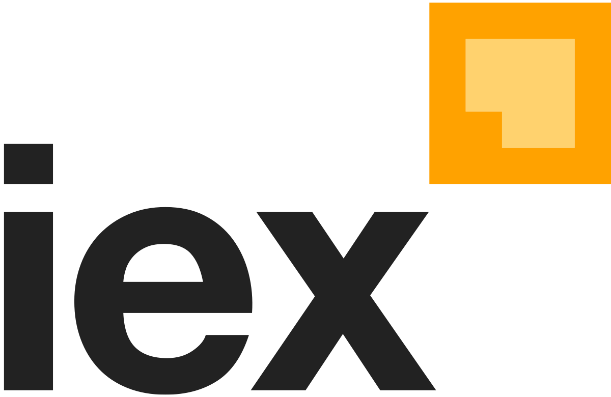

## Table of Contents

## What is the IEX Trading Platform?

IEX, which stands for Investors Exchange, is a stock exchange in the United States that was created to improve fairness in the stock market. It was started by a group of people who wanted to make trading more transparent and give everyone a fair chance. IEX works a bit differently from other exchanges because it uses a special technology to slow down trades by just a tiny bit. This helps to stop some traders from using high-speed computers to get an advantage over others.

The main idea behind IEX is to level the playing field for all investors. By slowing down trades, IEX makes it harder for big firms with fast computers to see and react to market changes before everyone else. This is important because it helps to create a more honest and equal market where everyone has the same information at the same time. Since it started, IEX has become popular among investors who care about fairness and transparency in the stock market.

## How did IEX get started and what was its primary goal?

IEX got started in 2012 by a group of people who used to work at a big trading company called RBC Capital Markets. They saw a problem in the stock market where some traders with fast computers could make money before others even knew what was happening. These people, led by Brad Katsuyama, wanted to change this. They created IEX to make trading fair for everyone, not just the people with the fastest technology.

The main goal of IEX was to level the playing field in the stock market. They wanted to make sure that all investors, big or small, had the same chance to buy and sell stocks. To do this, IEX used a special technology that slowed down trades just a tiny bit. This small delay helped stop the fast traders from getting an unfair advantage. By doing this, IEX aimed to make the stock market more honest and transparent for everyone.

## What makes IEX different from other stock exchanges?

IEX is different from other stock exchanges because it focuses on making trading fair for everyone. Most other exchanges let traders with fast computers get information and make trades before others. IEX uses a special technology that slows down trades by a tiny bit. This small delay stops the fast traders from getting an unfair advantage. By doing this, IEX makes sure that all investors, whether big or small, have the same chance to buy and sell stocks.

Another way IEX stands out is its commitment to transparency. Many other exchanges have complex systems that can be hard to understand. IEX keeps things simple and open so that everyone can see how trading works. This helps build trust in the market. IEX also works hard to keep the market honest by making sure no one can cheat or use tricks to make money unfairly. This focus on fairness and transparency is what makes IEX different from other stock exchanges.

## How does the IEX trading process work?

When you want to buy or sell a stock on IEX, you send your order to the exchange. IEX then checks if there's someone who wants to do the opposite trade. If there is, IEX matches your order with theirs. But before the trade happens, IEX uses a special technology called a "speed bump." This speed bump is a tiny delay that slows down all orders by just 350 microseconds. This small delay helps make sure that everyone has a fair chance to trade, not just the people with the fastest computers.

Once the speed bump is done, IEX looks at all the orders it has. It tries to find the best price for your trade. If it can, IEX will make the trade happen at that price. If it can't find a good match right away, your order might wait in the system until a match is found. This whole process is designed to be fair and transparent, so everyone knows what's happening and has the same chance to trade.

## What is the IEX signal and how does it help prevent high-frequency trading abuses?

The IEX signal is a special tool that IEX uses to stop high-frequency traders from getting an unfair advantage. High-frequency traders use very fast computers to see what other people are doing in the market and then make trades before everyone else. The IEX signal helps by sending a message to these traders that makes them think their fast trades won't work. This message, or signal, tricks the high-frequency traders into thinking they can't make money from their fast trades, so they don't do them.

By using the IEX signal, IEX makes the market fairer for everyone. It stops high-frequency traders from using their speed to see and react to market changes before other people. This means that all investors, whether they have fast computers or not, have a better chance to trade on equal terms. The IEX signal is a big part of how IEX works to make sure the stock market is honest and fair for everyone.

## What types of securities can be traded on IEX?

On IEX, you can trade different types of securities, like stocks and exchange-traded funds (ETFs). Stocks are shares in a company that you can buy and sell. ETFs are like baskets of stocks or other assets that you can trade like a single stock. IEX lets you trade these securities during regular trading hours, which are from 9:30 AM to 4:00 PM Eastern Time, Monday through Friday.

IEX also has a special kind of trading called "odd lot" trading. Odd lots are orders for fewer than 100 shares. Most other exchanges don't pay much attention to odd lot trades, but IEX makes sure they are treated fairly. This helps small investors who might not be buying or selling big blocks of shares. By offering these types of securities and trading options, IEX makes sure that everyone can trade in a fair and transparent way.

## How can someone start trading on the IEX platform?

To start trading on the IEX platform, you first need to open an account with a brokerage firm that uses IEX. Not all brokers let you trade on IEX, so you need to pick one that does. Once you have your account set up, you can start sending orders to buy or sell stocks or ETFs through your broker. Your broker will send your orders to IEX, and IEX will try to match your order with someone else's order.

After you send your order, IEX uses its special technology, like the speed bump and the IEX signal, to make sure everyone gets a fair chance to trade. The speed bump slows down all orders a tiny bit, and the IEX signal stops high-frequency traders from getting an unfair advantage. This way, whether you're a big investor or a small one, you can trade on IEX knowing that it's a fair and honest place to buy and sell securities.

## What are the fees associated with trading on IEX?

When you trade on IEX, you might have to pay some fees. These fees can come from your brokerage firm, which is the company you use to buy and sell stocks. The fees can be different depending on which broker you use. Some brokers might charge you a fee every time you make a trade, while others might have a monthly fee or no fees at all. It's a good idea to check with your broker to see what fees they charge for trading on IEX.

IEX itself also has some fees, but they are usually small. IEX charges a fee to the people who are selling stocks, which is called a "taker fee." This fee is usually around $0.0003 per share. If you are buying stocks, you might get a small credit, called a "maker rebate," which is about $0.0002 per share. These fees and rebates help IEX keep the market fair and running smoothly. Always remember to look at the fees from both your broker and IEX before you start trading.

## How does IEX ensure fair and transparent trading?

IEX makes sure trading is fair and clear by using special technology. One of these is a tiny delay called a "speed bump" that slows down all trades by just 350 microseconds. This small delay stops fast traders from getting information and making trades before everyone else. By doing this, IEX makes sure that all investors, whether they have fast computers or not, have the same chance to trade. This helps to create a level playing field where everyone can compete fairly.

Another way IEX keeps trading honest is by using the IEX signal. This signal tricks high-frequency traders into thinking their fast trades won't work, so they don't do them. This stops these traders from using their speed to see and react to market changes before other people. IEX also keeps things simple and open, so everyone can see how trading works. This transparency helps build trust in the market and makes sure no one can cheat or use tricks to make money unfairly. By focusing on fairness and openness, IEX helps make the stock market a better place for all investors.

## What role does IEX play in the broader financial ecosystem?

IEX plays an important part in the bigger world of money and trading. It works to make the stock market more fair for everyone. Many other exchanges let fast traders use their speed to make money before others. IEX stops this by using a small delay, called a speed bump, and a special signal. These tools make sure that all investors, big or small, have the same chance to buy and sell stocks. This helps to make the market more honest and fair.

IEX also helps to keep the market clear and open. It does this by making sure everyone can see how trading works. This transparency builds trust and stops people from cheating. By doing all this, IEX makes the whole financial world a better place. It shows that the market can work well for everyone, not just the people with the fastest computers. This is why IEX is important in the broader financial ecosystem.

## How has IEX influenced regulatory changes in the stock market?

IEX has made a big difference in how the stock market is run. It showed that it's possible to make trading fair for everyone, not just the people with fast computers. This made people who make the rules for the stock market, called regulators, think about how to make things better. IEX's use of a small delay, called a speed bump, and a special signal to stop fast traders from getting an unfair advantage got a lot of attention. This led to talks about new rules to make the whole market more fair.

Because of IEX, regulators started looking at ways to stop high-frequency trading from hurting other investors. They thought about making rules that would slow down trades a little bit, just like IEX does. This would help make sure everyone has the same chance to trade. IEX's focus on being clear and open also pushed regulators to think about making the whole market more transparent. This way, everyone can see what's happening and trust that the market is fair.

## What are the future developments and innovations planned for IEX?

IEX is always looking for new ways to make the stock market even better and fairer for everyone. They want to keep using their special technology, like the speed bump and the IEX signal, to stop fast traders from getting an unfair advantage. But they also want to find new tools and ideas that can help make trading even more honest and clear. They might work on making their systems faster and easier to use, so that all investors can trade without any trouble. This could mean new software or ways of doing things that make trading simpler and more open.

Another thing IEX might do is start offering more types of securities to trade. Right now, you can trade stocks and ETFs on IEX, but they could add other things like bonds or options. This would give investors more choices and help make the market even more fair. IEX also wants to keep working with the people who make the rules for the stock market, called regulators, to push for changes that make the whole market better. By doing all these things, IEX hopes to keep leading the way in making the stock market a place where everyone can trade fairly and with trust.

## References & Further Reading

[1]: IEX Group, Inc. ["The Investors Exchange: Trading Platform, Stock Exchange, Non-Display Fast Liquidity Solutions"](https://www.iex.io/) 

[2]: Patterson, Scott. ["Dark Pools: The Rise of the Machine Traders and the Rigging of the U.S. Stock Market"](https://www.amazon.com/Dark-Pools-Machine-Traders-Rigging/dp/0307887189) 

[3]: Lewis, Michael. ["Flash Boys: A Wall Street Revolt"](https://en.wikipedia.org/wiki/Flash_Boys) 

[4]: Securities and Exchange Commission. ["Order Granting the Application of Investors' Exchange, LLC for Registration as a National Securities Exchange"](https://www.sec.gov/files/rules/sro/cboeedgx/2025/34-102084.pdf) 

[5]: Aldridge, Irene. ["High-Frequency Trading: A Practical Guide to Algorithmic Strategies and Trading Systems"](https://www.amazon.com/High-Frequency-Trading-Practical-Algorithmic-Strategies/dp/1118343506)