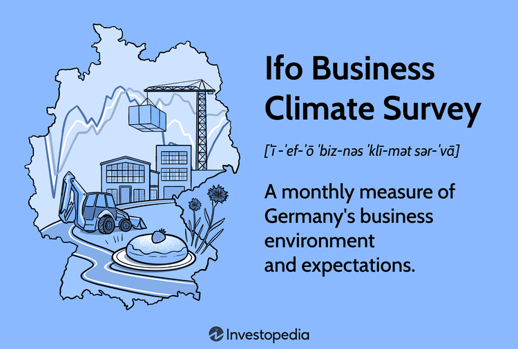

In the economic world, keeping track of market indicators is crucial for both policymakers and investors. One such essential indicator is the Ifo Business Climate Index. Based on a survey conducted by the Ifo Institute, this index provides valuable insights into the business climate in Germany—a key player in the global economy. The Ifo Business Climate Index is recognized for its ability to reflect changes in economic conditions and sentiments, making it an indispensable tool for evaluating the economic landscape.

Understanding this index is beneficial not only for traditional investors but also for algorithmic traders who aim to forecast economic trends and make informed decisions. The index's comprehensive approach captures nuanced shifts in business sentiment across various sectors, thus enabling stakeholders to anticipate potential economic developments. By assessing current business conditions and expectations, the Ifo Business Climate Index offers a dynamic view of economic confidence.



In this article, we explore the Ifo Business Climate Survey's methodology, implications for economic confidence in the EU, and its utility in algorithmic trading environments. By analyzing the index, we can better grasp the economic forces at play and fine-tune our strategies to respond efficiently to market changes.

## Table of Contents

## Understanding the Ifo Business Climate Survey

The Ifo Business Climate Survey serves as a pivotal economic indicator that offers a monthly analysis of the business environment within Germany. Conducted meticulously by the Munich-based Ifo Institute for Economic Research, this survey garners insights from around 9,000 firms across diverse sectors, including manufacturing, construction, services, and trade. Each month, businesses from these sectors provide assessments of two critical aspects: their current business situations and their expectations for the upcoming six months.

The Ifo Business Climate Index is derived from these evaluations and is intended to furnish businesses and investors with vital data to comprehend prevailing and anticipated economic conditions. The methodology involves calculating a balance between positive and negative responses, which are then seasonally adjusted to ensure accuracy across different periods.

For instance, suppose a survey produces the following raw data from respondents regarding their current business situation: 30% report good conditions, 50% satisfactory, and 20% poor. The balance is then computed as $\text{Balance} = (\text{Percentage Reporting Good} - \text{Percentage Reporting Poor}) = (30 - 20) = 10$. This balance assists in creating the index value, which is a critical component of the survey.

By analyzing these results, businesses can make informed decisions concerning resource allocation, investment strategies, and market initiatives. Investors utilize this index to identify economic trends and potential market shifts, enabling them to strategize effectively. The insights offered by the Ifo Business Climate Index are instrumental in facilitating preparedness for any economic fluctuations that might affect Germany, a key player in the global economic landscape.

## The Significance of the Ifo Business Climate Index

Germany, as Europe's largest economy, plays a pivotal role in shaping the economic trajectory of the European Union. The Ifo Business Climate Index holds particular significance as a measure of this influence, providing a comprehensive snapshot of business sentiment across various sectors. This index is derived from responses collected from around 9,000 firms, capturing their assessments of the current business climate and future expectations within manufacturing, construction, services, and trade.

The impact of the Ifo Business Climate Index extends beyond a simple reflection of business sentiment. It serves as a valuable predictor of economic cycles, such as recessions or expansions. By analyzing historical data and trends indicated by the index, economists and investors can identify patterns that precede shifts in the economic cycle. For instance, a consistent decline in the index over subsequent months may herald an impending economic downturn, whereas a rising trend could indicate an upcoming period of economic growth.

Global investors and economists closely monitor the Ifo Business Climate Index to gain insights into potential economic turning points. The index acts as a vital barometer, helping stakeholders anticipate changes in the economic landscape. By providing an early warning system for economic fluctuations, the index plays an essential role in strategic planning and decision-making. Investors, in particular, use the insights from the Ifo Index to adjust their portfolios and investment strategies in anticipation of market changes, thereby optimizing returns and mitigating risks.

The widespread use of the Ifo Business Climate Index underscores its importance as an economic indicator. It not only reflects the state of business confidence within Germany but also influences macroeconomic policy decisions at the European level. Policymakers can leverage the insights from the index to formulate effective fiscal and monetary policies that align with the prevailing economic conditions. The ability to act preemptively based on informed predictions further enhances the utility of the Ifo Business Climate Index as a critical tool in economic analysis and policy formulation.

## Linking the Ifo Index to Business Confidence

The Ifo Business Climate Index functions as a key indicator of business confidence within Germany and the broader European Union. This Index is pivotal in measuring the prevailing sentiment among businesses regarding the economic environment. When the Index shows higher readings, it signifies increasing confidence among businesses about future economic prospects. Such confidence can stimulate investment activities and influence spending decisions, as businesses are more inclined to expand operations and invest in capital projects when they feel optimistic about future economic conditions.

The Index's significance extends beyond mere business confidence. It is an essential tool for policymakers, who utilize it to gauge the general mood of businesses—whether optimistic or pessimistic—within the economy. This understanding aids policymakers in crafting fiscal and monetary policies that are responsive to current economic conditions. For instance, if the Index indicates a downturn in business confidence, policymakers might consider implementing expansionary fiscal or monetary policies to boost economic activities.

By analyzing historical data and trends associated with the Ifo Index, one can identify patterns that correlate with economic cycles. For example, rising indices often precede economic expansions, while declining indices may signal impending recessions. This predictive capability makes the Ifo Index invaluable for stakeholders aiming to preemptively address shifts in economic conditions. This symbiotic relationship between the Index and economic confidence underpins its utility in both assessing and influencing the economic trajectory within the EU bloc.

## Ifo Business Climate Index and Algo Trading

Algorithmic trading systems rely heavily on data for making informed and timely trading decisions. The Ifo Business Climate Index, which reflects current business sentiment and expectations in Germany, serves as a valuable resource for such systems. Insights from this index can aid in anticipating market shifts, allowing algorithmic traders to optimize their strategies accordingly.

Algorithmic trading leverages predefined rules and market analysis, often integrated with real-time data feeds, to execute trades at high speeds. When trends from the Ifo Index indicate a positive (or negative) shift in business confidence, algorithmic systems can use this data to predict corresponding market behaviors. For instance, a rising Ifo Index might signal economic expansion, prompting algorithms to increase buying activities in sectors expected to benefit from such growth.

At the heart of [algorithmic trading](/wiki/algorithmic-trading) systems is the implementation of mathematical models and statistical techniques to derive actionable insights. These models can be designed to trigger specific actions based on set thresholds or patterns detected within the Ifo index data. Python, with its robust libraries such as NumPy, pandas, and scikit-learn, provides the tools necessary for constructing and back-testing such models.

Consider the following example in Python that demonstrates how a simple trading algorithm could be configured to respond to changes in the Ifo Index:

```python
import pandas as pd
import numpy as np

# Sample Ifo Index data
ifo_data = pd.DataFrame({
    'date': pd.date_range(start='2023-01-01', periods=12, freq='M'),
    'ifo_index': [95.0, 96.5, 94.8, 97.1, 97.5, 98.3, 99.2, 98.6, 99.8, 100.2, 101.0, 102.3]
})

# Calculate the percent change in the index
ifo_data['percent_change'] = ifo_data['ifo_index'].pct_change()

# Define a simple strategy
def trading_signal(row):
    if row['percent_change'] > 0.02:  # Arbitrary threshold for demonstration
        return 'buy'
    elif row['percent_change'] < -0.02:
        return 'sell'
    else:
        return 'hold'

# Apply the strategy
ifo_data['signal'] = ifo_data.apply(trading_signal, axis=1)

print(ifo_data[['date', 'ifo_index', 'percent_change', 'signal']])
```

In this script, the Ifo index's percent change is calculated, and a trading signal is generated based on predetermined thresholds. Such models can be fine-tuned to incorporate more sophisticated indicators derived from the Ifo data, potentially yielding more nuanced trading strategies.

Furthermore, the ability to forecast market movements based on economic indicators like the Ifo Business Climate Index is vital in an increasingly data-driven financial landscape. By continuously refining trading algorithms and incorporating advanced [machine learning](/wiki/machine-learning) methods, traders can enhance predictive accuracy and market responsiveness.

Ultimately, integrating the Ifo Index into algorithmic trading models can lead to optimized trading performance, helping traders navigate the complexities of global financial markets with greater precision and confidence.

## Conclusion

The Ifo Business Climate Index is an indispensable tool for assessing economic sentiment in Germany, with broader implications for the European Union. As an authoritative measure, it provides essential insights into both the current state and anticipated future conditions of the business environment. This information is crucial for a wide range of stakeholders, including investors, policymakers, and traders. Investors rely on the index to predict economic cycles and adjust their portfolios accordingly, while policymakers use it to guide fiscal and monetary policy decisions by understanding business confidence levels.

In financial markets, where speed and accuracy can significantly impact profit margins, the Ifo Index data becomes particularly valuable for algorithmic traders. Advanced trading algorithms can be programmed to respond to trends and shifts indicated by the index. For instance, increased business confidence, reflected by a higher index reading, may signal traders to adopt more aggressive trading strategies, integrating real-time economic data to anticipate market movements.

By leveraging such data, traders can optimize their strategies to better align with expected macroeconomic developments. The implementation of automated systems allows for rapid execution of trades, minimizing human error and potentially enhancing returns. Overall, the Ifo Business Climate Index stands out as a powerful indicator, aiding various economic actors in making informed decisions based on reliable and timely economic sentiment data.

## References & Further Reading

[1]: Ifo Institute for Economic Research. ["The Ifo Business Climate Index."](https://www.ifo.de/en/facts/2024-12-17/ifo-business-climate-index-falls-december-2024)

[2]: Statista. ["Ifo Business Climate Index in Germany."](https://www.statista.com/statistics/1279692/ifo-business-climate-index-germany/)

[3]: Lopez de Prado, M. (2018). ["Advances in Financial Machine Learning."](https://www.amazon.com/Advances-Financial-Machine-Learning-Marcos/dp/1119482089) Wiley.

[4]: Gerhard, M. (2018). ["The Role of Economic Indicators in Trading Strategies."](https://www.researchgate.net/publication/373173679_Defining_and_Measuring_Economic_Development_A_Literature_Review_and_Outlook)

[5]: Jansen, S. (2020). ["Machine Learning for Algorithmic Trading: Predictive Models to Extract Signals from Market and Alternative Data for Systematic Trading Strategies with Python."](https://www.amazon.com/Machine-Learning-Algorithmic-Trading-alternative/dp/1839217715) Packt Publishing.