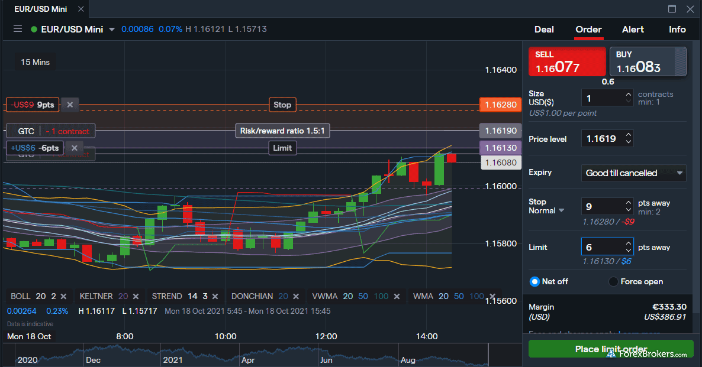

IG Group Holdings plc is recognized as a prominent online brokerage firm, distinguished for its innovative trading solutions and a strong global presence. Established in 1974 by Stuart Wheeler in the United Kingdom, IG initially emerged as an innovative financial entity, pioneering the concept of financial spread betting. This novel approach allowed retail investors to speculate on various financial markets, including indices, commodities, and currencies, without the need to purchase the underlying assets directly.

Over the years, IG Group has expanded significantly, transitioning into a comprehensive online trading platform that caters to both retail and institutional clients. As of the latest figures, IG boasts approximately 360,000 active users spread over 19 countries, reflecting its extensive market reach and adaptability to diverse financial environments. This widespread user base underscores the company's ability to offer a versatile trading experience enhanced by advanced technology and diverse product offerings.

One of IG's defining attributes is its status as a highly regulated broker, ensuring a secure trading environment for its clients. It operates under the jurisdiction of multiple financial regulatory bodies across the globe, which not only enhances its credibility but also ensures compliance with stringent financial standards. This extensive regulatory framework underpins IG's commitment to maintaining transparency and trustworthiness in all aspects of its operations.

Further solidifying its position in the financial services sector, IG provides an impressive range of tradable assets, enabling investors to engage with an array of markets. Its offerings include forex, stocks, commodities, indices, and cryptocurrencies, among others. This breadth of available assets, combined with intuitive trading platforms and robust security measures, positions IG Group Holdings plc as a leader in the online brokerage industry, setting a benchmark for quality and integrity in market operations.

## Table of Contents

## Features of the IG Trading Platform

IG Group Holdings plc provides traders with an intuitive online trading platform known for its user-friendly interface. This platform simplifies trading activities across a spectrum of assets, catering to both novice and seasoned traders. The design emphasizes ease of navigation, with a clean and organized dashboard that displays critical information such as price charts, market news, and trade positions. This helps users make informed decisions swiftly, supported by customization options that allow traders to personalize their workspace according to their trading preferences.

The platform offers access to a wide range of tradable assets, ensuring flexibility and diversity in trading strategies. Users can trade in popular markets such as forex, stocks, and indices, as well as expanding asset classes like commodities, ETFs, bonds, and options. Additionally, the platform supports [cryptocurrency](/wiki/cryptocurrency) trading, enabling users to buy and sell digital currencies alongside traditional financial instruments. This extensive array of available assets makes it easier for traders to diversify their portfolios and explore various market opportunities.

In terms of financial instruments, IG Trading Platform boasts a suite of robust tools and integrations. Users can leverage contracts for difference (CFDs) and spread betting options to potentially capitalize on market fluctuations without owning the underlying assets. Furthermore, IG integrates with renowned third-party software, enhancing trading capabilities. The integration with platforms like MetaTrader 4 supports enhanced technical analysis and automated trading strategies, although it is worth noting that MetaTrader 5 is not supported, potentially limiting options for traders who prefer this version.

The platform’s limitations include the aforementioned absence of MetaTrader 5, which some traders might find restrictive given its advanced features not present in MetaTrader 4. Despite this, IG’s trading platform remains highly versatile, offering a comprehensive range of tools and resources that support effective trading and strategic analysis, thereby maintaining its reputation as a leading choice among online brokerage firms.

## Regulatory Compliance and Security

IG Group Holdings plc, widely recognized as one of the leading online brokerage firms, is renowned for its rigorous regulatory compliance and robust security measures. As a publicly traded company listed on the London Stock Exchange (LSE) under the symbol "IGG", IG Group exemplifies transparency and adherence to financial regulations. The company's comprehensive compliance with financial regulations ensures its operations adhere to rigorous standards mandated by financial authorities.

IG Group is licensed and regulated by more than a dozen countries, covering major financial hubs around the world. This includes oversight by the Financial Conduct Authority (FCA) in the United Kingdom, the Commodity Futures Trading Commission (CFTC) in the United States, and the Australian Securities and Investments Commission (ASIC) in Australia. Such extensive licensing ensures that the company meets the differing regulatory requirements and standards wherever it operates.

Security measures implemented by IG are designed to protect investor funds and reinforce the company's commitment to regulatory compliance. Client funds are segregated from IG's own money, complying with regulations to ensure that these funds are protected in the unlikely event of the company’s insolvency. Additionally, IG employs secure encryption technology to protect client data and transactions from unauthorized access.

The firm's adherence to strict risk management policies further bolsters its reputation for security. Regular audits and assessments help maintain IG's high standards of operation, while allowing continuous improvement in security protocols. Furthermore, IG's commitment to compliance and security strengthens investor confidence, positioning it as a reputable choice for both novice and experienced traders seeking a reliable trading platform. Such reputation is vital in a constantly evolving financial landscape where trust and security are paramount.

## IG’s Product Offerings

IG Group Holdings plc offers a diverse range of financial products that cater to a wide spectrum of trading preferences and strategies. Among these products, Contracts for Difference (CFDs), Exchange-Traded Funds (ETFs), futures, and options are prominent offerings that contribute to its appeal as a versatile online broker.

CFDs represent a significant portion of IG's product catalog, allowing traders to speculate on the price movements of various underlying assets without owning them. This provides a flexible avenue for leveraging their positions, as CFDs typically allow for trading with margin. ETFs are another option, enabling traders to invest in baskets of assets, such as stocks or commodities, with the ease of trading a single security. Futures contracts further extend IG's offerings, providing opportunities to engage in standardized agreements to buy or sell assets at a predetermined price on a specified future date. Options trading is also available, granting traders the right but not the obligation to buy or sell an asset at a specified price within a particular time frame, offering strategies to hedge or enhance portfolio positions.

Despite this comprehensive suite of products, IG does not feature a copy trading system. This absence might affect traders who prefer to mirror the strategies of successful investors, thereby learning through example or minimizing their own active involvement in trading decisions. The lack of this feature may prompt such traders to seek third-party platforms that support copy trading to supplement their trading strategies.

Beyond these offerings, IG provides a spread betting platform, exclusive to certain jurisdictions like the UK. This feature allows clients to speculate on price movements without owning the asset, akin to CFDs, yet with distinct tax advantages in some regions, such as being exempt from capital gains tax. Managed portfolios are also part of IG's product line, designed for investors who prefer a hands-off approach and wish to have their investments curated by professional fund managers, thereby blending the benefits of personalized investment management with IG's technological and market insights.

Through these varied products, IG Group meets the needs of a diverse client base, offering tools and opportunities for both active traders aiming to capitalize on short-term market movements and longer-term investors seeking efficient portfolio management solutions.

## Algo Trading and Technology

IG Group Holdings plc offers robust trading technology, seamlessly integrating widely recognized platforms like MetaTrader 4 (MT4) and ProRealTime. These integrations enhance the trading experience by providing traders with sophisticated tools for executing and managing trades.

MetaTrader 4, a popular choice among [forex](/wiki/forex-system) traders, is supported by IG Group, allowing users to implement a wide array of [algorithmic trading](/wiki/algorithmic-trading) strategies. MT4's Expert Advisors (EAs) enable automated trading by executing predefined trading strategies. Traders can also employ scripts and custom indicators written in the platform's MQL4 programming language. This aids in automating repetitive tasks and creating complex trading strategies, such as mean reversion or [trend following](/wiki/trend-following) models, without manual intervention.

ProRealTime offers an advanced trading experience with comprehensive technical analysis tools. Its algorithmic trading feature, ProOrder, facilitates the creation and execution of automated strategies. Through ProBuilder, a proprietary programming language, traders can develop custom indicators and strategies. Moreover, ProRealTime includes [backtesting](/wiki/backtesting) capabilities, allowing traders to test their strategies on historical data to evaluate performance metrics such as Sharpe ratio or maximum drawdown before deployment in live markets. 

IG Group also supports advanced order types through the L2 Dealer platform, enhancing the trading process. L2 Dealer offers features such as direct market access (DMA), which provides traders with the ability to interact directly with order [books](/wiki/algo-trading-books), leading to potentially better pricing and execution quality. Traders can utilize various order types, including limit, stop, and conditional orders, to customize their trading strategies. Conditional orders, for example, allow the setting of precise execution conditions, such as fill-or-kill (FOK) or immediate-or-cancel (IOC), offering increased control over trade executions.

These technological offerings by IG underscore its commitment to providing a comprehensive and flexible trading environment. The integration with platforms like MT4 and ProRealTime, along with the advanced order functionalities in L2 Dealer, equips traders with the tools necessary for implementing sophisticated trading strategies efficiently.

## Costs and Fees

IG Group Holdings plc adopts a transparent and comprehensive fee structure, making it accessible to both novice and seasoned traders. One key component of this structure is the spread costs, which represent the difference between the bid and ask price of a financial instrument. These costs vary depending on the asset class, with forex spreads starting from as low as 0.6 pips for major currency pairs. 

In addition to spread costs, IG imposes overnight financing fees on leveraged positions. These fees are calculated based on the market value of the position and the duration it is held overnight. The formula to calculate the overnight financing cost is as follows:

$$
\text{Financing Cost} = \text{Notional Volume} \times \text{Daily Interest Rate}
$$

where the daily interest rate is derived from the prevailing benchmark interest rate, with an additional small percentage for IG's margin.

The inactivity fee is another consideration for traders who do not engage in trading activities over extended periods. IG charges a monthly fee of £12 (or equivalent in other currencies) on dormant accounts after two years of inactivity. This fee ensures that resources are utilized efficiently across active clients.

For active traders, IG offers discounts and special pricing programs designed to reduce trading costs. These programs are typically based on trading [volume](/wiki/volume-trading-strategy), offering rebates or lower spreads as users increase their trading frequency. While specific discounts may vary, they are generally tailored to incentivize higher trading volumes.

Notably, IG does not charge fees for account opening, which allows traders to initiate their trading activities without any initial financial burden. Similarly, there are no fees for deposits or withdrawals via the standard methods provided by IG, ensuring that clients can manage their funds efficiently without incurring additional costs.

In summary, IG's fee structure is designed to be competitive and straightforward, facilitating a cost-effective trading environment. The absence of account opening, deposit, and withdrawal fees further enhances IG's attractiveness, offering traders a reputable platform with transparent pricing practices.

## Educational and Research Resources

IG Group Holdings plc offers a robust suite of educational and research resources designed to enhance the trading proficiency of its users. A cornerstone of these offerings is the IG Academy, which provides a comprehensive array of educational materials and online courses tailored to cater to both novice and experienced traders. The academy covers numerous aspects of trading, including foundational concepts, advanced strategies, risk management, and technical analysis. These resources are crafted to empower traders with the knowledge and skills necessary to make informed trading decisions.

In addition to the structured courses, IG contributes to the trading community by offering real-time market insights through IGTV. This platform delivers daily coverage of global market news, providing traders with timely information that can be critical for effective decision-making. The integration of expert analysis and market updates helps users stay informed about the latest financial developments and potential market-moving events.

By combining interactive learning tools with current market intelligence, IG Group underscores its commitment to trader education and essentially aids users in navigating the complexities of the financial markets.

## Customer Support and Transparency

IG Group Holdings plc places significant emphasis on delivering exceptional customer support to cater to its wide-ranging global clientele. With services spanning 19 countries and a robust user base, IG ensures that its customer service infrastructure is both comprehensive and accessible.

IG provides a variety of support channels to assist its users. These include live chat, phone support, and email, ensuring that users can reach out for assistance through their preferred mode of communication. The live chat option offers real-time responses, which is particularly useful for traders who may need immediate assistance during market hours. Phone support adds a personal touch, allowing users to talk directly with knowledgeable representatives. Email support, on the other hand, is ideal for less urgent inquiries or detailed support requests, delivering thorough and well-researched responses.

Transparency is another cornerstone of IG's service framework. IG is committed to maintaining clarity in its fee structures, which is crucial for traders who depend on clear information to make informed decisions. Detailed explanations of spreads, commissions, and any additional costs are readily accessible, enabling users to have a complete understanding of potential expenses. Such transparency helps in building trust and ensures that there are no hidden surprises for traders navigating the platform.

Furthermore, IG is forthright in its presentation of risk disclaimers, providing traders with a comprehensive understanding of the potential risks involved in trading various financial instruments. This openness is crucial for fostering an informed trading environment where users can assess the risks and rewards more accurately. By prioritizing transparency and robust customer support, IG reinforces its commitment to offering a reliable and user-friendly trading experience.

## Conclusion

IG Group Holdings plc stands as a preeminent figure in the realm of online brokerage, demonstrating an unwavering commitment to reliability and user-friendly platforms. The company's comprehensive suite of offerings is indicative of its dedication to catering to the diverse needs of traders worldwide. With an array of tradable assets that includes forex, stocks, ETFs, cryptocurrencies, and more, IG provides its users with ample opportunities to diversify their portfolios. 

This vast selection is complemented by the advanced technology integrations inherent in its trading platforms. By offering compatibility with industry-standard software like MetaTrader 4 and ProRealTime, as well as supporting algorithmic trading capabilities, IG ensures that both novice and experienced traders can optimize their trading strategies. Such technological advancements not only enhance trading efficiency but also contribute to a superior trading experience across user categories.

IG’s commitment extends beyond mere functionality and into providing comprehensive educational resources that support its clientele's growth and development. Through initiatives like IG Academy and their detailed research materials, users are empowered with knowledge and insights that are crucial for successful trading.

In conclusion, IG's established position as a leading online broker is not merely a reflection of its substantial market presence or regulatory compliance, but a testament to its ongoing dedication to delivering exceptional and accessible trading experiences. Whether through a wide range of financial products or cutting-edge technological solutions, IG continues to enable traders at every level to engage confidently and effectively within the financial markets.

## References & Further Reading

[1]: Riechmann, R. (2009). ["The Evolution of Financial Spread Betting and IG Group's Role."](https://royalsocietypublishing.org/doi/10.1098/rstb.2009.0134) Investopedia.

[2]: Nassar, P. (2018). ["An Introduction to Contracts for Difference (CFDs)."](https://scholar.google.com/citations?user=FLK_vj4AAAAJ&sortby=title) Investopedia.

[3]: Financial Conduct Authority. (2023). ["The FCA's Oversight of Online Brokers."](https://www.fca.org.uk/) 

[4]: Adams, G. (2020). ["Spread Betting vs CFDs: Key Differences Explained."](https://www.reddit.com/r/investing/comments/oy0wc/the_difference_between_spread_betting_cfds/) FOREX.com.

[5]: MetaQuotes Software Corp. (n.d.). ["MetaTrader 4 vs MetaTrader 5: A Comparative Analysis."](https://www.metaquotes.net/en/download)