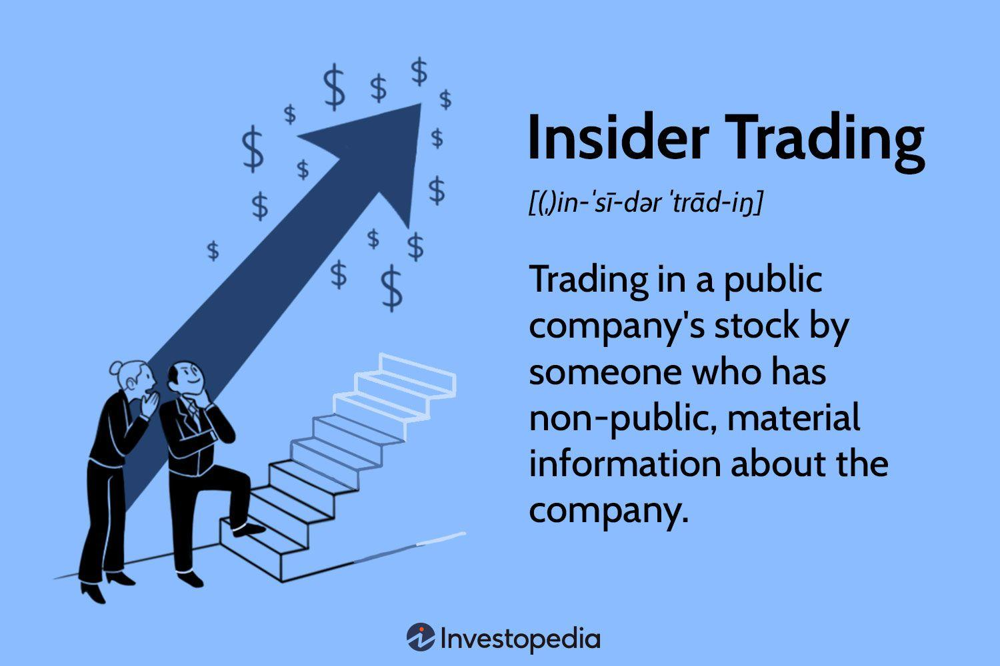

Securities fraud is a critical issue in financial markets, encompassing various illegal activities that deceive investors and manipulate financial asset prices, ultimately undermining the integrity of the markets. The impact of securities fraud is profound, leading to significant financial losses and eroding trust among investors. Notable forms of securities fraud include Ponzi schemes, pump-and-dump schemes, and insider trading. Each of these fraudulent activities can distort market operations, affect investor decision-making, and lead to significant legal repercussions for the perpetrators.

Financial crimes related to securities markets are not limited to fraud alone. They encompass a broader spectrum, including money laundering and tax evasion, which compound the negative effects on the financial ecosystem. These crimes often exploit the complexities of financial instruments and global market operations, challenging detection and enforcement efforts. The economic implications are far-reaching, influencing everything from investor confidence to market stability and even national economies.

Insider trading is one of the most scrutinized illegal activities within securities fraud, involving the buying or selling of a publicly-traded company’s stock by someone who has non-public, material information about that stock. This practice is considered illegal because it undermines investor trust and violates the principle of a level playing field. Regulatory bodies like the U.S. Securities and Exchange Commission (SEC) vigorously pursue insider trading cases to maintain market integrity and uphold legal standards.

In contrast, algorithmic trading represents a legal facet of modern finance, leveraging computer programs to execute trades at high speed and volume based on predefined criteria. While algorithmic trading can enhance market efficiency and liquidity, it also poses risks such as market manipulation and unintended volatility spikes, known as flash crashes. The role of algorithmic trading in contemporary financial markets is continually evolving, necessitating stringent regulatory oversight to prevent potential abuses.

This article aims to explore the intersection of securities fraud, insider trading, and algorithmic trading, shedding light on their complex interrelations and implications for financial markets. Understanding these concepts is critical for investors and regulators alike, as it equips them to navigate and mitigate the potential risks associated with these issues. By examining these key topics, stakeholders can better safeguard market integrity, foster trust, and ensure a fair trading environment.

## Table of Contents

## Understanding Securities Fraud

Securities fraud is a type of serious financial crime involving the deception of investors or the manipulation of financial markets. It encompasses a variety of illegal activities aimed at misrepresenting information that investors use to make decisions, often leading to significant financial losses. The most common forms of securities fraud include Ponzi schemes, pump-and-dump schemes, insider trading, and accounting fraud.

**Ponzi Schemes and Pump-and-Dump Schemes**

Ponzi schemes promise high returns with little risk to investors but instead of generating profits, they use funds from new investors to pay earlier backers. This creates an illusion of a profitable enterprise until the scheme collapses due to lack of new investment. A prime example is the Bernie Madoff scandal, one of the largest of its kind, which defrauded investors of approximately $65 billion.

Pump-and-dump schemes involve artificially inflating the price of a stock through false or misleading statements, allowing fraudsters to sell their shares at peak prices before the market corrects itself. This often leaves unsuspecting investors with significant losses.

**Case Studies of Significant Incidents**

One notable case of securities fraud is Enron Corporation's bankruptcy in 2001, which resulted in over $30 billion in losses. Executives used accounting loopholes, special purpose entities, and poor financial reporting to hide debts, misleading shareholders and analysts. This case led to the dissolution of Arthur Andersen, Enron's auditor, and sparked major regulatory changes.

Another significant case is the collapse of Bear Stearns in 2008. The investment bank was heavily involved in subprime mortgage-backed securities, and when their value plummeted, the firm experienced a [liquidity](/wiki/liquidity-risk-premium) crisis, causing massive losses to investors and necessitating a government-backed buyout by JPMorgan Chase.

**Legal Consequences and Penalties**

The legal ramifications for securities fraud are severe and can include both civil and criminal penalties. Individuals found guilty may face hefty fines and imprisonment, while corporations can be fined billions of dollars. For instance, in the aftermath of the Enron scandal, CEO Jeffrey Skilling received a 24-year prison sentence, which was later reduced. Companies also risk losing investor trust and suffering long-lasting reputational damage.

**Role of Government Agencies and Regulations**

Government agencies like the Securities and Exchange Commission (SEC) in the United States are primarily responsible for enforcing securities laws and protecting investors. The SEC investigates and prosecutes violations of securities laws, utilizing regulations such as the Sarbanes-Oxley Act and the Dodd-Frank Act to enforce compliance. These regulations have been implemented to increase transparency, enhance accountability, and prevent fraudulent activities in financial markets.

**Preventive Measures and Red Flags for Investors**

Investors can protect themselves by recognizing red flags typical of securities fraud. Promises of high returns with low risk, unverified track records, and pressure to invest quickly are often warning signs. Conducting due diligence, verifying the credentials of financial advisors, and being skeptical of investments that seem too good to be true are all crucial preventative strategies. Additionally, leveraging resources like FINRA’s BrokerCheck can help investors assess the validity of investment opportunities and advisors.

Understanding securities fraud and its various manifestations is essential for investors, regulators, and policymakers. By recognizing the signs and understanding the legal framework and preventive measures in place, stakeholders can better safeguard against these financial crimes.

## Financial Crime and Its Impacts

Financial crime encompasses a wide range of illegal activities involving the financial system, including money laundering, terrorist financing, tax evasion, and securities fraud. While securities fraud is one aspect, the broader category of financial crime has significant implications on both national and global scales.

**Economic Implications**  
Financial crime can lead to substantial economic damage. It often results in the diversion of funds from constructive economic activities, distorts market operations, and can cause significant losses for businesses and investors. These crimes can reduce government revenues through tax evasion, increase the cost of doing business, and decrease economic efficiency. On a global scale, financial crimes contribute to an uneven distribution of wealth and can impede the economic development of nations. For example, the International Monetary Fund (IMF) estimates that the annual cost of money laundering, an integral part of financial crime, ranges from 2% to 5% of global GDP[^1^].

**Undermining Investor Confidence and Market Stability**  
Financial crimes erode trust in financial institutions and markets. Investor confidence is crucial for the functioning of capital markets; when investors believe that they are operating on an uneven playing field, they may withdraw their investment or demand higher returns, leading to increased capital costs. Historical incidences like the Enron scandal exemplify how financial crime can devastate companies and shake investor confidence on a large scale[^2^].

**Scope of Financial Crimes: Key Statistics**  
The scope of financial crimes is vast and growing with technological advancements. According to the United Nations Office on Drugs and Crime (UNODC), money laundering transactions are estimated to comprise 2-5% of global GDP, or roughly $800 billion to $2 trillion annually[^3^]. Cybercrime, a modern addition to financial crime, costs the global economy approximately $600 billion annually, according to a report by McAfee and the Center for Strategic and International Studies[^4^].

**Efforts by International Bodies**  
International bodies have put significant efforts into combating financial crime. Organizations like the Financial Action Task Force (FATF) have developed policies and recommendations aimed at fighting money laundering and terrorist financing. Additionally, organizations such as Interpol and Europol work to ensure cross-border collaboration in tackling international financial crimes[^5^].

**Strategies for Mitigation**  
Mitigating financial crime involves a multi-faceted approach, including robust regulatory frameworks, technology-driven surveillance, and rigorous enforcement of laws. Financial institutions are increasingly employing technology such as [artificial intelligence](/wiki/ai-artificial-intelligence) (AI) and [machine learning](/wiki/machine-learning) to detect fraudulent activities. Companies are urged to implement comprehensive compliance programs, conduct regular audits, and increase transparency. Education and raising awareness among employees and customers are also seen as vital strategies in reducing the risk of financial crime.

In conclusion, financial crime poses a formidable challenge to both national economies and global financial systems. Addressing these issues requires concerted efforts from governments, international organizations, and private entities to implement robust strategies and foster a secure financial environment.

[^1^]: "Confronting the Challenges of Global Financial Crime," International Monetary Fund, 2021.
[^2^]: Benston, George J. "The Role of Fraud in the Enron Collapse." Journal of Economic Perspectives, vol. 17, no. 2, 2003, pp. 177–197.
[^3^]: "Money-Laundering and Globalisation," United Nations Office on Drugs and Crime.
[^4^]: Lewis, James A. "Economic Impact of Cybercrime – No Slowing Down," McAfee, 2018.
[^5^]: "Strategies to Combat Financial Crime – A Giant Stride Towards a Safer Future," Europol.

## Insider Trading: Legal and Ethical Considerations

Insider trading refers to the buying or selling of a publicly-traded company's stock by someone who has non-public, material information about that stock. It is considered illegal because it violates the principle of market fairness, based on ensuring all investors have equal access to material information regarding a company. Legal frameworks, such as the U.S. Securities Exchange Act of 1934, prohibit insider trading to maintain transparent and equitable markets.

Historically, insider trading has been marked by numerous high-profile cases that have shaped its legal landscape. Notable instances include the 1980s prosecution of Ivan Boesky, a stock trader who was convicted for using non-public information to trade securities, which underscored the illegal nature of such actions. Another landmark case involved Raj Rajaratnam, the founder of the Galleon Group, whose conviction in 2011 was one of the largest insider trading cases in U.S. history. These cases have been critical in reinforcing the illicit status of insider trading and have helped establish stricter regulations.

Ethically, insider trading poses challenges within corporate cultures, as it can undermine trust and promote unethical behavior. Employees with access to material information may face conflicts between personal gain and professional duty. Companies are therefore encouraged to foster an ethical environment that discourages exploitation of inside information for personal advantage.

Several significant scandals have highlighted the impacts of insider trading, eroding public trust in financial markets. The ImClone scandal in the early 2000s, where Martha Stewart was implicated for insider trading, served to illustrate how unethical trading practices could have widespread financial and reputational repercussions. These incidents have led to increased scrutiny and reforms aimed at restoring integrity in financial markets.

From a regulatory perspective, authorities employ various strategies to curtail insider trading. Measures include enforcing strict reporting requirements for insiders who trade securities, implementing surveillance systems to detect suspicious trading activities, and imposing severe penalties for violations. Agencies like the Securities and Exchange Commission (SEC) in the U.S. play a pivotal role in investigating and prosecuting insider trading cases, thus deterring potential violators.

To ensure compliance with insider trading laws, companies adopt a range of policies and practices. These often include establishing blackout periods during which trading by insiders is restricted, mandating the pre-clearance of trade transactions involving company securities, and conducting training programs for employees to understand the legal and ethical implications of insider trading. By implementing robust compliance frameworks, corporations can help prevent illegal trading activities and maintain fair market practices.

## The Rise of Algorithmic Trading

Algorithmic trading refers to the use of computer algorithms to automate the process of trading financial securities. These algorithms, designed to follow specific instructions, make trading decisions at speeds and frequencies far beyond the capabilities of human traders. The history of [algorithmic trading](/wiki/algorithmic-trading) can be traced back to the early 1970s with the introduction of computerized systems for order placements. By the late 1990s, these systems evolved to execute a significant portion of trades in financial markets.

Algorithmic trading offers numerous advantages over traditional trading practices. The most notable advantages include speed and efficiency, as algorithms can execute trades in milliseconds, allowing traders to capitalize on small price discrepancies. Additionally, algorithms can process vast amounts of market data and execute complex strategies with precision, reducing the likelihood of human error.

Despite its advantages, algorithmic trading, particularly high-frequency trading ([HFT](/wiki/high-frequency-trading-strategies)), poses potential risks. One of the most significant risks includes flash crashes, sudden and severe market downturns triggered by automated trading systems. The most infamous instance was the 2010 Flash Crash, where the Dow Jones Industrial Average plummeted nearly 1,000 points within minutes, only to recover shortly after.

Algorithmic trading significantly impacts market liquidity and [volatility](/wiki/volatility-trading-strategies). On one hand, it enhances liquidity by increasing the [volume](/wiki/volume-trading-strategy) and speed of trades, thus tightening bid-ask spreads. On the other hand, it can contribute to market volatility, as the rapid buying and selling by algorithms can amplify price movements during periods of market stress.

Regulations have been implemented to mitigate the potential abuses and fraud associated with algorithmic trading. In the United States, the Securities and Exchange Commission (SEC) and the Commodity Futures Trading Commission (CFTC) oversee algorithmic and high-frequency trading. Rules require firms to have risk management controls and compliance measures in place, such as circuit breakers, which halt trading if a security's price fluctuates excessively within a short period.

The future of algorithmic trading is shaped by ongoing technological advancements and regulatory developments. Machine learning and artificial intelligence are expected to enhance algorithmic models by enabling pattern recognition and predictive analytics capabilities. Moreover, the increasing use of [alternative data](/wiki/best-alternative-data) sources, such as social media sentiment, economic indicators, and satellite imagery, could provide traders with additional insights into market behavior. However, as trading technologies advance, regulators will need to continuously evolve their frameworks to address new challenges and ensure market integrity and stability.

## Intersection of Fraud, Insider Trading, and Algo Trading

The intersection of fraud, insider trading, and algorithmic trading presents a complex web of challenges and opportunities for financial markets. These elements can interact in various ways, impacting market integrity, investor confidence, and regulatory frameworks.

Algorithmic trading, which involves the use of complex algorithms to execute trades at high speeds, can both facilitate and uncover fraudulent activities. For example, algorithms can be manipulated to engage in spoofing, where traders place and then quickly cancel large orders to create the illusion of demand, ultimately misleading other market participants (Comerton-Forde & Putniņš, 2015). Conversely, the analytical capabilities of advanced algorithms can also be harnessed to detect unusual trading patterns that may indicate fraud or insider trading. Machine learning technologies, for example, can identify anomalies that deviate from expected behavioral norms, highlighting potential instances of misconduct.

Insider trading, involving the use of non-public information to gain an unfair market advantage, remains a significant legal and ethical concern. Algorithms can be employed to monitor trading activities for patterns consistent with insider trading, such as irregular buying or selling following the insider's access to confidential information. These algorithms can cross-reference multiple data points, including trading histories and news events, to flag suspicious activities for further investigation.

Legal challenges arise in prosecuting crimes that involve these sophisticated technologies. The complexity of algorithms can obscure the intentions behind certain trades, making it difficult for regulators to prove fraudulent activity beyond reasonable doubt. Additionally, the global nature of financial markets complicates the jurisdictional authority of regulatory bodies, often requiring international cooperation to address cross-border crimes.

Looking ahead, the potential for financial crime involving these concepts may expand as technology evolves. Scenarios may involve increasingly sophisticated algorithms capable of both committing and detecting fraud at unprecedented scales. Quantum computing and artificial intelligence advancements could further complicate the landscape, necessitating a reevaluation of current legal frameworks and enforcement strategies.

The importance of real-time surveillance and regulation cannot be overstated in protecting markets from these threats. Regulators must invest in technologies that allow for the continuous monitoring of trading activities and swift identification of irregularities. Collaborative efforts between financial institutions, technology providers, and regulatory authorities are essential to develop robust systems that balance the benefits of technological innovation with the imperatives of market integrity and investor protection.

References:
- Comerton-Forde, C., & Putniņš, T. J. (2015). Stock Market Manipulation: Evidence from Concrete Cases. The Journal of Financial Intermediation, 24(1), 56-73.
- SEC’s initiatives on prosecuting algorithmic and insider trading related offences.

## Conclusion

Securities fraud, insider trading, and algorithmic trading are intricate elements of today's financial markets, entwined in a complex interplay that can significantly impact market integrity. Thorough understanding and regulation of these elements are paramount to ensuring a stable and fair financial environment.

The necessity for robust yet balanced regulations is evident, as overly stringent measures can stifle technological innovation while inadequate controls may fail to prevent fraudulent activities. Policymakers must aim to craft rules that deter malfeasance without hindering the benefits that technological advancements, such as algorithmic trading, can deliver.

Continuous education and heightened awareness among both investors and financial professionals are essential to combat financial malpractices effectively. By staying informed about potential red flags and evolving legal frameworks, stakeholders can better guard themselves and their investments against fraudulent schemes.

As financial crime adapts to the digital age, it becomes increasingly important for participants at all levels to collaborate. Governments, regulatory bodies, financial institutions, and investors must work together to identify vulnerabilities and develop proactive measures to counteract sophisticated financial crimes.

Looking forward, the integration of advanced technologies such as artificial intelligence and machine learning holds promise in enhancing the security of financial markets. These technologies can be leveraged to identify irregular trading patterns, predict potential fraud, and ensure compliance with regulatory requirements. By embracing such innovations, stakeholders can help safeguard the integrity of the financial ecosystem.

The journey towards a fraud-free financial market is ongoing and demands concerted efforts from all participants. With the right balance of regulation, education, and technological integration, the future of financial markets can be both innovative and secure.

## References & Further Reading

[1]: Benston, George J. (2003). ["The Role of Fraud in the Enron Collapse."](https://www.researchgate.net/publication/222577275_Enron_What_happened_and_what_we_can_learn_from_it) Journal of Economic Perspectives, 17(2), 177–197.

[2]: Comerton-Forde, C., & Putniņš, T. J. (2015). ["Stock Market Manipulation: Evidence from Concrete Cases."](https://www.semanticscholar.org/paper/Stock-Price-Manipulation%3A-Prevalence-and-Comerton-Forde-Putni%C5%86%C5%A1/e98335e2d9b575bc796b34b5679d101c316985a2) The Journal of Financial Intermediation, 24(1), 56-73.

[3]: Lewis, James A. (2018). ["Economic Impact of Cybercrime – No Slowing Down."](https://csis-website-prod.s3.amazonaws.com/s3fs-public/publication/economic-impact-cybercrime.pdf) McAfee.

[4]: International Monetary Fund (2021). ["Confronting the Challenges of Global Financial Crime."](https://www.imf.org/en/Publications/GFSR/Issues/2021/10/12/global-financial-stability-report-october-2021)

[5]: United Nations Office on Drugs and Crime. ["Money-Laundering and Globalisation."](https://www.unodc.org/unodc/en/money-laundering/overview.html)