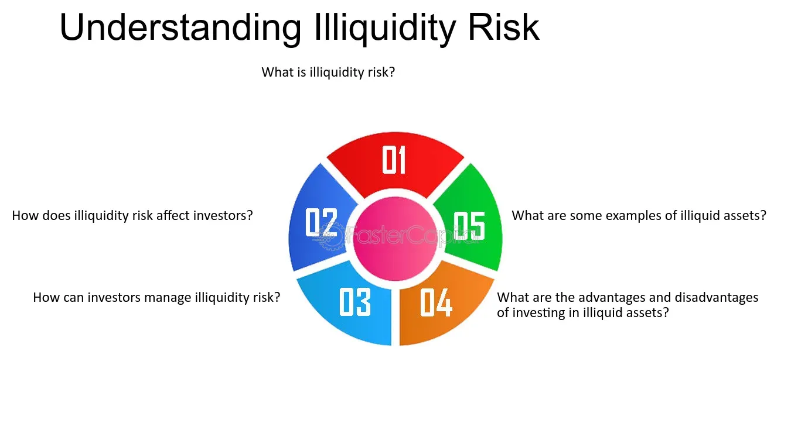

## Table of Contents

## What are illiquid assets?

Illiquid assets are things that are hard to sell quickly or turn into cash. These can include things like real estate, art, or private company shares. Because they are not easy to sell, you might have to wait a long time to find a buyer, or you might have to sell them for less money than you want.

Having illiquid assets can be good because they might grow in value over time. For example, a house might become worth more money in the future. But it can also be a problem if you need cash fast. If something unexpected happens and you need money right away, it can be hard to get it from an illiquid asset.

## What are some common examples of illiquid assets?

Illiquid assets are things that you can't easily turn into cash. Some common examples are real estate, like houses or land. If you own a house and need money quickly, it can take months to sell it. Another example is fine art, like paintings or sculptures. These can be valuable, but finding someone to buy them at the price you want can take a long time.

Private company shares are also illiquid assets. If you own part of a company that isn't publicly traded, it's hard to find someone to buy your shares. You might have to wait until the company goes public or gets bought out. Collectibles, like rare coins or stamps, are another example. These items can be hard to value and sell quickly.

Lastly, some types of investments, like certain types of bonds or hedge funds, can be illiquid. These investments often have rules that make it hard to sell them quickly. For example, you might have to wait until a specific date to sell your investment, or you might have to give notice far in advance.

## Why are illiquid assets considered risky?

Illiquid assets are considered risky because they can be hard to turn into cash quickly. If you need money fast because of an emergency or a good investment opportunity, you might not be able to sell your illiquid assets in time. For example, if you own a house and need cash right away, it can take months to find a buyer and complete the sale. This delay can be a big problem if you need the money urgently.

Another reason illiquid assets are risky is that you might have to sell them for less than they're worth. When you're in a hurry to get cash, you might have to accept a lower price just to find a buyer quickly. This means you could lose money compared to what the asset is really worth. For instance, if you need to sell a piece of art fast, you might have to sell it at a discount, which is not ideal if you were hoping to get its full value.

## How does the liquidity of an asset affect its value?

The liquidity of an asset can affect its value in a big way. When an asset is liquid, it means you can sell it quickly and easily. This makes it more valuable because you can turn it into cash whenever you need to. For example, stocks that are traded on big stock markets are usually very liquid. You can sell them in seconds, and this makes them more attractive to investors. On the other hand, if an asset is illiquid, it might be harder to find someone to buy it, and you might have to wait a long time. This can make the asset less valuable because it's harder to use it when you need money.

Sometimes, the value of an illiquid asset can be lower because you might have to sell it for less than it's worth. If you're in a hurry to get cash, you might have to accept a lower price just to find a buyer quickly. This means you could lose money compared to what the asset is really worth. For example, if you need to sell a piece of land fast, you might have to sell it for less than its market value. This risk of having to sell at a discount makes illiquid assets less desirable and can lower their overall value.

## What is the difference between liquid and illiquid assets?

Liquid assets are things that you can easily turn into cash. They are easy to sell, and you can get your money quickly. Examples of liquid assets include cash, money in your bank account, and stocks that are traded on big stock markets. Because you can get cash from them fast, liquid assets are very useful if you need money in a hurry.

Illiquid assets, on the other hand, are things that are hard to turn into cash quickly. They take a long time to sell, and you might have to wait to find a buyer. Examples of illiquid assets include real estate, like houses or land, art, and shares in private companies. If you need money fast, it can be a problem to have a lot of illiquid assets because you can't get cash from them quickly.

## How can an investor assess the liquidity of an asset?

An investor can assess the liquidity of an asset by looking at how quickly and easily it can be sold. For example, if you want to know how liquid a stock is, you can check how many shares are traded every day. If a lot of shares are traded, it means the stock is liquid because you can sell it fast. On the other hand, if you're thinking about buying a piece of real estate, you can look at how long similar properties in the area take to sell. If it takes a long time, the property is probably illiquid.

Another way to assess liquidity is by thinking about how much the price might drop if you need to sell the asset quickly. If you have to sell something like a piece of art or a rare coin in a hurry, you might have to accept a lower price just to find a buyer. This means the asset is less liquid because you can't get its full value right away. By considering these factors, an investor can get a good idea of how easy or hard it will be to turn an asset into cash when they need to.

## What are the potential benefits of investing in illiquid assets?

Investing in illiquid assets can have some big benefits. One of the main benefits is that they can grow a lot in value over time. For example, if you buy a house in a good area, its value might go up a lot over the years. This means you could make more money when you finally sell it. Another benefit is that illiquid assets can give you a chance to invest in things that other people might not be able to. For instance, if you invest in a private company, you might be able to get in early and make a lot of money if the company does well.

Another advantage of illiquid assets is that they can help you diversify your investments. This means you're not putting all your money into one type of investment, like stocks. By spreading your money across different types of assets, you can lower your risk. If the stock market goes down, your real estate or art might still be doing well. This can help protect your money and give you more stability over the long term.

## How do market conditions affect the liquidity of assets?

Market conditions can have a big impact on how easy or hard it is to sell an asset. When the economy is doing well and people feel confident, there are usually more buyers looking to spend money. This makes it easier to sell things like houses, art, or shares in private companies. People are more willing to take risks and invest in things that might take a while to turn into cash. On the other hand, when the economy is not doing well, people are more cautious. They might not want to spend money on things that are hard to sell quickly. This can make it harder to find buyers for illiquid assets, and you might have to wait longer or sell them for less money.

Different types of assets can also be affected differently by market conditions. For example, during a financial crisis, the stock market might become very volatile, and even liquid assets like stocks can become harder to sell at a good price. At the same time, the real estate market might slow down a lot, making houses and land even more illiquid. On the flip side, in a booming economy, both stocks and real estate might be easier to sell, but the liquidity of more niche assets like rare collectibles might not change as much because their market is smaller and less affected by overall economic trends.

## What strategies can be used to manage the risks associated with illiquid assets?

One strategy to manage the risks of illiquid assets is to diversify your investments. This means you should not put all your money into illiquid assets. Instead, mix them with liquid assets like stocks or money in the bank. This way, if you need cash quickly, you can sell your liquid assets first. Another part of this strategy is to keep some money in a savings account as an emergency fund. This can help you cover unexpected costs without having to sell your illiquid assets at a bad time.

Another strategy is to plan ahead and understand the market for your illiquid assets. If you know how long it usually takes to sell a house or a piece of art in your area, you can be better prepared. You might decide to sell your illiquid asset when the market is doing well, so you get a better price. It's also a good idea to keep an eye on market trends and economic conditions. This can help you decide when to buy or sell your illiquid assets to get the best value.

Lastly, you can use financial tools like loans or lines of credit to manage the risks of illiquid assets. If you need cash but don't want to sell your illiquid asset at a low price, you might be able to borrow money against it. For example, you can get a home equity loan if you own a house. This way, you can get the cash you need without selling your asset right away. Just remember that borrowing money means you'll have to pay it back, so make sure you can afford the payments.

## How do regulatory environments impact the liquidity of certain assets?

Regulatory environments can make it easier or harder to sell certain assets, which affects their liquidity. For example, if the government puts strict rules on who can buy and sell certain types of investments, like private company shares, it can make them harder to sell. This means fewer people might want to buy them, and it could take longer to find a buyer. On the other hand, if the government makes rules that help people trade assets more easily, like making it simpler to buy and sell stocks, it can make those assets more liquid.

Different countries have different rules, and this can affect how easy it is to sell assets in different places. For example, some countries might have rules that make it hard to sell real estate to people from other countries. This can make real estate in those countries less liquid because there are fewer potential buyers. Understanding the rules in different places can help investors know how easy or hard it will be to turn their assets into cash.

## What role do illiquid assets play in portfolio diversification?

Illiquid assets can help you spread out your investments, which is called diversification. When you have different types of investments, like stocks, bonds, and real estate, you're not putting all your money in one place. If one type of investment goes down in value, the others might still be doing well. This can help protect your money and make your investments more stable over time. Illiquid assets, like houses or art, can be a good way to diversify because they often grow in value differently than liquid assets like stocks.

However, illiquid assets can also be riskier because they're hard to turn into cash quickly. If you need money fast, you might have to wait a long time to sell them or sell them for less than they're worth. This is why it's important to balance illiquid assets with liquid ones in your portfolio. By having some money in things you can sell quickly, like stocks or cash, you can manage the risks of illiquid assets better. This way, you can still enjoy the potential benefits of illiquid assets while keeping your portfolio flexible and ready for unexpected needs.

## How can advanced financial modeling help in predicting the liquidity risks of illiquid assets?

Advanced financial modeling can help investors understand and predict the liquidity risks of illiquid assets by using data and math to make smart guesses about how easy or hard it will be to sell these assets in the future. These models can look at things like how long it usually takes to sell similar assets, how the economy is doing, and what the rules are for buying and selling certain types of assets. By putting all this information together, the models can give investors a better idea of when they might be able to sell their illiquid assets and for how much money.

For example, a model might use past data to predict how long it will take to sell a house in a certain area. It can also look at economic trends to see if people are more or less likely to buy houses in the future. By understanding these patterns, investors can make better decisions about when to buy or sell their illiquid assets. This can help them avoid selling at a bad time and losing money, and it can also help them plan ahead for when they might need cash from their investments.

## What is Understanding Illiquid Assets?

Illiquid assets are distinguished by their inability to be rapidly converted into cash without incurring substantial losses. These assets typically experience low trading volumes, which leads to wider bid-ask spreads—a situation where the difference between the price buyers are willing to pay and the price sellers are willing to accept is large. This results in higher transaction costs, making quick sales challenging and often costly.

Such assets include real estate, art, antiques, and privately held businesses. While these may possess inherent value, their lack of an active, liquid market makes them difficult to sell promptly. For instance, real estate transactions often involve lengthy processes that can span months or even years. Similarly, art and antiques require specialized buyers, reducing the frequency of transactions. Privately held businesses do not have the same market visibility or number of potential buyers as publicly listed firms, further contributing to their illiquidity.

Illiquidity is frequently seen as the inverse of liquidity, which describes assets that are easily sold at stable prices, even during turbulent market periods. Liquid assets, like most publicly traded stocks, benefit from a high number of market participants and a close bid-ask spread, allowing for quick and relatively cost-efficient transactions.

In financial terms, the [liquidity](/wiki/liquidity-risk-premium) of an asset theoretically can be quantified using the liquidity ratio, which is defined mathematically as:

$$
\text{Liquidity Ratio} = \frac{\text{Cash Equivalents}}{\text{Current Liabilities}}
$$

However, this formula is more applicable to assessing the liquidity of a company's balance sheet rather than individual asset liquidity. For assets, liquidity is more practically understood through market dynamics and trading volumes. Thus, strategies to manage and invest in illiquid assets must consider the inherent challenges of low liquidity, such as potential capital lock-in and increased risk of price [volatility](/wiki/volatility-trading-strategies).

## References & Further Reading

[1]: ["Market Liquidity: Theory, Evidence, and Policy"](https://academic.oup.com/book/55158) by Thierry Foucault, Marco Pagano, and Ailsa Röell

[2]: ["Flash Boys: A Wall Street Revolt"](https://en.wikipedia.org/wiki/Flash_Boys) by Michael Lewis

[3]: Lewis, M. (2014). ["The Flash Crash: A New Regulatory Paradigm?"](https://www.researchgate.net/publication/320965956_The_flash_crash_a_review) University of Miami Inter-American Law Review.

[4]: Aldridge, I. (2013). ["High-Frequency Trading: A Practical Guide to Algorithmic Strategies and Trading Systems"](https://www.amazon.com/High-Frequency-Trading-Practical-Algorithmic-Strategies/dp/1118343506) 

[5]: Quan Qiu, H. (2012). ["Trading and Exchanges: Market Microstructure for Practitioners"](https://academic.oup.com/book/52292) by Larry Harris.