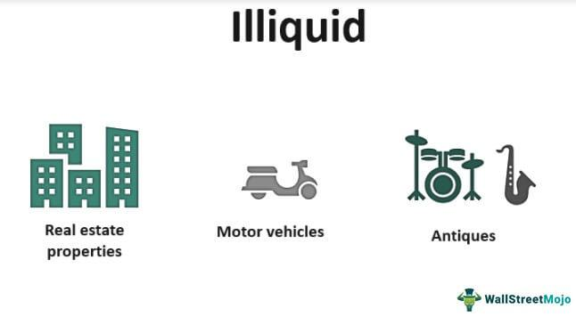

The financial landscape is complex, encompassing a multitude of asset classes and investment vehicles. Among these, illiquid assets stand out for their unique set of challenges and potential opportunities. Illiquid assets are typically difficult to sell quickly without incurring a significant loss in value. This characteristic sets them apart from more liquid assets, which can be sold swiftly, even during periods of market distress, without substantial price concessions. The handling and management of illiquid assets necessitate specialized strategies, given the obstacles posed by their inherent nature.

Algorithmic trading, renowned for its efficiency and speed, faces distinct challenges when dealing with illiquid assets. Unlike liquid markets, where algorithmic systems can execute large volumes of trades with minimal market impact, illiquid assets require a fundamentally different approach. The complexity arises from factors such as low trading volumes and wider bid-ask spreads, which can lead to increased transaction costs and price volatility. Effective interaction with illiquid assets using algorithmic methods involves adjustments to traditional trading strategies to account for these market dynamics.

This article explores the characteristics of illiquid assets, the risks they embody, and how they differ from liquid counterparts. It also examines the ways in which algorithmic trading strategies can be adapted to manage these challenges effectively, providing a comprehensive understanding of the interplay between illiquid assets and modern trading techniques.

## Table of Contents

## Understanding Illiquid Assets

Illiquid assets are distinguished by their inability to be rapidly converted into cash without incurring substantial losses. These assets typically experience low trading volumes, which leads to wider bid-ask spreads—a situation where the difference between the price buyers are willing to pay and the price sellers are willing to accept is large. This results in higher transaction costs, making quick sales challenging and often costly.

Such assets include real estate, art, antiques, and privately held businesses. While these may possess inherent value, their lack of an active, liquid market makes them difficult to sell promptly. For instance, real estate transactions often involve lengthy processes that can span months or even years. Similarly, art and antiques require specialized buyers, reducing the frequency of transactions. Privately held businesses do not have the same market visibility or number of potential buyers as publicly listed firms, further contributing to their illiquidity.

Illiquidity is frequently seen as the inverse of liquidity, which describes assets that are easily sold at stable prices, even during turbulent market periods. Liquid assets, like most publicly traded stocks, benefit from a high number of market participants and a close bid-ask spread, allowing for quick and relatively cost-efficient transactions.

In financial terms, the [liquidity](/wiki/liquidity-risk-premium) of an asset theoretically can be quantified using the liquidity ratio, which is defined mathematically as:

$$
\text{Liquidity Ratio} = \frac{\text{Cash Equivalents}}{\text{Current Liabilities}}
$$

However, this formula is more applicable to assessing the liquidity of a company's balance sheet rather than individual asset liquidity. For assets, liquidity is more practically understood through market dynamics and trading volumes. Thus, strategies to manage and invest in illiquid assets must consider the inherent challenges of low liquidity, such as potential capital lock-in and increased risk of price [volatility](/wiki/volatility-trading-strategies).

## Examples of Illiquid Assets

Illiquid assets are investments that cannot easily be converted into cash without significant value loss. These often have low trading volumes and larger bid-ask spreads, leading to higher transaction costs and extended selling periods. 

**Real Estate Properties:** Real estate is a prime example of an illiquid asset, where sales transactions can take months or even years to finalize. The process typically involves lengthy negotiations, due diligence, and complex legal paperwork. The unique characteristics of individual properties mean each transaction can be significantly different, impacting liquidity.

**Collectibles:** Items such as rare art pieces and vintage cars are classified as collectibles. These assets require unique buyers with specific interests, which adds to the complexity of finding a market. The subjective nature of their value and rarity can further complicate and prolong the sales process.

**Private Company Interests:** Stakes in private companies are another form of illiquid assets. Unlike publicly traded companies, private companies do not list their shares on stock exchanges, limiting the pool of potential buyers. Transferring ownership might require lengthy approval processes from other stakeholders and adherence to various agreements.

**Certain Stocks:** Some stocks, especially those traded on less active or over-the-counter (OTC) markets, may also be considered illiquid. OTC stocks typically have fewer market participants, resulting in wider spreads and reduced liquidity. Such stocks may face significant price volatility, making them challenging to sell swiftly without concessional pricing. 

In conclusion, while illiquid assets can offer substantial value under the right conditions, they also pose challenges due to their complex nature and market dynamics. These challenges necessitate careful planning and strategic management to mitigate associated risks effectively.

## Risks Associated with Illiquid Assets

Illiquid assets pose several distinct risks due to their inherent characteristics. One of the primary concerns is price volatility. In markets with fewer participants, even nominal trades can result in substantial price fluctuations. This phenomenon arises from the limited number of buyers and sellers, leading to larger impacts from individual transactions. When a trade occurs in such an environment, the price adjustment required to match the limited market demand or supply can be substantial.

Another risk associated with illiquid assets is the challenge of exiting positions. Selling these assets can often be time-consuming, as the limited pool of potential buyers may not always align with the seller's timeframe. Consequently, selling can necessitate significant price concessions to attract buyers, directly impacting the asset's valuation and the seller's returns.

Slippage is another significant concern. Slippage occurs when the price at which a trade is executed differs from the expected price. In low-[volume](/wiki/volume-trading-strategy) markets, the disparity between expected and actual trade prices can be considerable, particularly when large orders are involved. This unpredictability in execution further complicates the trading of illiquid assets and requires careful management to minimize adverse effects.

Lastly, capital lock-in is a critical challenge. When funds are allocated to illiquid assets, they can be immobilized for prolonged periods, contrary to initial liquidity needs or changes in market conditions. This prolonged tie-up can restrict an investor’s ability to reallocate capital in response to new investment opportunities or liquidity demands, potentially leading to suboptimal asset management.

Each of these risks underscores the complexities and potential pitfalls in dealing with illiquid assets, necessitating careful strategic planning and risk assessment to navigate them effectively.

## Impact on Algorithmic Trading

Algorithmic trading hinges on the rapid and efficient execution of large trade volumes. However, navigating illiquid markets presents distinct challenges due to execution risk, higher slippage, and increased transaction costs. In illiquid environments, the impact of a large trade is magnified, potentially leading to substantial shifts in market prices. This is because with fewer market participants, the entry or [exit](/wiki/exit-strategy) of even a moderate trade can cause significant price movements, thus escalating execution risk.

Furthermore, slippage is an inherent concern when trading in such markets. Slippage occurs when there is a discrepancy between the expected price of a trade and the actual price at which it is executed. This divergence can be exacerbated in illiquid markets due to limited trading activity and wider bid-ask spreads. Consequently, algorithms must adapt to account for these disparities, often leading to higher transaction costs as trades are executed at less favorable prices.

To address these concerns, [algorithmic trading](/wiki/algorithmic-trading) employs several innovative strategies. One effective approach is order splitting. By breaking down large orders into smaller, more manageable chunks, algorithms can execute trades incrementally without overwhelming the market. This tactic helps in minimizing market impact and reducing slippage. 

Another strategy involves the use of dark pools, which are private financial forums for trading securities. Dark pools provide an avenue for large trades to be executed anonymously, reducing the likelihood of price movements resulting from the visibility of large orders. By utilizing dark pools, traders can diminish the market impact of substantial trades, thereby mitigating some of the challenges associated with illiquid markets.

In summary, while illiquid markets pose significant hurdles for algorithmic trading, understanding the intricacies of execution risk, slippage, and transaction costs allows for the development of robust strategies. Employing techniques like order splitting and dark pool trading offers viable solutions to manage the complexities of trading in such environments effectively.

## Real-World Applications and Case Studies

The 2010 Flash Crash and the 2012 Knight Capital incident serve as prominent examples highlighting the interaction between illiquidity and algorithmic trading, demonstrating how these factors can result in significant market disruptions.

### The 2010 Flash Crash

On May 6, 2010, the U.S. stock market experienced a rapid and severe downturn, dropping about 1,000 points, approximately 9%, only to recover the majority of those losses within minutes. This event became known as the Flash Crash. The rapid selling was triggered in part by algorithmic trading systems that, sensing volatility and low liquidity, executed a high volume of sales. The crash was initiated by a large sell order executed on the E-mini S&P 500 futures contracts by a mutual fund complex, intended to hedge its equity position. This was an extreme example of how algorithmic trading can amplify market movements when liquidity is low. Algorithms, designed to react to certain market signals, accelerated selling, and low liquidity hindered the absorption of these trades, exacerbating volatility.

During the Flash Crash, the bid-ask spreads for many stocks widened significantly, and some financial instruments traded for as low as a penny or as high as $100,000. This showcased the potential impact of slippage, where the actual execution price deviates from the expected price due to illiquidity. The event illustrated the need for improved regulatory measures and circuit breakers to manage extraordinary volatility driven by automated trading systems in illiquid markets.

### The 2012 Knight Capital Incident

Knight Capital Group, a major trading firm, encountered a severe operational crisis on August 1, 2012, due to a software glitch that resulted in a loss of $440 million within 45 minutes. The company had deployed a faulty algorithm that inadvertently placed numerous unintended market orders. Knight Capital's algorithms were supposed to manage order flow strategically; however, a server issue led to an accidental overflooding of the market with orders. The incident highlighted the risks of algorithmic trading glitches compounded by market illiquidity.

The excess orders significantly impacted prices as they hit various stocks simultaneously, causing sharp price fluctuations due to the lack of liquidity to absorb these orders smoothly. This incident underscored the importance of rigorous testing and robust fail-safes in algorithmic trading systems, particularly when dealing with less liquid assets where the market's ability to manage such fluctuations is constrained.

Both the Flash Crash and the Knight Capital incident exemplify the complex interplay between algorithmic trading strategies and market liquidity. They highlight the importance of ensuring stringent risk management practices and the continuous updating of trading algorithms to prevent similar occurrences and mitigate their impact.

## Management Strategies for Illiquid Assets

## Management Strategies for Illiquid Assets

Illiquid assets require a strategic approach to effectively manage the unique challenges they present. One of the primary strategies involves conducting a thorough liquidity analysis before engaging with these assets. Liquidity analysis entails assessing the ease with which assets can be converted into cash without significantly affecting their price. By understanding current market conditions and the potential for liquidity shifts, investors can make more informed decisions about asset acquisition or disposal. Additionally, liquidity analysis can provide insights into the appropriate timing for entering or exiting positions, minimizing potential losses.

Another essential strategy is maintaining a balance between liquid and illiquid assets within a portfolio. This balance helps address cash flow requirements and reduces the risks associated with unexpected expenses or market downturns. A diversified portfolio containing both types of assets allows investors to leverage the stability of liquid assets while potentially benefiting from the long-term appreciation or higher returns often associated with illiquid investments. This approach necessitates continual monitoring and reallocation of assets to maintain the desired balance as market conditions evolve.

Developing timing strategies is also vital for handling illiquid assets effectively. These strategies involve anticipating potential market exits or entries to mitigate associated risks. For instance, during periods of market volatility or low demand, strategizing the timing of asset sales can prevent significant price concessions. Conversely, identifying periods of heightened demand or favorable market conditions can enhance the potential return on investments. Timing strategies often involve predictive analytics and market trend analysis to forecast optimal action points, employing both quantitative and qualitative data for informed decision-making.

In conclusion, managing illiquid assets requires a multifaceted approach that includes liquidity analysis, portfolio balancing, and strategic timing. Understanding and applying these strategies can significantly enhance the capacity to navigate the complexities of illiquid markets, safeguarding investments and optimizing returns.

## Conclusion

Illiquid assets, by nature, present a complex landscape characterized by distinct risks, yet they also offer potential rewards for investors who can effectively navigate their intricacies. Their unique characteristics, such as difficulty in being sold quickly without significant loss in value, challenge both traditional and algorithmic trading methodologies. However, a comprehensive understanding of these assets can lead to substantial opportunities.

To effectively manage illiquid assets, it is crucial to gain a deep understanding of their nature. This involves recognizing the factors contributing to their illiquidity, which include limited market participation and wide bid-ask spreads. Armed with this knowledge, investors can adopt strategic tools and methodologies to optimize their approaches. For instance, algorithmic trading strategies tailored to the specific behaviors of illiquid assets can provide pathways to efficiently manage transactions and minimize associated risks. Innovative approaches like order splitting and leveraging alternative trading venues such as dark pools can mitigate some of the challenges posed by illiquid markets.

The evolution of technology plays a vital role in enhancing trading strategies and addressing liquidity concerns. Continuous advancements have propelled the development of sophisticated algorithms capable of adjusting to varying market conditions, thereby reducing execution risks and transaction costs. Moreover, evolving regulatory frameworks are set to further streamline the trading of illiquid assets, promoting more transparent and efficient market interactions.

As the financial landscape continues to evolve, investors who leverage these technological advancements and adhere to robust risk management practices will be well-positioned to capitalize on the opportunities presented by illiquid assets. The key lies in balancing the risks with strategic, informed decision-making, enabling investors to turn potential challenges into substantial financial gains.

## References & Further Reading

[1]: ["Market Liquidity: Theory, Evidence, and Policy"](https://academic.oup.com/book/55158) by Thierry Foucault, Marco Pagano, and Ailsa Röell

[2]: ["Flash Boys: A Wall Street Revolt"](https://en.wikipedia.org/wiki/Flash_Boys) by Michael Lewis

[3]: Lewis, M. (2014). ["The Flash Crash: A New Regulatory Paradigm?"](https://www.researchgate.net/publication/320965956_The_flash_crash_a_review) University of Miami Inter-American Law Review.

[4]: Aldridge, I. (2013). ["High-Frequency Trading: A Practical Guide to Algorithmic Strategies and Trading Systems"](https://www.amazon.com/High-Frequency-Trading-Practical-Algorithmic-Strategies/dp/1118343506) 

[5]: Quan Qiu, H. (2012). ["Trading and Exchanges: Market Microstructure for Practitioners"](https://academic.oup.com/book/52292) by Larry Harris.