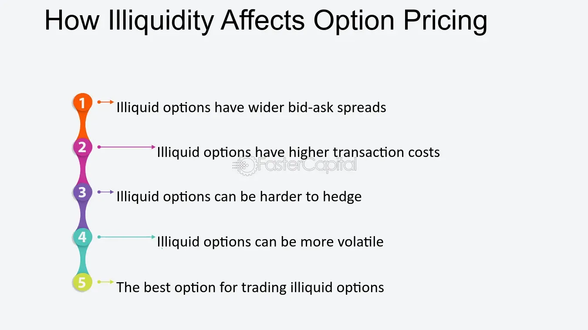

## Table of Contents

## What are illiquid options?

Illiquid options are options contracts that are not traded often. This means there are fewer buyers and sellers for these options, so it can be hard to buy or sell them quickly. When you want to trade an illiquid option, you might have to wait longer to find someone to trade with, or you might have to accept a worse price than you expected.

Because of the low trading activity, the prices of illiquid options can be more unpredictable. They can change a lot in a short time, which can be risky. If you are thinking about trading illiquid options, it's important to understand these risks and be ready for the possibility that you might not be able to trade when you want to.

## How do illiquid options differ from liquid options?

Illiquid options and liquid options are different mainly because of how often they are traded. Liquid options are traded a lot, so there are many buyers and sellers. This makes it easy to buy or sell them quickly, and the prices don't change much suddenly. On the other hand, illiquid options are not traded often. There are fewer people wanting to buy or sell them, so it can take longer to make a trade, and you might not get the price you want.

The price of illiquid options can also be more unpredictable. Because there are fewer trades, the price can jump around a lot. This can be risky if you're trying to trade them. With liquid options, the price is more stable because there are so many trades happening all the time. So, if you're thinking about trading options, it's important to know if they are liquid or illiquid, because it can affect how easy it is to trade and how much risk you're taking on.

## What are the common characteristics of illiquid options?

Illiquid options are options that don't get traded very often. This means there aren't many people buying and selling them. Because of this, if you want to trade an illiquid option, you might have to wait a long time to find someone to trade with. It can also be hard to get the price you want because there are fewer people to negotiate with.

Another thing about illiquid options is that their prices can change a lot and be hard to predict. Since there aren't many trades happening, the price can jump around more than with options that are traded a lot. This can make trading them riskier because you might not know what price you'll get when you finally make a trade.

So, if you're thinking about trading options, it's good to know if they are illiquid or not. Illiquid options can be trickier to trade and might come with more risk because of how their prices can move and how hard it can be to find someone to trade with.

## Where are illiquid options typically found?

Illiquid options are often found in markets where there isn't a lot of trading happening. This can be because the options are for smaller companies that not many people are interested in, or because the options are very far away from the current stock price (called "out-of-the-money" options). When there aren't many people buying and selling these options, they become illiquid.

You might also find illiquid options in markets for things that are not very common or popular. For example, options on commodities like wheat or sugar might be less liquid than options on more popular assets like stocks or major stock indexes. If you're looking at options and see that there aren't many trades happening, or if the price changes a lot between trades, you're probably looking at illiquid options.

## What are the main reasons for an option becoming illiquid?

An option can become illiquid when there aren't many people wanting to buy or sell it. This often happens with options on smaller companies that not many investors are interested in. When a company is small or not well-known, fewer people pay attention to its options, so there are fewer trades. Another reason is if the option is far away from the current stock price. These are called "out-of-the-money" options, and since they are less likely to be profitable, fewer people trade them.

Also, options can become illiquid if they are for things that are not very popular or common. For example, options on commodities like wheat or sugar might not be traded as often as options on big stock indexes. When there is less interest in the underlying asset, there will be fewer people trading the options. So, if you see an option that doesn't have many trades happening, or if the price jumps around a lot between trades, it's probably an illiquid option.

## How can an investor identify an illiquid option?

An investor can identify an illiquid option by looking at how often it is traded. If there aren't many trades happening, it means the option is illiquid. You can check this by looking at the trading [volume](/wiki/volume-trading-strategy), which shows how many options have been bought and sold. If the trading volume is low, it's a sign that the option is illiquid.

Another way to spot an illiquid option is by looking at the bid-ask spread. This is the difference between the price someone is willing to pay for the option (the bid) and the price someone is willing to sell it for (the ask). If the bid-ask spread is wide, it means there aren't many people trading the option, so it's likely illiquid. Also, if the price of the option jumps around a lot between trades, that's another sign that it might be illiquid.

## What are the potential risks of trading illiquid options?

Trading illiquid options can be risky because it's hard to buy or sell them quickly. When you want to trade an illiquid option, you might have to wait a long time to find someone to trade with. This can be a problem if you need to get out of a trade fast. Also, because there aren't many people trading, you might not get the price you want. You might have to accept a worse price than you expected, which can cost you more money.

Another risk is that the price of illiquid options can change a lot and be hard to predict. Since there aren't many trades happening, the price can jump around more than with options that are traded a lot. This can make trading them riskier because you might not know what price you'll get when you finally make a trade. If the price moves against you, it could lead to bigger losses than you planned for. So, if you're thinking about trading illiquid options, it's important to understand these risks and be ready for them.

## How does the bid-ask spread affect trading in illiquid options?

The bid-ask spread is the difference between the price someone is willing to pay for an option (the bid) and the price someone is willing to sell it for (the ask). In illiquid options, this spread is usually wider because there are fewer people trading. When you want to buy an illiquid option, you might have to pay a higher price than you would for a liquid option. And when you want to sell, you might have to accept a lower price. This wider spread can make trading more expensive because you're losing more money on each trade.

Because of the wide bid-ask spread, it can be harder to make a profit with illiquid options. If you buy an option and then want to sell it, the price you get might be a lot lower than what you paid. This means you need the option's price to move more in your favor just to break even. So, the bid-ask spread in illiquid options adds an extra layer of risk and cost to your trades.

## What strategies can be used to trade illiquid options effectively?

Trading illiquid options can be tricky, but there are some strategies that can help. One good way is to be patient and wait for the right time to trade. Since illiquid options don't have many buyers and sellers, you might need to wait longer to find someone to trade with. It's a good idea to set a limit order, which means you decide the price you want to buy or sell at, and then wait for someone to agree to that price. This can help you avoid paying too much or selling for too little.

Another strategy is to be ready for big price changes. Illiquid options can jump around in price a lot, so it's important to have a plan for what you'll do if the price moves against you. You might want to set a stop-loss order, which automatically sells your option if the price drops to a certain level. This can help limit your losses. Also, it's a good idea to only trade illiquid options with money you can afford to lose, because the risks are higher.

Lastly, it can help to do a lot of research before trading illiquid options. Look at the trading volume and the bid-ask spread to understand how illiquid the option is. If the trading volume is very low and the bid-ask spread is wide, be extra careful. Also, try to learn as much as you can about the company or asset the option is based on. The more you know, the better you can predict how the option's price might move.

## How do market makers influence the liquidity of options?

Market makers are important people in the options market because they help make it easier to buy and sell options. They do this by always being ready to buy or sell options at certain prices. When there are market makers, it means there are always people willing to trade, so options become more liquid. This is good for everyone because it means you can trade your options faster and at better prices.

But market makers can also affect how liquid options are in a different way. If they think an option is too risky or not worth their time, they might not want to trade it as much. When this happens, the option can become less liquid because there are fewer people willing to buy or sell it. So, market makers can make options more liquid by being ready to trade, but they can also make options less liquid if they decide not to trade certain options.

## What are the regulatory considerations for trading illiquid options?

When trading illiquid options, there are some rules you need to think about. These rules are there to make sure trading is fair and to protect people from big risks. For example, some rules say that you need to have enough money in your account to cover the trades you make. This is called having enough "margin." If you don't have enough margin, you might not be allowed to trade illiquid options.

Another important thing to know is that some places have special rules for illiquid options. These rules might say that you need to be a certain kind of investor, like a professional or someone with a lot of experience, to trade them. This is because illiquid options can be risky, and the rules are there to make sure only people who understand the risks can trade them. So, before you start trading illiquid options, it's a good idea to check what the rules are in your area.

## How can advanced traders use illiquid options to their advantage?

Advanced traders can use illiquid options to their advantage by taking advantage of the bigger price changes that happen with these options. Because illiquid options don't have many people trading them, their prices can move a lot more than liquid options. If an advanced trader can predict these price moves well, they might be able to make more money. They can buy an option at a low price and then sell it at a much higher price if the market moves in their favor.

Another way advanced traders can benefit from illiquid options is by using them to make special trading plans. For example, they might use illiquid options to create a strategy that limits their risk while still giving them a chance to make money. Since fewer people are trading these options, advanced traders can sometimes find deals that others might miss. But it's important for them to be very careful and know a lot about the market, because trading illiquid options can be risky if things don't go as planned.

## What are the risks associated with illiquid options?

Trading illiquid options presents several inherent risks that investors must carefully consider. The foremost challenge arises from the difficulty in exiting positions. Illiquid options often suffer from low trading activity, meaning there can be a lack of buyers or sellers when an investor wishes to close out a position. This can force traders to hold positions until expiration, potentially leading to losses if the market moves unfavorably.

The wider bid-ask spreads associated with illiquid options also significantly impact profitability. In an illiquid market, the gap between what buyers are willing to pay (bid) and what sellers are willing to accept (ask) tends to be much larger. This spread inherently increases the cost of executing trades and erodes potential profits. Mathematically, if the spread is denoted by $S$ and the transaction size by $Q$, the additional cost incurred, or the slippage, can be represented as:

$$
\text{Slippage} = Q \times S
$$

This formula emphasizes how increased spreads compound transaction costs, ultimately affecting gross returns.

Illiquid options are often more susceptible to heightened [volatility](/wiki/volatility-trading-strategies), where sudden price movements occur due to the limited number of market participants. This increased volatility can have a significant market impact, as large orders are more likely to move the market price unfavorably before the order is fully executed. Consequently, strategy execution becomes complex, requiring sophisticated risk management mechanisms to mitigate adverse effects.

Investors in illiquid options markets must be adept at navigating these challenges. A lack of [liquidity](/wiki/liquidity-risk-premium) can magnify errors in judgment about market movements, resulting in substantial financial repercussions. As such, it is imperative to acknowledge and prepare for these risks to succeed in trading illiquid options.

## References & Further Reading

[1]: ["Options, Futures, and Other Derivatives"](https://www.amazon.com/Options-Futures-Other-Derivatives-9th/dp/0133456315) by John C. Hull

[2]: ["Algorithmic Trading: Winning Strategies and Their Rationale"](https://github.com/prabakar2610/TradingBooks/blob/master/Algorithmic%20Trading%20-%20Winning%20Strategies%20and%20Their%20Rationale%202013.pdf) by Ernie Chan

[3]: Black, F., & Scholes, M. (1973). ["The Pricing of Options and Corporate Liabilities."](https://www.cs.princeton.edu/courses/archive/fall09/cos323/papers/black_scholes73.pdf) Journal of Political Economy, 81(3), 637-654.

[4]: Hasbrouck, J. (2007). ["Empirical Market Microstructure: The Institutions, Economics, and Econometrics of Securities Trading"](https://academic.oup.com/book/52241) by Joel Hasbrouck

[5]: Kissell, R. (2013). ["The Science of Algorithmic Trading and Portfolio Management"](https://www.sciencedirect.com/book/9780124016897/the-science-of-algorithmic-trading-and-portfolio-management) by Robert Kissell