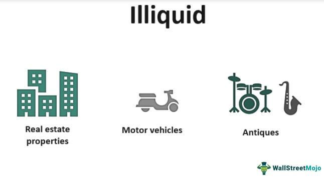

Options trading is a multifaceted area within finance, involving numerous asset types and trading strategies. Among these, illiquid options stand out for their distinct characteristics, presenting unique challenges and opportunities for traders. Illiquid options refer to those options that lack ease of sale or conversion to cash. This illiquidity is primarily attributed to low trading volumes and limited market interest, which often result in wider bid-ask spreads and less frequent trading activity.

The complexity of trading illiquid options arises from their inherent characteristics. These instruments are often challenging to transact due to the sparse presence of active buyers and sellers. For investors and traders, understanding these dynamics is essential to navigating the nuances of illiquid options effectively. The selection of these options typically requires sophisticated strategies and a keen awareness of the market environment.



This article aims to explore the various dimensions associated with illiquid options in financial trading. It intends to illuminate the risks, such as the difficulty in exiting positions and potential unfavorable price movements. Moreover, the discussion extends to the applicability of algorithmic trading strategies, which can offer solutions by enhancing execution efficiency. For traders wishing to venture into the world of illiquid options, careful strategic planning and a thorough understanding of market behavior are crucial to achieving success.

## Table of Contents

## Understanding Illiquid Options

Illiquid options are distinguished by their limited market activity, making them difficult to buy or sell without causing significant changes in their price. This lack of ease in trading is primarily evidenced by wider bid-ask spreads, which represent the difference between the highest price a buyer is willing to pay for an option and the lowest price a seller is willing to accept. Wider spreads indicate a higher cost of entry and exit for traders.

Several factors contribute to the illiquidity of options. A key [factor](/wiki/factor-investing) is low open interest, which refers to the total number of outstanding option contracts that have not been settled. A lower open interest indicates less interaction from investors, resulting in less liquidity. Additionally, a lack of market participants—such as institutional investors or active traders—reduces the frequency of transactions, further complicating the trading process. Infrequent trading of certain options can also be attributed to the underlying asset’s lack of volatility or its unattractive risk-to-reward profile, discouraging potential buyers and sellers from participating.

For investors, understanding these factors is critical for making informed decisions. The degree of illiquidity can significantly impact the cost-effectiveness and timing of trades. For instance, an investor looking to exit a position in an illiquid option might have to accept a lower-than-desired price due to the scarcity of buyers. Conversely, entering a position may involve paying a premium due to the limited availability of sellers.

It's important for investors to assess the [liquidity](/wiki/liquidity-risk-premium) of options by examining metrics such as trading [volume](/wiki/volume-trading-strategy) and open interest. Additionally, keeping track of economic factors and announcements that might sway investor interest can help anticipate changes in option liquidity. Making these assessments helps investors forecast potential transaction costs and the feasibility of executing their trading strategies effectively.

## Risks Associated with Illiquid Options

Trading illiquid options presents several inherent risks that investors must carefully consider. The foremost challenge arises from the difficulty in exiting positions. Illiquid options often suffer from low trading activity, meaning there can be a lack of buyers or sellers when an investor wishes to close out a position. This can force traders to hold positions until expiration, potentially leading to losses if the market moves unfavorably.

The wider bid-ask spreads associated with illiquid options also significantly impact profitability. In an illiquid market, the gap between what buyers are willing to pay (bid) and what sellers are willing to accept (ask) tends to be much larger. This spread inherently increases the cost of executing trades and erodes potential profits. Mathematically, if the spread is denoted by $S$ and the transaction size by $Q$, the additional cost incurred, or the slippage, can be represented as:

$$
\text{Slippage} = Q \times S
$$

This formula emphasizes how increased spreads compound transaction costs, ultimately affecting gross returns.

Illiquid options are often more susceptible to heightened [volatility](/wiki/volatility-trading-strategies), where sudden price movements occur due to the limited number of market participants. This increased volatility can have a significant market impact, as large orders are more likely to move the market price unfavorably before the order is fully executed. Consequently, strategy execution becomes complex, requiring sophisticated risk management mechanisms to mitigate adverse effects.

Investors in illiquid options markets must be adept at navigating these challenges. A lack of liquidity can magnify errors in judgment about market movements, resulting in substantial financial repercussions. As such, it is imperative to acknowledge and prepare for these risks to succeed in trading illiquid options.

## Algorithmic Trading and Illiquid Options

Algorithmic trading plays a crucial role in addressing the challenges associated with illiquid options, particularly by optimizing trade execution and minimizing market impact. Illiquid options, characterized by their low trading volume and wide bid-ask spreads, pose significant obstacles for traditional trading strategies. However, sophisticated algorithms can effectively navigate these hurdles by strategically scheduling and executing trades in such a way that minimizes disruption in the market.

One of the primary advantages of [algorithmic trading](/wiki/algorithmic-trading) in illiquid markets is the ability to execute trades more efficiently. Algorithms can analyze vast amounts of market data in real-time, allowing them to identify favorable trading opportunities and respond to market conditions swiftly. This capability is particularly beneficial in illiquid markets, where price movements can be erratic and unpredictable. By automating the decision-making process, algorithms can reduce latency, ensure timely execution, and improve overall trading performance.

Moreover, algorithms can be designed to minimize market impact by breaking down large orders into smaller, more manageable trades. This technique, often referred to as order slicing, helps prevent significant price fluctuations that could occur if a large order were executed at once. For example, the implementation of a Volume Weighted Average Price (VWAP) strategy can distribute the execution of an order across the trading session, thereby reducing the potential for adverse price movements. A simple Python implementation of a VWAP algorithm might look like this:

```python
import numpy as np

def calculate_vwap(prices, volumes):
    return np.sum(prices * volumes) / np.sum(volumes)

# Example data
prices = np.array([100, 101, 102, 103])
volumes = np.array([200, 250, 300, 350])

vwap = calculate_vwap(prices, volumes)
print(f"The VWAP is: {vwap}")
```

While algorithmic trading provides these solutions, it's imperative to recognize the complexities inherent in designing and implementing such algorithms in illiquid markets. The effectiveness of a trading algorithm depends on its ability to incorporate and adapt to the unique liquidity dynamics of the market. Algorithms must be rigorously tested and validated to ensure they account for factors like low open interest and infrequent trading, which are typical in illiquid options markets.

Ultimately, the successful application of algorithmic trading to illiquid options demands a thoughtful balance between sophistication and market realism. Traders must continually assess and refine their algorithms to align with changing market conditions, ensuring that they remain robust against the inherent challenges of illiquidity.

## Strategies for Navigating Illiquid Options Market

In navigating the illiquid options market, investors must employ strategies that mitigate the risks associated with price execution and market dynamics. One effective approach is to utilize limit orders. Limit orders allow investors to specify the maximum price they are willing to pay for an option or the minimum price at which they are willing to sell. This order type ensures that the transaction will not occur unless the price criteria are met, thereby reducing the risk of executing trades at unfavorable prices. By controlling entry and [exit](/wiki/exit-strategy) points with precision, limit orders help minimize exposure to wide bid-ask spreads and potential price slippage.

Another strategy involves selecting options with longer expiration dates. Options that are far from expiration may offer improved liquidity over time as market interest can increase and more participants enter the market. Longer-dated options provide investors with additional time for strategic planning and position adjustments, potentially reducing the urgency that often accompanies short-term option trades with immediate expiry. This additional timeframe can allow for more favorable market conditions to develop, thus improving the likelihood of exiting positions at acceptable prices.

Continuous monitoring of market conditions is essential for managing illiquid options effectively. Investors should remain vigilant to changes in market sentiment, volatility, and trading volume, adapting their strategies accordingly. This might involve reassessing option holdings, adjusting price limits on orders, or altering the time horizon of trades. Employing technology and data analytics can enhance this monitoring process, providing real-time insights and alerts that inform decision-making.

In sum, navigating the illiquid options market requires a combination of tactical order placement, strategic selection of option maturities, and vigilant market analysis. By implementing these strategies, investors can better manage the inherent challenges of illiquidity, optimizing their trading outcomes.

## Conclusion

Trading illiquid options presents a distinctive risk-reward profile that necessitates a comprehensive understanding and meticulous strategic planning. The inherent challenges stem from the difficulty of exiting positions due to low liquidity, which can compel investors to retain assets until expiration under potentially adverse price conditions. The wider bid-ask spreads also contribute to elevated transaction costs, thereby affecting overall profitability.

Algorithmic trading can serve as a potent tool to mitigate some of the risks associated with illiquid options. By leveraging sophisticated algorithms, traders can enhance execution efficiency and minimize market impact, even within less liquid markets. However, the implementation of these algorithms requires careful consideration of the complexities involved and their alignment with the specific liquidity characteristics of the underlying assets.

Successful navigation of the illiquid options market hinges on the application of nuanced strategies and constant evaluation of market conditions. For instance, limit orders can be employed to manage entry and exit points, reducing exposure to unfavorable price fluctuations. Additionally, selecting options with longer expiration terms may offer potential improvements in liquidity over time. Continuous monitoring and adjustment of strategies in response to evolving market dynamics are crucial for optimizing outcomes in a landscape characterized by both risks and opportunities.

By harnessing the appropriate strategies and perpetually assessing market trends, investors can effectively address the challenges inherent in trading illiquid options, balancing risk and reward to their advantage.

## References & Further Reading

[1]: ["Options, Futures, and Other Derivatives"](https://www.amazon.com/Options-Futures-Other-Derivatives-9th/dp/0133456315) by John C. Hull

[2]: ["Algorithmic Trading: Winning Strategies and Their Rationale"](https://github.com/prabakar2610/TradingBooks/blob/master/Algorithmic%20Trading%20-%20Winning%20Strategies%20and%20Their%20Rationale%202013.pdf) by Ernie Chan

[3]: Black, F., & Scholes, M. (1973). ["The Pricing of Options and Corporate Liabilities."](https://www.cs.princeton.edu/courses/archive/fall09/cos323/papers/black_scholes73.pdf) Journal of Political Economy, 81(3), 637-654.

[4]: Hasbrouck, J. (2007). ["Empirical Market Microstructure: The Institutions, Economics, and Econometrics of Securities Trading"](https://academic.oup.com/book/52241) by Joel Hasbrouck

[5]: Kissell, R. (2013). ["The Science of Algorithmic Trading and Portfolio Management"](https://www.sciencedirect.com/book/9780124016897/the-science-of-algorithmic-trading-and-portfolio-management) by Robert Kissell