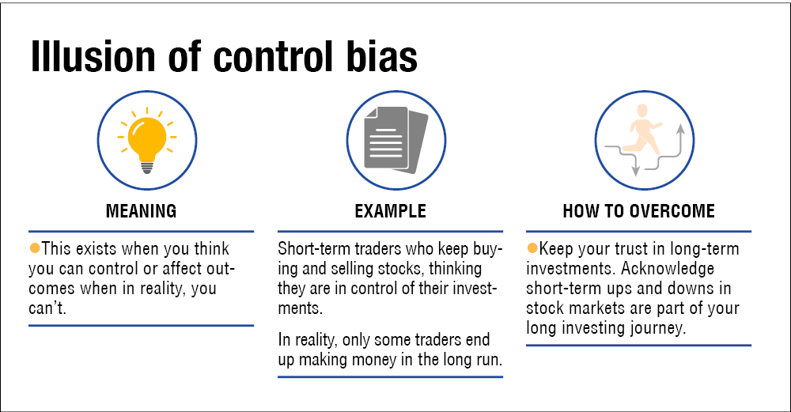

## Table of Contents

## What is the illusion of control bias?

The illusion of control bias is when people think they have more control over things than they really do. For example, someone might believe they can make a random event, like rolling a dice, go their way just by trying harder or using a special method. This can happen in games, gambling, or even in daily life when people think their actions can influence things that are actually out of their control.

This bias can lead to problems because it makes people take unnecessary risks or feel too confident. For instance, a gambler might keep betting money thinking they can control the outcome, even though it's just luck. Understanding this bias can help people make better decisions by realizing what they can and cannot control, and not overestimating their influence on random events.

## How does the illusion of control bias affect investment decisions?

The illusion of control bias can make investors think they can predict or control the stock market more than they really can. They might believe that by doing a lot of research or using special strategies, they can make the market do what they want. This can lead them to take bigger risks, like investing all their money in one stock, thinking they can control how it will perform. But the stock market is unpredictable, and no one can control it completely.

This bias can cause investors to make bad choices. For example, they might keep buying a stock even when it's going down, thinking they can turn it around. Or they might trade too often, thinking each trade will be a winner. Over time, this can lead to big losses because they're not seeing the market for what it really is – something they can't fully control. Recognizing this bias can help investors make smarter choices, like diversifying their investments and not putting too much faith in their ability to predict the market.

## Can you provide examples of the illusion of control bias in everyday investing?

Imagine someone who checks the stock market every day and thinks that by watching it closely, they can predict when the stock will go up or down. They might believe that if they buy or sell at just the right time, they can make a lot of money. This is the illusion of control bias because no one can really predict the stock market that way. It's like trying to guess the weather by looking out the window every hour – you might get it right sometimes, but you can't control it.

Another example is when someone thinks they can make a stock go up by buying more of it. They might think, "If I keep buying this stock, it will go up because I'm showing confidence in it." But the stock market doesn't work like that. The price of a stock is influenced by many things, like company news, economic reports, and other investors' actions. So, thinking you can control the stock price by buying more is just an illusion. It's important to understand that while you can choose what to invest in, you can't control how the market will react.

## What are the psychological roots of the illusion of control bias?

The illusion of control bias comes from how our brains work. People like to feel in charge of what happens around them. This feeling can make us think we have more control over things than we really do. It's like when you play a game and think you can win by trying harder, even if it's just luck. Our brains trick us into thinking we can control things that are actually random or out of our hands.

This bias also comes from how we learn and remember things. When something good happens after we do something, we might think our action caused it, even if it was just a coincidence. For example, if you wear a lucky shirt and your team wins, you might think the shirt helped. Over time, these experiences build up and make us believe we have more control than we really do. Understanding this can help us see when we're falling into this trap and make better choices.

## How can the illusion of control bias lead to overconfidence in investment returns?

The illusion of control bias can make investors feel too sure about their investment choices. They might think that by doing lots of research or using special methods, they can make their investments grow a lot. This makes them believe they can control the stock market, even though it's really hard to predict. When they feel this way, they might take bigger risks, like putting all their money in one stock, thinking they know exactly how it will do. But the market is unpredictable, and no one can control it completely.

This overconfidence can lead to big problems. Investors might keep buying a stock even when it's going down, thinking they can turn it around. They might also trade too much, thinking each trade will be a winner. Over time, these actions can lead to big losses because they're not seeing the market for what it really is – something they can't fully control. Recognizing this bias can help investors make smarter choices, like spreading their money across different investments and not thinking they can predict the market perfectly.

## What are the potential financial consequences of the illusion of control bias in investing?

The illusion of control bias can lead to big money problems when people invest. When investors think they can control the stock market, they might take bigger risks than they should. They might put all their money into one stock, thinking they can make it go up. But if the stock goes down, they could lose a lot of money. They might also keep buying a stock even when it's going down, thinking they can turn it around. This can make their losses even bigger.

Over time, this bias can make investors trade too much, thinking each trade will be a winner. But trading a lot can cost a lot in fees and taxes, and it might not make them more money. In the end, they might lose money because they're not seeing the market for what it really is – something they can't fully control. Recognizing this bias can help investors avoid these big money mistakes and make smarter choices, like spreading their money across different investments and not thinking they can predict the market perfectly.

## How can investors recognize the illusion of control bias in their own behavior?

Investors can recognize the illusion of control bias by paying attention to how they feel about their investments. If they think they can predict the stock market or make it go their way just by doing more research or using special methods, they might be falling into this trap. They might feel too sure about their choices and think they can control things that are really out of their hands. If they find themselves taking big risks, like putting all their money into one stock, or if they keep buying a stock even when it's going down, hoping to turn it around, these are signs that the illusion of control bias might be affecting them.

Another way to spot this bias is by looking back at their past decisions. If they notice that they often think their actions caused good outcomes, even when it might have been just luck, this could be a sign of the illusion of control. For example, if they believe that checking the stock market every day or trading a lot will make them more money, they're likely overestimating their control over the market. Recognizing these patterns can help investors see when they're being influenced by this bias and make more realistic and careful choices with their money.

## What strategies can investors use to mitigate the effects of the illusion of control bias?

Investors can use a few simple strategies to help them not fall into the trap of thinking they can control the stock market. One good way is to spread their money across different investments. This is called diversification. By not putting all their money into one stock or one type of investment, they can lower the risk of losing a lot of money if one investment goes down. Another strategy is to set clear rules for themselves about when to buy or sell investments. This can help them make decisions based on facts and not just feelings or the hope that they can control the market.

Another helpful approach is to keep learning about the stock market and how it works. By understanding that the market is unpredictable and that no one can control it completely, investors can be more realistic about their choices. They can also talk to a financial advisor who can give them good advice and help them see when they might be thinking they have more control than they really do. By using these strategies, investors can make smarter choices and avoid the big money mistakes that come from thinking they can control things they can't.

## How does the illusion of control bias interact with other cognitive biases in investment?

The illusion of control bias often works together with other cognitive biases to make investing harder. One common bias it interacts with is overconfidence bias. When investors think they can control the stock market, they might also feel too sure about their choices. This can make them take bigger risks, like putting all their money into one stock, thinking they know exactly how it will do. But the market is unpredictable, and no one can control it completely. So, when these two biases mix, investors might make bad choices and lose money because they're not seeing the market for what it really is.

Another bias that can mix with the illusion of control is confirmation bias. This is when people look for information that supports what they already believe and ignore information that doesn't. If an investor thinks they can control the market, they might only pay attention to news or data that makes them feel like they're right. This can make them keep buying a stock even when it's going down, thinking they can turn it around. Over time, these biases together can lead to big losses because investors are not seeing the full picture and are making decisions based on what they want to believe, not on what's really happening.

## What role does the illusion of control bias play in the performance of professional investors versus amateur investors?

The illusion of control bias can affect both professional and amateur investors, but it might show up differently for each group. Professional investors, like those who manage big funds, might think they can control the market because they have a lot of experience and information. They might use complex strategies and think these give them more control over their investments. But even with all their knowledge, they can still fall into the trap of thinking they can predict or control the market better than they really can. This can lead them to take big risks, like investing heavily in one stock or sector, hoping their strategies will pay off.

Amateur investors, on the other hand, might not have as much experience or information, but they can still feel like they can control the market. They might think that by watching the stock market every day or using tips from friends, they can make the right choices. This can make them trade a lot or put all their money into one stock, thinking they can make it go up. Both groups can lose money because of the illusion of control bias, but professionals might lose more because they manage bigger amounts of money. Recognizing this bias can help both types of investors make smarter choices and not take unnecessary risks.

## How can financial advisors help clients overcome the illusion of control bias?

Financial advisors can help clients overcome the illusion of control bias by teaching them about how the stock market works. They can explain that the market is unpredictable and that no one can control it completely. By showing clients real examples of how the market has moved in the past, advisors can help them see that even the best strategies can't predict everything. This can help clients understand that their actions might not have as much control over the market as they think. Advisors can also encourage clients to diversify their investments, spreading their money across different stocks and types of investments. This way, if one investment goes down, they won't lose all their money.

Another way financial advisors can help is by setting up clear rules for buying and selling investments. These rules can be based on facts and numbers, not just feelings or hopes. For example, an advisor might tell a client to sell a stock if it goes down by a certain amount. This can help clients make decisions based on what's really happening, not on the belief that they can control the market. Advisors can also keep reminding clients about the illusion of control bias and how it can lead to bad choices. By talking about it openly and regularly, advisors can help clients stay aware of the bias and make smarter investment decisions.

## What are the latest research findings on the impact of the illusion of control bias on long-term investment returns?

Recent research shows that the illusion of control bias can hurt long-term investment returns. When investors think they can control the stock market, they might take bigger risks, like putting all their money into one stock or trading a lot. This can lead to big losses because the market is unpredictable and no one can control it completely. Studies have found that investors who believe they have more control than they really do often end up with lower returns over time. They might keep buying a stock even when it's going down, hoping to turn it around, which can make their losses even bigger.

Researchers have also looked at how the illusion of control bias affects different types of investors. They found that both professional and amateur investors can be affected by this bias, but it might show up differently. Professionals might think their experience and complex strategies give them more control, while amateurs might believe they can control the market by watching it closely or using tips from friends. The studies show that recognizing and understanding this bias can help investors make better choices, like diversifying their investments and not taking unnecessary risks. By being aware of the illusion of control bias, investors can improve their long-term returns and avoid big money mistakes.

## References & Further Reading

[1]: Langer, E. J. (1975). ["The Illusion of Control."](https://psycnet.apa.org/record/1977-03333-001) Journal of Personality and Social Psychology, 32(2), 311–328.

[2]: Shefrin, H. (2000). ["Beyond Greed and Fear: Understanding Behavioral Finance and the Psychology of Investing"](https://academic.oup.com/book/27607). Harvard Business School Press.

[3]: Tversky, A., & Kahneman, D. (1974). ["Judgment under Uncertainty: Heuristics and Biases."](https://www2.psych.ubc.ca/~schaller/Psyc590Readings/TverskyKahneman1974.pdf) Science, 185(4157), 1124-1131.

[4]: Thaler, R. H., & Sunstein, C. R. (2008). ["Nudge: Improving Decisions About Health, Wealth, and Happiness"](https://www.researchgate.net/publication/257178709_Nudge_Improving_Decisions_About_Health_Wealth_and_Happiness_RH_Thaler_CR_Sunstein_Yale_University_Press_New_Haven_2008_293_pp). Yale University Press.

[5]: Barber, B. M., & Odean, T. (2000). ["Trading is Hazardous to Your Wealth: The Common Stock Investment Performance of Individual Investors."](https://faculty.haas.berkeley.edu/odean/Papers%20current%20versions/Individual_Investor_Performance_Final.pdf) The Journal of Finance, 55(2), 773-806.

[6]: Kahneman, D. (2011). ["Thinking, Fast and Slow"](https://link.springer.com/article/10.1007/s00362-013-0533-y). Farrar, Straus and Giroux.

[7]: Seides, T. (2016). ["The Illusion of Control and Overconfidence in Investing."](https://www.researchgate.net/publication/371533715_The_Influence_of_Behavioral_Biases_on_Investment_Decisions_Moderating_Role_of_Emotional_Stability) The Journal of Financial Perspectives.