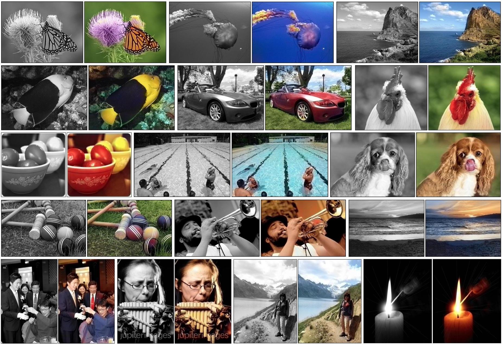

## Table of Contents

## What is image colorization and why is it important?

Image colorization is the process of adding color to black and white or grayscale images. It's like painting with a computer, where the computer guesses what colors should go where based on what it knows about the world. This can be done automatically using special computer programs that use math and patterns to figure out the best colors to use.

Colorization is important because it can bring old photos and movies back to life, making them look new and fresh. When we see things in color, it's easier to understand and feel connected to them. Colorized images can help us learn about history in a more interesting way, and they can also make old family photos more meaningful. Plus, colorization can be used in art and design to create unique and eye-catching images.

## How do traditional image colorization methods differ from machine learning approaches?

Traditional image colorization methods often rely on manual work, where artists carefully add color to black and white images by hand. This process can be very time-consuming and requires a lot of skill and patience. Artists use their knowledge of the world and the colors they see around them to decide what colors to use. For example, they might know that the sky is usually blue, so they'll color the sky part of the image blue. This method can produce very detailed and accurate results, but it's slow and not practical for colorizing large numbers of images.

Machine learning approaches to image colorization use computers to do the work automatically. These methods use special programs that can learn from examples. The computer looks at many color images and learns the patterns and relationships between different colors and parts of the image. Then, when it sees a black and white image, it uses what it has learned to guess the best colors to use. This can be much faster than manual methods, and it can handle many images at once. However, the results might not always be as accurate or detailed as those done by hand, because the computer is making guesses based on patterns rather than real-world knowledge.

Both methods have their strengths and weaknesses. Traditional methods can produce high-quality results but are slow and labor-intensive. Machine learning methods are faster and can process many images, but the quality might not be as good. As technology improves, machine learning methods are getting better and better, making them a more popular choice for many people.

## What are the basic components of a machine learning model for image colorization?

A machine learning model for image colorization usually has a few key parts. First, it needs a way to understand the black and white image. This part is called a convolutional neural network (CNN), which is like a computer's way of looking at pictures. The CNN breaks down the image into small pieces and looks for patterns, like edges and shapes. It then uses these patterns to figure out what the image might be showing. Second, the model needs a way to guess the colors. This is often done with another part of the model called a decoder, which takes the patterns found by the CNN and turns them into color predictions. The decoder tries to match the colors it thinks should be there based on what it has learned from lots of other color images.

The third important part is the training process. The model learns by looking at many examples of black and white images and their color versions. It compares its color guesses to the real colors and adjusts its guesses to be more accurate. This is done using a method called backpropagation, which helps the model learn from its mistakes. The more examples the model sees, the better it gets at colorizing new images. Finally, the model might use something called a loss function to measure how good its color guesses are. The loss function helps the model know if it's getting better or worse and guides it to make better color choices over time.

## How does the Colorization Transformer model work?

The Colorization Transformer model uses a special way to add color to black and white images. It's like a smart computer that looks at the whole picture at once, instead of breaking it into small pieces like some other models do. This model uses something called a Transformer, which is a type of computer program that's really good at understanding patterns in data. The Colorization Transformer looks at the black and white image and uses what it has learned from lots of other color pictures to guess the right colors. It's like the model is trying to fill in a coloring book, but instead of using crayons, it uses math and patterns to decide which colors to use where.

The way the Colorization Transformer works is by using a process called self-attention. This means the model can look at different parts of the image and see how they relate to each other. For example, if it sees a part of the image that looks like a tree, it can use what it knows about trees to color that part green. The model keeps getting better at this by comparing its color guesses to the real colors in the training pictures. Over time, it learns to make better and better guesses. This makes the Colorization Transformer really good at adding color to black and white images in a way that looks natural and realistic.

## What datasets are commonly used for training image colorization models?

For training image colorization models, one of the most commonly used datasets is the ImageNet dataset. ImageNet is a large collection of images that are organized into different categories, like animals, plants, and objects. These images are used to teach the computer what different things look like in color, so it can guess the right colors for black and white images. Another popular dataset is the COCO (Common Objects in Context) dataset, which has a lot of everyday scenes and objects. Both of these datasets help the model learn from a wide variety of images, making it better at colorizing different types of pictures.

Another dataset that's often used is the Places dataset, which focuses on different types of scenes and environments. This helps the model understand how colors are used in different settings, like indoors versus outdoors. Some researchers also use custom datasets that they create themselves, which can be tailored to specific types of images they want to colorize. By using these different datasets, the model can learn more about the world and make better color guesses for all kinds of black and white images.

## What are the key challenges in developing effective image colorization models?

One of the main challenges in developing effective image colorization models is getting the colors right. Since the model is guessing colors based on patterns it has learned from other images, it can sometimes make mistakes. For example, it might color a sky orange when it should be blue, or it might not know the right shade of green for a tree. This is because the model doesn't have the same understanding of the world that a human does. It's just using math and patterns to make its best guess, which can lead to colors that don't look quite right.

Another challenge is making the model work well with different types of images. Some images might be easy to colorize, like a clear photo of a person or a landscape. But other images, like old, blurry photos or pictures with lots of different objects, can be much harder. The model needs to be trained on a wide variety of images so it can learn how to handle all these different situations. This means using big datasets with lots of different kinds of pictures, which can be hard to find and use. Even with lots of training data, the model might still struggle with certain types of images, which can make it less useful for some tasks.

## How can the performance of an image colorization model be evaluated?

The performance of an image colorization model can be evaluated by comparing the colors it adds to black and white images with the real colors in the original color images. One way to do this is by using a measure called the Mean Squared Error (MSE). MSE looks at the difference between the color the model guessed and the real color, and then squares that difference to make sure all errors are positive. It then averages all these squared differences across the whole image. If the MSE is small, it means the model's color guesses are close to the real colors. Another way to evaluate performance is by using the Peak Signal-to-Noise Ratio (PSNR), which is a bit like MSE but flipped around so that higher numbers mean better performance. PSNR is calculated using the formula $$ \text{PSNR} = 10 \cdot \log_{10} \left( \frac{\text{MAX}_I^2}{\text{MSE}} \right) $$, where $$\text{MAX}_I$$ is the maximum possible pixel value of the image.

In addition to these numerical measures, people can also look at the colorized images and see if they look good to the human eye. This is called a qualitative evaluation. Sometimes, even if the numbers say the model is doing well, the colors might not look right to a person. For example, the model might color a sky orange when it should be blue, or it might not get the right shade of green for a tree. To help with this, researchers might ask a group of people to rate the colorized images on a scale from bad to good. This can give a better idea of how well the model is doing at making images that look natural and realistic to people. By combining both the numerical measures and the human judgments, researchers can get a full picture of how well the image colorization model is performing.

## What are some state-of-the-art techniques used to improve the accuracy of colorization models?

One state-of-the-art technique to improve the accuracy of colorization models is using Generative Adversarial Networks (GANs). GANs work by having two parts: a generator that tries to colorize images and a discriminator that tries to tell if the colors are real or fake. The generator gets better over time by trying to fool the discriminator. This back-and-forth helps the model learn to make colors that look more natural and realistic. Another technique is using attention mechanisms, like in the Colorization Transformer model. Attention mechanisms help the model focus on different parts of the image and understand how they relate to each other. This can lead to more accurate color guesses because the model can see the whole picture at once and use that information to make better decisions.

Another important technique is using large and diverse datasets for training. The more examples the model sees, the better it can learn to colorize different types of images. Researchers often use datasets like ImageNet, COCO, and Places, which have lots of different kinds of pictures. This helps the model learn about the world and make better color guesses. Additionally, some models use a technique called self-supervised learning, where the model learns from the images themselves without needing extra labels. This can make the model more flexible and able to handle new types of images it hasn't seen before. By combining these techniques, researchers can create colorization models that are more accurate and useful for a wide range of applications.

## How does the architecture of the Colorization Transformer compare to other neural network models?

The Colorization Transformer uses a special kind of neural network called a Transformer, which is different from other models like Convolutional Neural Networks (CNNs) and Generative Adversarial Networks (GANs). While CNNs break down images into small pieces and look at them one at a time, the Colorization Transformer looks at the whole image at once. It uses something called self-attention to understand how different parts of the image relate to each other. This means it can color a tree green and the sky blue at the same time, making the colors more accurate and natural. In contrast, CNNs might struggle with understanding the big picture because they focus on small parts of the image.

Another difference is how the Colorization Transformer learns to colorize images. Instead of using separate parts like an encoder and decoder, which is common in other models, the Transformer uses a single, unified architecture. This allows it to process the entire image in one go, making it more efficient. Other models like GANs use two parts: a generator that tries to colorize the image and a discriminator that checks if the colors look real. This back-and-forth can help improve color accuracy, but it's more complex than the Transformer's simpler approach. Overall, the Colorization Transformer's architecture is designed to understand and colorize images in a more holistic and efficient way.

## What role does attention mechanism play in the Colorization Transformer?

The attention mechanism in the Colorization Transformer helps the model focus on different parts of the black and white image at the same time. It's like the model is looking at the whole picture and figuring out how different parts, like a tree and the sky, relate to each other. By doing this, the model can decide what colors to use where more accurately. For example, if it sees a part of the image that looks like a tree, it can use what it knows about trees to color that part green. This makes the colorization more natural and realistic because the model understands the whole image, not just small pieces of it.

In simpler terms, the attention mechanism lets the Colorization Transformer pay attention to important parts of the image and understand how they connect. This is different from other models that might only look at small parts of the image one at a time. By looking at the whole image together, the Colorization Transformer can make better color guesses and create images that look more like real color photos.

## How can image colorization models be integrated into real-world applications?

Image colorization models can be used in many real-world applications to bring old photos and videos back to life. For example, museums and historical societies can use these models to colorize old black and white photographs and films. This makes history more interesting and easier to understand because people can see the colors of the past. Another use is in the film industry, where old movies can be colorized to look new again. This can help attract more viewers who might not be interested in watching black and white films. Also, people can use these models to colorize their own family photos, making them more special and meaningful.

In addition to historical and personal uses, image colorization models can be helpful in art and design. Artists and designers can use these models to create unique and eye-catching images for their projects. For example, a graphic designer might use a colorization model to turn a black and white sketch into a colorful piece of art. This can save time and inspire new creative ideas. Moreover, these models can be integrated into software and apps, making them easy for anyone to use. People can upload their black and white images to these apps and get colorized versions in just a few clicks, making the technology accessible to everyone.

## What are the future directions and potential advancements in the field of image colorization?

In the future, image colorization might get even better and easier to use. One big goal is to make models that can colorize images more accurately, so the colors look just right. Researchers are working on using even bigger and more varied datasets to train these models. This can help the models learn more about the world and make better color guesses. Another idea is to use new kinds of neural networks that can understand images even better. For example, some researchers are looking into using something called Vision Transformers, which are really good at seeing the whole picture at once. This could make colorization models more accurate and able to handle all kinds of images, from old photos to modern art.

Another exciting direction is making image colorization tools easier for everyone to use. Right now, you need special software and a good computer to run these models. But in the future, these tools might be built right into phones and cameras. This would let people colorize their photos on the go, without needing any extra equipment. Also, researchers are working on ways to let people guide the colorization process, so they can choose the colors they want for certain parts of the image. This could make colorization more fun and creative, letting people turn their black and white photos into colorful works of art with just a few taps.