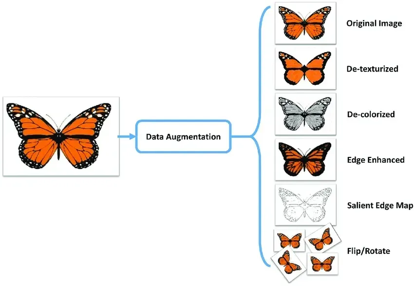

## Table of Contents

## What is image data augmentation in machine learning?

Image data augmentation in machine learning is a technique used to increase the amount of training data by applying various transformations to existing images. This helps improve the performance of machine learning models, especially when the initial dataset is small. By creating new versions of images through methods like rotation, flipping, cropping, and zooming, the model can learn from a more diverse set of examples, which can lead to better generalization and accuracy.

These transformations mimic the variations that might occur in real-world scenarios, helping the model to be more robust and less likely to overfit to the specific examples in the training set. For instance, if a model is trained to recognize cats, data augmentation can generate images of cats in different poses or lighting conditions, which the model might encounter in new, unseen images. This way, the model becomes better at identifying cats regardless of how they are presented.

## Why is image data augmentation important for training machine learning models?

Image data augmentation is important for training machine learning models because it helps to increase the amount of data available for training. When you have more data, the model can learn better and make more accurate predictions. This is especially useful when you start with a small dataset. By creating new versions of images through simple changes like rotating or flipping them, you can teach the model to recognize objects from different angles and in different conditions.

Another reason why image data augmentation is important is that it helps the model to generalize better. This means the model can work well with new images it hasn't seen before. For example, if you're training a model to recognize dogs, data augmentation can show the model dogs in different poses or lighting. This makes the model more flexible and less likely to get confused by small changes in new images. By using data augmentation, you're making your model stronger and more reliable.

## What are some basic techniques for image data augmentation?

Some basic techniques for image data augmentation include flipping, rotating, and zooming. Flipping an image means turning it over horizontally or vertically. This can help a model learn that an object looks the same even if it's flipped. Rotating an image means turning it by a certain angle, like 90 or 180 degrees. This helps the model recognize objects at different angles. Zooming means making the image bigger or smaller. This can teach the model to recognize objects even if they are far away or close up.

Another technique is cropping, which means cutting out a part of the image. This can show the model different parts of an object and help it focus on important features. Adjusting brightness and contrast is also useful. Changing how bright or dark an image is can help the model work in different lighting conditions. Adding noise to an image means putting in small, random changes. This can make the model more robust and able to handle imperfections in new images.

These techniques can be easily applied using libraries like TensorFlow or PyTorch. For example, in Python with TensorFlow, you might use the following code to flip an image horizontally:

```python
import tensorflow as tf

# Assume 'image' is a tensor representing an image
flipped_image = tf.image.flip_left_right(image)
```

By using these simple methods, you can create a lot more training data and help your model learn better.

## How does Random Horizontal Flip work and when should it be used?

Random Horizontal Flip is a technique where an image is flipped left to right randomly during training. Imagine you have a picture of a cat. Sometimes, the training program will show the cat as it is, and other times, it will show the cat flipped, like looking in a mirror. This helps the model learn that a cat is still a cat, no matter which way it's facing. The flip happens randomly, so the model can't predict when it will happen. This randomness makes the model better at recognizing objects from different views.

You should use Random Horizontal Flip when you want your model to recognize objects that look the same when flipped, like animals, cars, or buildings. For example, if you're training a model to spot dogs in pictures, flipping the images can teach the model that a dog is a dog whether it's facing left or right. However, you shouldn't use this technique for objects that change meaning when flipped, like words or numbers. For instance, flipping the number "6" turns it into "9", which is different. So, think about what you're trying to teach the model before using Random Horizontal Flip.

Here's a simple example of how to apply Random Horizontal Flip using Python and the TensorFlow library:

```python
import tensorflow as tf

# Assume 'image' is a tensor representing an image
flipped_image = tf.image.random_flip_left_right(image)
```

This code will randomly flip the image horizontally, helping your model learn from varied perspectives.

## What is ColorJitter and how can it improve model performance?

ColorJitter is a technique used in image data augmentation where the colors of an image are changed slightly. This means making the image a bit brighter or darker, changing how vivid the colors are, or shifting the colors a little bit. For example, a picture of a red apple might look a bit more orange or less bright. By doing this, ColorJitter helps the model learn that an object can look different under various lighting conditions or when seen on different screens.

Using ColorJitter can improve a model's performance by making it more robust. When a model sees many versions of the same image with slightly different colors, it learns to focus on the shape and other important features of the object, rather than just its color. This makes the model better at recognizing objects in real life, where lighting and color can change a lot. For example, if you're training a model to recognize cars, ColorJitter can show the model cars under different lighting, helping it identify cars no matter if it's sunny or cloudy outside.

## Can you explain the concept of CutMix and its benefits?

CutMix is a technique in image data augmentation where parts of two different images are mixed together to create a new image. Imagine you have a picture of a cat and a picture of a dog. With CutMix, you might cut out a part of the cat picture, like its head, and paste it onto the dog picture, replacing part of the dog with the cat's head. The model then sees this new mixed image during training. The areas where the images are mixed are chosen randomly, and the model is told to predict both the cat and the dog in the new image, but with different importance based on how much of each image is shown.

This technique helps the model learn better in several ways. First, it makes the model focus on different parts of objects, not just the whole thing. By seeing parts of different objects together, the model learns to recognize important features more accurately. Second, CutMix helps prevent the model from overfitting, which means it stops the model from just memorizing the training images. Instead, it encourages the model to understand the objects in a deeper way. This can lead to better performance when the model sees new, unseen images in real life.

## How does AutoAugment select and apply augmentation policies?

AutoAugment is a smart way to choose and use image augmentation techniques. It looks at a lot of different ways to change images, like flipping them, rotating them, or changing their colors. Then, it tries out many combinations of these changes to see which ones help the model learn the best. AutoAugment does this by testing different policies, which are sets of rules telling it what changes to make and how strong those changes should be. It keeps track of which policies make the model perform better on a special set of images that it doesn't use for training.

After testing many policies, AutoAugment picks the best one and uses it to change the training images. This best policy tells the program exactly what to do, like "flip the image 50% of the time" or "change the brightness by 10% sometimes." By using this chosen policy, AutoAugment makes sure the model sees a good mix of different images, which helps it learn better and work well with new images it hasn't seen before. This way, the model becomes more accurate and reliable, even when the real world throws different kinds of images at it.

## What is the difference between RandAugment and AutoAugment?

AutoAugment and RandAugment are both methods used to improve how well a machine learning model can recognize images by changing them in different ways. AutoAugment works by trying out a lot of different ways to change images, like flipping them or changing their brightness, and then picking the best set of changes that helps the model learn the best. It does this by testing these changes on a special set of images that it doesn't use for training, and then uses the best set of changes, called a policy, to change the training images.

RandAugment, on the other hand, is a simpler and faster method. Instead of trying out lots of different ways to change images and picking the best one, RandAugment uses a simpler approach. It picks a few changes to make to the images, and how strong those changes should be, randomly. This means it doesn't need to test a lot of different options like AutoAugment does, which makes it quicker to use. Both methods help the model learn better, but RandAugment is easier and faster to set up and use.

## How does Mixup help in creating more robust models?

Mixup is a technique that helps make machine learning models better at recognizing images by mixing two different images together. Imagine you have a picture of a cat and a picture of a dog. With Mixup, you blend these two images into one new image, where you can see parts of both the cat and the dog. The model is then trained on this new mixed image and told to predict both the cat and the dog, but with different importance based on how much of each image is in the mix. This helps the model learn to recognize objects even when they are in unusual or mixed settings.

By using Mixup, the model becomes more robust because it learns to focus on the important features of objects, rather than just memorizing whole images. This makes the model better at dealing with new, unseen images that might be a bit different from the ones it was trained on. Mixup helps prevent the model from overfitting, which means it stops the model from just remembering the training images and instead encourages it to understand the objects in a deeper way. This leads to better performance and more reliable predictions in real-world scenarios.

## What are advanced techniques like AugMix and how do they differ from simpler methods?

AugMix is a more advanced method of image data augmentation that aims to make machine learning models even better at recognizing images by mixing different ways of changing them. Instead of just using one way to change an image, like flipping it or making it brighter, AugMix uses a mix of several changes at the same time. It does this by creating different versions of an image using various techniques, and then blending these versions together to make a new image. This helps the model see images in lots of different ways, making it more robust and able to handle new images it hasn't seen before.

The main difference between AugMix and simpler methods like flipping or rotating images is that AugMix uses a more complex approach. Simpler methods change images in one way at a time, which can help the model learn, but AugMix goes further by combining many changes into one image. This means the model gets to see images that are more like what it might see in real life, where lighting, angles, and other conditions can change a lot. By using this advanced technique, AugMix helps the model understand images better and make more accurate predictions, even when the images are very different from the ones it was trained on.

## How can techniques like Adversarial Color Enhancement be used to improve model robustness?

Adversarial Color Enhancement is a way to make machine learning models better at recognizing images by changing their colors in tricky ways. Imagine you have a picture of a car. This technique would change the car's color to something weird, like bright purple or neon green, but still keep it looking like a car. By showing the model these strange colors, it learns to focus on the shape and other important parts of the car, not just its usual color. This makes the model stronger because it can recognize cars even if they are painted in unusual colors.

Using Adversarial Color Enhancement helps the model get ready for real-world situations where lighting and color can be very different. For example, a car might look different at night under streetlights compared to how it looks in the daytime. By training with these color-changed images, the model learns to pay attention to what really matters, like the car's shape and size. This way, the model becomes more reliable and can handle new images better, no matter what color they are.

## What are some state-of-the-art image data augmentation methods like InstaBoost and R-Mix, and how do they work?

InstaBoost is a smart way to make images better for training machine learning models. It works by changing the images in ways that make the model focus on the important parts. Imagine you have a picture of a dog. InstaBoost might zoom in on the dog's face or change its size a bit, making sure the model pays attention to the dog and not the background. It also adds some randomness to these changes, so the model sees the dog in different ways each time. This helps the model learn to recognize dogs no matter where they are in the picture or how big they look. By doing this, InstaBoost makes the model more accurate and able to handle new images better.

R-Mix, or Robust Mixup, is another advanced method that helps make models stronger. It takes two images and mixes them together, but in a special way that makes the model focus on the important parts of both images. For example, if you have a picture of a cat and a picture of a bird, R-Mix might blend them so that the model sees the cat's head and the bird's wings in one image. The model is then told to predict both the cat and the bird, with different importance based on how much of each is in the mix. This helps the model learn to recognize objects even when they are in unusual settings. By using R-Mix, the model becomes more reliable and better at dealing with new, unseen images.