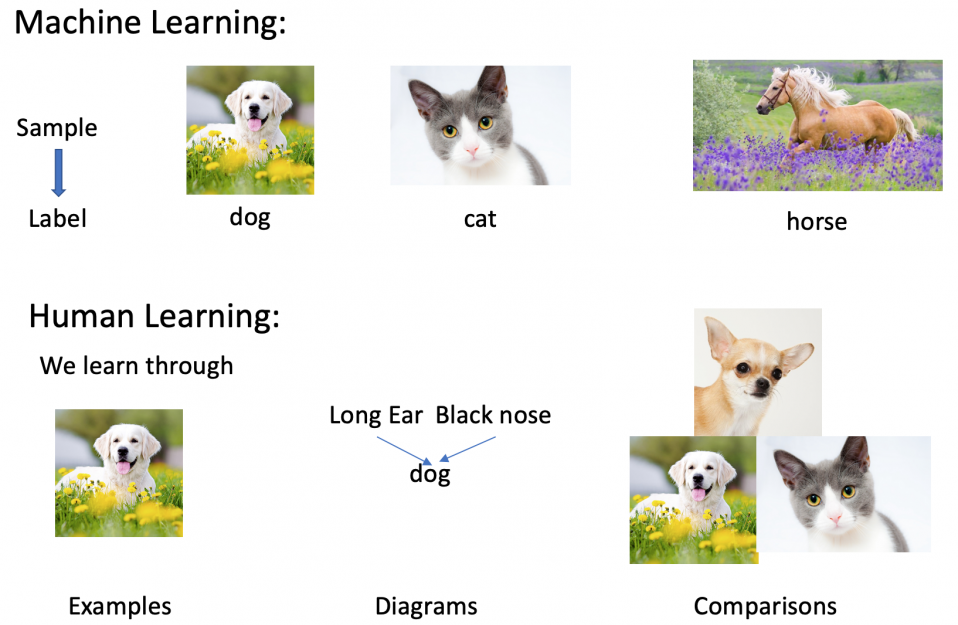

## Table of Contents

## What is an image dataset comparison metric in machine learning?

An image dataset comparison metric in machine learning is a way to measure how similar or different two sets of images are. This is important because it helps researchers and developers understand how well their models are performing or how different datasets might affect their results. Common metrics include structural similarity index (SSIM), peak signal-to-noise ratio (PSNR), and mean squared error (MSE). These metrics look at different aspects of the images, like their structure, brightness, and pixel differences, to give a score that shows how similar the images are.

For example, the structural similarity index (SSIM) compares the luminance, contrast, and structure of two images. The formula for SSIM is $$ \text{SSIM}(x, y) = \frac{(2\mu_x\mu_y + c_1)(2\sigma_{xy} + c_2)}{(\mu_x^2 + \mu_y^2 + c_1)(\sigma_x^2 + \sigma_y^2 + c_2)} $$, where $\mu_x$ and $\mu_y$ are the average pixel values of images $x$ and $y$, $\sigma_x^2$ and $\sigma_y^2$ are the variances, $\sigma_{xy}$ is the covariance, and $c_1$ and $c_2$ are constants to stabilize the division. A higher SSIM score means the images are more similar. These metrics help in tasks like image compression, where you want to know how much quality is lost, or in training models, where you want to see if the model's output matches the expected result.

## Why is it important to compare image datasets?

Comparing image datasets is important because it helps us understand how different sets of images might affect the results of our machine learning models. When we train a model, we want it to work well on new images it hasn't seen before. By comparing datasets, we can see if our model is learning the right things or if it's just memorizing the training data. This helps us make sure our model will be useful in the real world, where it will see all sorts of different images.

Another reason to compare image datasets is to check the quality of the images. For example, if we are working on a project to improve image quality, we need to know how much better the images are after our changes. Metrics like the structural similarity index (SSIM) help us do this. The formula for SSIM is $$ \text{SSIM}(x, y) = \frac{(2\mu_x\mu_y + c_1)(2\sigma_{xy} + c_2)}{(\mu_x^2 + \mu_y^2 + c_1)(\sigma_x^2 + \sigma_y^2 + c_2)} $$. A higher SSIM score means the images are more similar, which tells us if our improvements are working. This way, we can make sure our methods are actually making the images better.

## What are some common metrics used for comparing image datasets?

Some common metrics for comparing image datasets are mean squared error (MSE), peak signal-to-noise ratio (PSNR), and structural similarity index (SSIM). MSE measures the average of the squares of the errors between the pixels of two images. It's simple but can be sensitive to small differences. PSNR is based on MSE but gives a score in decibels, which is easier to understand. A higher PSNR means the images are more similar. SSIM looks at the structure, brightness, and contrast of the images. The formula for SSIM is $$ \text{SSIM}(x, y) = \frac{(2\mu_x\mu_y + c_1)(2\sigma_{xy} + c_2)}{(\mu_x^2 + \mu_y^2 + c_1)(\sigma_x^2 + \sigma_y^2 + c_2)} $$. A higher SSIM score means the images are more similar.

These metrics help us understand how different or similar two sets of images are. For example, if we are working on improving image quality, we can use these metrics to see if our changes are making the images better. MSE and PSNR are good for checking pixel-level differences, while SSIM is better for understanding how the images look to a human. By using these metrics, we can make sure our [machine learning](/wiki/machine-learning) models are working well and that our image processing techniques are effective.

## How does the choice of metric affect the outcome of image dataset comparison?

The choice of metric for comparing image datasets can really change what we learn from the comparison. Different metrics look at different parts of the images. For example, mean squared error (MSE) just looks at the difference between each pixel in the two images. If we use MSE, we might focus a lot on small differences that might not matter to people looking at the images. On the other hand, the structural similarity index (SSIM) looks at how the images look to humans, like their brightness, contrast, and structure. The formula for SSIM is $$ \text{SSIM}(x, y) = \frac{(2\mu_x\mu_y + c_1)(2\sigma_{xy} + c_2)}{(\mu_x^2 + \mu_y^2 + c_1)(\sigma_x^2 + \sigma_y^2 + c_2)} $$. If we use SSIM, we might see that two images are very similar even if their pixels are a bit different, because they look the same to a person.

Choosing the right metric depends on what we want to know from the comparison. If we are working on image compression and want to see how much quality is lost, peak signal-to-noise ratio (PSNR) might be a good choice because it gives a score in decibels that's easy to understand. But if we are training a machine learning model and want to see if it's learning the right things, SSIM might be better because it tells us if the model's output looks right to a human. So, the metric we pick can change what we think about how similar or different two sets of images are, and it's important to pick the one that matches our goals.

## Can you explain the concept of similarity measures in the context of image datasets?

Similarity measures are ways to tell how much two images are alike. In the world of machine learning, we use these measures to see if our models are doing a good job or to check if one set of images is different from another. There are different ways to measure similarity, and each way looks at different parts of the images. For example, mean squared error (MSE) looks at how different each pixel is between two images. If the pixels are very different, the MSE will be high, meaning the images are not very similar. On the other hand, the structural similarity index (SSIM) looks at how the images look to a human, like their brightness, contrast, and structure. The formula for SSIM is $$ \text{SSIM}(x, y) = \frac{(2\mu_x\mu_y + c_1)(2\sigma_{xy} + c_2)}{(\mu_x^2 + \mu_y^2 + c_1)(\sigma_x^2 + \sigma_y^2 + c_2)} $$. If the SSIM score is high, it means the images look very similar to a person, even if the pixels are a bit different.

Choosing the right similarity measure depends on what we want to learn from comparing the images. If we are working on making images smaller without losing too much quality, we might use peak signal-to-noise ratio (PSNR). PSNR gives a score in decibels, which is easy to understand. A high PSNR means the images are very similar, so we know the compression didn't hurt the image too much. But if we are training a machine learning model and want to see if it's learning the right things, SSIM might be better. SSIM tells us if the model's output looks right to a human, which is important for real-world use. So, the way we measure similarity can change what we think about how alike two sets of images are, and it's important to pick the one that matches what we're trying to do.

## What are the differences between pixel-based and feature-based comparison metrics?

Pixel-based comparison metrics look at the differences between the individual pixels of two images. For example, mean squared error (MSE) calculates the average of the squares of the errors between the pixels of two images. If the pixels are very different, the MSE will be high, meaning the images are not very similar. Another pixel-based metric is peak signal-to-noise ratio (PSNR), which is based on MSE but gives a score in decibels. A high PSNR means the images are very similar. These metrics are good for checking small differences in images, like when we want to see how much quality is lost after compressing an image.

Feature-based comparison metrics, on the other hand, look at the overall structure and features of the images, not just the pixels. The structural similarity index (SSIM) is a popular feature-based metric. It compares the luminance, contrast, and structure of two images. The formula for SSIM is $$ \text{SSIM}(x, y) = \frac{(2\mu_x\mu_y + c_1)(2\sigma_{xy} + c_2)}{(\mu_x^2 + \mu_y^2 + c_1)(\sigma_x^2 + \sigma_y^2 + c_2)} $$. A high SSIM score means the images look very similar to a person, even if the pixels are a bit different. Feature-based metrics are better for understanding how images look to humans, which is important when we are training machine learning models to recognize things in images.

Choosing between pixel-based and feature-based metrics depends on what we want to learn from comparing the images. If we are working on tasks like image compression, where we want to see how much quality is lost, pixel-based metrics like MSE and PSNR are useful. But if we are training a model to recognize objects or scenes, feature-based metrics like SSIM are better because they tell us if the model's output looks right to a human.

## How do you calculate the Structural Similarity Index (SSIM) for image datasets?

The Structural Similarity Index (SSIM) is a way to see how similar two images are by looking at their structure, brightness, and contrast. To calculate SSIM, you need to compare these three things between the two images. The formula for SSIM is $$ \text{SSIM}(x, y) = \frac{(2\mu_x\mu_y + c_1)(2\sigma_{xy} + c_2)}{(\mu_x^2 + \mu_y^2 + c_1)(\sigma_x^2 + \sigma_y^2 + c_2)} $$. In this formula, $\mu_x$ and $\mu_y$ are the average pixel values of images $x$ and $y$, $\sigma_x^2$ and $\sigma_y^2$ are the variances, $\sigma_{xy}$ is the covariance, and $c_1$ and $c_2$ are small constants to make sure the division is stable. A higher SSIM score means the images are more similar.

To use SSIM for comparing image datasets, you would calculate the SSIM score for each pair of images from the two datasets. Then, you might take the average of all these scores to get an overall measure of how similar the two datasets are. This helps you understand if the images in one dataset look a lot like the images in the other dataset, which is useful for tasks like checking the quality of image processing techniques or seeing how well a machine learning model is doing.

## What role does the Peak Signal-to-Noise Ratio (PSNR) play in image dataset comparison?

Peak Signal-to-Noise Ratio (PSNR) is a way to see how similar two images are by looking at the difference between their pixels. It's like a score that tells us how much the images have changed, often used when we want to check if an image has lost quality after being compressed or changed in some way. PSNR is based on another measure called Mean Squared Error (MSE), which looks at the average of the squares of the errors between the pixels of two images. PSNR turns this into a score in decibels, which is easier to understand. A higher PSNR means the images are more similar, so if we see a high PSNR, we know the changes we made to the image didn't hurt its quality too much.

When comparing image datasets, PSNR helps us understand how different the images in one set are from the images in another set. For example, if we are working on a project to make images smaller without losing too much quality, we can use PSNR to see if our method is working. We would calculate the PSNR for each pair of images from the two datasets and then take the average to get an overall idea of how similar the datasets are. This way, we can tell if our image processing techniques are keeping the images looking good, which is important for making sure our machine learning models work well with the images they see.

## How can deep learning models be used to develop custom image comparison metrics?

Deep learning models can be used to create custom image comparison metrics by training them to understand what makes images similar or different. These models can learn to focus on important parts of images, like shapes, colors, or objects, instead of just looking at pixel differences. For example, a [deep learning](/wiki/deep-learning) model can be trained to recognize if two images show the same scene but from different angles or with different lighting. By using a [neural network](/wiki/neural-network), we can create a metric that gives a score based on how the model sees the images, which can be more useful than traditional metrics like Mean Squared Error (MSE) or Peak Signal-to-Noise Ratio (PSNR) because it can understand the images in a way that's closer to how humans do.

To develop such a custom metric, we would first train a deep learning model on a large set of images, teaching it to tell the difference between similar and different images. Once trained, we can use the model's output to create a similarity score. For instance, we might use the model's final layer to get a feature vector for each image and then compare these vectors to see how similar the images are. The formula for this could be something like $$ \text{Similarity}(x, y) = 1 - \frac{\|\text{feature_vector}(x) - \text{feature_vector}(y)\|}{\max(\|\text{feature_vector}(x)\|, \|\text{feature_vector}(y)\|)} $$, where $\text{feature_vector}(x)$ and $\text{feature_vector}(y)$ are the feature vectors of images $x$ and $y$. This way, we can create a metric that's tailored to our specific needs, like recognizing certain objects or understanding different image styles, which can be very helpful in tasks like image retrieval or quality assessment.

## What are the challenges in comparing large-scale image datasets?

Comparing large-scale image datasets can be tough because there are so many images to look at. It takes a lot of computer power and time to go through all of them. When we use metrics like Mean Squared Error (MSE) or Peak Signal-to-Noise Ratio (PSNR), we need to calculate these for every pair of images, which can be slow and hard on our computers. Also, these metrics might not be good enough for big datasets because they just look at pixel differences and might miss important things that a human would notice, like the shapes or objects in the images.

Another challenge is that large datasets often have different kinds of images, like photos taken in different places or with different cameras. This can make it hard to compare them because the images might look different even if they show the same thing. Deep learning models can help by learning to focus on what really matters in the images, but training these models on big datasets takes a lot of time and data. We might use a formula like $$ \text{Similarity}(x, y) = 1 - \frac{\|\text{feature_vector}(x) - \text{feature_vector}(y)\|}{\max(\|\text{feature_vector}(x)\|, \|\text{feature_vector}(y)\|)} $$ to compare images based on what the model learns, but even this can be slow when we have millions of images to check.

## How do you evaluate the robustness of an image comparison metric across different types of images?

To evaluate how well an image comparison metric works with different types of images, we need to test it on a variety of images. This means using images with different brightness, colors, and objects. We might use photos taken indoors and outdoors, pictures of people and animals, and images with different kinds of noise or blur. By doing this, we can see if the metric gives good results for all kinds of images or if it works better for some types than others. For example, if we are using the Structural Similarity Index (SSIM), we can check if it gives high scores for images that look similar to a human, no matter what type of image it is. The formula for SSIM is $$ \text{SSIM}(x, y) = \frac{(2\mu_x\mu_y + c_1)(2\sigma_{xy} + c_2)}{(\mu_x^2 + \mu_y^2 + c_1)(\sigma_x^2 + \sigma_y^2 + c_2)} $$. If SSIM scores are high for similar images across different types, we know it's a robust metric.

Another way to check the robustness of a metric is to see how it handles changes in the images. We can add noise, blur, or change the brightness of the images and then compare them to the original images. If the metric still gives good results even after these changes, it means it's robust. For example, if we use Peak Signal-to-Noise Ratio (PSNR) and it gives high scores for images that are still clear after adding noise, we know it's a good metric for those kinds of changes. By testing the metric in many different ways, we can be sure it will work well in real-world situations where images can be very different from each other.

## What advanced techniques exist for comparing image datasets in specialized domains like medical imaging?

In specialized domains like medical imaging, advanced techniques for comparing image datasets often involve using deep learning models that are trained specifically for medical images. These models can learn to focus on important features like tumors, organs, or blood vessels, which are crucial for doctors to see. For example, a deep learning model might be trained to compare MRI scans of the brain to see if there are any changes in the size or shape of a tumor over time. By using a neural network, we can create a custom metric that gives a score based on how the model sees the images. This can be more useful than traditional metrics like Mean Squared Error (MSE) or Peak Signal-to-Noise Ratio (PSNR) because it can understand the images in a way that's closer to how doctors do. The formula for this could be something like $$ \text{Similarity}(x, y) = 1 - \frac{\|\text{feature_vector}(x) - \text{feature_vector}(y)\|}{\max(\|\text{feature_vector}(x)\|, \|\text{feature_vector}(y)\|)} $$, where $\text{feature_vector}(x)$ and $\text{feature_vector}(y)$ are the feature vectors of images $x$ and $y$.

Another advanced technique is to use registration methods, which align images to make them easier to compare. In medical imaging, this is important because images might be taken at different times or from different angles. By aligning the images, we can see if there are any changes in the patient's condition more clearly. For example, if we are comparing two CT scans of the lungs, we can use registration to make sure the images are lined up correctly before we compare them. This helps us see if there are any new growths or changes in the lung tissue. These advanced techniques help doctors make better decisions by giving them more accurate and detailed information about the images they are looking at.