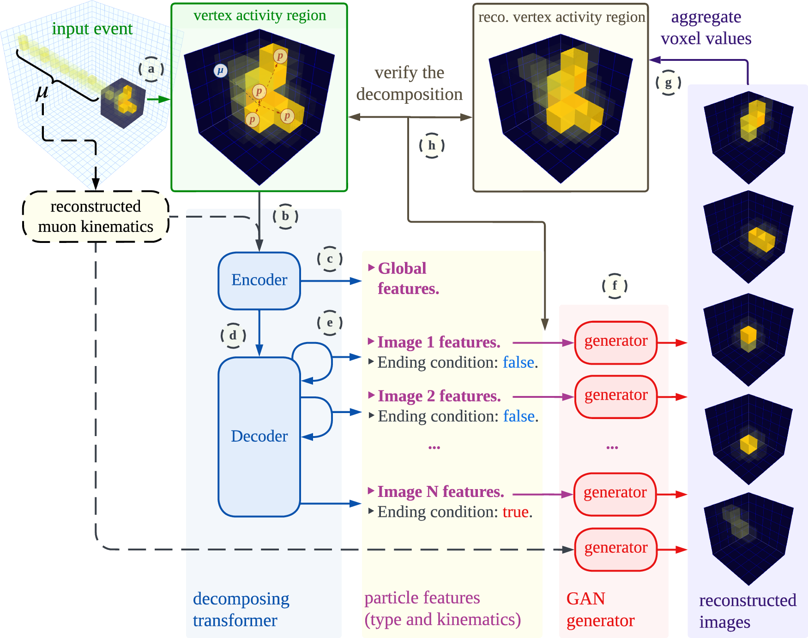

## Table of Contents

## What is an Image Decomposition Model in machine learning?

An Image Decomposition Model in machine learning is a technique used to break down an image into simpler parts or components. This process helps in understanding the structure of the image better and can be useful for various applications like image compression, denoising, and feature extraction. By decomposing an image, we can separate the important features from the noise or irrelevant details, making it easier to analyze and process the image.

One common method of image decomposition is using techniques like Principal Component Analysis (PCA) or Independent Component Analysis (ICA). These methods transform the image into a set of basis images or components, where each component represents a different aspect of the original image. For example, in PCA, the image is decomposed into eigenvectors, which are then used to reconstruct the image with reduced dimensionality. This can be expressed as $$X = USV^T$$, where \(X\) is the original image, \(U\) and \(V\) are the eigenvectors, and \(S\) is a diagonal matrix of singular values.

Another approach to image decomposition is through the use of convolutional neural networks (CNNs). CNNs can learn to decompose images into hierarchical features, starting from simple edges and textures to more complex shapes and objects. This is done through layers of convolutional filters that extract different levels of abstraction from the input image. For instance, a simple CNN architecture for image decomposition might look like this:

```python
import tensorflow as tf

model = tf.keras.Sequential([
    tf.keras.layers.Conv2D(32, (3, 3), activation='relu', input_shape=(28, 28, 1)),
    tf.keras.layers.MaxPooling2D((2, 2)),
    tf.keras.layers.Conv2D(64, (3, 3), activation='relu'),
    tf.keras.layers.MaxPooling2D((2, 2)),
    tf.keras.layers.Conv2D(64, (3, 3), activation='relu')
])
```

This model would decompose the input image into multiple layers of features, each representing different aspects of the image at different levels of detail.

## How do Image Decomposition Models differ from traditional image processing techniques?

Image Decomposition Models and traditional image processing techniques both aim to analyze and manipulate images, but they do so in different ways. Traditional image processing often involves applying filters or transformations directly to the image to achieve specific effects like sharpening, blurring, or edge detection. These methods are usually straightforward and can be applied using basic mathematical operations. For example, a simple Gaussian blur can be applied to an image to reduce noise, which involves convolving the image with a Gaussian kernel.

On the other hand, Image Decomposition Models take a more sophisticated approach by breaking down the image into its fundamental components. These models use advanced algorithms like Principal Component Analysis (PCA) or neural networks to extract meaningful features from the image. For instance, PCA can be used to decompose an image into eigenvectors and eigenvalues, represented as $$X = USV^T$$, where \(X\) is the original image, \(U\) and \(V\) are the eigenvectors, and \(S\) is a diagonal matrix of singular values. This decomposition allows for a deeper understanding of the image's structure and can be used for tasks like image compression or denoising.

In summary, while traditional image processing techniques focus on direct manipulation of the image through filters and transformations, Image Decomposition Models aim to understand the underlying structure of the image by breaking it down into simpler parts. This difference in approach makes Image Decomposition Models particularly useful for more complex tasks that require a deeper analysis of the image's content.

## What are the main components of an Image Decomposition Model?

Image Decomposition Models have a few main parts that help them break down images into simpler parts. The first part is the method used for decomposition, like Principal Component Analysis (PCA) or Independent Component Analysis (ICA). These methods take the original image and turn it into a set of basis images or components. For example, in PCA, the image is decomposed into eigenvectors and eigenvalues, which can be written as $$X = USV^T$$, where \(X\) is the original image, \(U\) and \(V\) are the eigenvectors, and \(S\) is a diagonal matrix of singular values. This helps to separate the important parts of the image from the noise.

The second part of an Image Decomposition Model is the way it processes the components after decomposition. This can involve using algorithms to reconstruct the image with fewer components for compression, or to remove noise by keeping only the most important parts. For example, a simple way to process the components using PCA might look like this in Python:

```python
import numpy as np

# Assume 'X' is the original image matrix
U, S, Vt = np.linalg.svd(X, full_matrices=False)
# Reconstruct the image using only the first 'k' components
k = 50  # number of components to keep
X_reconstructed = U[:, :k] @ np.diag(S[:k]) @ Vt[:k, :]
```

The third part involves the application of the model, where the decomposed components can be used for tasks like feature extraction, where the model identifies important features in the image, or image enhancement, where the image is improved by adjusting the components. These applications make Image Decomposition Models useful for a wide range of image analysis tasks.

## Can you explain the basic principle behind the BIDeN model?

The BIDeN model, which stands for Blind Image Decomposition Network, is a type of Image Decomposition Model that aims to separate an image into its main parts without knowing the exact details of those parts beforehand. It does this by learning from a lot of images and figuring out how to break them down into simpler components. The main idea is that the model can take an image and split it into a clear part and a noisy part, which helps to improve the image quality. This process is useful for tasks like removing noise from photos or enhancing details that might be hard to see.

The BIDeN model works by using a neural network that has been trained to recognize patterns in images. When you give it an image, the model uses what it has learned to break the image down into its basic components. One way to think about this is like $$I = C + N$$, where \(I\) is the input image, \(C\) is the clear part, and \(N\) is the noisy part. The model tries to make the clear part as good as possible while pushing the noise into the noisy part. By doing this, the BIDeN model can help clean up images and make them look better, which is very helpful in photography and other areas where clear images are important.

## What types of images are best suited for decomposition using models like BIDeN?

Images that have a lot of noise or small details are best suited for decomposition using models like BIDeN. These models are good at separating the clear parts of an image from the noisy parts. For example, if you have a photo taken in low light where there is a lot of graininess, BIDeN can help make the photo look clearer by removing the noise. The model works by learning from many images and figuring out how to break them down into a clear part and a noisy part, which can be represented as $$I = C + N$$, where \(I\) is the input image, \(C\) is the clear part, and \(N\) is the noisy part.

Photos with hidden details or subtle textures can also benefit from BIDeN. If you have an image where certain details are hard to see, like faint patterns on a fabric or small cracks in a surface, the model can enhance these details by separating them from the rest of the image. This makes it easier to see and understand what's in the photo. By using a neural network trained on a wide variety of images, BIDeN can improve the quality of these types of images, making them more useful for tasks like analysis or enhancement.

## How does the BIDeN model handle noise and artifacts in images?

The BIDeN model is really good at taking out noise and fixing artifacts in pictures. It does this by learning from lots of different images and figuring out how to split a photo into a clear part and a noisy part. This can be shown as $$I = C + N$$, where \(I\) is the original picture, \(C\) is the clear part, and \(N\) is the noisy part. The model works hard to make the clear part as good as it can be while moving all the unwanted noise into the noisy part. This way, when you look at the clear part, the picture looks much better because the noise and artifacts are gone.

For example, if you have a photo that was taken in a dark room and it's full of grainy spots, BIDeN can help make it look clearer. It does this by understanding what parts of the photo are important and what parts are just noise. Once it knows this, it can take away the grainy spots and leave you with a picture that's easier to see and enjoy. This is really helpful for photographers who want to make their photos look better, or for anyone who needs clear images for their work.

## What are the steps involved in training an Image Decomposition Model?

Training an Image Decomposition Model involves several steps that help the model learn how to break down images into simpler parts. First, you need to gather a large dataset of images that the model can learn from. These images should be diverse and include examples of the types of noise or artifacts you want the model to handle. Next, you split this dataset into a training set and a validation set. The training set is used to teach the model, while the validation set helps you check how well the model is doing without using the same images it learned from. You then set up the model architecture, which could be something like a neural network designed for image decomposition, such as BIDeN. The model is initialized with random weights, and you start the training process.

During training, you feed the images from the training set into the model, and it tries to decompose each image into its clear and noisy parts. The model uses a loss function to measure how well it's doing. For example, if the model is trying to separate an image into $$I = C + N$$, the loss function might compare the clear part \(C\) to the original image \(I\) and see how much noise \(N\) it can remove. The model then adjusts its weights to minimize this loss, using techniques like gradient descent. You keep repeating this process, feeding in batches of images, updating the weights, and checking the loss. After each epoch, or complete pass through the training set, you evaluate the model on the validation set to see if it's improving. Once the model's performance stops improving, you can stop training and use the final model to decompose new images.

## How can the performance of an Image Decomposition Model be evaluated?

To evaluate the performance of an Image Decomposition Model, you can use several methods. One common way is to look at how well the model can separate the clear part of an image from the noisy part. For example, if the model is trying to break down an image into $$I = C + N$$ where \(I\) is the original image, \(C\) is the clear part, and \(N\) is the noise, you can compare the clear part \(C\) to the original image \(I\) to see how much noise the model was able to remove. You can use metrics like Peak Signal-to-Noise Ratio (PSNR) or Structural Similarity Index (SSIM) to measure this. Higher PSNR and SSIM values mean the model did a better job at removing noise and keeping the important parts of the image clear.

Another way to check the model's performance is by using a test set of images that the model hasn't seen before. You run these images through the model and see how well it decomposes them. You can also look at the visual quality of the decomposed images. If the clear part looks sharp and the noisy part contains most of the unwanted details, the model is doing well. Additionally, you might want to see how the model performs on different types of images, like those with different levels of noise or different kinds of artifacts. By testing the model in various situations, you can get a good idea of how well it will work in real-world scenarios.

## What are some common challenges faced when implementing Image Decomposition Models?

One common challenge when implementing Image Decomposition Models is dealing with the complexity of the algorithms used. These models often rely on advanced techniques like Principal Component Analysis (PCA) or neural networks, which can be hard to understand and set up correctly. For example, if you're using PCA to decompose an image into $$X = USV^T$$, where \(X\) is the original image, \(U\) and \(V\) are the eigenvectors, and \(S\) is a diagonal matrix of singular values, you need to make sure you're choosing the right number of components to keep. If you choose too few, you might lose important details in the image. If you choose too many, the model might not remove enough noise.

Another challenge is the need for a large and diverse dataset to train the model effectively. Without enough good examples, the model might not learn how to separate the clear parts of an image from the noisy parts. For instance, if you're training a model like BIDeN, you need images with different types of noise and artifacts so the model can learn to handle them all. Gathering and preparing this data can be time-consuming and difficult. Additionally, training the model can take a lot of time and computational power, which can be a problem if you don't have access to strong computers or enough time to wait for the training to finish.

## How do advanced Image Decomposition Models like BIDeN improve upon earlier models?

Advanced Image Decomposition Models like BIDeN make big improvements over older models by being better at taking out noise and fixing artifacts in images. They use neural networks that learn from lots of different images, so they can figure out how to separate the clear part of a picture from the noisy part. This is shown as $$I = C + N$$, where \(I\) is the original image, \(C\) is the clear part, and \(N\) is the noise. BIDeN can handle different types of noise and artifacts better because it learns from a wide range of images, making it more useful for real-world photos where the noise can be complicated.

Another way BIDeN improves on earlier models is by being more flexible and adaptable. Older models might struggle with images that have unusual kinds of noise or artifacts, but BIDeN can learn to handle these situations because it uses deep learning techniques. This means it can keep getting better as it sees more images, making it a powerful tool for photographers and anyone who needs to clean up and enhance images. By using advanced algorithms and learning from diverse datasets, BIDeN can deliver clearer and more detailed images than what was possible with earlier image decomposition methods.

## What are the potential applications of Image Decomposition Models in various industries?

Image Decomposition Models like BIDeN have many uses in different industries. In photography, these models can help photographers clean up their pictures by removing noise and enhancing details. For example, if a photo is taken in low light and has a lot of graininess, the model can separate the clear part of the image from the noisy part, making the photo look much better. This is really helpful for professional photographers who want to make their photos look as good as possible. In medicine, doctors can use these models to improve the quality of medical images like X-rays or MRIs. By removing noise from these images, doctors can see important details more clearly, which can help them make better diagnoses and treatment plans.

In the field of remote sensing, Image Decomposition Models can be used to analyze satellite images. These images often have noise due to weather conditions or other factors, but the models can help scientists see through the noise to important features on the Earth's surface. This can be useful for tracking changes in the environment, like deforestation or urban growth. In manufacturing, these models can help with quality control by inspecting images of products for defects or imperfections. By breaking down the image into clear and noisy parts, the model can highlight any issues that need to be fixed, making the manufacturing process more efficient and reliable.

## What future developments can we expect in the field of Image Decomposition Models?

In the future, we can expect Image Decomposition Models to become even better at cleaning up and enhancing images. One big improvement might be in the way these models learn from images. Right now, models like BIDeN use neural networks to separate an image into its clear part and noisy part, which can be shown as $$I = C + N$$, where \(I\) is the original image, \(C\) is the clear part, and \(N\) is the noise. In the future, these models might use even more advanced learning techniques that can handle more types of noise and artifacts, making them useful for even more kinds of images. This could mean clearer photos for photographers, better medical images for doctors, and more accurate satellite images for scientists.

Another area where Image Decomposition Models might improve is in their speed and efficiency. Right now, training these models can take a lot of time and computer power. But in the future, new algorithms and better computers might make it faster and easier to train these models. This would mean that more people could use them, not just those with access to powerful computers. Also, the models might become more flexible, able to work on different devices like smartphones or tablets. This would make it easier for people to clean up and enhance their photos on the go, without needing special equipment or software.