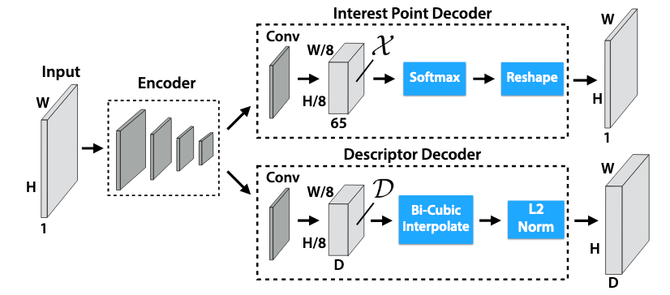

## Table of Contents

## What is an image feature extractor in the context of machine learning?

An image feature extractor in machine learning is a tool or algorithm that helps computers understand and process images. It does this by identifying and extracting important parts, or "features," from the images. These features could be edges, corners, colors, or specific patterns that help the computer recognize what is in the picture. For example, if you have a picture of a cat, the feature extractor might identify the cat's eyes, ears, and whiskers as important features.

Once these features are extracted, they can be used for various tasks like image classification, object detection, or even generating new images. Feature extractors are often part of larger systems like convolutional neural networks (CNNs), which are very good at processing images. By breaking down images into their key features, these systems can learn to recognize and categorize different objects more accurately. This makes image feature extractors a crucial part of many modern machine learning applications that deal with visual data.

## How does a basic convolution operation work in image feature extraction?

A basic convolution operation in image feature extraction is like using a special magnifying glass to look at different parts of an image. Imagine you have a small window, called a kernel or filter, that slides over the entire image. As it moves, it looks at a small section of the image at a time and performs a simple math operation. This operation involves multiplying the values in the kernel with the corresponding values in the image section and then adding them up. The result of this calculation is a single number that represents a new value for the center pixel of the section the kernel was looking at.

Let's say you have a 3x3 kernel and a part of the image it's looking at. The kernel might look like this: $$ \begin{bmatrix} -1 & 0 & 1 \\ -2 & 0 & 2 \\ -1 & 0 & 1 \end{bmatrix} $$. If the image section it's looking at is: $$ \begin{bmatrix} 10 & 20 & 30 \\ 40 & 50 & 60 \\ 70 & 80 & 90 \end{bmatrix} $$, the convolution operation would multiply each number in the kernel with the corresponding number in the image section and then sum them up. So, the calculation would be: $$ (-1 \times 10) + (0 \times 20) + (1 \times 30) + (-2 \times 40) + (0 \times 50) + (2 \times 60) + (-1 \times 70) + (0 \times 80) + (1 \times 90) = -10 + 0 + 30 - 80 + 0 + 120 - 70 + 0 + 90 = 80 $$. This new value, 80, would replace the center pixel (50) in the new feature map. By doing this across the whole image, the convolution operation helps highlight important features like edges or patterns, which are crucial for understanding what's in the image.

## What is the purpose of using 1x1 convolutions in neural networks?

1x1 convolutions in neural networks are like tiny windows that look at just one pixel at a time. They might seem simple, but they're really useful for changing the number of channels in the data. Imagine you have a stack of images, and each image is a different channel. A 1x1 convolution can help you combine or split these channels without looking at the neighbors of each pixel. This is great for making the network smaller and faster because it reduces the amount of data the network has to process.

Another cool thing about 1x1 convolutions is that they can help the network learn more complex patterns. By using them between layers, the network can mix information from different channels in a smart way. This mixing can help the network understand the image better, like figuring out that a certain combination of colors and shapes means "dog." So, even though 1x1 convolutions are small, they play a big role in making neural networks work better and more efficiently.

## Can you explain the concept of depthwise convolution and its advantages?

Depthwise convolution is a special way of looking at images in neural networks. Instead of using one big filter to look at all the channels of an image at once, depthwise convolution uses a separate small filter for each channel. Imagine you have a stack of images, and each image is a different channel. With depthwise convolution, you slide a tiny window over each image in the stack separately. This means if you have 3 channels (like red, green, and blue in a color image), you'll use 3 different filters, one for each channel. This can be written as $$ \text{Depthwise Convolution} = \sum_{c=1}^{C} \text{Conv}(X_c, K_c) $$, where $$ X_c $$ is the input for channel $$ c $$, and $$ K_c $$ is the kernel for channel $$ c $$.

The main advantage of depthwise convolution is that it makes the network faster and uses less memory. Because it looks at each channel separately, it does less work than a regular convolution that looks at all channels at once. This is especially helpful when you're working with big images or when you want your network to run quickly on devices like phones. Another benefit is that it can help the network focus on important details in each channel without mixing them up too early. This can lead to better understanding of the image, like recognizing edges or textures more clearly in each channel before combining them later in the network.

## What is the difference between pointwise convolution and depthwise convolution?

Pointwise convolution and depthwise convolution are two different ways of looking at images in neural networks. Pointwise convolution uses a 1x1 filter to look at just one pixel at a time across all the channels of an image. It's like using a tiny window that combines information from different channels into a single output channel. This is useful for changing the number of channels in the data and mixing information from different parts of the image. In math, pointwise convolution can be written as $$ \text{Pointwise Convolution} = \sum_{c=1}^{C} \text{Conv}(X_c, K) $$, where $$ X_c $$ is the input for channel $$ c $$, and $$ K $$ is a shared 1x1 kernel across all channels.

Depthwise convolution, on the other hand, uses a different approach. It uses a separate small filter for each channel of the image. So, if you have an image with three channels (like red, green, and blue), you'll use three different filters, one for each channel. This means the network looks at each channel separately without mixing them up right away. The formula for depthwise convolution is $$ \text{Depthwise Convolution} = \sum_{c=1}^{C} \text{Conv}(X_c, K_c) $$, where $$ X_c $$ is the input for channel $$ c $$, and $$ K_c $$ is the kernel for channel $$ c $$. This method makes the network faster and uses less memory because it does less work than a regular convolution that looks at all channels at once.

## How does depthwise separable convolution improve efficiency in neural networks?

Depthwise separable convolution improves efficiency in neural networks by breaking down the traditional convolution into two simpler steps: depthwise convolution and pointwise convolution. Depthwise convolution uses a separate small filter for each channel of the image, looking at them one at a time. This means if you have an image with three channels (like red, green, and blue), you'll use three different filters, one for each channel. This approach makes the network faster because it does less work than a regular convolution that looks at all channels at once. The formula for depthwise convolution is $$ \text{Depthwise Convolution} = \sum_{c=1}^{C} \text{Conv}(X_c, K_c) $$, where $$ X_c $$ is the input for channel $$ c $$, and $$ K_c $$ is the kernel for channel $$ c $$.

After the depthwise convolution, the network uses pointwise convolution to combine the information from different channels. Pointwise convolution uses a 1x1 filter to look at just one pixel at a time across all the channels of the image. This step is like using a tiny window that mixes information from different parts of the image into a single output channel. The formula for pointwise convolution is $$ \text{Pointwise Convolution} = \sum_{c=1}^{C} \text{Conv}(X_c, K) $$, where $$ X_c $$ is the input for channel $$ c $$, and $$ K $$ is a shared 1x1 kernel across all channels. By breaking the convolution into these two steps, depthwise separable convolution reduces the number of parameters and computations needed, making the network more efficient and faster, especially on devices with limited resources like mobile phones.

## What are dilated convolutions and how do they affect the receptive field?

Dilated convolutions are a way to look at images in neural networks by using a special kind of filter that skips over some pixels. Imagine you have a small window, called a kernel, that slides over the image. With dilated convolutions, this window doesn't look at every pixel next to each other. Instead, it leaves some pixels out, like looking at every other pixel or every third pixel. This "skipping" is called the dilation rate. If the dilation rate is 2, the kernel looks at every second pixel. If it's 3, it looks at every third pixel. This can be written as $$ \text{Dilated Convolution}(X, K, r) $$, where $$ X $$ is the input, $$ K $$ is the kernel, and $$ r $$ is the dilation rate.

By using dilated convolutions, the network can see a larger part of the image without using a bigger kernel. This larger part is called the receptive field. The receptive field is like the area of the image that the network can "see" at once. When you use a higher dilation rate, the receptive field gets bigger because the kernel is looking at pixels that are farther apart. This helps the network understand bigger patterns and details in the image without making the network bigger and slower. So, dilated convolutions are a smart way to make the network more efficient and better at recognizing things in images.

## What is the role of grouped convolutions in reducing computational complexity?

Grouped convolutions help make neural networks faster and use less memory by splitting the input channels into smaller groups. Imagine you have a big stack of images, and each image is a different channel. Instead of using one big filter to look at all the channels at once, grouped convolutions use smaller filters that only look at a few channels at a time. This means if you have 64 channels, you might split them into 4 groups of 16 channels each. Each group is processed separately, which reduces the number of calculations the network has to do. The formula for grouped convolutions can be written as $$ \text{Grouped Convolution} = \sum_{g=1}^{G} \text{Conv}(X_g, K_g) $$, where $$ X_g $$ is the input for group $$ g $$, and $$ K_g $$ is the kernel for group $$ g $$.

By breaking the convolution into smaller groups, grouped convolutions make the network more efficient. This is especially helpful when you're working with big images or when you want your network to run quickly on devices like phones. Grouped convolutions can also help the network learn different features from different parts of the image, which can lead to better understanding of what's in the picture. So, even though grouped convolutions are simpler, they play a big role in making neural networks work better and faster.

## How do 3D convolutions differ from 2D convolutions and where are they applied?

3D convolutions are like looking at a stack of images all at once, while 2D convolutions look at one image at a time. Imagine you have a small window, called a kernel, that slides over the image. With 2D convolutions, this window slides over a single image, looking at its height and width. But with 3D convolutions, the window slides over a stack of images, looking at their height, width, and depth. This means 3D convolutions use a 3D kernel instead of a 2D one. The formula for 3D convolution can be written as $$ \text{3D Convolution}(X, K) $$, where $$ X $$ is the input volume and $$ K $$ is the 3D kernel.

3D convolutions are used in tasks where you need to understand how things change over time or across different slices of data. For example, they're really helpful in video analysis, where you want to track movement from one frame to the next. They're also used in medical imaging, like looking at a series of MRI scans to understand the structure of the brain or other organs. By looking at the data in 3D, the network can learn patterns that happen across different slices or over time, which can be really important for understanding complex data.

## What are non-local operations and how do they enhance feature extraction?

Non-local operations in neural networks are like looking at the whole picture instead of just small parts. Imagine you're trying to understand a big painting. Instead of focusing on one tiny spot at a time, you look at how different parts of the painting relate to each other. Non-local operations do something similar with images or videos. They help the network see how different pixels or parts of the data are connected, even if they're far apart. This can be written as $$ \text{Non-Local}(X) = \sum_{i,j} f(X_i, X_j)g(X_j) $$, where $$ X_i $$ and $$ X_j $$ are different parts of the input, and $$ f $$ and $$ g $$ are functions that help the network understand these relationships.

By using non-local operations, the network can better understand the overall context of the image or video. This is really helpful for tasks like understanding what's happening in a scene or tracking objects that move around. For example, if you're watching a video of a soccer game, non-local operations can help the network see how players are moving across the whole field, not just in one small area. This makes the feature extraction more powerful because the network can capture long-range dependencies and patterns that are important for understanding complex data.

## Can you describe the mechanism and benefits of deformable convolutions?

Deformable convolutions are a way to make neural networks look at images more flexibly. Instead of using a fixed window, called a kernel, that slides over the image in a regular way, deformable convolutions let the kernel change its shape. It's like using a magnifying glass that can stretch and twist to look at the parts of the image that matter most. This is done by adding an extra step where the network learns how to move the points in the kernel to focus on important details. The formula for deformable convolution can be written as $$ \text{Deformable Convolution}(X, K, \Delta) = \sum_{p} w_p \cdot x(p + \Delta p) $$, where $$ X $$ is the input, $$ K $$ is the kernel, $$ w_p $$ are the weights, and $$ \Delta p $$ are the learned offsets that change the kernel's shape.

The main benefit of deformable convolutions is that they make the network better at understanding complex images. By letting the kernel change its shape, the network can focus on important details like the edges of objects or the way things are arranged in the image. This is really helpful for tasks like object detection, where you need to find and identify different things in a picture. Deformable convolutions can also make the network more efficient because it doesn't have to use a bigger, fixed kernel to see the same details. This means the network can work faster and use less memory, which is great for running on devices like phones or computers with limited resources.

## What advanced techniques like selective kernel convolution or attention-augmented convolution offer over traditional methods?

Selective kernel convolution and attention-augmented convolution are advanced techniques that help neural networks understand images better than traditional methods. Selective kernel convolution works by letting the network choose the best way to look at different parts of the image. Imagine you have different sizes of magnifying glasses, and the network picks the right one for each part of the picture. This helps the network focus on important details, like the edges of objects or the way things are arranged. The formula for selective kernel convolution can be written as $$ \text{SK Convolution}(X) = \sum_{k} a_k \cdot \text{Conv}(X, K_k) $$, where $$ X $$ is the input, $$ K_k $$ are different kernels, and $$ a_k $$ are the weights that the network learns to choose the best kernel.

Attention-augmented convolution adds another layer of smartness to the network by letting it pay more attention to certain parts of the image. It's like the network can highlight the important parts of the picture before looking at them closely. This helps the network understand the overall context of the image better, which is really helpful for tasks like understanding what's happening in a scene or tracking objects that move around. By combining traditional convolution with attention mechanisms, attention-augmented convolution can make the network more accurate and efficient. This means the network can work faster and use less memory, which is great for running on devices like phones or computers with limited resources.