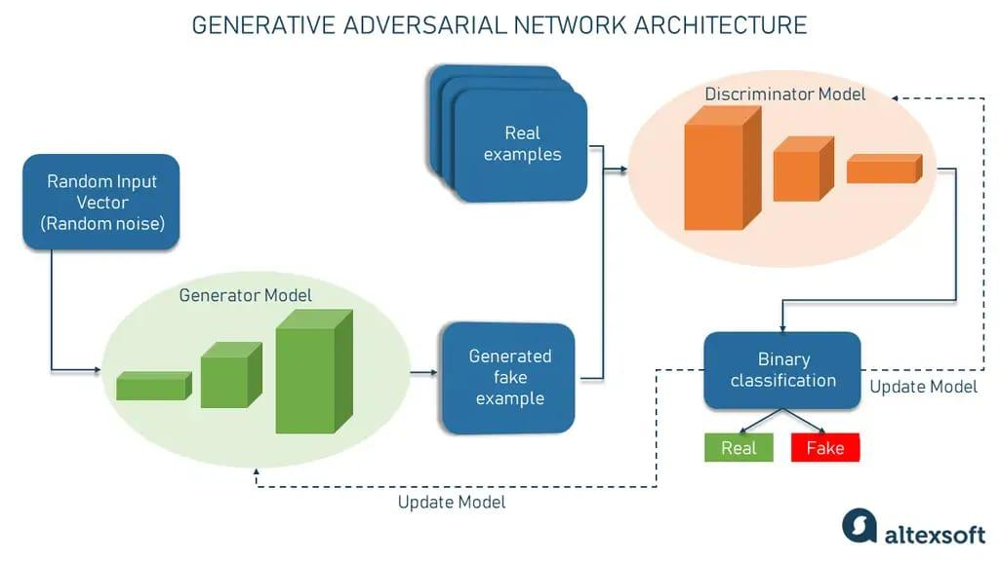

## Table of Contents

## What is an image generation model in machine learning?

An image generation model in machine learning is a type of artificial intelligence that creates new images from scratch or modifies existing ones. These models learn patterns and features from a large set of example images, and then use this knowledge to generate new visuals. For example, if you show the model many pictures of cats, it can create new images of cats that look realistic, even though they are completely made up.

The most common type of image generation model is called a Generative Adversarial Network (GAN). In a GAN, there are two parts: a generator and a discriminator. The generator tries to create images that look real, while the discriminator tries to tell if the images are fake or real. They work together, getting better over time. The generator learns to make more convincing images, and the discriminator gets better at spotting fakes. This back-and-forth process helps the model improve its ability to generate high-quality images.

## How do image generation models work?

Image generation models work by learning from a lot of pictures. They look at these pictures to understand what things look like, like the shape of a cat or the color of the sky. Once they learn these patterns, they can create new pictures that look real. They do this by putting together pieces of what they've learned in new ways. It's like if you saw many different kinds of flowers and then drew a new flower that combined parts from all of them.

A common type of image generation model is called a Generative Adversarial Network, or GAN. In a GAN, there are two parts working together: a generator and a discriminator. The generator makes new pictures, and the discriminator checks if they look real or fake. They keep going back and forth, with the generator trying to fool the discriminator and the discriminator trying to get better at spotting fakes. Over time, this helps the generator make better and better pictures. It's like a game where both players get better the more they play.

## What are some common applications of image generation models?

Image generation models are used in many cool ways. One way is in making art and design. Artists and designers can use these models to create new pictures and patterns that they can use in their work. For example, a designer might use an image generation model to make a new wallpaper pattern or a unique piece of art for a project.

Another use is in making video games and movies. In video games, these models can create new characters, backgrounds, and scenes. This makes the games look more real and interesting. In movies, image generation models can help create special effects and even whole scenes that would be hard or expensive to film in real life.

Image generation models also help in science and medicine. Scientists can use them to make pictures of things that are too small to see, like cells or molecules. Doctors can use these models to help plan surgeries by creating detailed images of a patient's body. This can help them see what they need to do before they even start the surgery.

## Can you explain the basic concept of diffusion models in image generation?

Diffusion models in image generation work by slowly adding noise to an image until it becomes completely random, and then learning how to reverse this process to turn the noise back into a clear image. Imagine taking a clear picture and slowly making it blurrier and blurrier until you can't see anything anymore. The model learns how to do the opposite - starting from a blurry mess and making it clearer and clearer until you get a nice picture again. This is done step by step, with the model figuring out how to remove a little bit of noise at each step.

The process of adding noise is called the forward process, and the process of removing noise is called the reverse process. In the forward process, the model adds a bit of noise to the image at each step, making it more and more random. In the reverse process, the model learns to take away a bit of noise at each step, slowly turning the random noise back into a clear image. This is like solving a puzzle, where the model figures out how to put the pieces back together to make a picture. By doing this many times, the model gets better at turning noise into clear images, which is how it can generate new images from scratch.

## What is GLIDE and how does it differ from other image generation models?

GLIDE is a type of image generation model that uses text to create pictures. It's special because it can make images that match what you write. For example, if you type "a cat playing with a ball," GLIDE can create a picture of that. It works by learning from a lot of pictures and their descriptions, so it knows how to put together images that match the words you give it. This makes GLIDE really useful for turning ideas into visuals.

What makes GLIDE different from other models is how it combines text and image generation. While many models like GANs focus on making images from other images, GLIDE starts with text. It uses a technique called "guided diffusion" to slowly build the image from noise, guided by the text description. This method helps GLIDE create more accurate and detailed images based on what you write, making it a powerful tool for anyone who needs to visualize their ideas quickly and accurately.

## How does classifier-guidance improve the performance of image generation models?

Classifier-guidance helps image generation models make better pictures by using a special tool called a classifier. A classifier is like a smart guesser that can look at a picture and say what it is. When making new images, the model can use the classifier to check if the image it's creating is getting closer to what it's supposed to be. If the classifier says the image is not quite right, the model can fix it, making the final picture more accurate and detailed.

For example, if you want to create an image of a dog, the classifier can tell the model if the image looks more like a dog or something else. The model then uses this feedback to adjust the image step by step, making sure it ends up looking like a dog. This back-and-forth process helps the model create images that match what you want more closely, improving the overall quality of the generated images.

## What is Blended Diffusion and what are its advantages?

Blended Diffusion is a way to make new pictures by mixing two different images together. It's like taking parts of one picture and parts of another picture and combining them to make a new one. For example, you could take the sky from one picture and the mountains from another picture and blend them to make a new scene. This method uses something called diffusion models, which slowly add and then remove noise to create and change images. In Blended Diffusion, the model starts with two images and slowly blends them together, making sure the new picture looks natural and smooth.

One big advantage of Blended Diffusion is that it lets you be very creative. You can take your favorite parts from different pictures and put them together in new ways. This is great for artists and designers who want to make unique images. Another advantage is that Blended Diffusion can make the blending process look very smooth and natural. The model works step by step, making sure the final image doesn't look like it's made from two different parts. This makes the new picture look more real and believable.

## How does DALL·E 2 generate images and what makes it unique?

DALL·E 2 is a special kind of computer program that makes pictures from words. It works by learning from lots of pictures and their descriptions. When you give DALL·E 2 a sentence like "a cat wearing a hat," it uses what it learned to create a new picture that matches the words. It does this using a method called diffusion, where it starts with a blurry image and slowly makes it clearer until it looks just right. This process helps DALL·E 2 make very detailed and accurate pictures that fit what you described.

What makes DALL·E 2 unique is how good it is at understanding and creating images from complex descriptions. It can handle lots of details and make pictures that look very real. For example, if you ask for "a dog playing in a park with autumn leaves," DALL·E 2 can make a picture that shows all those things in a way that looks natural. This makes it a powerful tool for anyone who needs to turn their ideas into pictures quickly and accurately.

## What is AltDiffusion and how does it address the limitations of previous models?

AltDiffusion is a new way to make pictures using computers. It's special because it tries to fix some problems that older picture-making programs had. One big problem with older programs was that they could sometimes make pictures that didn't look right or were hard to understand. AltDiffusion works by using a method called diffusion, where it starts with a blurry image and slowly makes it clearer. But it also adds something new: it uses different ways to guide the picture-making process, so the final pictures are clearer and more accurate.

What makes AltDiffusion different is that it can make pictures that are easier to understand and look more like what you want. It does this by using special tools to help guide the picture-making process. These tools help the computer understand what parts of the picture are important and how to make them look right. This means that when you ask AltDiffusion to make a picture of something, like a dog playing in a park, it can make a picture that looks more real and matches what you described better than older programs could.

## Can you describe the Differential Diffusion technique and its impact on image quality?

Differential Diffusion is a way to make pictures using computers that tries to make the pictures look even better. It works by comparing two different ways of making the same picture and then [picking](/wiki/asset-class-picking) the best parts from each way. Imagine you have two friends drawing the same thing, but one friend is really good at drawing the sky and the other is great at drawing trees. Differential Diffusion would take the sky from the first friend's drawing and the trees from the second friend's drawing to make one perfect picture.

This technique helps make the pictures clearer and more detailed. By comparing and combining the best parts of different ways to make a picture, Differential Diffusion can fix small mistakes and make the final image look more real. It's like having a team of artists working together to make sure every part of the picture is as good as it can be. This means the pictures you get from Differential Diffusion are often more accurate and look better than pictures made by other methods.

## What is GroupDNet and how does it utilize group-based approaches in image generation?

GroupDNet is a way to make pictures using computers that uses something called group-based approaches. It works by breaking down the picture-making process into smaller parts, or groups. Each group focuses on a different part of the picture, like the sky, the trees, or the animals. By working on these groups separately, GroupDNet can make sure each part of the picture looks good before putting them all together. This method helps the computer understand what's important in the picture and how to make it look right.

Using group-based approaches helps GroupDNet make better pictures. When the computer works on different parts of the picture in groups, it can pay more attention to details and make sure everything fits together well. This means the final picture can look more real and be easier to understand. GroupDNet's way of breaking things down into groups is like having a team of artists, where each artist is really good at drawing a certain part of the picture, and they all work together to make one great image.

## How does Make-A-Scene allow for more creative control in generating images?

Make-A-Scene is a special tool that lets you make pictures from words, but it gives you more control over how the picture looks. You can tell Make-A-Scene what you want in the picture, like "a dog playing in a park," and it will make a picture of that. But you can also tell it where you want things to be in the picture. For example, you can say you want the dog on the left side and the park on the right side. This way, you can decide how the picture is set up, making it more like what you want.

This extra control makes Make-A-Scene great for people who want to be creative. You can try different ideas and see how they look without having to draw everything yourself. If you want to change something, you can just tell Make-A-Scene to move things around or add new things. This makes it easier to make the perfect picture that matches your ideas.

## References & Further Reading

[1]: Goodfellow, I., Pouget-Abadie, J., Mirza, M., Xu, B., Warde-Farley, D., Ozair, S., Courville, A., & Bengio, Y. (2014). ["Generative Adversarial Nets."](https://arxiv.org/abs/1406.2661) Advances in Neural Information Processing Systems 27.

[2]: Dhariwal, P., & Nichol, A. (2021). ["Diffusion Models Beat GANs on Image Synthesis."](https://arxiv.org/abs/2105.05233) arXiv.

[3]: Ramesh, A., Pavlov, M., Goh, G., Gray, S., Voss, C., Radford, A., Chen, M., & Sutskever, I. (2021). ["Zero-Shot Text-to-Image Generation."](https://arxiv.org/abs/2102.12092) arXiv.

[4]: Nichol, A., Dhariwal, P., Ramesh, A., Shyam, P., Mishkin, P., McGrew, B., Sutskever, I., & Chen, M. (2021). ["GLIDE: Towards Photorealistic Image Generation and Editing with Text-Guided Diffusion Models."](https://arxiv.org/abs/2112.10741) arXiv.

[5]: Saharia, C., Chan, W., Saxena, S., Li, L., Whang, J., Denton, E., Ghasemipour, S. K. S., Ayan, B. K., Mahdavi, S. S., Lopes, R. G., & others. (2022). ["Palette: Image-to-Image Diffusion Models."](https://arxiv.org/abs/2205.11487) arXiv.

[6]: Ho, J., Jain, A., & Abbeel, P. (2020). ["Denoising Diffusion Probabilistic Models."](https://arxiv.org/abs/2006.11239) arXiv.