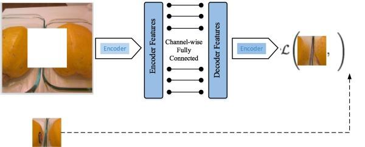

## Table of Contents

## What is image inpainting and why is it important in machine learning?

Image inpainting is a technique used in computer vision and machine learning where damaged, missing, or unwanted parts of an image are filled in or reconstructed. Imagine you have an old photo with a big scratch across it. Image inpainting can help restore the photo by filling in the scratched area, making it look like the scratch was never there. This is done using algorithms that analyze the surrounding pixels and intelligently guess what should be in the missing spots.

This technique is important in machine learning because it helps improve the quality of images used in various applications. For example, in medical imaging, doctors might need clear images to make accurate diagnoses. If an image has artifacts or missing parts, image inpainting can fix these issues, leading to better healthcare outcomes. Additionally, in the field of digital restoration, image inpainting can be used to restore old photographs or artworks, preserving cultural heritage. By enabling machines to understand and fill in missing visual information, image inpainting enhances the capabilities of machine learning models in handling real-world, imperfect data.

## How does image inpainting work at a basic level?

At its core, image inpainting works by looking at the parts of an image that are still there and using that information to guess what the missing parts should look like. Imagine you have a picture of a blue sky with a cloud, but part of the cloud is missing. The inpainting algorithm will look at the color and shape of the rest of the cloud and the blue sky around it. Then, it will try to fill in the missing part in a way that makes the whole picture look natural.

To do this, the algorithm uses something called a "loss function" to measure how well it's doing. The loss function compares the inpainted image to what the image should ideally look like. If the filled-in part doesn't match well, the loss function will be high, and the algorithm will keep trying different ways to fill it in until the loss function gets as low as possible. This process can be quite complex, but the goal is always to make the final image look as if nothing was ever missing.

## What are the common applications of image inpainting?

Image inpainting is used in many different ways. One common use is in photo editing and restoration. Imagine you have an old family photo with scratches or tears. Image inpainting can fix these problems by filling in the damaged parts, making the photo look new again. This is important for keeping memories alive and can even be used to restore old paintings or historical documents.

Another use is in medical imaging. Doctors often use images to check for health problems, but these images can sometimes have parts missing or be unclear. Image inpainting can help by filling in these gaps, making it easier for doctors to see what's going on inside the body. This can lead to better diagnoses and treatments, which is crucial for patient care.

Image inpainting is also used in movies and video games. Sometimes, filmmakers need to remove unwanted objects from a scene or add new ones. Inpainting helps them do this seamlessly, so viewers don't notice the changes. In video games, inpainting can be used to create more realistic environments by filling in missing textures or details. This makes the gaming experience more immersive and enjoyable.

## What is the Contextual Residual Aggregation approach in image inpainting?

The Contextual Residual Aggregation (CRA) approach is a method used in image inpainting to make the filled-in parts of an image look more natural. It works by looking at the whole image and using what it sees to guess what should be in the missing spots. Imagine you have a picture of a forest with a big hole in it. CRA would look at the trees, leaves, and shadows around the hole and try to fill it in with similar things, making the whole picture look like a real forest again.

CRA does this by breaking down the image into smaller parts and then using a special kind of math to figure out how to fill in the missing parts. It uses something called a "residual" to make small changes to the image until it looks right. The idea is to keep making these small changes until the filled-in part matches the rest of the image as closely as possible. This way, the final picture looks like it was never damaged or missing anything.

## How does Contextual Residual Aggregation improve upon traditional inpainting methods?

Contextual Residual Aggregation (CRA) improves upon traditional inpainting methods by using the whole image to guess what should fill in the missing spots. Traditional methods might just look at the edges around the hole and try to fill it in based on that. But CRA looks at the whole picture, like the colors, shapes, and patterns all around. This makes the filled-in part fit better with the rest of the image. For example, if you have a picture of a forest with a big hole in it, CRA would look at all the trees and leaves around the hole and fill it in with similar things, making the whole picture look like a real forest again.

Another way CRA improves on traditional methods is by using small changes, called residuals, to make the filled-in part look just right. Traditional methods might try to fill in the hole all at once, which can sometimes look off. But CRA keeps making tiny adjustments until the filled-in part matches the rest of the image perfectly. This means the final picture looks like it was never damaged or missing anything. By using the whole image and making small, careful changes, CRA can create more natural-looking results than older inpainting methods.

## What are the key components of a Contextual Residual Aggregation model?

The key components of a Contextual Residual Aggregation (CRA) model include the contextual attention module and the residual aggregation process. The contextual attention module is like a smart tool that looks at the whole image to figure out what should go in the missing spots. It does this by comparing the known parts of the image with the areas around the hole. This way, it can find similar patterns and textures to fill in the gaps, making the filled-in part blend well with the rest of the picture.

The residual aggregation process is another important part of the CRA model. It works by making small changes, called residuals, to the image until the filled-in part looks just right. Instead of trying to fill in the hole all at once, the model keeps making tiny adjustments. This helps the final image look more natural because it can slowly get closer and closer to the perfect fit. By using both the contextual attention module and the residual aggregation process, the CRA model can create very realistic and seamless image inpainting results.

## How is training data prepared for an image inpainting model using Contextual Residual Aggregation?

To prepare training data for an image inpainting model using Contextual Residual Aggregation (CRA), you start with a collection of complete images. These images are then modified to create training examples. This is done by randomly selecting parts of the images and removing them, creating holes or masks. The model will then try to fill in these holes during training. The idea is to give the model many different examples of images with missing parts so it can learn how to fill them in correctly. The complete images serve as the ground truth, showing the model what the filled-in parts should look like.

Once the images are modified, they are split into two sets: the training set and the validation set. The training set is used to teach the model how to do inpainting, while the validation set is used to check how well the model is learning without actually training on it. This helps to make sure the model can work well on new images it hasn't seen before. The images in both sets are usually pre-processed to make them the right size and format for the model. This way, the CRA model can learn from a variety of images and get better at filling in missing parts to make the whole image look natural.

## What metrics are used to evaluate the performance of image inpainting modules?

When we want to check how good an image inpainting model is, we use different ways to measure it. One common way is to use the Peak Signal-to-Noise Ratio (PSNR). This metric compares the inpainted image to the original, complete image. A higher PSNR means the inpainted image is closer to the original, which is good. Another important metric is the Structural Similarity Index (SSIM). SSIM looks at how similar the inpainted image is to the original in terms of things like brightness, contrast, and structure. A higher SSIM score means the inpainted image looks more like the original.

Another way to evaluate image inpainting is by using the Learned Perceptual Image Patch Similarity (LPIPS). LPIPS tries to see how similar the inpainted image is to the original by using a neural network that has learned what images should look like. This can be more accurate than PSNR or SSIM because it's closer to how humans see images. Sometimes, we also use human evaluations, where people look at the inpainted images and rate how good they look. This can give us a good idea of how well the model is doing because it's based on human judgment.

## What are the challenges faced when implementing Contextual Residual Aggregation in image inpainting?

One of the main challenges when implementing Contextual Residual Aggregation (CRA) in image inpainting is the computational complexity. CRA looks at the whole image to fill in missing parts, which means it has to do a lot of calculations. This can make the process slow, especially for big images. Another challenge is making sure the filled-in parts look natural. CRA uses small changes, called residuals, to make the image look right, but getting these changes just right can be hard. If the model doesn't do it well, the filled-in part might not match the rest of the image, making it look fake.

Another challenge is dealing with different kinds of images. Some images, like those of forests or cities, have lots of details and patterns. CRA needs to learn how to handle these different types of images well. If it doesn't, the filled-in parts might not look right. Also, training the model to use CRA can be tricky. You need a lot of good training data, and preparing this data can take a lot of time. If the training data isn't good, the model might not learn how to fill in missing parts well, which means the final images might not look as good as they should.

## How can the effectiveness of an image inpainting module be optimized using Contextual Residual Aggregation?

To optimize the effectiveness of an image inpainting module using Contextual Residual Aggregation (CRA), it's important to focus on improving the model's ability to understand and use the context of the whole image. This can be done by training the model with a diverse set of images that have different kinds of missing parts. By seeing many different examples, the model can learn how to fill in holes in a way that looks natural no matter what the image shows. Another way to optimize CRA is by fine-tuning the residual aggregation process. This means making small changes to how the model makes its tiny adjustments to the image. By getting these adjustments just right, the filled-in parts can blend better with the rest of the image, making it look like nothing was ever missing.

Another important aspect of optimizing CRA is to reduce the computational complexity. Since CRA looks at the whole image, it can be slow, especially for big images. To make it faster, you can use techniques like parallel processing, where the computer works on different parts of the image at the same time. Also, using a good loss function can help the model learn faster and better. The loss function tells the model how well it's doing, and if it's set up right, the model can make better guesses about what should go in the missing spots. By focusing on these areas, the effectiveness of an image inpainting module using CRA can be greatly improved, leading to more natural-looking results.

## What are the latest advancements in image inpainting beyond Contextual Residual Aggregation?

Beyond Contextual Residual Aggregation, one of the latest advancements in image inpainting is the use of Generative Adversarial Networks (GANs). GANs work by having two parts: a generator that creates the filled-in parts of the image, and a discriminator that tries to tell if the filled-in parts look real or fake. The generator keeps getting better at making the filled-in parts look real, and the discriminator keeps getting better at spotting fakes. This back-and-forth helps the model create very realistic inpaintings. A popular example is the Edge-Connect method, which first predicts the edges of the missing parts and then fills them in, making the results look more natural.

Another advancement is the use of transformer-based models, like the ones used in language processing, for image inpainting. These models can look at the whole image and understand the context better than ever before. They work by breaking the image into patches and then using attention mechanisms to figure out how these patches relate to each other. This allows the model to fill in missing parts in a way that fits well with the rest of the image. Researchers are also exploring the use of self-supervised learning, where the model learns from the images themselves without needing lots of labeled data. This can make the inpainting process more efficient and effective.

## How can image inpainting be integrated into larger machine learning systems for practical applications?

Image inpainting can be a useful part of bigger machine learning systems in many practical ways. For example, in medical imaging, doctors might use a system that first uses image inpainting to fix any missing or unclear parts of an image. After the image is fixed, other parts of the machine learning system can use this clearer image to help diagnose diseases or plan treatments. This makes the whole system more accurate and helpful for doctors. In the world of digital photo editing, image inpainting can be part of a larger system that lets people remove unwanted objects from their photos or fix old, damaged pictures. The inpainting module would work with other parts of the system to make the final image look perfect.

Another way image inpainting can be used in larger systems is in video and movie production. Here, the inpainting module could be part of a system that helps filmmakers remove unwanted objects from scenes or add new ones to make the movie look better. The inpainting part of the system would work together with other parts that handle things like color correction and special effects. By using image inpainting in these larger systems, the final videos or movies can look more professional and realistic. Overall, integrating image inpainting into bigger machine learning systems can make them more powerful and useful in many different areas.