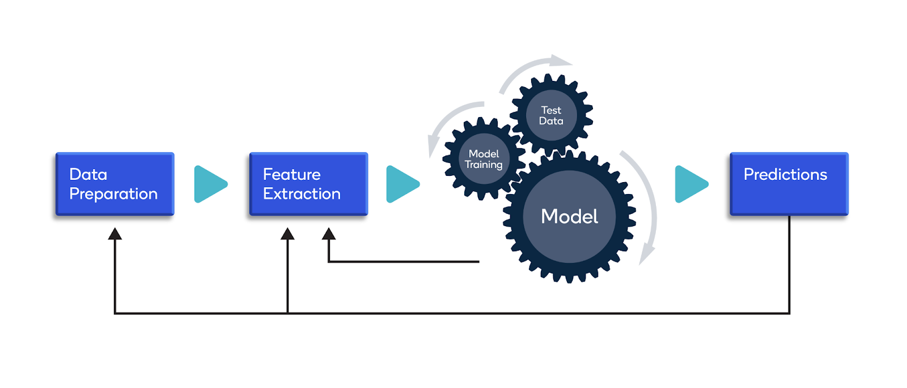

## Table of Contents

## What is image manipulation in the context of machine learning?

Image manipulation in machine learning refers to the process of altering images using algorithms and techniques to achieve specific goals, such as improving image quality, extracting features, or generating new images. This is often done to prepare images for use in machine learning models, where the quality and characteristics of the images can significantly impact the model's performance. Common techniques include resizing, cropping, rotating, and applying filters, all of which can be automated and scaled using machine learning algorithms.

One important application of image manipulation in machine learning is data augmentation. Data augmentation involves creating modified versions of existing images to increase the diversity of the training dataset. This helps machine learning models learn from a wider variety of examples, which can improve their ability to generalize and perform well on new, unseen images. Techniques used in data augmentation might include flipping, zooming, and changing the brightness or contrast of images. By doing this, models can be trained to recognize objects and patterns under different conditions, making them more robust and effective.

Another key aspect of image manipulation in machine learning is the use of generative models, such as Generative Adversarial Networks (GANs). These models can create entirely new images that look realistic, often by learning from a large dataset of existing images. For instance, a GAN could be trained to generate new portraits of people or new landscapes. This not only showcases the creative potential of machine learning but also has practical applications in fields like art, entertainment, and even medical imaging, where generating synthetic data can be useful for training models without compromising patient privacy.

## How do image manipulation models work?

Image manipulation models in [machine learning](/wiki/machine-learning) use special math formulas and computer programs to change pictures. They look at the colors and shapes in a picture and then use rules to make it bigger, smaller, brighter, or even create a whole new picture. For example, if you want to make a picture brighter, the model might add a certain number to every color value in the picture. This is called image processing, and it's like using a magic wand to change how a picture looks.

One way these models work is through something called [data augmentation](/wiki/data-augmentation). Imagine you have a few pictures of cats, but you need more to teach a computer to recognize cats better. The model can flip the pictures, rotate them, or change their colors to make new ones. This helps the computer learn from different angles and lighting, making it smarter at recognizing cats no matter how they look. It's like giving the computer more practice with different cat pictures.

Another cool thing these models can do is make completely new pictures. This is done with models like Generative Adversarial Networks (GANs). A GAN has two parts: one part makes new pictures, and the other part checks if they look real. They work together, with the first part trying to fool the second part. Over time, they get better and better, and the new pictures start looking more and more like real ones. It's like an art class where the students keep practicing until they can paint perfect pictures.

## What are some common applications of image manipulation models?

Image manipulation models are used in many everyday things. One big use is in photo editing apps on phones and computers. These apps let you make your pictures look better by adjusting their brightness, contrast, or even removing red-eye. They use simple math to change the colors and shapes in the pictures. For example, if you want to make a picture brighter, the app might add a number to every color value in the picture. This makes the whole picture look lighter and more vibrant.

Another common use is in making games and movies look more realistic. In video games, these models can create new scenes or characters that look real. They do this by learning from lots of pictures and then making new ones that fit into the game. In movies, special effects teams use these models to add things that weren't there when filming, like explosions or creatures. This makes the movies more exciting and believable.

Image manipulation models also help doctors and scientists. In medicine, these models can make medical images, like X-rays, clearer and easier to read. This helps doctors find problems faster and treat patients better. In science, researchers use these models to study things too small or too far away to see easily. By making these images better, scientists can learn more about the world around us.

## What is DeepSIM and how does it fit into image manipulation?

DeepSIM stands for Deep Structured Image Manipulation. It's a special kind of computer program that uses something called a [neural network](/wiki/neural-network) to change pictures in smart ways. Imagine you want to make a picture look like it was taken at sunset instead of midday. DeepSIM can learn how to do that by looking at lots of pictures of sunsets and figuring out what makes them look different from other times of day. It then uses this knowledge to change your picture, making it look like it was taken at sunset.

DeepSIM fits into image manipulation by making changes to pictures that are more than just simple tweaks like making them brighter or darker. It can change the whole feel of a picture, like making it look like a different season or time of day. This is useful for artists and photographers who want to create a certain mood in their pictures. By using DeepSIM, they can turn a regular picture into something that looks like it was taken in a completely different setting, making their work more interesting and creative.

## What are the key components of a DeepSIM model?

A DeepSIM model has a few important parts that help it change pictures in smart ways. One key part is the neural network, which is like a brain that learns from lots of pictures. It figures out what makes a picture look a certain way, like how a sunset picture looks different from a midday one. The neural network uses this knowledge to change the picture you give it, making it look like it was taken at a different time or in a different season.

Another important part of a DeepSIM model is the loss function. This is like a scorekeeper that tells the model how well it's doing. If the model changes a picture to look like a sunset but it doesn't look quite right, the loss function will give it a bad score. The model then tries to do better next time. The loss function helps the model learn and improve until it can make pictures look just the way you want them to.

## How is DeepSIM trained and what data is used?

DeepSIM is trained using a big collection of pictures. These pictures show different times of day, seasons, and other changes that the model needs to learn. For example, if you want DeepSIM to make pictures look like they were taken at sunset, you would give it lots of sunset pictures. The model looks at these pictures and learns what makes a sunset look different from other times of day. It does this by adjusting the numbers inside its neural network, trying to get better at making pictures look like sunsets.

The training process involves showing the model pairs of pictures. One picture is the original, and the other is what you want the original to look like after the change. For instance, you might show it a picture taken at noon and another taken at sunset. The model then tries to change the noon picture to look like the sunset one. It keeps trying and learning until it gets really good at making these changes. The more pictures it sees and the more it practices, the better it gets at turning regular pictures into ones that look like they were taken at a different time or in a different setting.

## What are the performance metrics used to evaluate image manipulation models like DeepSIM?

Image manipulation models like DeepSIM are evaluated using different performance metrics to see how well they work. One common metric is the Mean Squared Error (MSE), which measures the average of the squares of the errors between the manipulated image and the target image. If the MSE is low, it means the model did a good job making the picture look like it should. Another important metric is the Peak Signal-to-Noise Ratio (PSNR), which tells us how close the manipulated image is to the target image in terms of quality. A higher PSNR means the image looks more like the target and has less "noise" or unwanted changes.

Another metric used is the Structural Similarity Index (SSIM), which looks at how similar the structure of the manipulated image is to the target image. SSIM is good because it considers things like brightness, contrast, and structure, not just the difference in pixel values. A high SSIM score means the model kept the important parts of the image the same while making the changes. These metrics help people understand how well the model is doing and where it might need to improve. By using these measures, researchers can make the models better at turning regular pictures into ones that look like they were taken at a different time or in a different setting.

## What are the challenges faced when developing image manipulation models?

Developing image manipulation models like DeepSIM can be tricky because they need to handle a lot of different things at once. One big challenge is making sure the model can change pictures in a way that looks natural and believable. For example, if you want to make a picture look like it was taken at sunset, the model has to change the colors and lighting just right. If it doesn't, the picture might look fake or strange. Another challenge is dealing with all the different kinds of pictures out there. Pictures can be taken in different lighting, from different angles, and with different objects in them. The model has to learn from all these different pictures and still make good changes, which can be hard.

Another difficulty is getting enough good data to train the model. You need a lot of pictures that show the changes you want the model to make, like sunsets or different seasons. Gathering all these pictures and making sure they are good quality can take a lot of time and effort. Plus, the model has to be fast and efficient. If it takes too long to change a picture, people won't want to use it. So, developers have to find ways to make the model work quickly without losing its ability to make good changes. All these challenges make developing image manipulation models a complex but interesting task.

## How can image manipulation models be integrated into existing systems?

Image manipulation models can be added to existing systems by connecting them to the software that people already use. For example, if you have a photo editing app on your phone, you can include a model like DeepSIM to let users change their pictures in cool ways, like making them look like they were taken at sunset. To do this, you need to make sure the model can talk to the app, sending and receiving pictures easily. This might mean writing some new code to connect the model to the app, making sure it works smoothly without slowing things down.

Once the model is part of the system, it can do its job without users needing to know how it works. They just use the app as usual, but now they can do more with their pictures. For example, if someone wants to make a picture look like it was taken in the fall, they can pick that option in the app, and the model will change the picture to match. This makes the app more useful and fun, helping people create pictures that look just the way they want them to.

## What are the ethical considerations when using image manipulation models?

Using image manipulation models like DeepSIM can raise some important ethical questions. One big concern is that these models can make pictures look so real that it's hard to tell what's true and what's not. For example, someone could use the model to change a picture to make it look like something happened that didn't. This could be used to trick people or spread false information, which can be harmful. It's important for people who make and use these models to be honest about what they're doing and to think about how their work might affect others.

Another ethical issue is privacy. When these models are used to change pictures, they might need to look at a lot of personal photos to learn how to do it well. This means people's private pictures could be used without their permission, which isn't right. It's crucial to make sure that any pictures used to train these models are shared with permission and that people's privacy is respected. By being careful and thoughtful, we can use image manipulation models in ways that are helpful and fair.

## What are the latest advancements in image manipulation models beyond DeepSIM?

Beyond DeepSIM, one of the latest advancements in image manipulation models is the development of more advanced Generative Adversarial Networks (GANs). These newer GANs, like StyleGAN and BigGAN, can create incredibly realistic images from scratch. They do this by using a special way of learning that lets them focus on different parts of the image, like the eyes or the background, and change them separately. This makes the images look more natural and detailed. For example, StyleGAN can generate portraits that look just like real people, which is amazing but also raises questions about how these images might be used.

Another exciting advancement is the use of neural style transfer, which can change the style of an image to look like a famous painting or another artistic style. This technique uses a neural network to separate the content of an image from its style and then combines the content with a new style. It's like turning a regular photo into a piece of art. Researchers are also working on making these models faster and easier to use, so more people can enjoy creating and editing images in creative ways. These advancements show how quickly image manipulation technology is growing and how it can be used for both fun and serious purposes.

## How can one start experimenting with image manipulation models, including setting up a development environment?

To start experimenting with image manipulation models, you first need to set up a development environment on your computer. This involves installing software that can run and test the models. You'll need Python, which is a popular programming language for machine learning, and some libraries like TensorFlow or PyTorch, which help you build and train neural networks. You can download Python from the official website and install libraries using a package manager like pip. For example, you can install TensorFlow by typing ```pip install [tensorflow](/wiki/tensorflow)``` in your command line. Once you have these tools set up, you can start writing code to manipulate images.

After setting up your environment, you can begin working with image manipulation models. Start by finding or creating a dataset of images to use for training and testing. You can use online resources like Kaggle or create your own by taking photos. Then, you can write a simple script to load these images and apply basic manipulations like resizing or changing brightness. As you get more comfortable, you can move on to more advanced techniques like using GANs to generate new images. There are many tutorials and online courses that can guide you through this process, helping you understand how to use and tweak these models to achieve the results you want.