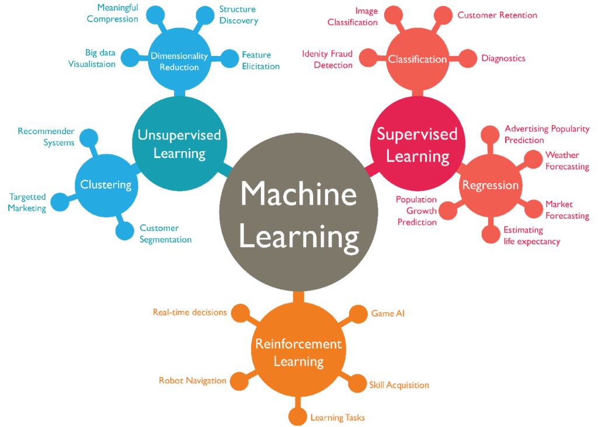

## Table of Contents

## What is an Image Model Block in the context of machine learning?

An Image Model Block in machine learning is a part of a larger neural network designed specifically for processing and analyzing images. These blocks are typically found in convolutional neural networks (CNNs), which are widely used for tasks like image classification, object detection, and image segmentation. An Image Model Block usually includes layers that perform operations such as convolution, which applies filters to the image to detect features like edges or textures, and pooling, which reduces the dimensionality of the data while retaining important information.

These blocks are crucial because they help the neural network to learn hierarchical features from the images. For instance, early layers might detect simple features like edges, while deeper layers can identify more complex structures like faces or objects. By stacking multiple Image Model Blocks, the network can progressively build a more detailed understanding of the image, leading to better performance in tasks like recognizing objects or classifying images into different categories.

## How does a Residual Block function in image processing models?

A Residual Block, also known as a ResBlock, is a special part of some image processing models that helps the model learn better and faster. It does this by using a shortcut, or a "skip connection," which lets the model take a direct path from one layer to a later layer. This shortcut helps the model keep important information that might get lost as it goes through many layers. By adding the output of one layer directly to the output of a later layer, the model can focus on learning the difference, or the "residual," between these layers. This makes training deep networks easier and helps them perform better on tasks like recognizing objects in pictures.

In simple terms, if you imagine the model as a series of steps, a Residual Block lets you skip some steps to make sure you don't forget what you learned earlier. For example, if you're trying to identify a cat in a picture, early layers might recognize the cat's ears, and later layers might recognize the whole cat. The skip connection helps the model remember the ears while it's trying to see the whole cat. This way, the model can be very deep, with many layers, but still work well because it can use these shortcuts to keep important details from the beginning to the end of the process.

## What are the key differences between a Residual Block and a Bottleneck Residual Block?

A Residual Block and a Bottleneck Residual Block are both used in deep neural networks to help the model learn better, but they have some key differences. A regular Residual Block typically consists of two or three convolutional layers with the same number of filters. For example, if the first layer has 64 filters, the next layers will also have 64 filters. This setup helps the model keep important information from earlier layers by using skip connections, which directly add the input of the block to its output.

On the other hand, a Bottleneck Residual Block is designed to be more efficient, especially in very deep networks. It uses a three-layer structure where the middle layer has fewer filters than the other two layers. For instance, if the first and third layers have 256 filters, the middle layer might only have 64 filters. This "bottleneck" design reduces the number of parameters and computations needed, making the network faster to train and run, while still keeping the benefits of the skip connections.

In summary, while both types of blocks use skip connections to help with training deep networks, the main difference lies in their structure. A regular Residual Block keeps the same number of filters throughout its layers, while a Bottleneck Residual Block narrows down the number of filters in the middle layer to save on computational resources.

## Can you explain the structure and purpose of a Squeeze-and-Excitation Block?

A Squeeze-and-Excitation Block, often called an SE Block, is a part of some neural networks that helps them focus on the most important parts of an image. It does this by looking at the whole image and figuring out which features are most useful for the task at hand, like recognizing objects. The SE Block has two main steps: the "squeeze" step and the "excitation" step. In the squeeze step, it takes all the information from the image and turns it into a single number for each feature. This helps the network understand the overall importance of each feature across the entire image. Then, in the excitation step, it uses these numbers to decide how much attention to pay to each feature. This way, the network can focus more on the important parts of the image and less on the unimportant parts.

The structure of an SE Block is simple but powerful. First, it uses a global average pooling layer to squeeze the spatial dimensions of the input into a single value for each channel. This is like taking the average of all the values in each feature map. Then, it uses two fully connected layers to create the excitation part. The first fully connected layer reduces the number of channels, and the second one brings it back to the original number of channels. Between these layers, a ReLU activation function is used to introduce non-linearity, and a sigmoid activation function is used at the end to make sure the values are between 0 and 1. These values are then multiplied with the original input to scale the importance of each feature. This process can be represented as:
$$
\mathbf{z} = \mathbf{x} \odot \sigma(W_2 \cdot \text{ReLU}(W_1 \cdot \text{GlobalAveragePool}(\mathbf{x})))
$$
where $$\mathbf{x}$$ is the input, $$\mathbf{z}$$ is the output, $$\sigma$$ is the sigmoid function, $$\odot$$ denotes element-wise multiplication, and $$W_1$$ and $$W_2$$ are the weights of the fully connected layers. By doing this, the SE Block helps the network perform better on tasks like image classification or object detection.

## How does a Dense Block enhance feature propagation in neural networks?

A Dense Block helps neural networks learn better by connecting all the layers inside it to each other. In a regular [neural network](/wiki/neural-network), each layer only connects to the next one. But in a Dense Block, every layer gets information from all the layers before it. This means that if you have four layers in a Dense Block, the fourth layer will get information directly from the first, second, and third layers, not just the third layer. This way, the network can reuse the features it learns and make sure important information doesn't get lost as it goes deeper.

By connecting all the layers like this, a Dense Block makes it easier for the network to pass information from the beginning to the end. This is really helpful because it can stop the problem called "vanishing gradients," where the network has trouble learning as it gets deeper. The formula for how a layer in a Dense Block works is $$x_l = H_l([x_0, x_1, ..., x_{l-1}])$$, where $$x_l$$ is the output of the $$l$$-th layer, $$H_l$$ is the function of that layer, and $$[x_0, x_1, ..., x_{l-1}]$$ are the outputs of all the previous layers. This setup helps the network learn more detailed and useful features, making it better at tasks like recognizing objects in pictures.

## What is the role of an Inception Module in handling multi-scale features?

An Inception Module is a part of some neural networks that helps them look at images in different ways at the same time. It does this by using different sizes of filters to find different kinds of features in the image. For example, a small filter might be good at finding small details like edges, while a larger filter might be better at finding bigger shapes or patterns. By using all these filters together, the Inception Module can see both the small details and the bigger picture, which makes the network better at understanding what's in the image.

The way an Inception Module works is by having several paths, each with different sizes of filters. These paths run at the same time, and their results are combined at the end. This means the network can learn about different scales of features all at once. The formula for how an Inception Module combines the outputs of different paths can be written as $$y = \text{Concat}(1 \times 1, 3 \times 3, 5 \times 5, \text{Pool})$$, where $$y$$ is the output, and the different numbers represent the sizes of the filters used. This helps the network be more flexible and efficient, making it easier to recognize objects in pictures no matter how big or small they are.

## How does a Non-Local Block capture long-range dependencies in images?

A Non-Local Block helps neural networks understand how different parts of an image relate to each other, even if they are far apart. It does this by looking at the whole image and figuring out which parts are important for understanding other parts. Imagine you're trying to recognize a person in a crowd. The Non-Local Block can help the network see how the person's face relates to their clothes or the people around them, even if these parts are not close together in the image. This is different from regular layers that only look at small areas at a time.

The way a Non-Local Block works is by using a special formula to calculate how much each part of the image should pay attention to every other part. The formula is $$y_i = \frac{1}{C(x)} \sum_{\forall j} f(x_i, x_j) g(x_j)$$, where $$y_i$$ is the new value for a part of the image, $$x_i$$ and $$x_j$$ are different parts of the image, $$f$$ is a function that measures how related two parts are, $$g$$ is a function that gets information from a part, and $$C(x)$$ is a number that makes sure the values stay in a good range. By using this formula, the Non-Local Block can help the network see the big picture and understand the image better.

## What is the mechanism behind the Spatial Transformer and its impact on image recognition?

A Spatial Transformer is a special part of some neural networks that helps them understand images better by changing how the images look. It does this by moving, resizing, or rotating the image in a smart way. Imagine you're trying to recognize a cat in a picture, but the cat is tilted or too far away. The Spatial Transformer can fix this by straightening the cat or making it bigger, so the network can see it more clearly. This helps the network focus on the important parts of the image and ignore things like the angle or size that might make recognition harder.

The way a Spatial Transformer works is by using a special formula to decide how to change the image. It looks at the whole image and figures out the best way to transform it. The formula is $$y_i = \sum_j x_j \cdot \text{kernel}(i, j)$$, where $$y_i$$ is the new value for a part of the image, $$x_j$$ is the old value, and $$\text{kernel}(i, j)$$ is a function that decides how to move and change the image. By doing this, the Spatial Transformer can make the network better at recognizing objects, even if they are in different positions or sizes in the image.

## How does the ResNeXt Block improve upon the traditional ResNet architecture?

The ResNeXt Block is a special part of some neural networks that makes them better than the traditional ResNet architecture. It does this by using a trick called "cardinality," which means it uses many small paths instead of one big path to understand the image. Imagine you're trying to solve a puzzle. In a traditional ResNet, you might use one big piece to solve it, but in a ResNeXt, you use many smaller pieces. This way, the network can learn more detailed and useful information from the image, making it better at recognizing objects.

The way a ResNeXt Block works is by splitting the image into many smaller parts and then combining them at the end. The formula for how it does this is $$y = \sum_{i=1}^{C} T_i(x)$$, where $$y$$ is the output, $$C$$ is the number of paths (or cardinality), and $$T_i(x)$$ is the function for each path. By using many small paths, the ResNeXt Block can learn more about the image without needing more calculations, making the network faster and more efficient. This helps the network perform better on tasks like recognizing objects in pictures.

## What are the advantages of using a Channel Attention Module in deep learning models?

A Channel Attention Module helps [deep learning](/wiki/deep-learning) models focus on the most important parts of an image. It does this by figuring out which features, or channels, are the most useful for understanding what's in the picture. Imagine you're looking at a photo of a dog. Some parts of the image, like the dog's eyes or fur, are more important for recognizing it's a dog. The Channel Attention Module helps the network pay more attention to these important parts and less attention to the less important ones, like the background. This makes the network better at recognizing objects and understanding images.

The way a Channel Attention Module works is by using a special formula to decide how much attention to pay to each channel. The formula is $$y = x \odot \sigma(W_2 \cdot \text{ReLU}(W_1 \cdot \text{GlobalAveragePool}(x)))$$, where $$x$$ is the input, $$y$$ is the output, $$\sigma$$ is the sigmoid function, $$\odot$$ means multiplying each part, and $$W_1$$ and $$W_2$$ are numbers that help the network learn. By using this formula, the Channel Attention Module can help the network see the most important parts of the image and ignore the less important ones. This makes the network more accurate and efficient, especially when dealing with complex images.

## How does the Inception-v3 Module differ from its predecessors and what improvements does it offer?

The Inception-v3 Module is a more advanced version of the earlier Inception modules, like Inception-v1 and Inception-v2. It makes the network better at recognizing objects in pictures by using smaller filters and adding something called "factorization." In the older versions, they used big filters, but Inception-v3 breaks these big filters into smaller ones. For example, instead of using one big 5x5 filter, it uses two smaller 3x3 filters. This helps the network see more details in the image without needing more calculations. It also adds something called "auxiliary classifiers," which are extra parts that help the network learn better by giving it more chances to guess what's in the picture.

Another big change in Inception-v3 is the use of "asymmetric convolutions." This means it uses different sizes of filters in different directions. For example, it might use a 1x3 filter and a 3x1 filter instead of a 3x3 filter. This helps the network see different kinds of patterns in the image and makes it more flexible. The formula for how Inception-v3 combines different paths can be written as $$y = \text{Concat}(1 \times 1, 3 \times 3_{\text{reduced}}, 3 \times 3_{\text{reduced}} \rightarrow 3 \times 3, 3 \times 3_{\text{reduced}} \rightarrow 1 \times 3 \rightarrow 3 \times 1, \text{Pool})$$, where $$y$$ is the output, and the different numbers represent the sizes of the filters used. By using all these tricks, Inception-v3 can understand images better and faster than the older versions.

## What advanced techniques are used in the Ghost Module to optimize model efficiency and performance?

The Ghost Module is a special part of some neural networks that makes them faster and better at understanding images. It does this by using a trick called "cheap operations." Instead of using a lot of big calculations to find features in the image, the Ghost Module uses smaller and simpler calculations. It starts with a regular convolutional layer, which is a common way to find features in images. Then, it adds something called "ghost features," which are extra features that are easy to calculate but still help the network understand the image better. By using these ghost features, the network can see more details without needing more calculations, making it faster and more efficient.

Another important part of the Ghost Module is how it combines the regular features with the ghost features. It does this by using a formula that looks like $$y = \text{Concat}(x, \text{Ghost}(x))$$, where $$y$$ is the output, $$x$$ is the input from the regular convolutional layer, and $$\text{Ghost}(x)$$ are the ghost features. This way, the network can use both the regular features and the ghost features to understand the image better. By using these advanced techniques, the Ghost Module helps the network perform better on tasks like recognizing objects in pictures, while also making it faster and more efficient.

## References & Further Reading

[1]: Krizhevsky, A., Sutskever, I., & Hinton, G. E. (2012). ["Imagenet classification with deep convolutional neural networks."](https://dl.acm.org/doi/10.1145/3065386) Communications of the ACM, 60(6), 84-90.

[2]: He, K., Zhang, X., Ren, S., & Sun, J. (2016). ["Deep residual learning for image recognition."](https://ieeexplore.ieee.org/document/7780459) In Proceedings of the IEEE conference on computer vision and pattern recognition (pp. 770-778).

[3]: Hu, J., Shen, L., & Sun, G. (2018). ["Squeeze-and-excitation networks."](https://ieeexplore.ieee.org/document/8578843) In Proceedings of the IEEE conference on computer vision and pattern recognition (pp. 7132-7141).

[4]: Huang, G., Liu, Z., van der Maaten, L., & Weinberger, K. Q. (2017). ["Densely connected convolutional networks."](https://ieeexplore.ieee.org/document/8099726) In Proceedings of the IEEE conference on computer vision and pattern recognition (pp. 4700-4708).

[5]: Szegedy, C., Vanhoucke, V., Ioffe, S., Shlens, J., & Wojna, Z. (2016). ["Rethinking the inception architecture for computer vision."](https://arxiv.org/abs/1512.00567) In Proceedings of the IEEE conference on computer vision and pattern recognition (pp. 2818-2826).

[6]: Wang, X., Girshick, R., Gupta, A., & He, K. (2018). ["Non-local neural networks."](https://arxiv.org/abs/1711.07971) In Proceedings of the IEEE conference on computer vision and pattern recognition (pp. 7794-7803).

[7]: Jaderberg, M., Simonyan, K., Zisserman, A., & Kavukcuoglu, K. (2015). ["Spatial transformer networks."](https://arxiv.org/abs/1506.02025) Advances in neural information processing systems, 28.

[8]: Xie, S., Girshick, R., Dollár, P., Tu, Z., & He, K. (2017). ["Aggregated residual transformations for deep neural networks."](https://ieeexplore.ieee.org/document/8100117) In Proceedings of the IEEE conference on computer vision and pattern recognition (pp. 1492-1500).

[9]: Woo, S., Park, J., Lee, J. Y., & Kweon, I. S. (2018). ["Cbam: Convolutional block attention module."](https://arxiv.org/abs/1807.06521) In Proceedings of the European Conference on Computer Vision (ECCV) (pp. 3-19).

[10]: Han, K., Wang, Y., Zhang, Q., Li, Z., & Xu, C. (2020). ["Ghostnet: More features from cheap operations."](https://ieeexplore.ieee.org/document/9157333) In Proceedings of the IEEE/CVF Conference on Computer Vision and Pattern Recognition (pp. 1580-1589).