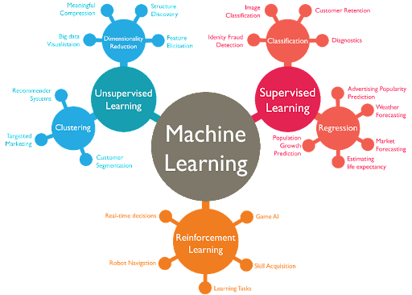

## Table of Contents

## What is an image model in the context of machine learning?

An image model in machine learning is a type of artificial intelligence system that is designed to understand, analyze, and generate images. These models are trained on large datasets of images, learning to recognize patterns, shapes, and features within them. For example, an image model can identify objects in a photo, like a cat or a car, by recognizing specific characteristics that differentiate these objects from others.

These models often use deep learning techniques, particularly convolutional neural networks (CNNs), which are very good at processing visual data. A CNN works by applying different filters to the image to detect edges, textures, and other features, gradually building up a more complex understanding of the image as it moves through the network's layers. This allows the model to not only recognize what is in an image but also understand the context and relationships between different elements within it.

## How do convolutional neural networks (CNNs) work in image models?

Convolutional neural networks (CNNs) are a special type of neural network used in image models to understand pictures. They work by using small filters that slide over the image, looking for specific patterns like edges or colors. These filters help the CNN break down the image into simpler parts. As the image moves through the layers of the CNN, these simple parts are combined to form more complex features. For example, the network might first recognize lines and curves, then combine them to identify shapes like circles or squares, and finally recognize objects like a dog or a car.

Each layer in a CNN has a specific job. The first layers usually find basic features like edges and textures. As you go deeper into the network, the layers start to recognize more complex patterns. The final layers can identify entire objects or even understand the whole scene in the image. This process is like building a puzzle: starting with small pieces and putting them together to see the big picture. By the end, the CNN can tell what's in the image and even where each part is located, making it very useful for tasks like image recognition or self-driving cars.

## What are some common architectures of image models used in machine learning?

Some common architectures of image models in [machine learning](/wiki/machine-learning) include LeNet, AlexNet, VGG, ResNet, and Inception. LeNet was one of the first successful CNNs, designed for recognizing handwritten digits. It's simple, with just a few layers, but it set the stage for more complex models. AlexNet came next and became famous for winning the ImageNet competition in 2012. It used more layers and a technique called ReLU (Rectified Linear Unit) to make training faster and more effective. VGG, or Visual Geometry Group, is known for its uniform architecture, using many small 3x3 filters stacked together. This makes it easier to understand and tweak, but it can be slow to train because of its depth.

ResNet, or Residual Network, introduced a clever trick called skip connections, which help the network learn better by allowing it to skip over some layers. This makes it possible to build very deep networks without losing performance. Inception, also known as GoogLeNet, uses a different approach with its Inception modules. These modules let the network look at the image in different ways at the same time, making it more efficient and powerful. Each of these architectures has its strengths and is chosen based on the specific task and the resources available.

These architectures have evolved over time, with each new model building on the successes and lessons of the previous ones. They all use the basic idea of CNNs, but they add their own special features to improve performance. For example, while LeNet might be good enough for simple tasks like reading numbers, ResNet or Inception might be better for more complex tasks like recognizing objects in a busy street scene. By understanding these different architectures, researchers and engineers can pick the best tool for their image recognition job.

## How does the ResNet architecture improve upon traditional CNNs?

ResNet, or Residual Network, improves upon traditional CNNs by using a special trick called skip connections. In traditional CNNs, as you add more layers, it can become harder for the network to learn because the information has to pass through so many layers. This can lead to something called the vanishing gradient problem, where the network struggles to update its weights effectively. ResNet solves this by adding skip connections, which let the information skip over some layers. This means the network can learn better and go much deeper without losing performance. For example, a ResNet can have over 100 layers, while a traditional CNN might struggle with just a few dozen.

These skip connections work by taking the output from one layer and adding it directly to the output of a later layer. This can be shown with a simple formula: if $$x$$ is the input to a block of layers and $$F(x)$$ is the output after passing through these layers, the skip connection adds $$x$$ directly to $$F(x)$$, giving a final output of $$F(x) + x$$. This helps the network learn what's called the "residual" - the difference between the input and the desired output. By focusing on learning these small changes, the network can train more effectively and handle very deep architectures. This makes ResNet a powerful tool for tasks that need to understand complex images, like recognizing objects in a busy scene or diagnosing diseases from medical scans.

## What is the role of transfer learning in image models, and how is it implemented?

Transfer learning is a way to use what a model has already learned on one task to help it learn a new task faster and better. In image models, this means taking a model that was trained on a big set of pictures, like the ImageNet dataset, and using it to start learning about a different set of pictures. This is really helpful because training a model from scratch can take a lot of time and need a lot of pictures. With transfer learning, you can get good results with fewer pictures and less time.

To use transfer learning, you start with a pre-trained model, like a ResNet or VGG, that has already learned to recognize many different things in images. You then take off the last few layers of this model, which are usually the ones that make the final decision about what's in the picture, and replace them with new layers that are better suited for your new task. You can then train these new layers on your specific set of images. Sometimes, you might also fine-tune the earlier layers of the model, which means you let them learn a little bit more to better fit your new pictures. This way, the model can use what it already knows about general features in images, like edges and shapes, to quickly learn about the new, specific things you want it to recognize.

## How do Vision Transformers differ from traditional CNN-based image models?

Vision Transformers (ViTs) are different from traditional CNN-based image models because they use a different way to look at pictures. Instead of using filters that slide over the image like CNNs do, ViTs break the image into small pieces called patches. They then treat these patches like words in a sentence, using a technique called self-attention to understand how these patches relate to each other. This allows ViTs to see the big picture and understand the relationships between different parts of the image all at once, rather than building up that understanding layer by layer like CNNs.

One big advantage of ViTs is that they can be very good at understanding the context of an image. For example, if there's a dog in the picture, a ViT can quickly see how the dog's position and the things around it all fit together. This can make ViTs very good at tasks like recognizing objects or understanding scenes. However, ViTs can need a lot of data to train well, and they can be slower to train than CNNs. But once trained, they can sometimes do a better job at understanding complex images.

## What are the advantages of using MobileNetV2 in mobile and embedded vision applications?

MobileNetV2 is really good for mobile and small devices because it's designed to be fast and use less power. It does this by using a special kind of building block called an inverted residual structure. This structure helps the model to be smaller and quicker, which is perfect for phones and other gadgets that don't have a lot of power or space. MobileNetV2 also uses something called linear bottlenecks, which helps keep the model from losing important details while still being small.

Another big advantage of MobileNetV2 is that it can be easily changed to fit different needs. You can make it bigger or smaller depending on how much power your device has or how fast you need it to work. This means you can use MobileNetV2 on all sorts of devices, from tiny sensors to bigger tablets. It's also good at recognizing things in pictures, so it's useful for apps that need to understand what's in a photo or video on your phone.

## How does the Swin Transformer address the limitations of traditional transformers in image processing?

The Swin Transformer helps fix some problems that traditional transformers have when they work with images. Traditional transformers look at all parts of an image at once, which can make them slow and use a lot of memory, especially for big images. The Swin Transformer solves this by breaking the image into small pieces called windows. It only looks at the pieces in one window at a time, which makes it faster and use less memory. It also uses a special trick called shifted windows, where it moves the windows a bit to look at different parts of the image. This helps the Swin Transformer see how different parts of the image are connected without needing to look at the whole image all at once.

Another way the Swin Transformer is better is that it can handle images of different sizes easily. Traditional transformers need the images to be a fixed size, but the Swin Transformer can work with images that are bigger or smaller. It does this by changing the size of the windows it uses to look at the image. This makes it more flexible and useful for all kinds of image tasks, like recognizing objects or understanding scenes. By using these smart ideas, the Swin Transformer can work well on big images without using too much power or memory, which makes it a great choice for many image processing jobs.

## What are the key features of EfficientNet and how does it achieve its efficiency?

EfficientNet is a type of image model that's really good at recognizing things in pictures while using less power and time. It does this by using a special idea called compound scaling. This means it makes the model bigger by changing three things at the same time: how deep the model is (more layers), how wide it is (more channels in each layer), and how big the pictures it looks at are (larger input size). By balancing these three things, EfficientNet can get better at recognizing things without using too much more power or time. This makes it a great choice for devices that don't have a lot of power, like phones or small computers.

Another key feature of EfficientNet is that it starts with a base model called EfficientNet-B0, which is already very good at understanding images. Then, it uses the compound scaling method to make bigger versions of this model, like EfficientNet-B1, B2, and so on, up to B7. Each bigger version is better at recognizing things but still tries to stay efficient. This way, you can pick the right size of EfficientNet for your needs, whether you need something small and fast or something bigger and more accurate. By using these smart ideas, EfficientNet can do a great job at understanding pictures while still being quick and using less power.

## How do 3D CNNs extend the capabilities of traditional 2D CNNs for video data?

3D CNNs take the idea of 2D CNNs and make them work with videos. Videos are just a bunch of pictures (called frames) shown one after the other. A 2D CNN looks at each picture by itself, but a 3D CNN can look at several pictures at once. It does this by using 3D filters that slide over the video in three directions: up and down, left and right, and also forward and backward in time. This helps the 3D CNN understand how things move and change in the video, not just what they look like in one picture.

This ability to understand movement and changes over time makes 3D CNNs really good at tasks like recognizing actions in videos. For example, a 2D CNN might see a person in a picture and know it's a person, but a 3D CNN can see that person moving and know they're running or dancing. By looking at the video as a whole, 3D CNNs can learn about the patterns of movement and how things change from one frame to the next, making them much better at understanding video data than 2D CNNs.

## What are the latest advancements in image models like DINO and how do they contribute to self-supervised learning?

DINO, which stands for "DIstillation with NO labels," is a new way to train image models without needing lots of labeled pictures. It uses a technique called self-supervised learning, where the model learns by itself from the pictures it sees, without anyone telling it what's in them. DINO works by having two versions of the same model: a teacher and a student. The teacher looks at the whole picture and tries to understand it, while the student looks at a part of the picture and tries to do the same. The student learns by trying to match what the teacher does, and over time, it gets better at understanding pictures on its own. This way, DINO can learn from huge amounts of pictures without needing labels, making it easier and cheaper to train good image models.

One big advantage of DINO is that it can find patterns and details in pictures that other models might miss. It does this by focusing on what's important in the picture, like the shapes and colors that make up different objects. This helps DINO create a rich understanding of images, which can be used for tasks like recognizing objects or even creating new pictures. By using self-supervised learning, DINO shows that we can train powerful image models without needing tons of labeled data, opening up new possibilities for how we can use and improve image recognition technology.

## How can image models be optimized for specific tasks such as object detection, segmentation, and classification?

Image models can be optimized for specific tasks like object detection, segmentation, and classification by fine-tuning them on datasets that are relevant to the task at hand. For object detection, models like YOLO (You Only Look Once) or SSD (Single Shot MultiBox Detector) are used, which are trained to not only recognize objects but also to pinpoint where they are in the image. These models use techniques like bounding boxes to draw a box around the object, and they are trained on datasets with labeled images showing where objects are located. For segmentation, models like U-Net or DeepLab are used, which go beyond just recognizing objects to understand the exact shape and boundaries of objects in the image. These models are trained on images where each pixel is labeled to show what it belongs to, allowing the model to learn how to separate different parts of the image.

For classification, models like ResNet or EfficientNet are often used, which are trained to recognize what is in the image by assigning it to a specific category. These models are fine-tuned on datasets where each image is labeled with the correct category, allowing the model to learn the features that distinguish one category from another. Transfer learning is a common technique used to optimize these models for specific tasks. By starting with a pre-trained model and then training it further on a new dataset that's specific to the task, the model can learn to perform better on that task without needing to start from scratch. This makes the training process faster and more efficient, and it can lead to better performance on the specific task at hand.

## References & Further Reading

[1]: Krizhevsky, A., Sutskever, I., & Hinton, G. E. (2012). ["ImageNet Classification with Deep Convolutional Neural Networks."](https://dl.acm.org/doi/10.1145/3065386) Advances in Neural Information Processing Systems 25.

[2]: He, K., Zhang, X., Ren, S., & Sun, J. (2016). ["Deep Residual Learning for Image Recognition."](https://ieeexplore.ieee.org/document/7780459) Proceedings of the IEEE Conference on Computer Vision and Pattern Recognition (CVPR).

[3]: Simonyan, K., & Zisserman, A. (2015). ["Very Deep Convolutional Networks for Large-Scale Image Recognition."](https://arxiv.org/abs/1409.1556) arXiv preprint arXiv:1409.1556.

[4]: Dosovitskiy, A., Beyer, L., Kolesnikov, A., Weissenborn, D., et al. (2021). ["An Image is Worth 16x16 Words: Transformers for Image Recognition at Scale."](https://arxiv.org/abs/2010.11929) Advances in Neural Information Processing Systems.

[5]: Tan, M., & Le, Q. V. (2019). ["EfficientNet: Rethinking Model Scaling for Convolutional Neural Networks."](https://arxiv.org/abs/1905.11946) arXiv preprint arXiv:1905.11946.

[6]: Howard, A. G., Sandler, M., Chen, B., Wang, W., et al. (2019). ["Searching for MobileNetV3."](https://arxiv.org/abs/1905.02244) arXiv preprint arXiv:1905.02244.

[7]: Ren, S., He, K., Girshick, R., & Sun, J. (2015). ["Faster R-CNN: Towards Real-Time Object Detection with Region Proposal Networks."](https://ieeexplore.ieee.org/document/7485869) Proceedings of the International Conference on Computer Vision (ICCV).

[8]: Chen, L. C., Papandreou, G., Schroff, F., & Adam, H. (2017). ["Rethinking Atrous Convolution for Semantic Image Segmentation."](https://arxiv.org/abs/1706.05587) arXiv preprint arXiv:1706.05587.

[9]: Caron, M., Touvron, H., Misra, I., et al. (2021). ["Emerging Properties in Self-Supervised Vision Transformers."](https://arxiv.org/abs/2104.14294) arXiv preprint arXiv:2104.14294.