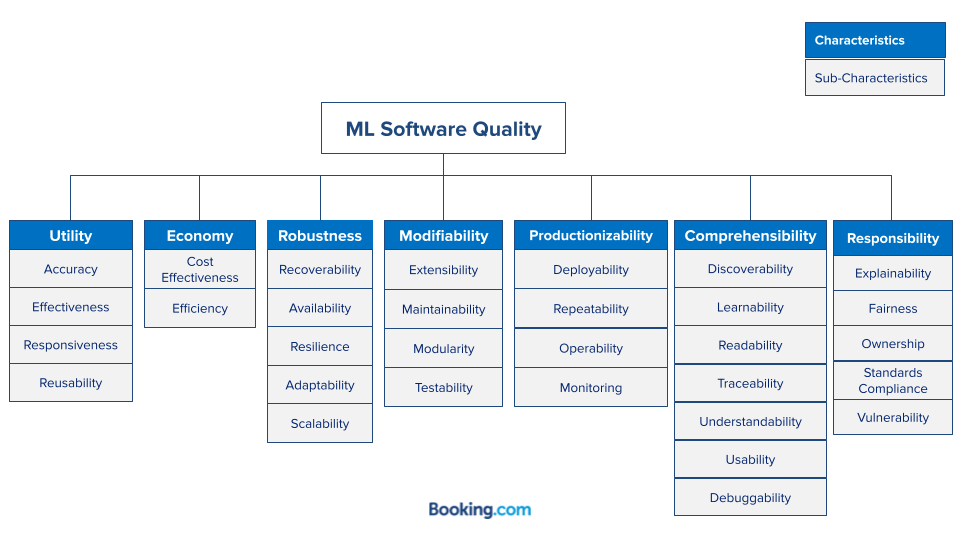

## Table of Contents

## What is an Image Quality Model in the context of machine learning?

An Image Quality Model in machine learning is a tool used to evaluate how good or bad an image is. This can be based on different things like how clear the image is, how much noise it has, or how well it can be used for a specific task. These models help in many areas, like making sure cameras take good pictures or helping computers understand images better.

There are different types of Image Quality Models. Some models need a perfect image to compare with, while others can judge the quality of an image all by themselves. For example, a model might look at how blurry an image is or how much it has been compressed. These models use math to turn what they see in the image into a number that tells us about its quality. This number can help decide if an image is good enough for what we need it for.

## How do Image Quality Models like DKL and MUSIQ work?

DKL, or Deep Kernel Learning, is a type of Image Quality Model that uses a mix of deep learning and traditional machine learning methods. It works by first using a deep neural network to turn the image into a simpler form that a computer can understand better. Then, it uses a special math trick called a kernel to look at the differences between this simpler form and a perfect image. This helps DKL figure out how good the image is. The math behind it can be shown as $$DKL(I, I_{ref}) = \int p(I) \log \frac{p(I)}{q(I|I_{ref})} dI$$, where $$I$$ is the image, $$I_{ref}$$ is the reference image, $$p(I)$$ is the probability of the image, and $$q(I|I_{ref})$$ is the conditional probability of the image given the reference.

MUSIQ, or Multi-Scale Image Quality Transformer, is another Image Quality Model that uses a different approach. It looks at the image in different sizes, from very small to very big, to understand it better. MUSIQ uses a special kind of [neural network](/wiki/neural-network) called a transformer, which is good at understanding the relationships between different parts of the image. By looking at the image at different scales, MUSIQ can figure out if the image is good or not. This model doesn't need a perfect image to compare with; it can judge the quality of an image all by itself.

## What are the primary applications of Image Quality Models?

Image Quality Models are used in many areas where it's important to know how good an image is. One big use is in photography and camera technology. These models help camera makers make sure their cameras take clear, sharp pictures. They can also help fix problems like blur or noise in photos. For example, if a camera takes a blurry picture, an Image Quality Model can tell how bad the blur is and help fix it.

Another important use is in computer vision and [machine learning](/wiki/machine-learning). When computers need to understand images, like in self-driving cars or medical imaging, they need the images to be good quality. Image Quality Models help make sure the images are clear enough for the computer to use. This can make the computer's job easier and more accurate. For example, in a self-driving car, the model can check if the camera's view is clear enough to safely navigate the road.

Image Quality Models are also used in image compression and transmission. When images are sent over the internet or stored on a computer, they often need to be made smaller. This can make the image quality worse. Image Quality Models can help find the best way to compress the image so it stays as clear as possible. This is important for things like video calls or streaming movies, where you want the picture to look good even after it's been compressed.

## What is the difference between subjective and objective Image Quality Assessment?

Subjective Image Quality Assessment involves people looking at images and saying how good they think the images are. This can be different from person to person because everyone has their own opinion. For example, one person might think a slightly blurry photo is still good, while another person might think it's bad. To do this kind of assessment, a group of people look at the same images and rate them. The final score is usually an average of all the ratings. This method can be very accurate because it uses human judgment, but it takes a lot of time and can be expensive.

Objective Image Quality Assessment, on the other hand, uses math and computer programs to judge how good an image is. These programs look at things like how blurry the image is, how much noise it has, or how well it matches a perfect image. For example, a program might use a formula like $$PSNR = 10 \cdot \log_{10} \left( \frac{MAX_I^2}{MSE} \right)$$ to measure the Peak Signal-to-Noise Ratio (PSNR), where $$MAX_I$$ is the maximum possible pixel value of the image and $$MSE$$ is the Mean Squared Error. This method is faster and cheaper than asking people, but it might not always match what a human would think about the image's quality.

## How is the DKL model trained and what datasets are commonly used?

The DKL model is trained by using a mix of [deep learning](/wiki/deep-learning) and traditional machine learning methods. It starts with a deep neural network that turns images into simpler forms that a computer can understand better. Then, it uses a special math trick called a kernel to compare these simpler forms with perfect images. During training, the model looks at many images and their quality scores. It tries to guess the scores and gets better over time by adjusting its guesses to be closer to the real scores. The math behind this training can be shown as $$DKL(I, I_{ref}) = \int p(I) \log \frac{p(I)}{q(I|I_{ref})} dI$$, where $$I$$ is the image, $$I_{ref}$$ is the reference image, $$p(I)$$ is the probability of the image, and $$q(I|I_{ref})$$ is the conditional probability of the image given the reference. This helps the model learn how to tell the difference between good and bad images.

Common datasets used to train the DKL model include the LIVE Image Quality Assessment Database and the TID2013 dataset. The LIVE database has a lot of images that have been changed to have different kinds of problems, like blur or noise, and each image has a score from people saying how good the image is. The TID2013 dataset is similar but has even more types of problems and more images. These datasets are important because they give the DKL model a lot of different examples to learn from, helping it understand what makes an image good or bad.

## What metrics are used to evaluate the performance of Image Quality Models?

To evaluate how well Image Quality Models work, people use different ways to measure their performance. One common way is to use the Mean Squared Error (MSE). This measures how far off the model's guesses are from the real quality scores. The formula for MSE is $$MSE = \frac{1}{n} \sum_{i=1}^{n} (y_i - \hat{y}_i)^2$$, where $$y_i$$ is the real score and $$\hat{y}_i$$ is the model's guess. Another popular metric is the Peak Signal-to-Noise Ratio (PSNR), which is related to MSE but gives a score in decibels. PSNR is calculated as $$PSNR = 10 \cdot \log_{10} \left( \frac{MAX_I^2}{MSE} \right)$$, where $$MAX_I$$ is the highest possible pixel value of the image. These metrics help see how close the model's guesses are to what people think about the image quality.

Another important metric is the Structural Similarity Index (SSIM), which looks at how similar two images are in terms of things like brightness, contrast, and structure. The formula for SSIM is $$SSIM(x, y) = \frac{(2\mu_x\mu_y + c_1)(2\sigma_{xy} + c_2)}{(\mu_x^2 + \mu_y^2 + c_1)(\sigma_x^2 + \sigma_y^2 + c_2)}$$, where $$\mu_x$$ and $$\mu_y$$ are the average pixel values of the two images, $$\sigma_x^2$$ and $$\sigma_y^2$$ are the variances, $$\sigma_{xy}$$ is the covariance, and $$c_1$$ and $$c_2$$ are small constants to avoid division by zero. SSIM is good because it tries to match how people see images, not just numbers. There's also the Spearman's Rank Correlation Coefficient (SRCC), which measures how well the model's guesses match the order of the real quality scores. SRCC is useful because it shows if the model can tell which images are better or worse, even if it doesn't guess the exact scores right.

## How does MUSIQ improve upon traditional Image Quality Models?

MUSIQ, or Multi-Scale Image Quality Transformer, improves on traditional Image Quality Models by looking at images in different sizes, from very small to very big. This helps MUSIQ understand the image better because it can see both the big picture and the small details. Traditional models might only look at the image in one size, which can miss important information. MUSIQ uses a special kind of neural network called a transformer, which is good at understanding how different parts of the image relate to each other. This makes MUSIQ better at figuring out if an image is good or not, even without comparing it to a perfect image.

Another way MUSIQ improves on traditional models is that it doesn't need a perfect image to compare with. Traditional models often need a reference image to judge the quality of another image. This can be a problem if you don't have a perfect image to use. MUSIQ can judge the quality of an image all by itself, which makes it more useful in real-life situations where you might not have a perfect image to compare with. By using these new ways of looking at images, MUSIQ can give more accurate and helpful quality scores than many traditional Image Quality Models.

## Can you explain the architecture of the MUSIQ model?

The MUSIQ model uses a special way to look at images to figure out their quality. It starts by taking the image and making different size versions of it, from very small to very big. This is called multi-scale processing. Each of these different size images goes through a part of the model called a feature extractor. This part uses a neural network to turn the image into numbers that the computer can understand better. These numbers are then put into another part of the model called a transformer. The transformer is good at understanding how the different parts of the image are related to each other. It looks at the numbers from all the different size images and combines them to get a better idea of the whole image.

After the transformer looks at all the numbers from the different size images, it sends them to the last part of the model, which is called the quality predictor. This part uses the numbers to guess how good the image is. It does this by using a simple math formula to turn the numbers into a score. The score tells us about the image's quality. Because MUSIQ looks at the image in different sizes and uses a transformer to understand how everything fits together, it can give a more accurate score than many other models.

## What are the challenges faced when deploying Image Quality Models in real-world scenarios?

Deploying Image Quality Models in real-world scenarios can be tricky because of many reasons. One big challenge is that these models need a lot of computer power to work well. They often use big neural networks that need strong computers to run fast. In places like phones or small devices, it can be hard to make the models work quickly enough. Another problem is that the models need to be trained on a lot of different images to understand what good quality means. If the images used for training are not like the ones seen in real life, the model might not work well. This is called the problem of generalization. For example, if a model is trained only on clear, daytime photos, it might not do well with blurry or nighttime photos.

Another challenge is that the quality of an image can mean different things to different people. What one person thinks is a good photo might not be the same for someone else. This makes it hard to make a model that works well for everyone. Also, the models need to be updated often because new types of images and new ways of taking photos keep coming out. If the model doesn't get updated, it might not be able to judge the quality of these new images correctly. Keeping the model up to date can take a lot of work and money.

## How do advanced techniques like transfer learning affect the development of Image Quality Models?

Transfer learning helps make Image Quality Models better and easier to build. Instead of starting from scratch, transfer learning lets us use a model that's already been trained on a lot of images. This saves time and computer power because we don't have to train the whole model again. For example, we can take a model that's good at recognizing objects in photos and change it a little to judge the quality of images. This way, the model already knows a lot about images and just needs to learn what makes an image good or bad. Transfer learning can make the model work better, especially if we don't have a lot of new images to train it with.

One challenge with transfer learning is making sure the new model still works well for judging image quality. Sometimes, the model might remember too much about the old task and not focus enough on the new one. This is called overfitting to the original task. To fix this, we can use techniques like fine-tuning, where we only change a small part of the model to make it better at the new job. Another way is to use a method called domain adaptation, which helps the model understand the new types of images it will see. By using transfer learning carefully, we can make Image Quality Models that are both fast to build and good at their job.

## What future developments can we expect in the field of Image Quality Models?

In the future, Image Quality Models will likely become even better at understanding what makes an image good or bad. One big change we might see is the use of even more advanced neural networks. These networks could look at images in new ways, like understanding how people feel about the images or how the images change over time. For example, a model might learn to tell if a photo looks happy or sad, which can be important for things like social media or advertising. Also, with more powerful computers, these models could work faster and on smaller devices like phones. This would make it easier for more people to use them in everyday life.

Another thing that might happen is the use of more types of data to train these models. Right now, models mostly look at still images, but in the future, they could also use videos or even 3D images. This would help the models understand more about what makes an image or a video good. Also, as more people use these models, we might see new ways to make them work better for everyone. For example, models could be made to understand different cultures or personal tastes better. This would make them more useful for things like photo editing apps or quality control in manufacturing.

## How can Image Quality Models be integrated with other AI systems to enhance overall performance?

Image Quality Models can be integrated with other AI systems to make them work better. For example, in computer vision systems, Image Quality Models can help by checking if the images are good enough before the system tries to understand them. If an image is too blurry or has too much noise, the model can tell the system to fix it first or ask for a better image. This can make the computer vision system more accurate because it will only work with good images. Another way to use Image Quality Models is in AI systems that make images, like those used in photo editing or creating art. The model can check the quality of the images as they are being made, helping the system make better and clearer images.

Another important use is in AI systems that help with medical imaging. Image Quality Models can check the quality of X-rays or MRIs to make sure they are clear enough for doctors to see. If the images are not good enough, the model can tell the system to fix them or take new ones. This can help doctors make better decisions and improve patient care. Also, in AI systems for video streaming, Image Quality Models can check the quality of the video in real-time. If the quality drops, the model can help the system adjust to make the video clearer for viewers. By working together with other AI systems, Image Quality Models can help make them more useful and effective.

## References & Further Reading

[1]: Zhang, L., Zhang, L., Mou, X., & Zhang, D. (2011). ["FSIM: A Feature Similarity Index for Image Quality Assessment."](https://pubmed.ncbi.nlm.nih.gov/21292594/) IEEE Transactions on Image Processing, 20(8), 2378-2386.

[2]: Mittal, A., Soundararajan, R., & Bovik, A. C. (2012). ["Making a 'Completely Blind' Image Quality Analyzer."](https://ieeexplore.ieee.org/document/6353522) Signal Processing Letters, IEEE, 20(3), 209-212.

[3]: Lin, H., Tseng, K.-T., & Jiang, Q. (2020). ["The Design and Validation of a Deep Learning-Based Image Quality Assessment System for Diabetic Retinopathy Images."](https://www.sciopen.com/article/10.1016/j.cj.2025.01.018?issn=2095-5421) Journal of Medical Internet Research, 22(4), e17981.

[4]: Wang, Z., Bovik, A. C., Sheikh, H. R., & Simoncelli, E. P. (2004). ["Image Quality Assessment: From Error Visibility to Structural Similarity."](https://ieeexplore.ieee.org/document/1284395) IEEE Transactions on Image Processing, 13(4), 600-612.

[5]: Sheikh, H. R., & Bovik, A. C. (2006). ["Image Information and Visual Quality."](https://ieeexplore.ieee.org/abstract/document/1576816) IEEE Transactions on Image Processing, 15(2), 430-444.