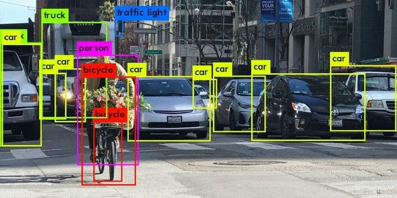

## Table of Contents

## What is image recognition in the context of machine learning?

Image recognition in machine learning is a technology that allows computers to identify and categorize objects or patterns within digital images. It works by using algorithms to analyze the pixels in an image and compare them to known patterns or objects that the system has been trained on. This process is similar to how humans recognize objects by looking at their shapes, colors, and other visual features.

The most common approach to image recognition is through the use of convolutional neural networks (CNNs), a type of deep learning algorithm. These networks are designed to mimic the way the human visual cortex processes visual information. By training a CNN on a large dataset of labeled images, the system can learn to recognize specific objects or features within new images it encounters. This makes image recognition useful in many applications, such as facial recognition, medical image analysis, and autonomous driving systems.

## How does image recognition differ from traditional computer vision techniques?

Image recognition and traditional computer vision techniques both aim to understand and interpret visual information, but they do so in different ways. Traditional computer vision often relies on hand-crafted algorithms and feature extraction methods. For example, to recognize an object, these methods might look for specific edges, corners, or textures within an image. These features are then compared against a database of known objects to identify what is in the image. This approach requires a lot of manual work to design the algorithms and can be less effective when dealing with complex scenes or variations in lighting and angles.

On the other hand, image recognition, especially with the use of deep learning and convolutional neural networks (CNNs), takes a more automated and data-driven approach. Instead of manually defining what features to look for, a CNN learns these features directly from the data it is trained on. This means that as long as you have a large enough dataset of labeled images, the system can learn to recognize a wide variety of objects and patterns without needing to be told exactly what to look for. This makes image recognition more flexible and capable of handling real-world variability, leading to better performance in many applications.

In summary, while traditional computer vision techniques are more rule-based and require specific feature engineering, image recognition with [deep learning](/wiki/deep-learning) is more adaptive and learns from the data itself. This difference makes image recognition particularly powerful in today's world, where large datasets and computational power are more readily available.

## What are the basic steps involved in an image recognition process?

The first step in image recognition is to collect and prepare a dataset of images. These images need to be labeled with the correct categories or objects they contain. This dataset is then split into a training set and a test set. The training set is used to teach the computer what to look for, while the test set is used to check how well the computer has learned. Once the dataset is ready, the next step is to preprocess the images. This can involve resizing the images to a standard size, normalizing the pixel values, and possibly applying other transformations to make the images easier for the computer to analyze.

After preprocessing, the images are fed into a [machine learning](/wiki/machine-learning) model, often a [convolutional [neural network](/wiki/neural-network)](/wiki/convolutional-neural-network) (CNN). The CNN works by passing the image through several layers, each of which extracts different features from the image. Early layers might detect simple features like edges and colors, while deeper layers can recognize more complex patterns like shapes or even entire objects. The model learns by adjusting its internal parameters to better match the labeled data it is trained on. This process, called training, continues until the model's performance on the training set stops improving.

Once the model is trained, it can be used to recognize objects in new images. The new image goes through the same preprocessing steps and is then passed through the trained CNN. The model outputs a prediction about what objects are in the image, often along with a confidence score for each prediction. The final step is to evaluate the model's performance using the test set. If the model performs well, it can be deployed for use in real-world applications. If not, the model might need to be retrained with more data or different settings.

## Which common algorithms are used for image recognition?

The most common algorithm used for image recognition is the Convolutional Neural Network (CNN). CNNs are a type of deep learning model that are really good at understanding images. They work by passing the image through different layers. Each layer looks for different things in the image, like edges, colors, and shapes. As the image goes through more layers, the CNN can start to recognize more complex things, like whole objects. A popular CNN architecture is the LeNet-5, which was one of the first successful CNNs used for recognizing handwritten digits.

Another common algorithm is the Support Vector Machine (SVM). SVMs are not as good at understanding images on their own as CNNs, but they can be used along with other methods to help with image recognition. For example, you can use other algorithms to find important features in an image, and then use an SVM to classify the image based on those features. SVMs work by finding the best way to separate different categories of data, which can be useful for telling different objects apart in an image.

There are also other algorithms like k-Nearest Neighbors (k-NN) and Random Forests that can be used for image recognition. k-NN works by looking at the features of an image and comparing them to the features of other images to see which ones are most similar. If most of the similar images belong to one category, then the new image is likely to belong to that category too. Random Forests are made up of many decision trees, and they work by having each tree vote on what category an image belongs to. The category with the most votes wins. These algorithms can be less accurate than CNNs for complex image recognition tasks, but they can still be useful in certain situations.

## What is the role of convolutional neural networks (CNNs) in image recognition?

Convolutional Neural Networks (CNNs) play a crucial role in image recognition because they are designed to understand images in a way that's similar to how humans do. A CNN works by looking at small parts of an image, called pixels, and figuring out what they mean. It does this by passing the image through several layers. Each layer looks for different things, like edges, colors, or shapes. As the image goes through more layers, the CNN can start to recognize more complex things, like whole objects. This makes CNNs really good at recognizing objects in pictures, even if the objects are in different positions or lighting.

The way CNNs work is by using something called convolution. This is a math operation that helps the network find patterns in the image. Imagine sliding a small window over the image and doing a calculation at each spot. This helps the network understand the image better. After convolution, the network might use something called pooling to make the image smaller and easier to work with. Finally, the network uses fully connected layers to make a final guess about what's in the image. All these steps together make CNNs powerful tools for image recognition, used in everything from identifying faces to helping cars drive themselves.

## How do you prepare and preprocess images for recognition tasks?

To prepare and preprocess images for recognition tasks, the first step is to collect a dataset of images that are relevant to what you want the computer to recognize. These images need to be labeled correctly, so the computer knows what it's looking at. Once you have the images, you split them into a training set, which you'll use to teach the computer, and a test set, which you'll use to check how well the computer learned. After that, you need to make sure all the images are in a format the computer can understand. This often means resizing the images to the same size, so the computer can process them more easily. You might also need to change the images to have the same number of color channels, usually three for red, green, and blue.

Next, you preprocess the images to make them easier for the computer to analyze. One common step is to normalize the pixel values, which means adjusting them so they all fall within a certain range, usually between 0 and 1. This helps the computer compare different images more accurately. You might also apply [data augmentation](/wiki/data-augmentation) techniques, like rotating or flipping the images, to create more training data and make the computer better at recognizing objects in different positions. All these steps help the computer understand the images better and improve its ability to recognize objects accurately.

## What are some popular datasets used for training image recognition models?

One of the most popular datasets for training image recognition models is the ImageNet dataset. ImageNet contains millions of images, each labeled with what they show. It's used a lot because it has so many different types of objects, which helps computers learn to recognize a wide variety of things. Another commonly used dataset is the CIFAR-10 and CIFAR-100 datasets. These are smaller than ImageNet but still useful. CIFAR-10 has 60,000 images divided into 10 categories, like airplanes and dogs, while CIFAR-100 has the same number of images but spread across 100 categories. These datasets are great for testing new image recognition ideas because they're smaller and easier to work with.

The MNIST dataset is also very popular, especially for beginners. It has images of handwritten digits from 0 to 9. There are 60,000 images for training and 10,000 for testing. This dataset is often used to teach the basics of image recognition because it's simple but still challenging. Another dataset worth mentioning is the COCO (Common Objects in Context) dataset. COCO has a lot of images with objects in everyday scenes, and it's labeled not just with what's in the image but also where the objects are. This makes it useful for tasks like object detection, where the computer needs to find and outline objects in an image.

## How can you evaluate the performance of an image recognition model?

To evaluate the performance of an image recognition model, you use a test set of images that the model hasn't seen before. You run these images through the model and see how well it can recognize the objects in them. One common way to measure performance is by looking at the accuracy, which is the percentage of images the model gets right. For example, if the model correctly identifies 90 out of 100 images, its accuracy is 90%. Another important measure is the confusion matrix, which shows how often the model confuses one object for another. This helps you understand where the model is making mistakes.

Besides accuracy, you can also use other metrics like precision and recall. Precision tells you how many of the objects the model said were in the images actually were there. Recall tells you how many of the actual objects in the images the model was able to find. These metrics are especially useful when you're dealing with imbalanced datasets, where some objects appear more often than others. By looking at all these measures together, you can get a good idea of how well your image recognition model is working and where it might need improvement.

## What are the challenges faced in real-world image recognition applications?

One of the biggest challenges in real-world image recognition applications is dealing with variability. Images taken in the real world can look very different from the ones used to train the model. For example, the lighting might be different, the objects might be at different angles, or there might be other things in the background that make it hard to see the main object. This means the model needs to be really good at recognizing objects no matter how they appear. Another challenge is having enough good data to train the model. Collecting and labeling a large dataset of images can be time-consuming and expensive, but it's important for the model to learn well.

Another challenge is making sure the model works quickly and efficiently. In many real-world applications, like self-driving cars or security systems, the model needs to recognize objects in real-time. This means it has to process images very fast, which can be hard if the model is too complex. Also, the model needs to be able to handle new types of objects it hasn't seen before. If the model only knows how to recognize a limited set of objects, it might not be very useful in situations where new objects show up. These challenges make it important to keep improving image recognition technology to make it more reliable and useful in the real world.

## How can transfer learning be applied to improve image recognition models?

Transfer learning is a way to make image recognition models better by using what they already know from one task to help with another task. Imagine you taught a model to recognize cats and dogs. Now, you want it to recognize different types of birds. Instead of starting from scratch, you can take the part of the model that learned about general things like edges and shapes from the cat and dog images, and use that as a starting point for recognizing birds. This saves time and can make the model better at recognizing birds because it already knows some basics about images.

To use transfer learning, you start with a pre-trained model, which means a model that has already been taught on a big dataset like ImageNet. You take this model and remove the last few layers that were used for the original task. Then, you add new layers and train these new layers on your specific task, like recognizing birds. This way, the model can use what it learned from the big dataset to help it learn the new task faster and better. Transfer learning is really helpful because it lets you use less data and less time to train a good model for your specific needs.

## What are the latest advancements in image recognition technology?

One of the latest advancements in image recognition technology is the development of more efficient and accurate models. Researchers have been working on improving convolutional neural networks (CNNs) by making them deeper and more complex, which allows them to recognize objects with greater precision. A notable example is the introduction of architectures like EfficientNet, which balances model size and performance, making it possible to achieve high accuracy with fewer computational resources. Another exciting development is the use of attention mechanisms, which help models focus on the most important parts of an image, similar to how humans pay attention to specific details. This has led to significant improvements in tasks like object detection and segmentation.

Another advancement is the integration of image recognition with other technologies, such as natural language processing (NLP). This has given rise to vision-language models like CLIP (Contrastive Language–Image Pretraining), which can understand and describe images using text. These models are trained on vast amounts of image-text pairs, allowing them to link visual content with descriptive language. This not only improves the accuracy of image recognition but also makes it possible to use image recognition in more interactive and versatile applications, such as automated image captioning and visual question answering. As these technologies continue to evolve, image recognition is becoming more powerful and accessible, opening up new possibilities for its use in everyday life.

## How do ethical considerations and biases affect image recognition systems?

Ethical considerations and biases can have a big impact on image recognition systems. One of the main problems is that these systems can be biased if they are trained on data that doesn't represent everyone equally. For example, if a system is trained mostly on images of people with lighter skin, it might not recognize people with darker skin as well. This can lead to unfair treatment and discrimination, especially in applications like facial recognition used for security or hiring. It's important for people who make these systems to use diverse datasets and check for biases to make sure the systems treat everyone fairly.

Another ethical issue is privacy. Image recognition systems, especially those used in public places like stores or streets, can collect a lot of personal information without people knowing or agreeing. This raises concerns about how this data is used and who can see it. There's also the risk that these systems might be used to watch people too closely or in ways that invade their privacy. To deal with these issues, it's important to have clear rules about how image recognition systems are used and to make sure people know when they are being watched or recorded. By thinking about these ethical problems and working to fix them, we can make image recognition technology better and more fair for everyone.