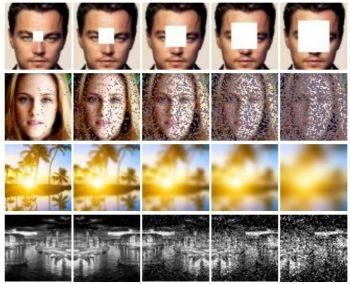

## Table of Contents

## What is image restoration in the context of machine learning?

Image restoration in machine learning is about fixing damaged or degraded images to make them look better. Imagine you have an old photo that's blurry or has scratches on it. Image restoration uses special computer programs to clean up these problems and make the photo look clearer and nicer. These programs use machine learning, which means they learn from lots of examples to figure out how to fix images. They can remove noise, fix blurriness, and even fill in missing parts of an image.

The process usually involves feeding the damaged image into a machine learning model, like a neural network. This model has been trained on many other images to recognize what a good, clear image should look like. It then applies what it has learned to the damaged image, making adjustments to improve its quality. For example, if the image is blurry, the model might sharpen it; if there are scratches, it might smooth them out. The goal is to make the restored image as close as possible to the original, undamaged version.

In practice, image restoration can be very useful in many areas. For instance, in medical imaging, it can help doctors see clearer pictures of a patient's insides, which can lead to better diagnoses. In the world of old photographs, it can help restore family memories that might otherwise be lost. By using machine learning, image restoration becomes more accurate and efficient, making it a powerful tool for improving the quality of visual information.

## Why is image restoration important and where is it commonly applied?

Image restoration is important because it helps us fix and improve pictures that are damaged or not clear. When photos get old, they can get scratches, become blurry, or have other problems. By using image restoration, we can make these photos look good again. This is really helpful because it lets us keep our memories and important information. For example, if you have an old family photo that's faded, image restoration can bring back the colors and details, making it look almost new.

Image restoration is used in many different places. In hospitals, doctors use it to make medical images clearer. This can help them see inside the body better and make better decisions about how to help their patients. In the movie industry, old films can be restored to look like they did when they were first made. This helps keep the history of movies alive. Also, in the field of art, old paintings and photographs can be restored to show their original beauty. By using image restoration, we can keep and enjoy important visual information from the past.

## What are some common types of image degradation that restoration models address?

Image restoration models often fix problems like blurriness, noise, and scratches. Blurriness happens when the camera moves or the image is out of focus. Noise makes the picture look grainy or speckled, and it can come from low light or old film. Scratches are physical marks on the image, usually on old photos or film.

Another common issue is color fading, where the colors in a photo become less bright over time. This can happen because of age or being exposed to light. Restoration models can bring back the original colors and make the image look new again. They can also fix missing parts of an image, like if a piece of the photo is torn off, by filling in what should be there based on the rest of the picture.

These problems can make it hard to see what's in the image or enjoy it fully. By using [machine learning](/wiki/machine-learning), restoration models learn how to fix these issues and make the image look as good as possible. This helps us keep our memories and important information clear and beautiful.

## Can you explain the basic architecture of a typical image restoration model?

A typical image restoration model uses a type of artificial [neural network](/wiki/neural-network) called a [convolutional neural network](/wiki/convolutional-neural-network) (CNN). The basic idea is to take a damaged image as input and process it through several layers to produce a restored image as output. The CNN has layers that can recognize different parts of the image, like edges and textures, and these layers work together to figure out how to fix the image. For example, if the image is blurry, the network can learn to sharpen it by adjusting the pixels in a way that makes the image clearer.

The architecture of a CNN for image restoration usually includes an encoder and a decoder. The encoder part of the network takes the damaged image and breaks it down into simpler parts, kind of like taking apart a puzzle. It does this by using convolutional layers that look at small parts of the image and learn important features. The decoder then takes these simpler parts and puts them back together to create a restored image. It uses layers that can expand the image and fill in details, making sure the final image looks as good as possible. By training the network on many examples of damaged and restored images, it learns how to fix different types of problems and make the images look better.

## What is NAFNet and how does it approach image restoration?

NAFNet, which stands for Nonlinear Activation-Free Network, is a special type of neural network designed for image restoration. It's unique because it doesn't use the usual activation functions, like ReLU, that other networks use. Instead, it uses something called a simple gating mechanism to control how information flows through the network. This makes NAFNet faster and more efficient because it has fewer steps to process the image. It's like having a streamlined process to fix the image without needing extra tools.

NAFNet approaches image restoration by focusing on making the process simpler and more effective. It uses layers that can learn to fix different types of image problems, like blurriness or noise, without making the network too complicated. By not using activation functions, NAFNet can work faster and still do a good job at restoring images. This is important because it means you can fix images quickly and still get good results, which is helpful in many situations, like restoring old photos or medical images.

## How does the TLC model differ from other image restoration techniques?

The TLC model, or Transfer Learning-based Convolutional model, stands out from other image restoration techniques because it uses a special way of learning. Instead of starting from scratch, the TLC model takes a pre-trained network and fine-tunes it for image restoration. This means it uses what it already knows from other tasks to help fix images faster and better. Other techniques might build a whole new model just for restoration, but the TLC model is smarter because it reuses knowledge.

Another difference is that the TLC model focuses on using less data to get good results. While some methods need a lot of damaged and restored image pairs to train, the TLC model can work well with fewer examples. This makes it easier and quicker to train, which is helpful when you don't have a huge collection of images to use. By smartly using what it already knows and needing less data, the TLC model makes image restoration more efficient and effective.

## What are the key features of the MPRNet model for image restoration?

The MPRNet, or Multi-Stage Progressive Restoration Network, is designed to fix images in a smart way. It uses several steps to restore the image, starting with big problems like blurriness and then moving to smaller details like noise. This step-by-step approach helps the model do a better job because it can focus on one type of problem at a time. MPRNet also uses something called a feature pyramid, which helps it understand the image at different levels of detail. By looking at the image in this way, the model can make sure it fixes all parts of the image well.

Another cool thing about MPRNet is that it uses a special kind of attention mechanism. This helps the model pay more attention to the parts of the image that need fixing the most. For example, if there's a big scratch on the photo, the model will focus on that area to make it look better. By using this attention, MPRNet can make sure the restored image looks as good as possible. Overall, MPRNet is really good at fixing images because it breaks the problem into smaller steps and pays close attention to what needs to be fixed.

## Can you describe the Conffusion model and its unique contributions to image restoration?

The Conffusion model is a special way to fix images that uses something called confidence maps. These maps help the model figure out which parts of the image need the most help. Imagine you have a photo with some blurry spots and some clear spots. The Conffusion model looks at the whole picture and decides where to focus its efforts. By using these confidence maps, the model can make the blurry parts clearer without messing up the parts that are already good. This makes the restored image look better because the model knows exactly where to fix things.

One unique thing about the Conffusion model is how it combines different types of information to restore the image. It uses what it knows about the image's overall look and the specific details it needs to fix. This combination helps the model do a better job at making the image look right. For example, if there's a scratch on a photo, the model can use the confidence map to focus on that scratch and fix it while keeping the rest of the photo looking good. By paying attention to both the big picture and the small details, the Conffusion model makes image restoration more effective and accurate.

## How do these models (NAFNet, TLC, MPRNet, Conffusion) compare in terms of performance and efficiency?

NAFNet, TLC, MPRNet, and Conffusion each have their own strengths when it comes to fixing images. NAFNet is really fast and efficient because it doesn't use the usual activation functions. Instead, it uses a simple gating mechanism, which makes it quicker to process images. This is great if you need to restore a lot of images quickly. TLC, on the other hand, is good at using less data to get good results. It starts with a pre-trained network and fine-tunes it for image restoration, which means it can learn faster and work well even if you don't have a huge collection of images. MPRNet takes a step-by-step approach, fixing big problems first and then moving to smaller details. This makes it really good at making sure all parts of the image are fixed well. Conffusion uses confidence maps to focus on the parts of the image that need the most help, which can lead to more accurate restorations.

When it comes to performance, each model has its own way of doing things. NAFNet's speed and efficiency make it a top choice for quick restorations, but it might not be as good at handling very complex image problems as some other models. TLC's ability to work with less data is a big plus, but it might not be as fast as NAFNet. MPRNet's multi-stage approach can lead to very high-quality restorations, but it might take a bit longer to process each image. Conffusion's use of confidence maps can make it very accurate, especially for images with specific problems like scratches, but it might not be as fast as NAFNet. Overall, the best model for you depends on what you need - speed, data efficiency, detailed restoration, or accuracy in fixing specific issues.

## What are the current challenges and limitations faced by image restoration models?

Image restoration models face several challenges and limitations. One big challenge is dealing with very complex images. Sometimes, an image might have a lot of different problems, like blurriness, noise, and scratches all at once. It can be hard for a model to fix all these issues perfectly, especially if the problems are really bad. Another challenge is the need for a lot of data. To train a good model, you need many examples of damaged and restored images. If you don't have enough data, the model might not learn well and won't be able to fix images as well as it could. This is a problem because collecting and labeling all that data can take a lot of time and money.

Another limitation is that image restoration models can sometimes make mistakes. For example, when a model tries to fill in missing parts of an image, it might guess wrong and add things that weren't there before. This can make the restored image look strange or different from the original. Also, models can be slow to process images, especially if they are very detailed or if the model is trying to fix a lot of problems at once. Speed is important because people often need quick results, especially in places like hospitals where doctors need clear images fast to help their patients. Overall, while image restoration models have come a long way, there is still work to be done to make them faster, more accurate, and better at handling all kinds of image problems.

## What advancements in deep learning are influencing the development of new image restoration techniques?

Advancements in [deep learning](/wiki/deep-learning) are pushing the boundaries of image restoration techniques. One big change is the use of generative models like GANs (Generative Adversarial Networks). These models can create new parts of an image that are missing or damaged. They do this by learning what a good image should look like and then trying to make the damaged image look more like that. This is really helpful for fixing old photos or medical images where parts might be missing. Another important advancement is the use of attention mechanisms. These help the model focus on the parts of the image that need fixing the most. For example, if there's a big scratch on a photo, the model can pay more attention to that area and make it look better.

Another exciting development is the use of transformers in image restoration. Transformers were first used in language processing, but now they're being used for images too. They can look at the whole image at once and understand how different parts relate to each other. This helps the model fix problems in a way that makes the whole image look better, not just the damaged parts. Also, techniques like transfer learning are making it easier to train models. Instead of starting from scratch, a model can use what it already knows from other tasks to help with image restoration. This makes training faster and can lead to better results, even with less data. These advancements are helping to make image restoration models more accurate, efficient, and able to handle all kinds of image problems.

## How can someone interested in image restoration start implementing and experimenting with these models?

If you're interested in image restoration and want to start experimenting with models like NAFNet, TLC, MPRNet, or Conffusion, you'll need to get familiar with deep learning frameworks like TensorFlow or PyTorch. These tools help you build, train, and test your models. Start by setting up your development environment. You can do this by installing Python and then using a package manager like pip to install the deep learning framework of your choice. For example, you might run ```pip install [tensorflow](/wiki/tensorflow)``` or ```pip install torch``` to get started. Once your environment is set up, you can find open-source implementations of these models on platforms like GitHub. Download the code, read the documentation, and try running the models on sample images to see how they work.

Next, you'll want to experiment with the models. Start by understanding the basic architecture of the model you're interested in. For instance, if you're looking at NAFNet, learn about its use of simple gating mechanisms instead of activation functions. You can then tweak the model's parameters or even the architecture itself to see how it affects the restoration results. Use datasets like the DIV2K or Flickr2K, which are commonly used for training image restoration models, to train and test your modifications. As you experiment, keep track of the performance metrics like PSNR (Peak Signal-to-Noise Ratio) and SSIM (Structural Similarity Index) to measure how well your model is doing. Over time, you'll gain a deeper understanding of image restoration and be able to contribute your own improvements to the field.