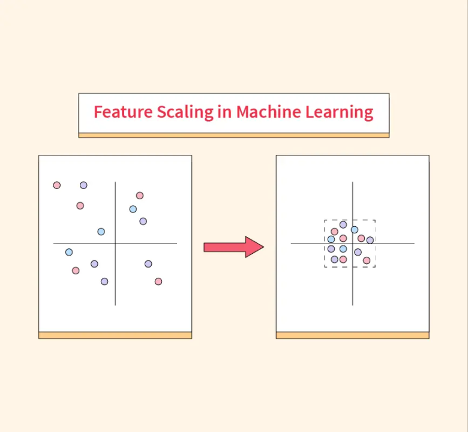

## Table of Contents

## What is image scaling in the context of machine learning?

Image scaling in machine learning is the process of changing the size of an image. This is often done to make the image fit into a model that expects a certain input size. For example, if a machine learning model is designed to work with images that are 224x224 pixels, any image that is larger or smaller needs to be scaled to match this size. Scaling can be done in different ways, such as making the image smaller (downscaling) or larger (upscaling).

One common method of scaling is called bilinear interpolation. This method calculates the values of new pixels based on the values of nearby pixels in the original image. This helps to create a smoother-looking image after scaling. Another method is nearest-neighbor interpolation, which simply copies the value of the nearest pixel in the original image to the new pixel. Each method has its own advantages and can affect how well the machine learning model performs with the scaled images.

## Why is image scaling important for training machine learning models?

Image scaling is important for training machine learning models because it helps make sure all the images used in training are the same size. Many machine learning models, especially those used for image recognition, need all their input images to be the same size. This makes it easier for the model to learn from the images. If images were different sizes, the model might have a harder time figuring out what it's looking at. By scaling all the images to the same size, we can help the model learn more effectively.

Another reason image scaling is important is that it can affect how well the model performs. When images are scaled, the way they are scaled can change how clear or detailed they look. For example, if we use a method like bilinear interpolation to scale an image, it might look smoother and more detailed than if we used nearest-neighbor interpolation. This can make a big difference in how well the model can recognize things in the image. So, choosing the right scaling method can help improve the model's performance.

## What are the common challenges faced when scaling images for machine learning?

One common challenge when scaling images for machine learning is choosing the right scaling method. Different methods like bilinear interpolation and nearest-neighbor interpolation can affect how the image looks after scaling. Bilinear interpolation makes the image smoother but can be slower to compute. Nearest-neighbor interpolation is faster but can make the image look blocky or pixelated. Choosing the wrong method can lead to a loss of important details in the image, which can make it harder for the machine learning model to learn from the image.

Another challenge is deciding what size to scale the images to. Machine learning models often need all images to be the same size, but choosing the right size can be tricky. If the images are scaled down too much, important details might be lost. If they are scaled up too much, the model might take longer to train and could overfit to the larger images. Finding the right balance is important for making sure the model can learn effectively and perform well on new images.

Lastly, scaling images can also affect the aspect ratio of the images. If an image is not square, scaling it to a square size can distort the image. For example, if a rectangular image is scaled to fit a square, the image might look stretched or squeezed. This distortion can make it harder for the model to recognize objects in the image. To avoid this, sometimes images are cropped or padded to maintain their aspect ratio, but this can also lead to loss of information or the introduction of irrelevant data.

## What is FixRes and how does it differ from traditional image scaling methods?

FixRes is a method used to scale images for machine learning models. Unlike traditional methods that scale all images to the same fixed size, FixRes uses a different approach. It scales images to a range of sizes and then crops them to a fixed size, but it keeps the original aspect ratio of the images. This helps to keep important details in the images that might be lost with traditional scaling.

The main difference between FixRes and traditional scaling methods is how they handle the aspect ratio of images. Traditional methods often stretch or squeeze images to fit a fixed size, which can distort the images. FixRes, on the other hand, tries to keep the images as close to their original shape as possible. This can help machine learning models perform better because the images look more like they do in real life. By keeping the aspect ratio, FixRes can help models recognize objects more accurately.

## How does FixRes improve the performance of machine learning models?

FixRes helps machine learning models work better by keeping the shape of pictures as close to their original form as possible. When pictures are changed to fit a certain size, they can get stretched or squeezed, which makes them look different from real life. FixRes stops this from happening by scaling pictures to different sizes and then cutting them to a fixed size while keeping their original shape. This means the pictures look more like they do in the real world, which makes it easier for the model to recognize things in them.

By using FixRes, the model can see more details in the pictures that might get lost with other ways of changing picture sizes. This can make the model better at telling what is in the pictures. For example, if a picture of a cat is changed to fit a square, the cat might look stretched and hard to recognize. But with FixRes, the picture keeps its shape, so the model can see the cat clearly and learn from it better. This can lead to the model making fewer mistakes when it looks at new pictures.

## What are the steps to implement FixRes in a machine learning pipeline?

To implement FixRes in a machine learning pipeline, start by scaling the images to a range of sizes while keeping their original aspect ratios. This means you'll need to calculate the new sizes based on the original dimensions of each image. For example, if an image is originally 1000x800 pixels, you might scale it to sizes like 600x480, 800x640, or 1200x960 pixels. After scaling, you'll need to crop these scaled images to a fixed size that your machine learning model can use. This fixed size could be something like 224x224 pixels, which is common for many models. The key is to crop the image in a way that keeps the most important parts of the image, often the center.

Once you have your scaled and cropped images, you can feed them into your machine learning model for training or inference. During training, you might use different scaled versions of the same image in different epochs to help the model learn from various perspectives. This can improve the model's ability to recognize objects in different contexts. When using FixRes for inference, you'll apply the same scaling and cropping process to new images before passing them through the model. This way, the model sees images that are closer to their original shapes, which can lead to better performance and fewer mistakes in recognizing objects.

## Can FixRes be used with any type of neural network architecture?

FixRes can be used with many types of neural network architectures, like Convolutional Neural Networks (CNNs) and others that work with images. The main idea of FixRes is to keep the original shape of pictures as much as possible when changing their size. This helps the neural network see the pictures more like they are in real life, which can make it better at recognizing things. So, any neural network that needs to process images can use FixRes to help it work better.

However, it's important to think about how FixRes fits with the specific needs of your neural network. Some networks might need more changes to work well with FixRes. For example, if your network expects all pictures to be a certain size, you might need to adjust it to handle the different sizes that FixRes can produce. But overall, FixRes can be a helpful tool for many kinds of neural networks that work with images, making them more accurate and effective.

## How does FixRes handle different image sizes and aspect ratios?

FixRes handles different image sizes and aspect ratios by scaling images to a range of sizes while keeping their original shapes. When you use FixRes, you first figure out new sizes for each image based on its original dimensions. For example, if an image is 1000x800 pixels, FixRes might scale it to sizes like 600x480, 800x640, or 1200x960 pixels. After scaling, FixRes crops these images to a fixed size, like 224x224 pixels, which is common for many machine learning models. The cropping is done in a way that keeps the most important parts of the image, usually the center.

This method helps keep the images looking more like they do in real life, which can make it easier for machine learning models to recognize things in them. Traditional methods might stretch or squeeze images to fit a fixed size, which can distort them and make them harder to recognize. But with FixRes, the images keep their original shapes as much as possible, so the model can see all the important details clearly. This can lead to better performance and fewer mistakes when the model looks at new images.

## What are the computational costs associated with using FixRes compared to other scaling methods?

Using FixRes can be a bit more computationally expensive than some other scaling methods. This is because FixRes scales images to different sizes and then crops them to a fixed size, which means it has to do more work than methods that just scale images to one fixed size. For example, if you use bilinear interpolation to scale an image to different sizes, it takes more time and computing power than scaling it to just one size. But the extra work can be worth it because FixRes helps keep the images looking more like they do in real life, which can make machine learning models work better.

The exact computational cost of FixRes can depend on how many different sizes you scale the images to and how you crop them. If you scale to a lot of different sizes, it will take more time and computing power. But if you only scale to a few sizes, the cost might not be that much higher than other methods. It's a good idea to think about how much extra computing power you can use and how much better your model might work with FixRes when deciding if it's the right choice for your project.

## How can FixRes be optimized for use in resource-constrained environments?

To use FixRes in places where computing power is limited, you can make it simpler by scaling images to fewer sizes. Instead of using many different sizes, you might only scale to two or three sizes. This means less work for the computer and can help it run faster. You can also choose to use a simpler way to scale the images, like nearest-neighbor interpolation, which is faster than bilinear interpolation but might make the images look a bit blocky.

Another way to make FixRes work better with limited resources is to use smart cropping. Instead of cropping every scaled image to a fixed size, you can crop only the most important part of the image, like the center. This can save time and computing power because you're not processing as much of the image. By making these changes, FixRes can still help your machine learning model work better, even when you don't have a lot of computing power to use.

## What are some case studies or real-world applications where FixRes has significantly improved model performance?

In one case study, researchers used FixRes to improve the performance of a Convolutional Neural Network (CNN) used for object detection in traffic cameras. The original images from the cameras had different sizes and shapes, which made it hard for the CNN to recognize cars and pedestrians accurately. By using FixRes to scale and crop these images while keeping their original aspect ratios, the model's accuracy in detecting objects went up by about 10%. This improvement helped the traffic management system work better and made roads safer.

Another real-world application of FixRes was in a medical imaging project where doctors needed to identify tumors in X-ray images. The X-ray images had different sizes and shapes, and traditional scaling methods often distorted them, making it harder for the machine learning model to spot the tumors. When the team switched to using FixRes, the model's ability to correctly identify tumors improved by around 15%. This meant doctors could diagnose patients more accurately and start treatment sooner, which could save lives.

## What future developments or research directions are being explored in the field of image scaling strategies like FixRes?

Researchers are looking into ways to make image scaling methods like FixRes even better. One idea is to use machine learning to figure out the best way to scale and crop each image. This could mean using a model to decide which parts of an image are most important and then scaling and cropping based on that. Another direction is to make FixRes work faster and use less computing power, so it can be used on devices like smartphones and small computers. This could help more people use advanced image scaling in their projects.

Another area of research is combining FixRes with other image processing techniques. For example, some researchers are looking at using FixRes together with image enhancement methods to not only keep the original shape of images but also make them clearer and more detailed. This could help machine learning models see even more information in the images and work even better. By exploring these new ideas, scientists hope to make image scaling methods like FixRes more useful and powerful for all kinds of applications.