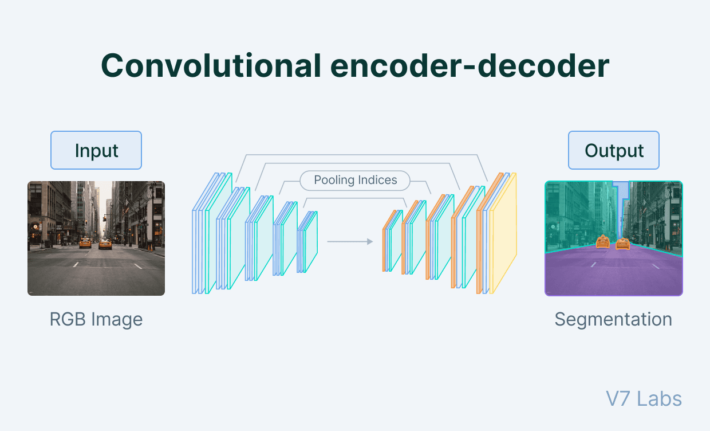

## Table of Contents

## What is image segmentation in machine learning?

Image segmentation in machine learning is a process where a computer looks at an image and divides it into different parts or segments. Each segment represents a different object or part of the image. For example, if you have a picture of a dog in a park, image segmentation can help the computer tell apart the dog, the grass, and the trees. This is useful for many tasks, like helping self-driving cars understand what they see on the road or helping doctors see different parts of the body in medical images.

To do image segmentation, machine learning models use special algorithms. These algorithms learn from many examples of images that have already been segmented by humans. Once trained, the model can look at new images and make its own segments. One common method used is called "semantic segmentation," where the model labels each pixel in the image with a category, like "dog" or "tree." Another method is "instance segmentation," which not only labels the pixels but also tells apart different instances of the same object, like two different dogs in the same picture.

## How does image segmentation differ from image classification?

Image segmentation and image classification are two different tasks in machine learning that help computers understand images. Image classification is like labeling a whole picture with one tag. For example, if you show a computer a picture of a dog in a park, image classification would just say "dog" or "park," depending on what it's trained to recognize. It looks at the entire image and decides what the main thing in the picture is.

On the other hand, image segmentation goes deeper. Instead of just labeling the whole image, it breaks the image into different parts and labels each part separately. Using the same example of a dog in a park, image segmentation would label the dog as "dog," the grass as "grass," and the trees as "trees." This way, the computer can understand and separate different objects within the same image. This is much more detailed and can be very useful for tasks like helping doctors see different parts of the body in medical images or helping self-driving cars understand what's around them on the road.

## What are some common applications of image segmentation?

Image segmentation is used a lot in medical imaging. Doctors use it to look at different parts of the body in pictures like X-rays or MRIs. For example, it can help them see the difference between healthy tissue and a tumor. This makes it easier for them to plan treatments and surgeries. It's also used in things like dental imaging to see the difference between teeth, gums, and bones, which helps dentists find problems and plan treatments.

Another big use of image segmentation is in self-driving cars. These cars need to understand what's around them, like other cars, people, and road signs. Image segmentation helps the car's computer see and label each of these things in real-time. This way, the car knows how to drive safely and avoid accidents. It's like giving the car a detailed map of its surroundings, which is really important for making sure it drives well.

Image segmentation also helps in things like photo editing and virtual reality. In photo editing, it can help you change just one part of a picture, like making the sky a different color without touching the rest of the image. In virtual reality, it can make the scenes look more real by separating different objects and making them look more lifelike. These are just a few examples of how image segmentation makes technology better and more useful for us.

## Can you explain the basic concept behind the SAM (Segment Anything Model)?

The Segment Anything Model (SAM) is a special kind of computer program that helps in understanding and breaking down images into different parts. It's designed to work with all kinds of images and can figure out what's in them without needing a lot of specific training. SAM uses something called a "prompt" to help it know what part of the image to look at. A prompt can be a click, a box, or even text that tells the model what to find. Once SAM gets the prompt, it can quickly and accurately segment the image, which means it can draw lines around different objects in the picture.

SAM is built to be flexible and useful in many different situations. It can work with images it has never seen before because it has been trained on a huge number of different pictures. This makes it really good at understanding new images and figuring out what's in them. For example, if you show SAM a picture of a busy street, it can use prompts to find and label cars, people, and buildings separately. This makes it a powerful tool for tasks like photo editing, medical imaging, and helping self-driving cars understand their surroundings.

## How does DEXTR (Deep Extreme Cut) approach image segmentation?

DEXTR, which stands for Deep Extreme Cut, is a method used for image segmentation that makes it easier to separate objects in a picture. Instead of having to draw around an object carefully, DEXTR only needs you to click on four points around the object you want to segment. These points are called extreme points because they are usually at the top, bottom, left, and right edges of the object. Once you click these points, DEXTR uses a special kind of computer program called a [neural network](/wiki/neural-network) to figure out the shape of the object and draw a line around it. This makes the process much faster and simpler than doing it by hand.

The way DEXTR works is by training on many pictures where people have already marked the extreme points and the full outline of objects. This training helps DEXTR learn how to connect the dots and create accurate outlines of new objects it sees. It's like teaching a computer to play connect-the-dots, but instead of just drawing lines, it understands the shape of the object and can even handle complex shapes and backgrounds. This makes DEXTR very useful for tasks where you need to quickly and accurately separate objects in images, like in photo editing or medical imaging.

## What makes HANet unique among image segmentation models?

HANet, which stands for Hybrid Attention Network, is unique because it uses a special way to pay attention to different parts of an image. It combines two kinds of attention: one looks at the whole image, and the other focuses on small parts. This mix helps HANet understand the image better and make more accurate segments. By using both kinds of attention, HANet can handle images with complex scenes where objects are close together or hard to tell apart.

This approach makes HANet really good at tasks where you need to separate objects that look similar or are in a busy background. For example, if you have a picture with lots of people, HANet can still tell them apart from each other and from the background. This is because it can focus on the details that matter and ignore the rest. HANet's ability to use both broad and detailed attention makes it stand out among other image segmentation models.

## How does SegSort improve upon traditional segmentation methods?

SegSort improves upon traditional segmentation methods by using a smarter way to group pixels together. It looks at the image and decides which pixels belong to the same object by thinking about their order and how they connect. This is different from older methods that might just look at the color or texture of pixels. SegSort uses a special sorting technique to figure out the best way to separate objects, making the results more accurate and detailed.

One big advantage of SegSort is that it can handle images with objects that are close together or have complex shapes. Traditional methods might struggle with these kinds of images because they can get confused by the details. But SegSort's sorting approach helps it understand the structure of the image better, so it can tell apart different objects even when they are touching or overlapping. This makes SegSort a powerful tool for tasks like medical imaging or self-driving cars, where getting the segmentation right is really important.

## What is the role of PALED in enhancing image segmentation?

PALED, which stands for Pixel-wise Adaptive Learning for Edge Detection, helps make image segmentation better by focusing on finding the edges of objects in a picture. It uses a special way to learn from images, looking at each pixel and figuring out if it's part of an edge or not. By doing this, PALED can draw very accurate lines around objects, which is really important for separating them correctly in image segmentation. This edge detection helps other segmentation methods work better because they can use the clear outlines PALED finds to make their own segments more precise.

In simple terms, PALED makes the job of other segmentation models easier by giving them a good starting point. For example, if you're trying to separate a dog from a busy background, PALED can help by finding the exact outline of the dog. This way, other models don't have to guess where the edges are and can focus on labeling the parts inside the outline. This makes the whole process of image segmentation faster and more accurate, which is really helpful in things like medical imaging or self-driving cars where getting it right is super important.

## How does pGAN utilize generative adversarial networks for segmentation?

pGAN, which stands for progressive Growing of GANs, uses a special kind of machine learning called Generative Adversarial Networks (GANs) to help with image segmentation. In pGAN, there are two parts working together: a generator and a discriminator. The generator tries to create fake images that look real, while the discriminator checks these images and tells the generator if they look real or not. As they work together, the generator gets better at making realistic images, and the discriminator gets better at spotting fakes. For segmentation, pGAN uses this process to slowly build up detailed images, starting with rough shapes and adding more details over time. This helps pGAN understand the structure of images and separate different objects more accurately.

The way pGAN does segmentation is by training the generator to create images that match the real ones, but with clear boundaries around different objects. As the generator improves, it learns to draw these boundaries better, which helps with segmenting the image. The discriminator plays a key role by checking if the segmented parts look right compared to the original image. This back-and-forth helps pGAN create very detailed and accurate segments, making it useful for tasks like medical imaging or photo editing where you need to see different parts of an image clearly.

## Can you describe the architecture of H-BEMD and its benefits?

H-BEMD, which stands for Hierarchical Boundary-Enhanced Mask Decoder, is a special kind of computer program used for image segmentation. It works by looking at an image and figuring out where the edges of different objects are. H-BEMD uses a two-part system: one part finds the rough shape of objects, and the other part adds more details to make the edges clearer. This two-step process helps H-BEMD understand the image better and draw more accurate lines around objects. It's like drawing a picture where you start with a simple outline and then add more details to make it look better.

The main benefit of H-BEMD is that it can handle images with lots of small details or objects that are close together. Because it focuses on finding the edges first, it can tell apart different objects even when they are touching or overlapping. This makes H-BEMD really useful for tasks like medical imaging, where doctors need to see different parts of the body clearly, or in self-driving cars, where the car needs to understand what's around it to drive safely. By using a hierarchical approach, H-BEMD makes the job of separating objects in an image easier and more accurate.

## What are the key features of SCNN_UNet_ConvLSTM that make it effective for video segmentation?

SCNN_UNet_ConvLSTM is a special model used for segmenting videos, which means it can break down moving pictures into different parts. It combines three main parts: SCNN, UNet, and ConvLSTM. SCNN helps the model understand the shapes and edges in the video. UNet is good at finding and labeling different objects in pictures. ConvLSTM adds the ability to remember what happened before in the video, which is important because videos are made of many frames that change over time. By working together, these parts help SCNN_UNet_ConvLSTM create accurate segments for each frame in the video.

One of the key features that makes SCNN_UNet_ConvLSTM effective for video segmentation is its ability to use information from past frames to improve its understanding of the current frame. This is thanks to the ConvLSTM part, which acts like a memory that helps the model keep track of how objects move and change. This is really helpful for tasks like tracking cars in traffic videos or watching how a tumor grows in medical videos. Another important feature is the combination of SCNN and UNet, which allows the model to be very good at finding and labeling objects, even in complex scenes where things are moving around a lot.

## How does SWRNet address the challenges of semantic segmentation in complex scenes?

SWRNet, which stands for Semantic Wavelet Recurrent Network, is a special kind of computer program that helps with understanding and separating different parts of an image, especially in complex scenes. It does this by using a method called wavelet transformation, which helps the computer look at the image in different levels of detail. This is really helpful when the image has a lot of things going on, like a busy street with cars, people, and buildings. SWRNet can see both the big picture and the small details, making it easier to tell apart different objects.

Another important part of SWRNet is that it uses a memory system to remember what it has seen before. This is useful for understanding how things in the image are connected or how they change over time. For example, if you have a video where cars are moving, SWRNet can use its memory to keep track of where each car was in the last frame and where it is now. This helps it make better guesses about what is happening in the scene, even when things are moving around a lot. By combining these two features, SWRNet can handle the challenges of complex scenes better than many other methods.

## References & Further Reading

[1]: Ronneberger, O., Fischer, P., & Brox, T. (2015). ["U-Net: Convolutional Networks for Biomedical Image Segmentation."](https://arxiv.org/abs/1505.04597) arXiv preprint arXiv:1505.04597.

[2]: He, K., Gkioxari, G., Dollár, P., & Girshick, R. (2017). ["Mask R-CNN."](https://ieeexplore.ieee.org/document/8237584) arXiv preprint arXiv:1703.06870.

[3]: Zhao, H., Shi, J., Qi, X., Wang, X., & Jia, J. (2017). ["Pyramid Scene Parsing Network."](https://ieeexplore.ieee.org/document/8100143) arXiv preprint arXiv:1612.01105.

[4]: Lin, T.-Y., Dollar, P., Girshick, R., He, K., Hariharan, B., & Belongie, S. (2017). ["Feature Pyramid Networks for Object Detection."](https://ieeexplore.ieee.org/document/8099589) arXiv preprint arXiv:1612.03144.

[5]: Yuan, Y., Chen, X., & Wang, J. (2019). ["Object-Contextual Representations for Semantic Segmentation."](https://arxiv.org/abs/1909.11065) arXiv preprint arXiv:1909.11065. 

[6]: Long, J., Shelhamer, E., & Darrell, T. (2015). ["Fully Convolutional Networks for Semantic Segmentation."](https://ieeexplore.ieee.org/document/7298965) arXiv preprint arXiv:1411.4038.

[7]: Xu, N., Price, B., Cohen, S., Yang, J., & Huang, T. (2018). ["Deep Interactive Object Selection."](https://arxiv.org/abs/1603.04042) arXiv preprint arXiv:1603.04042.

[8]: Cheng, B., Misra, I., Schwing, A., Kirillov, A., & Girdhar, R. (2022). ["Segment Anything."](https://arxiv.org/abs/2112.01527) arXiv preprint arXiv:2304.02643.